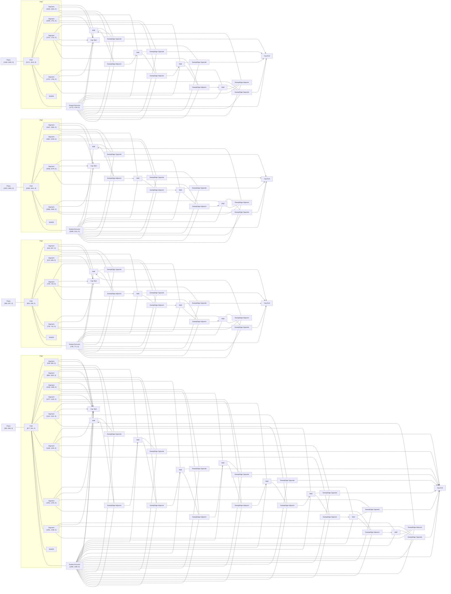

```mermaid
flowchart LR
  subgraph path5 [Path]
    5["Path<br>[603, 638, 0]"]
      %% [ProgramBodyItem { index: 5 }, VariableDeclarationDeclaration, VariableDeclarationInit, PipeBodyItem { index: 1 }]
    9["Segment<br>[644, 667, 0]"]
      %% [ProgramBodyItem { index: 5 }, VariableDeclarationDeclaration, VariableDeclarationInit, PipeBodyItem { index: 2 }]
    10["Segment<br>[673, 699, 0]"]
      %% [ProgramBodyItem { index: 5 }, VariableDeclarationDeclaration, VariableDeclarationInit, PipeBodyItem { index: 3 }]
    11["Segment<br>[705, 729, 0]"]
      %% [ProgramBodyItem { index: 5 }, VariableDeclarationDeclaration, VariableDeclarationInit, PipeBodyItem { index: 4 }]
    12["Segment<br>[735, 742, 0]"]
      %% [ProgramBodyItem { index: 5 }, VariableDeclarationDeclaration, VariableDeclarationInit, PipeBodyItem { index: 5 }]
    30[Solid2d]
  end
  subgraph path6 [Path]
    6["Path<br>[877, 931, 0]"]
      %% [ProgramBodyItem { index: 6 }, VariableDeclarationDeclaration, VariableDeclarationInit, FunctionExpressionBody, FunctionExpressionBodyItem { index: 0 }, VariableDeclarationDeclaration, VariableDeclarationInit, PipeBodyItem { index: 1 }]
    13["Segment<br>[939, 980, 0]"]
      %% [ProgramBodyItem { index: 6 }, VariableDeclarationDeclaration, VariableDeclarationInit, FunctionExpressionBody, FunctionExpressionBodyItem { index: 0 }, VariableDeclarationDeclaration, VariableDeclarationInit, PipeBodyItem { index: 2 }]
    14["Segment<br>[988, 1020, 0]"]
      %% [ProgramBodyItem { index: 6 }, VariableDeclarationDeclaration, VariableDeclarationInit, FunctionExpressionBody, FunctionExpressionBodyItem { index: 0 }, VariableDeclarationDeclaration, VariableDeclarationInit, PipeBodyItem { index: 3 }]
    15["Segment<br>[1028, 1069, 0]"]
      %% [ProgramBodyItem { index: 6 }, VariableDeclarationDeclaration, VariableDeclarationInit, FunctionExpressionBody, FunctionExpressionBodyItem { index: 0 }, VariableDeclarationDeclaration, VariableDeclarationInit, PipeBodyItem { index: 4 }]
    16["Segment<br>[1077, 1102, 0]"]
      %% [ProgramBodyItem { index: 6 }, VariableDeclarationDeclaration, VariableDeclarationInit, FunctionExpressionBody, FunctionExpressionBodyItem { index: 0 }, VariableDeclarationDeclaration, VariableDeclarationInit, PipeBodyItem { index: 5 }]
    17["Segment<br>[1110, 1152, 0]"]
      %% [ProgramBodyItem { index: 6 }, VariableDeclarationDeclaration, VariableDeclarationInit, FunctionExpressionBody, FunctionExpressionBodyItem { index: 0 }, VariableDeclarationDeclaration, VariableDeclarationInit, PipeBodyItem { index: 6 }]
    18["Segment<br>[1160, 1193, 0]"]
      %% [ProgramBodyItem { index: 6 }, VariableDeclarationDeclaration, VariableDeclarationInit, FunctionExpressionBody, FunctionExpressionBodyItem { index: 0 }, VariableDeclarationDeclaration, VariableDeclarationInit, PipeBodyItem { index: 7 }]
    19["Segment<br>[1201, 1243, 0]"]
      %% [ProgramBodyItem { index: 6 }, VariableDeclarationDeclaration, VariableDeclarationInit, FunctionExpressionBody, FunctionExpressionBodyItem { index: 0 }, VariableDeclarationDeclaration, VariableDeclarationInit, PipeBodyItem { index: 8 }]
    20["Segment<br>[1251, 1258, 0]"]
      %% [ProgramBodyItem { index: 6 }, VariableDeclarationDeclaration, VariableDeclarationInit, FunctionExpressionBody, FunctionExpressionBodyItem { index: 0 }, VariableDeclarationDeclaration, VariableDeclarationInit, PipeBodyItem { index: 9 }]
    32[Solid2d]
  end
  subgraph path7 [Path]
    7["Path<br>[1571, 1614, 0]"]
      %% [ProgramBodyItem { index: 8 }, VariableDeclarationDeclaration, VariableDeclarationInit, PipeBodyItem { index: 1 }]
    21["Segment<br>[1620, 1653, 0]"]
      %% [ProgramBodyItem { index: 8 }, VariableDeclarationDeclaration, VariableDeclarationInit, PipeBodyItem { index: 2 }]
    22["Segment<br>[1659, 1701, 0]"]
      %% [ProgramBodyItem { index: 8 }, VariableDeclarationDeclaration, VariableDeclarationInit, PipeBodyItem { index: 3 }]
    23["Segment<br>[1707, 1751, 0]"]
      %% [ProgramBodyItem { index: 8 }, VariableDeclarationDeclaration, VariableDeclarationInit, PipeBodyItem { index: 4 }]
    24["Segment<br>[1757, 1764, 0]"]
      %% [ProgramBodyItem { index: 8 }, VariableDeclarationDeclaration, VariableDeclarationInit, PipeBodyItem { index: 5 }]
    31[Solid2d]
  end
  subgraph path8 [Path]
    8["Path<br>[1899, 1941, 0]"]
      %% [ProgramBodyItem { index: 9 }, VariableDeclarationDeclaration, VariableDeclarationInit, PipeBodyItem { index: 1 }]
    25["Segment<br>[1947, 1981, 0]"]
      %% [ProgramBodyItem { index: 9 }, VariableDeclarationDeclaration, VariableDeclarationInit, PipeBodyItem { index: 2 }]
    26["Segment<br>[1987, 2030, 0]"]
      %% [ProgramBodyItem { index: 9 }, VariableDeclarationDeclaration, VariableDeclarationInit, PipeBodyItem { index: 3 }]
    27["Segment<br>[2036, 2079, 0]"]
      %% [ProgramBodyItem { index: 9 }, VariableDeclarationDeclaration, VariableDeclarationInit, PipeBodyItem { index: 4 }]
    28["Segment<br>[2085, 2092, 0]"]
      %% [ProgramBodyItem { index: 9 }, VariableDeclarationDeclaration, VariableDeclarationInit, PipeBodyItem { index: 5 }]
    29[Solid2d]
  end
  1["Plane<br>[580, 597, 0]"]
    %% [ProgramBodyItem { index: 5 }, VariableDeclarationDeclaration, VariableDeclarationInit, PipeBodyItem { index: 0 }]
  2["Plane<br>[852, 869, 0]"]
    %% [ProgramBodyItem { index: 6 }, VariableDeclarationDeclaration, VariableDeclarationInit, FunctionExpressionBody, FunctionExpressionBodyItem { index: 0 }, VariableDeclarationDeclaration, VariableDeclarationInit, PipeBodyItem { index: 0 }]
  3["Plane<br>[1548, 1565, 0]"]
    %% [ProgramBodyItem { index: 8 }, VariableDeclarationDeclaration, VariableDeclarationInit, PipeBodyItem { index: 0 }]
  4["Plane<br>[1876, 1893, 0]"]
    %% [ProgramBodyItem { index: 9 }, VariableDeclarationDeclaration, VariableDeclarationInit, PipeBodyItem { index: 0 }]
  33["Sweep Extrusion<br>[748, 771, 0]"]
    %% [ProgramBodyItem { index: 5 }, VariableDeclarationDeclaration, VariableDeclarationInit, PipeBodyItem { index: 6 }]
  34["Sweep Extrusion<br>[1266, 1289, 0]"]
    %% [ProgramBodyItem { index: 6 }, VariableDeclarationDeclaration, VariableDeclarationInit, FunctionExpressionBody, FunctionExpressionBodyItem { index: 0 }, VariableDeclarationDeclaration, VariableDeclarationInit, PipeBodyItem { index: 10 }]
  35["Sweep Extrusion<br>[1770, 1793, 0]"]
    %% [ProgramBodyItem { index: 8 }, VariableDeclarationDeclaration, VariableDeclarationInit, PipeBodyItem { index: 6 }]
  36["Sweep Extrusion<br>[2098, 2121, 0]"]
    %% [ProgramBodyItem { index: 9 }, VariableDeclarationDeclaration, VariableDeclarationInit, PipeBodyItem { index: 6 }]
  37[Wall]
  38[Wall]
  39[Wall]
  40[Wall]
  41[Wall]
  42[Wall]
  43[Wall]
  44[Wall]
  45[Wall]
  46[Wall]
  47[Wall]
  48[Wall]
  49[Wall]
  50[Wall]
  51[Wall]
  52[Wall]
  53[Wall]
  54[Wall]
  55[Wall]
  56[Wall]
  57["Cap Start"]
  58["Cap Start"]
  59["Cap Start"]
  60["Cap Start"]
  61["Cap End"]
  62["Cap End"]
  63["Cap End"]
  64["Cap End"]
  65["SweepEdge Opposite"]
  66["SweepEdge Opposite"]
  67["SweepEdge Opposite"]
  68["SweepEdge Opposite"]
  69["SweepEdge Opposite"]
  70["SweepEdge Opposite"]
  71["SweepEdge Opposite"]
  72["SweepEdge Opposite"]
  73["SweepEdge Opposite"]
  74["SweepEdge Opposite"]
  75["SweepEdge Opposite"]
  76["SweepEdge Opposite"]
  77["SweepEdge Opposite"]
  78["SweepEdge Opposite"]
  79["SweepEdge Opposite"]
  80["SweepEdge Opposite"]
  81["SweepEdge Opposite"]
  82["SweepEdge Opposite"]
  83["SweepEdge Opposite"]
  84["SweepEdge Opposite"]
  85["SweepEdge Adjacent"]
  86["SweepEdge Adjacent"]
  87["SweepEdge Adjacent"]
  88["SweepEdge Adjacent"]
  89["SweepEdge Adjacent"]
  90["SweepEdge Adjacent"]
  91["SweepEdge Adjacent"]
  92["SweepEdge Adjacent"]
  93["SweepEdge Adjacent"]
  94["SweepEdge Adjacent"]
  95["SweepEdge Adjacent"]
  96["SweepEdge Adjacent"]
  97["SweepEdge Adjacent"]
  98["SweepEdge Adjacent"]
  99["SweepEdge Adjacent"]
  100["SweepEdge Adjacent"]
  101["SweepEdge Adjacent"]
  102["SweepEdge Adjacent"]
  103["SweepEdge Adjacent"]
  104["SweepEdge Adjacent"]
  1 --- 5
  2 --- 6
  3 --- 7
  4 --- 8
  5 --- 9
  5 --- 10
  5 --- 11
  5 --- 12
  5 --- 30
  5 ---- 33
  6 --- 13
  6 --- 14
  6 --- 15
  6 --- 16
  6 --- 17
  6 --- 18
  6 --- 19
  6 --- 20
  6 --- 32
  6 ---- 34
  7 --- 21
  7 --- 22
  7 --- 23
  7 --- 24
  7 --- 31
  7 ---- 35
  8 --- 25
  8 --- 26
  8 --- 27
  8 --- 28
  8 --- 29
  8 ---- 36
  9 --- 40
  9 x--> 60
  9 --- 65
  9 --- 85
  10 --- 38
  10 x--> 60
  10 --- 66
  10 --- 86
  11 --- 37
  11 x--> 60
  11 --- 67
  11 --- 87
  12 --- 39
  12 x--> 60
  12 --- 68
  12 --- 88
  13 --- 47
  13 x--> 59
  13 --- 76
  13 --- 96
  14 --- 42
  14 x--> 59
  14 --- 75
  14 --- 95
  15 --- 48
  15 x--> 59
  15 --- 74
  15 --- 94
  16 --- 41
  16 x--> 59
  16 --- 73
  16 --- 93
  17 --- 45
  17 x--> 59
  17 --- 72
  17 --- 92
  18 --- 46
  18 x--> 59
  18 --- 71
  18 --- 91
  19 --- 43
  19 x--> 59
  19 --- 70
  19 --- 90
  20 --- 44
  20 x--> 59
  20 --- 69
  20 --- 89
  21 --- 56
  21 x--> 57
  21 --- 84
  21 --- 104
  22 --- 54
  22 x--> 57
  22 --- 83
  22 --- 103
  23 --- 53
  23 x--> 57
  23 --- 82
  23 --- 102
  24 --- 55
  24 x--> 57
  24 --- 81
  24 --- 101
  25 --- 49
  25 x--> 58
  25 --- 77
  25 --- 97
  26 --- 50
  26 x--> 58
  26 --- 78
  26 --- 98
  27 --- 51
  27 x--> 58
  27 --- 79
  27 --- 99
  28 --- 52
  28 x--> 58
  28 --- 80
  28 --- 100
  33 --- 37
  33 --- 38
  33 --- 39
  33 --- 40
  33 --- 60
  33 --- 64
  33 --- 65
  33 --- 66
  33 --- 67
  33 --- 68
  33 --- 85
  33 --- 86
  33 --- 87
  33 --- 88
  34 --- 41
  34 --- 42
  34 --- 43
  34 --- 44
  34 --- 45
  34 --- 46
  34 --- 47
  34 --- 48
  34 --- 59
  34 --- 63
  34 --- 69
  34 --- 70
  34 --- 71
  34 --- 72
  34 --- 73
  34 --- 74
  34 --- 75
  34 --- 76
  34 --- 89
  34 --- 90
  34 --- 91
  34 --- 92
  34 --- 93
  34 --- 94
  34 --- 95
  34 --- 96
  35 --- 53
  35 --- 54
  35 --- 55
  35 --- 56
  35 --- 57
  35 --- 61
  35 --- 81
  35 --- 82
  35 --- 83
  35 --- 84
  35 --- 101
  35 --- 102
  35 --- 103
  35 --- 104
  36 --- 49
  36 --- 50
  36 --- 51
  36 --- 52
  36 --- 58
  36 --- 62
  36 --- 77
  36 --- 78
  36 --- 79
  36 --- 80
  36 --- 97
  36 --- 98
  36 --- 99
  36 --- 100
  37 --- 67
  86 <--x 37
  37 --- 87
  38 --- 66
  85 <--x 38
  38 --- 86
  39 --- 68
  87 <--x 39
  39 --- 88
  40 --- 65
  40 --- 85
  88 <--x 40
  41 --- 73
  41 --- 93
  94 <--x 41
  42 --- 75
  42 --- 95
  96 <--x 42
  43 --- 70
  43 --- 90
  91 <--x 43
  44 --- 69
  44 --- 89
  90 <--x 44
  45 --- 72
  45 --- 92
  93 <--x 45
  46 --- 71
  46 --- 91
  92 <--x 46
  47 --- 76
  89 <--x 47
  47 --- 96
  48 --- 74
  48 --- 94
  95 <--x 48
  49 --- 77
  49 --- 97
  100 <--x 49
  50 --- 78
  97 <--x 50
  50 --- 98
  51 --- 79
  98 <--x 51
  51 --- 99
  52 --- 80
  99 <--x 52
  52 --- 100
  53 --- 82
  53 --- 102
  103 <--x 53
  54 --- 83
  54 --- 103
  104 <--x 54
  55 --- 81
  55 --- 101
  102 <--x 55
  56 --- 84
  101 <--x 56
  56 --- 104
  81 <--x 61
  82 <--x 61
  83 <--x 61
  84 <--x 61
  77 <--x 62
  78 <--x 62
  79 <--x 62
  80 <--x 62
  69 <--x 63
  70 <--x 63
  71 <--x 63
  72 <--x 63
  73 <--x 63
  74 <--x 63
  75 <--x 63
  76 <--x 63
  65 <--x 64
  66 <--x 64
  67 <--x 64
  68 <--x 64
```
