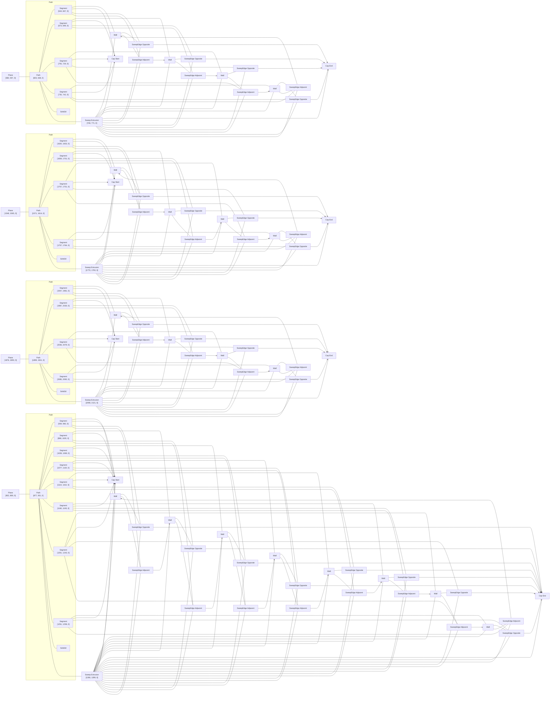

```mermaid
flowchart LR
  subgraph path2 [Path]
    2["Path<br>[603, 638, 0]"]
      %% [ProgramBodyItem { index: 5 }, VariableDeclarationDeclaration, VariableDeclarationInit, PipeBodyItem { index: 1 }]
    3["Segment<br>[644, 667, 0]"]
      %% [ProgramBodyItem { index: 5 }, VariableDeclarationDeclaration, VariableDeclarationInit, PipeBodyItem { index: 2 }]
    4["Segment<br>[673, 699, 0]"]
      %% [ProgramBodyItem { index: 5 }, VariableDeclarationDeclaration, VariableDeclarationInit, PipeBodyItem { index: 3 }]
    5["Segment<br>[705, 729, 0]"]
      %% [ProgramBodyItem { index: 5 }, VariableDeclarationDeclaration, VariableDeclarationInit, PipeBodyItem { index: 4 }]
    6["Segment<br>[735, 742, 0]"]
      %% [ProgramBodyItem { index: 5 }, VariableDeclarationDeclaration, VariableDeclarationInit, PipeBodyItem { index: 5 }]
    7[Solid2d]
  end
  subgraph path24 [Path]
    24["Path<br>[877, 931, 0]"]
      %% [ProgramBodyItem { index: 6 }, VariableDeclarationDeclaration, VariableDeclarationInit, FunctionExpressionBody, FunctionExpressionBodyItem { index: 0 }, VariableDeclarationDeclaration, VariableDeclarationInit, PipeBodyItem { index: 1 }]
    25["Segment<br>[939, 980, 0]"]
      %% [ProgramBodyItem { index: 6 }, VariableDeclarationDeclaration, VariableDeclarationInit, FunctionExpressionBody, FunctionExpressionBodyItem { index: 0 }, VariableDeclarationDeclaration, VariableDeclarationInit, PipeBodyItem { index: 2 }]
    26["Segment<br>[988, 1020, 0]"]
      %% [ProgramBodyItem { index: 6 }, VariableDeclarationDeclaration, VariableDeclarationInit, FunctionExpressionBody, FunctionExpressionBodyItem { index: 0 }, VariableDeclarationDeclaration, VariableDeclarationInit, PipeBodyItem { index: 3 }]
    27["Segment<br>[1028, 1069, 0]"]
      %% [ProgramBodyItem { index: 6 }, VariableDeclarationDeclaration, VariableDeclarationInit, FunctionExpressionBody, FunctionExpressionBodyItem { index: 0 }, VariableDeclarationDeclaration, VariableDeclarationInit, PipeBodyItem { index: 4 }]
    28["Segment<br>[1077, 1102, 0]"]
      %% [ProgramBodyItem { index: 6 }, VariableDeclarationDeclaration, VariableDeclarationInit, FunctionExpressionBody, FunctionExpressionBodyItem { index: 0 }, VariableDeclarationDeclaration, VariableDeclarationInit, PipeBodyItem { index: 5 }]
    29["Segment<br>[1110, 1152, 0]"]
      %% [ProgramBodyItem { index: 6 }, VariableDeclarationDeclaration, VariableDeclarationInit, FunctionExpressionBody, FunctionExpressionBodyItem { index: 0 }, VariableDeclarationDeclaration, VariableDeclarationInit, PipeBodyItem { index: 6 }]
    30["Segment<br>[1160, 1193, 0]"]
      %% [ProgramBodyItem { index: 6 }, VariableDeclarationDeclaration, VariableDeclarationInit, FunctionExpressionBody, FunctionExpressionBodyItem { index: 0 }, VariableDeclarationDeclaration, VariableDeclarationInit, PipeBodyItem { index: 7 }]
    31["Segment<br>[1201, 1243, 0]"]
      %% [ProgramBodyItem { index: 6 }, VariableDeclarationDeclaration, VariableDeclarationInit, FunctionExpressionBody, FunctionExpressionBodyItem { index: 0 }, VariableDeclarationDeclaration, VariableDeclarationInit, PipeBodyItem { index: 8 }]
    32["Segment<br>[1251, 1258, 0]"]
      %% [ProgramBodyItem { index: 6 }, VariableDeclarationDeclaration, VariableDeclarationInit, FunctionExpressionBody, FunctionExpressionBodyItem { index: 0 }, VariableDeclarationDeclaration, VariableDeclarationInit, PipeBodyItem { index: 9 }]
    33[Solid2d]
  end
  subgraph path62 [Path]
    62["Path<br>[1571, 1614, 0]"]
      %% [ProgramBodyItem { index: 8 }, VariableDeclarationDeclaration, VariableDeclarationInit, PipeBodyItem { index: 1 }]
    63["Segment<br>[1620, 1653, 0]"]
      %% [ProgramBodyItem { index: 8 }, VariableDeclarationDeclaration, VariableDeclarationInit, PipeBodyItem { index: 2 }]
    64["Segment<br>[1659, 1701, 0]"]
      %% [ProgramBodyItem { index: 8 }, VariableDeclarationDeclaration, VariableDeclarationInit, PipeBodyItem { index: 3 }]
    65["Segment<br>[1707, 1751, 0]"]
      %% [ProgramBodyItem { index: 8 }, VariableDeclarationDeclaration, VariableDeclarationInit, PipeBodyItem { index: 4 }]
    66["Segment<br>[1757, 1764, 0]"]
      %% [ProgramBodyItem { index: 8 }, VariableDeclarationDeclaration, VariableDeclarationInit, PipeBodyItem { index: 5 }]
    67[Solid2d]
  end
  subgraph path84 [Path]
    84["Path<br>[1899, 1941, 0]"]
      %% [ProgramBodyItem { index: 9 }, VariableDeclarationDeclaration, VariableDeclarationInit, PipeBodyItem { index: 1 }]
    85["Segment<br>[1947, 1981, 0]"]
      %% [ProgramBodyItem { index: 9 }, VariableDeclarationDeclaration, VariableDeclarationInit, PipeBodyItem { index: 2 }]
    86["Segment<br>[1987, 2030, 0]"]
      %% [ProgramBodyItem { index: 9 }, VariableDeclarationDeclaration, VariableDeclarationInit, PipeBodyItem { index: 3 }]
    87["Segment<br>[2036, 2079, 0]"]
      %% [ProgramBodyItem { index: 9 }, VariableDeclarationDeclaration, VariableDeclarationInit, PipeBodyItem { index: 4 }]
    88["Segment<br>[2085, 2092, 0]"]
      %% [ProgramBodyItem { index: 9 }, VariableDeclarationDeclaration, VariableDeclarationInit, PipeBodyItem { index: 5 }]
    89[Solid2d]
  end
  1["Plane<br>[580, 597, 0]"]
    %% [ProgramBodyItem { index: 5 }, VariableDeclarationDeclaration, VariableDeclarationInit, PipeBodyItem { index: 0 }]
  8["Sweep Extrusion<br>[748, 771, 0]"]
    %% [ProgramBodyItem { index: 5 }, VariableDeclarationDeclaration, VariableDeclarationInit, PipeBodyItem { index: 6 }]
  9[Wall]
    %% face_code_ref=Missing NodePath
  10[Wall]
    %% face_code_ref=Missing NodePath
  11[Wall]
    %% face_code_ref=Missing NodePath
  12[Wall]
    %% face_code_ref=Missing NodePath
  13["Cap Start"]
    %% face_code_ref=Missing NodePath
  14["Cap End"]
    %% face_code_ref=Missing NodePath
  15["SweepEdge Opposite"]
  16["SweepEdge Adjacent"]
  17["SweepEdge Opposite"]
  18["SweepEdge Adjacent"]
  19["SweepEdge Opposite"]
  20["SweepEdge Adjacent"]
  21["SweepEdge Opposite"]
  22["SweepEdge Adjacent"]
  23["Plane<br>[852, 869, 0]"]
    %% [ProgramBodyItem { index: 6 }, VariableDeclarationDeclaration, VariableDeclarationInit, FunctionExpressionBody, FunctionExpressionBodyItem { index: 0 }, VariableDeclarationDeclaration, VariableDeclarationInit, PipeBodyItem { index: 0 }]
  34["Sweep Extrusion<br>[1266, 1289, 0]"]
    %% [ProgramBodyItem { index: 6 }, VariableDeclarationDeclaration, VariableDeclarationInit, FunctionExpressionBody, FunctionExpressionBodyItem { index: 0 }, VariableDeclarationDeclaration, VariableDeclarationInit, PipeBodyItem { index: 10 }]
  35[Wall]
    %% face_code_ref=Missing NodePath
  36[Wall]
    %% face_code_ref=Missing NodePath
  37[Wall]
    %% face_code_ref=Missing NodePath
  38[Wall]
    %% face_code_ref=Missing NodePath
  39[Wall]
    %% face_code_ref=Missing NodePath
  40[Wall]
    %% face_code_ref=Missing NodePath
  41[Wall]
    %% face_code_ref=Missing NodePath
  42[Wall]
    %% face_code_ref=Missing NodePath
  43["Cap Start"]
    %% face_code_ref=Missing NodePath
  44["Cap End"]
    %% face_code_ref=Missing NodePath
  45["SweepEdge Opposite"]
  46["SweepEdge Adjacent"]
  47["SweepEdge Opposite"]
  48["SweepEdge Adjacent"]
  49["SweepEdge Opposite"]
  50["SweepEdge Adjacent"]
  51["SweepEdge Opposite"]
  52["SweepEdge Adjacent"]
  53["SweepEdge Opposite"]
  54["SweepEdge Adjacent"]
  55["SweepEdge Opposite"]
  56["SweepEdge Adjacent"]
  57["SweepEdge Opposite"]
  58["SweepEdge Adjacent"]
  59["SweepEdge Opposite"]
  60["SweepEdge Adjacent"]
  61["Plane<br>[1548, 1565, 0]"]
    %% [ProgramBodyItem { index: 8 }, VariableDeclarationDeclaration, VariableDeclarationInit, PipeBodyItem { index: 0 }]
  68["Sweep Extrusion<br>[1770, 1793, 0]"]
    %% [ProgramBodyItem { index: 8 }, VariableDeclarationDeclaration, VariableDeclarationInit, PipeBodyItem { index: 6 }]
  69[Wall]
    %% face_code_ref=Missing NodePath
  70[Wall]
    %% face_code_ref=Missing NodePath
  71[Wall]
    %% face_code_ref=Missing NodePath
  72[Wall]
    %% face_code_ref=Missing NodePath
  73["Cap Start"]
    %% face_code_ref=Missing NodePath
  74["Cap End"]
    %% face_code_ref=Missing NodePath
  75["SweepEdge Opposite"]
  76["SweepEdge Adjacent"]
  77["SweepEdge Opposite"]
  78["SweepEdge Adjacent"]
  79["SweepEdge Opposite"]
  80["SweepEdge Adjacent"]
  81["SweepEdge Opposite"]
  82["SweepEdge Adjacent"]
  83["Plane<br>[1876, 1893, 0]"]
    %% [ProgramBodyItem { index: 9 }, VariableDeclarationDeclaration, VariableDeclarationInit, PipeBodyItem { index: 0 }]
  90["Sweep Extrusion<br>[2098, 2121, 0]"]
    %% [ProgramBodyItem { index: 9 }, VariableDeclarationDeclaration, VariableDeclarationInit, PipeBodyItem { index: 6 }]
  91[Wall]
    %% face_code_ref=Missing NodePath
  92[Wall]
    %% face_code_ref=Missing NodePath
  93[Wall]
    %% face_code_ref=Missing NodePath
  94[Wall]
    %% face_code_ref=Missing NodePath
  95["Cap Start"]
    %% face_code_ref=Missing NodePath
  96["Cap End"]
    %% face_code_ref=Missing NodePath
  97["SweepEdge Opposite"]
  98["SweepEdge Adjacent"]
  99["SweepEdge Opposite"]
  100["SweepEdge Adjacent"]
  101["SweepEdge Opposite"]
  102["SweepEdge Adjacent"]
  103["SweepEdge Opposite"]
  104["SweepEdge Adjacent"]
  1 --- 2
  2 --- 3
  2 --- 4
  2 --- 5
  2 --- 6
  2 --- 7
  2 ---- 8
  3 --- 9
  3 x--> 13
  3 --- 15
  3 --- 16
  4 --- 10
  4 x--> 13
  4 --- 17
  4 --- 18
  5 --- 11
  5 x--> 13
  5 --- 19
  5 --- 20
  6 --- 12
  6 x--> 13
  6 --- 21
  6 --- 22
  8 --- 9
  8 --- 10
  8 --- 11
  8 --- 12
  8 --- 13
  8 --- 14
  8 --- 15
  8 --- 16
  8 --- 17
  8 --- 18
  8 --- 19
  8 --- 20
  8 --- 21
  8 --- 22
  9 --- 15
  9 --- 16
  22 <--x 9
  16 <--x 10
  10 --- 17
  10 --- 18
  18 <--x 11
  11 --- 19
  11 --- 20
  20 <--x 12
  12 --- 21
  12 --- 22
  15 <--x 14
  17 <--x 14
  19 <--x 14
  21 <--x 14
  23 --- 24
  24 --- 25
  24 --- 26
  24 --- 27
  24 --- 28
  24 --- 29
  24 --- 30
  24 --- 31
  24 --- 32
  24 --- 33
  24 ---- 34
  25 --- 42
  25 x--> 43
  25 --- 59
  25 --- 60
  26 --- 41
  26 x--> 43
  26 --- 57
  26 --- 58
  27 --- 40
  27 x--> 43
  27 --- 55
  27 --- 56
  28 --- 39
  28 x--> 43
  28 --- 53
  28 --- 54
  29 --- 38
  29 x--> 43
  29 --- 51
  29 --- 52
  30 --- 37
  30 x--> 43
  30 --- 49
  30 --- 50
  31 --- 36
  31 x--> 43
  31 --- 47
  31 --- 48
  32 --- 35
  32 x--> 43
  32 --- 45
  32 --- 46
  34 --- 35
  34 --- 36
  34 --- 37
  34 --- 38
  34 --- 39
  34 --- 40
  34 --- 41
  34 --- 42
  34 --- 43
  34 --- 44
  34 --- 45
  34 --- 46
  34 --- 47
  34 --- 48
  34 --- 49
  34 --- 50
  34 --- 51
  34 --- 52
  34 --- 53
  34 --- 54
  34 --- 55
  34 --- 56
  34 --- 57
  34 --- 58
  34 --- 59
  34 --- 60
  35 --- 45
  35 --- 46
  48 <--x 35
  36 --- 47
  36 --- 48
  50 <--x 36
  37 --- 49
  37 --- 50
  52 <--x 37
  38 --- 51
  38 --- 52
  54 <--x 38
  39 --- 53
  39 --- 54
  56 <--x 39
  40 --- 55
  40 --- 56
  58 <--x 40
  41 --- 57
  41 --- 58
  60 <--x 41
  46 <--x 42
  42 --- 59
  42 --- 60
  45 <--x 44
  47 <--x 44
  49 <--x 44
  51 <--x 44
  53 <--x 44
  55 <--x 44
  57 <--x 44
  59 <--x 44
  61 --- 62
  62 --- 63
  62 --- 64
  62 --- 65
  62 --- 66
  62 --- 67
  62 ---- 68
  63 --- 72
  63 x--> 73
  63 --- 81
  63 --- 82
  64 --- 71
  64 x--> 73
  64 --- 79
  64 --- 80
  65 --- 70
  65 x--> 73
  65 --- 77
  65 --- 78
  66 --- 69
  66 x--> 73
  66 --- 75
  66 --- 76
  68 --- 69
  68 --- 70
  68 --- 71
  68 --- 72
  68 --- 73
  68 --- 74
  68 --- 75
  68 --- 76
  68 --- 77
  68 --- 78
  68 --- 79
  68 --- 80
  68 --- 81
  68 --- 82
  69 --- 75
  69 --- 76
  78 <--x 69
  70 --- 77
  70 --- 78
  80 <--x 70
  71 --- 79
  71 --- 80
  82 <--x 71
  76 <--x 72
  72 --- 81
  72 --- 82
  75 <--x 74
  77 <--x 74
  79 <--x 74
  81 <--x 74
  83 --- 84
  84 --- 85
  84 --- 86
  84 --- 87
  84 --- 88
  84 --- 89
  84 ---- 90
  85 --- 91
  85 x--> 95
  85 --- 97
  85 --- 98
  86 --- 92
  86 x--> 95
  86 --- 99
  86 --- 100
  87 --- 93
  87 x--> 95
  87 --- 101
  87 --- 102
  88 --- 94
  88 x--> 95
  88 --- 103
  88 --- 104
  90 --- 91
  90 --- 92
  90 --- 93
  90 --- 94
  90 --- 95
  90 --- 96
  90 --- 97
  90 --- 98
  90 --- 99
  90 --- 100
  90 --- 101
  90 --- 102
  90 --- 103
  90 --- 104
  91 --- 97
  91 --- 98
  104 <--x 91
  98 <--x 92
  92 --- 99
  92 --- 100
  100 <--x 93
  93 --- 101
  93 --- 102
  102 <--x 94
  94 --- 103
  94 --- 104
  97 <--x 96
  99 <--x 96
  101 <--x 96
  103 <--x 96
```
