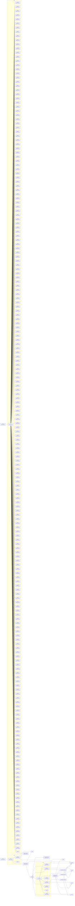

```mermaid
flowchart LR
  subgraph path2 [Path]
    2["Path<br>[1348, 1398, 0]"]
    3["Segment<br>[1348, 1398, 0]"]
    4[Solid2d]
  end
  subgraph path10 [Path]
    10["Path<br>[1875, 1912, 0]"]
    11["Segment<br>[1563, 1601, 0]"]
    12["Segment<br>[1563, 1601, 0]"]
    13["Segment<br>[1563, 1601, 0]"]
    14["Segment<br>[1563, 1601, 0]"]
    15["Segment<br>[1563, 1601, 0]"]
    16["Segment<br>[1563, 1601, 0]"]
    17["Segment<br>[1563, 1601, 0]"]
    18["Segment<br>[1563, 1601, 0]"]
    19["Segment<br>[1563, 1601, 0]"]
    20["Segment<br>[1563, 1601, 0]"]
    21["Segment<br>[1563, 1601, 0]"]
    22["Segment<br>[1563, 1601, 0]"]
    23["Segment<br>[1563, 1601, 0]"]
    24["Segment<br>[1563, 1601, 0]"]
    25["Segment<br>[1563, 1601, 0]"]
    26["Segment<br>[1563, 1601, 0]"]
    27["Segment<br>[1563, 1601, 0]"]
    28["Segment<br>[1563, 1601, 0]"]
    29["Segment<br>[1563, 1601, 0]"]
    30["Segment<br>[1563, 1601, 0]"]
    31["Segment<br>[1563, 1601, 0]"]
    32["Segment<br>[1563, 1601, 0]"]
    33["Segment<br>[1563, 1601, 0]"]
    34["Segment<br>[1563, 1601, 0]"]
    35["Segment<br>[1563, 1601, 0]"]
    36["Segment<br>[1563, 1601, 0]"]
    37["Segment<br>[1563, 1601, 0]"]
    38["Segment<br>[1563, 1601, 0]"]
    39["Segment<br>[1563, 1601, 0]"]
    40["Segment<br>[1563, 1601, 0]"]
    41["Segment<br>[1563, 1601, 0]"]
    42["Segment<br>[1563, 1601, 0]"]
    43["Segment<br>[1563, 1601, 0]"]
    44["Segment<br>[1563, 1601, 0]"]
    45["Segment<br>[1563, 1601, 0]"]
    46["Segment<br>[1563, 1601, 0]"]
    47["Segment<br>[1563, 1601, 0]"]
    48["Segment<br>[1563, 1601, 0]"]
    49["Segment<br>[1563, 1601, 0]"]
    50["Segment<br>[1563, 1601, 0]"]
    51["Segment<br>[1563, 1601, 0]"]
    52["Segment<br>[1563, 1601, 0]"]
    53["Segment<br>[1563, 1601, 0]"]
    54["Segment<br>[1563, 1601, 0]"]
    55["Segment<br>[1563, 1601, 0]"]
    56["Segment<br>[1563, 1601, 0]"]
    57["Segment<br>[1563, 1601, 0]"]
    58["Segment<br>[1563, 1601, 0]"]
    59["Segment<br>[1563, 1601, 0]"]
    60["Segment<br>[1563, 1601, 0]"]
    61["Segment<br>[1563, 1601, 0]"]
    62["Segment<br>[1563, 1601, 0]"]
    63["Segment<br>[1563, 1601, 0]"]
    64["Segment<br>[1563, 1601, 0]"]
    65["Segment<br>[1563, 1601, 0]"]
    66["Segment<br>[1563, 1601, 0]"]
    67["Segment<br>[1563, 1601, 0]"]
    68["Segment<br>[1563, 1601, 0]"]
    69["Segment<br>[1563, 1601, 0]"]
    70["Segment<br>[1563, 1601, 0]"]
    71["Segment<br>[1563, 1601, 0]"]
    72["Segment<br>[1563, 1601, 0]"]
    73["Segment<br>[1563, 1601, 0]"]
    74["Segment<br>[1563, 1601, 0]"]
    75["Segment<br>[1563, 1601, 0]"]
    76["Segment<br>[1563, 1601, 0]"]
    77["Segment<br>[1563, 1601, 0]"]
    78["Segment<br>[1563, 1601, 0]"]
    79["Segment<br>[1563, 1601, 0]"]
    80["Segment<br>[1563, 1601, 0]"]
    81["Segment<br>[1563, 1601, 0]"]
    82["Segment<br>[1563, 1601, 0]"]
    83["Segment<br>[1563, 1601, 0]"]
    84["Segment<br>[1563, 1601, 0]"]
    85["Segment<br>[1563, 1601, 0]"]
    86["Segment<br>[1563, 1601, 0]"]
    87["Segment<br>[1563, 1601, 0]"]
    88["Segment<br>[1563, 1601, 0]"]
    89["Segment<br>[1563, 1601, 0]"]
    90["Segment<br>[1563, 1601, 0]"]
    91["Segment<br>[1563, 1601, 0]"]
    92["Segment<br>[1563, 1601, 0]"]
    93["Segment<br>[1563, 1601, 0]"]
    94["Segment<br>[1563, 1601, 0]"]
    95["Segment<br>[1563, 1601, 0]"]
    96["Segment<br>[1563, 1601, 0]"]
    97["Segment<br>[1563, 1601, 0]"]
    98["Segment<br>[1563, 1601, 0]"]
    99["Segment<br>[1563, 1601, 0]"]
    100["Segment<br>[1563, 1601, 0]"]
    101["Segment<br>[1563, 1601, 0]"]
    102["Segment<br>[1563, 1601, 0]"]
    103["Segment<br>[1563, 1601, 0]"]
    104["Segment<br>[1563, 1601, 0]"]
    105["Segment<br>[1563, 1601, 0]"]
    106["Segment<br>[1563, 1601, 0]"]
    107["Segment<br>[1563, 1601, 0]"]
    108["Segment<br>[1563, 1601, 0]"]
    109["Segment<br>[1563, 1601, 0]"]
    110["Segment<br>[1563, 1601, 0]"]
    111["Segment<br>[1563, 1601, 0]"]
    112["Segment<br>[1964, 2033, 0]"]
    113["Segment<br>[1791, 1821, 0]"]
    114["Segment<br>[1791, 1821, 0]"]
    115["Segment<br>[1791, 1821, 0]"]
    116["Segment<br>[1791, 1821, 0]"]
    117["Segment<br>[1791, 1821, 0]"]
    118["Segment<br>[1791, 1821, 0]"]
    119["Segment<br>[1791, 1821, 0]"]
    120["Segment<br>[1791, 1821, 0]"]
    121["Segment<br>[1791, 1821, 0]"]
    122["Segment<br>[1791, 1821, 0]"]
    123["Segment<br>[1791, 1821, 0]"]
    124["Segment<br>[1791, 1821, 0]"]
    125["Segment<br>[1791, 1821, 0]"]
    126["Segment<br>[1791, 1821, 0]"]
    127["Segment<br>[1791, 1821, 0]"]
    128["Segment<br>[1791, 1821, 0]"]
    129["Segment<br>[1791, 1821, 0]"]
    130["Segment<br>[1791, 1821, 0]"]
    131["Segment<br>[1791, 1821, 0]"]
    132["Segment<br>[1791, 1821, 0]"]
    133["Segment<br>[1791, 1821, 0]"]
    134["Segment<br>[1791, 1821, 0]"]
    135["Segment<br>[1791, 1821, 0]"]
    136["Segment<br>[1791, 1821, 0]"]
    137["Segment<br>[1791, 1821, 0]"]
    138["Segment<br>[1791, 1821, 0]"]
    139["Segment<br>[1791, 1821, 0]"]
    140["Segment<br>[1791, 1821, 0]"]
    141["Segment<br>[1791, 1821, 0]"]
    142["Segment<br>[1791, 1821, 0]"]
    143["Segment<br>[1791, 1821, 0]"]
    144["Segment<br>[1791, 1821, 0]"]
    145["Segment<br>[1791, 1821, 0]"]
    146["Segment<br>[1791, 1821, 0]"]
    147["Segment<br>[1791, 1821, 0]"]
    148["Segment<br>[1791, 1821, 0]"]
    149["Segment<br>[1791, 1821, 0]"]
    150["Segment<br>[1791, 1821, 0]"]
    151["Segment<br>[1791, 1821, 0]"]
    152["Segment<br>[1791, 1821, 0]"]
    153["Segment<br>[1791, 1821, 0]"]
    154["Segment<br>[1791, 1821, 0]"]
    155["Segment<br>[1791, 1821, 0]"]
    156["Segment<br>[1791, 1821, 0]"]
    157["Segment<br>[1791, 1821, 0]"]
    158["Segment<br>[1791, 1821, 0]"]
    159["Segment<br>[1791, 1821, 0]"]
    160["Segment<br>[1791, 1821, 0]"]
    161["Segment<br>[1791, 1821, 0]"]
    162["Segment<br>[1791, 1821, 0]"]
    163["Segment<br>[1791, 1821, 0]"]
    164["Segment<br>[1791, 1821, 0]"]
    165["Segment<br>[1791, 1821, 0]"]
    166["Segment<br>[1791, 1821, 0]"]
    167["Segment<br>[1791, 1821, 0]"]
    168["Segment<br>[1791, 1821, 0]"]
    169["Segment<br>[1791, 1821, 0]"]
    170["Segment<br>[1791, 1821, 0]"]
    171["Segment<br>[1791, 1821, 0]"]
    172["Segment<br>[1791, 1821, 0]"]
    173["Segment<br>[1791, 1821, 0]"]
    174["Segment<br>[1791, 1821, 0]"]
    175["Segment<br>[1791, 1821, 0]"]
    176["Segment<br>[1791, 1821, 0]"]
    177["Segment<br>[1791, 1821, 0]"]
    178["Segment<br>[1791, 1821, 0]"]
    179["Segment<br>[1791, 1821, 0]"]
    180["Segment<br>[1791, 1821, 0]"]
    181["Segment<br>[1791, 1821, 0]"]
    182["Segment<br>[1791, 1821, 0]"]
    183["Segment<br>[1791, 1821, 0]"]
    184["Segment<br>[1791, 1821, 0]"]
    185["Segment<br>[1791, 1821, 0]"]
    186["Segment<br>[1791, 1821, 0]"]
    187["Segment<br>[1791, 1821, 0]"]
    188["Segment<br>[1791, 1821, 0]"]
    189["Segment<br>[1791, 1821, 0]"]
    190["Segment<br>[1791, 1821, 0]"]
    191["Segment<br>[1791, 1821, 0]"]
    192["Segment<br>[1791, 1821, 0]"]
    193["Segment<br>[1791, 1821, 0]"]
    194["Segment<br>[1791, 1821, 0]"]
    195["Segment<br>[1791, 1821, 0]"]
    196["Segment<br>[1791, 1821, 0]"]
    197["Segment<br>[1791, 1821, 0]"]
    198["Segment<br>[1791, 1821, 0]"]
    199["Segment<br>[1791, 1821, 0]"]
    200["Segment<br>[1791, 1821, 0]"]
    201["Segment<br>[1791, 1821, 0]"]
    202["Segment<br>[1791, 1821, 0]"]
    203["Segment<br>[1791, 1821, 0]"]
    204["Segment<br>[1791, 1821, 0]"]
    205["Segment<br>[1791, 1821, 0]"]
    206["Segment<br>[1791, 1821, 0]"]
    207["Segment<br>[1791, 1821, 0]"]
    208["Segment<br>[1791, 1821, 0]"]
    209["Segment<br>[1791, 1821, 0]"]
    210["Segment<br>[1791, 1821, 0]"]
    211["Segment<br>[1791, 1821, 0]"]
    212["Segment<br>[1791, 1821, 0]"]
    213["Segment<br>[1791, 1821, 0]"]
    214["Segment<br>[2079, 2086, 0]"]
    215[Solid2d]
  end
  subgraph path217 [Path]
    217["Path<br>[2567, 2667, 0]"]
    218["Segment<br>[2673, 2700, 0]"]
    219["Segment<br>[2706, 2734, 0]"]
    220["Segment<br>[2740, 2768, 0]"]
    221["Segment<br>[2774, 2861, 0]"]
    222["Segment<br>[2867, 2943, 0]"]
    223["Segment<br>[2949, 2956, 0]"]
    224[Solid2d]
  end
  1["Plane<br>[1325, 1342, 0]"]
  5["Sweep Extrusion<br>[1404, 1432, 0]"]
  6[Wall]
  7["Cap Start"]
  8["Cap End"]
  9["Plane<br>[1852, 1869, 0]"]
  216["Sweep Extrusion<br>[2092, 2120, 0]"]
  225["Sweep Extrusion<br>[2962, 2991, 0]"]
  226[Wall]
  227[Wall]
  228[Wall]
  229[Wall]
  230["SweepEdge Opposite"]
  231["SweepEdge Opposite"]
  232["SweepEdge Opposite"]
  233["StartSketchOnFace<br>[2530, 2561, 0]"]
  1 --- 2
  2 --- 3
  2 ---- 5
  2 --- 4
  3 --- 6
  3 x--> 7
  5 --- 6
  5 --- 7
  5 --- 8
  8 --- 217
  9 --- 10
  10 --- 11
  10 --- 12
  10 --- 13
  10 --- 14
  10 --- 15
  10 --- 16
  10 --- 17
  10 --- 18
  10 --- 19
  10 --- 20
  10 --- 21
  10 --- 22
  10 --- 23
  10 --- 24
  10 --- 25
  10 --- 26
  10 --- 27
  10 --- 28
  10 --- 29
  10 --- 30
  10 --- 31
  10 --- 32
  10 --- 33
  10 --- 34
  10 --- 35
  10 --- 36
  10 --- 37
  10 --- 38
  10 --- 39
  10 --- 40
  10 --- 41
  10 --- 42
  10 --- 43
  10 --- 44
  10 --- 45
  10 --- 46
  10 --- 47
  10 --- 48
  10 --- 49
  10 --- 50
  10 --- 51
  10 --- 52
  10 --- 53
  10 --- 54
  10 --- 55
  10 --- 56
  10 --- 57
  10 --- 58
  10 --- 59
  10 --- 60
  10 --- 61
  10 --- 62
  10 --- 63
  10 --- 64
  10 --- 65
  10 --- 66
  10 --- 67
  10 --- 68
  10 --- 69
  10 --- 70
  10 --- 71
  10 --- 72
  10 --- 73
  10 --- 74
  10 --- 75
  10 --- 76
  10 --- 77
  10 --- 78
  10 --- 79
  10 --- 80
  10 --- 81
  10 --- 82
  10 --- 83
  10 --- 84
  10 --- 85
  10 --- 86
  10 --- 87
  10 --- 88
  10 --- 89
  10 --- 90
  10 --- 91
  10 --- 92
  10 --- 93
  10 --- 94
  10 --- 95
  10 --- 96
  10 --- 97
  10 --- 98
  10 --- 99
  10 --- 100
  10 --- 101
  10 --- 102
  10 --- 103
  10 --- 104
  10 --- 105
  10 --- 106
  10 --- 107
  10 --- 108
  10 --- 109
  10 --- 110
  10 --- 111
  10 --- 112
  10 --- 113
  10 --- 114
  10 --- 115
  10 --- 116
  10 --- 117
  10 --- 118
  10 --- 119
  10 --- 120
  10 --- 121
  10 --- 122
  10 --- 123
  10 --- 124
  10 --- 125
  10 --- 126
  10 --- 127
  10 --- 128
  10 --- 129
  10 --- 130
  10 --- 131
  10 --- 132
  10 --- 133
  10 --- 134
  10 --- 135
  10 --- 136
  10 --- 137
  10 --- 138
  10 --- 139
  10 --- 140
  10 --- 141
  10 --- 142
  10 --- 143
  10 --- 144
  10 --- 145
  10 --- 146
  10 --- 147
  10 --- 148
  10 --- 149
  10 --- 150
  10 --- 151
  10 --- 152
  10 --- 153
  10 --- 154
  10 --- 155
  10 --- 156
  10 --- 157
  10 --- 158
  10 --- 159
  10 --- 160
  10 --- 161
  10 --- 162
  10 --- 163
  10 --- 164
  10 --- 165
  10 --- 166
  10 --- 167
  10 --- 168
  10 --- 169
  10 --- 170
  10 --- 171
  10 --- 172
  10 --- 173
  10 --- 174
  10 --- 175
  10 --- 176
  10 --- 177
  10 --- 178
  10 --- 179
  10 --- 180
  10 --- 181
  10 --- 182
  10 --- 183
  10 --- 184
  10 --- 185
  10 --- 186
  10 --- 187
  10 --- 188
  10 --- 189
  10 --- 190
  10 --- 191
  10 --- 192
  10 --- 193
  10 --- 194
  10 --- 195
  10 --- 196
  10 --- 197
  10 --- 198
  10 --- 199
  10 --- 200
  10 --- 201
  10 --- 202
  10 --- 203
  10 --- 204
  10 --- 205
  10 --- 206
  10 --- 207
  10 --- 208
  10 --- 209
  10 --- 210
  10 --- 211
  10 --- 212
  10 --- 213
  10 --- 214
  10 ---- 216
  10 --- 215
  217 --- 218
  217 --- 219
  217 --- 220
  217 --- 221
  217 --- 222
  217 --- 223
  217 ---- 225
  217 --- 224
  218 --- 229
  218 --- 232
  218 <--x 8
  219 --- 228
  219 --- 231
  219 <--x 8
  220 --- 227
  220 --- 230
  220 <--x 8
  222 --- 226
  222 <--x 8
  225 --- 226
  225 --- 227
  225 --- 228
  225 --- 229
  225 --- 230
  225 --- 231
  225 --- 232
  230 <--x 227
  230 <--x 7
  231 <--x 228
  231 <--x 7
  232 <--x 229
  232 <--x 7
  8 <--x 233
```
