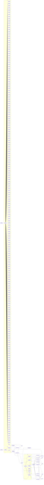

```mermaid
flowchart LR
  subgraph path4 [Path]
    4["Path<br>[1413, 1463, 0]"]
    7["Segment<br>[1413, 1463, 0]"]
    219[Solid2d]
  end
  subgraph path5 [Path]
    5["Path<br>[1932, 1969, 0]"]
    8["Segment<br>[1628, 1666, 0]"]
    9["Segment<br>[1628, 1666, 0]"]
    10["Segment<br>[1628, 1666, 0]"]
    11["Segment<br>[1628, 1666, 0]"]
    12["Segment<br>[1628, 1666, 0]"]
    13["Segment<br>[1628, 1666, 0]"]
    14["Segment<br>[1628, 1666, 0]"]
    15["Segment<br>[1628, 1666, 0]"]
    16["Segment<br>[1628, 1666, 0]"]
    17["Segment<br>[1628, 1666, 0]"]
    18["Segment<br>[1628, 1666, 0]"]
    19["Segment<br>[1628, 1666, 0]"]
    20["Segment<br>[1628, 1666, 0]"]
    21["Segment<br>[1628, 1666, 0]"]
    22["Segment<br>[1628, 1666, 0]"]
    23["Segment<br>[1628, 1666, 0]"]
    24["Segment<br>[1628, 1666, 0]"]
    25["Segment<br>[1628, 1666, 0]"]
    26["Segment<br>[1628, 1666, 0]"]
    27["Segment<br>[1628, 1666, 0]"]
    28["Segment<br>[1628, 1666, 0]"]
    29["Segment<br>[1628, 1666, 0]"]
    30["Segment<br>[1628, 1666, 0]"]
    31["Segment<br>[1628, 1666, 0]"]
    32["Segment<br>[1628, 1666, 0]"]
    33["Segment<br>[1628, 1666, 0]"]
    34["Segment<br>[1628, 1666, 0]"]
    35["Segment<br>[1628, 1666, 0]"]
    36["Segment<br>[1628, 1666, 0]"]
    37["Segment<br>[1628, 1666, 0]"]
    38["Segment<br>[1628, 1666, 0]"]
    39["Segment<br>[1628, 1666, 0]"]
    40["Segment<br>[1628, 1666, 0]"]
    41["Segment<br>[1628, 1666, 0]"]
    42["Segment<br>[1628, 1666, 0]"]
    43["Segment<br>[1628, 1666, 0]"]
    44["Segment<br>[1628, 1666, 0]"]
    45["Segment<br>[1628, 1666, 0]"]
    46["Segment<br>[1628, 1666, 0]"]
    47["Segment<br>[1628, 1666, 0]"]
    48["Segment<br>[1628, 1666, 0]"]
    49["Segment<br>[1628, 1666, 0]"]
    50["Segment<br>[1628, 1666, 0]"]
    51["Segment<br>[1628, 1666, 0]"]
    52["Segment<br>[1628, 1666, 0]"]
    53["Segment<br>[1628, 1666, 0]"]
    54["Segment<br>[1628, 1666, 0]"]
    55["Segment<br>[1628, 1666, 0]"]
    56["Segment<br>[1628, 1666, 0]"]
    57["Segment<br>[1628, 1666, 0]"]
    58["Segment<br>[1628, 1666, 0]"]
    59["Segment<br>[1628, 1666, 0]"]
    60["Segment<br>[1628, 1666, 0]"]
    61["Segment<br>[1628, 1666, 0]"]
    62["Segment<br>[1628, 1666, 0]"]
    63["Segment<br>[1628, 1666, 0]"]
    64["Segment<br>[1628, 1666, 0]"]
    65["Segment<br>[1628, 1666, 0]"]
    66["Segment<br>[1628, 1666, 0]"]
    67["Segment<br>[1628, 1666, 0]"]
    68["Segment<br>[1628, 1666, 0]"]
    69["Segment<br>[1628, 1666, 0]"]
    70["Segment<br>[1628, 1666, 0]"]
    71["Segment<br>[1628, 1666, 0]"]
    72["Segment<br>[1628, 1666, 0]"]
    73["Segment<br>[1628, 1666, 0]"]
    74["Segment<br>[1628, 1666, 0]"]
    75["Segment<br>[1628, 1666, 0]"]
    76["Segment<br>[1628, 1666, 0]"]
    77["Segment<br>[1628, 1666, 0]"]
    78["Segment<br>[1628, 1666, 0]"]
    79["Segment<br>[1628, 1666, 0]"]
    80["Segment<br>[1628, 1666, 0]"]
    81["Segment<br>[1628, 1666, 0]"]
    82["Segment<br>[1628, 1666, 0]"]
    83["Segment<br>[1628, 1666, 0]"]
    84["Segment<br>[1628, 1666, 0]"]
    85["Segment<br>[1628, 1666, 0]"]
    86["Segment<br>[1628, 1666, 0]"]
    87["Segment<br>[1628, 1666, 0]"]
    88["Segment<br>[1628, 1666, 0]"]
    89["Segment<br>[1628, 1666, 0]"]
    90["Segment<br>[1628, 1666, 0]"]
    91["Segment<br>[1628, 1666, 0]"]
    92["Segment<br>[1628, 1666, 0]"]
    93["Segment<br>[1628, 1666, 0]"]
    94["Segment<br>[1628, 1666, 0]"]
    95["Segment<br>[1628, 1666, 0]"]
    96["Segment<br>[1628, 1666, 0]"]
    97["Segment<br>[1628, 1666, 0]"]
    98["Segment<br>[1628, 1666, 0]"]
    99["Segment<br>[1628, 1666, 0]"]
    100["Segment<br>[1628, 1666, 0]"]
    101["Segment<br>[1628, 1666, 0]"]
    102["Segment<br>[1628, 1666, 0]"]
    103["Segment<br>[1628, 1666, 0]"]
    104["Segment<br>[1628, 1666, 0]"]
    105["Segment<br>[1628, 1666, 0]"]
    106["Segment<br>[1628, 1666, 0]"]
    107["Segment<br>[1628, 1666, 0]"]
    108["Segment<br>[1628, 1666, 0]"]
    109["Segment<br>[1848, 1878, 0]"]
    110["Segment<br>[1848, 1878, 0]"]
    111["Segment<br>[1848, 1878, 0]"]
    112["Segment<br>[1848, 1878, 0]"]
    113["Segment<br>[1848, 1878, 0]"]
    114["Segment<br>[1848, 1878, 0]"]
    115["Segment<br>[1848, 1878, 0]"]
    116["Segment<br>[1848, 1878, 0]"]
    117["Segment<br>[1848, 1878, 0]"]
    118["Segment<br>[1848, 1878, 0]"]
    119["Segment<br>[1848, 1878, 0]"]
    120["Segment<br>[1848, 1878, 0]"]
    121["Segment<br>[1848, 1878, 0]"]
    122["Segment<br>[1848, 1878, 0]"]
    123["Segment<br>[1848, 1878, 0]"]
    124["Segment<br>[1848, 1878, 0]"]
    125["Segment<br>[1848, 1878, 0]"]
    126["Segment<br>[1848, 1878, 0]"]
    127["Segment<br>[1848, 1878, 0]"]
    128["Segment<br>[1848, 1878, 0]"]
    129["Segment<br>[1848, 1878, 0]"]
    130["Segment<br>[1848, 1878, 0]"]
    131["Segment<br>[1848, 1878, 0]"]
    132["Segment<br>[1848, 1878, 0]"]
    133["Segment<br>[1848, 1878, 0]"]
    134["Segment<br>[1848, 1878, 0]"]
    135["Segment<br>[1848, 1878, 0]"]
    136["Segment<br>[1848, 1878, 0]"]
    137["Segment<br>[1848, 1878, 0]"]
    138["Segment<br>[1848, 1878, 0]"]
    139["Segment<br>[1848, 1878, 0]"]
    140["Segment<br>[1848, 1878, 0]"]
    141["Segment<br>[1848, 1878, 0]"]
    142["Segment<br>[1848, 1878, 0]"]
    143["Segment<br>[1848, 1878, 0]"]
    144["Segment<br>[1848, 1878, 0]"]
    145["Segment<br>[1848, 1878, 0]"]
    146["Segment<br>[1848, 1878, 0]"]
    147["Segment<br>[1848, 1878, 0]"]
    148["Segment<br>[1848, 1878, 0]"]
    149["Segment<br>[1848, 1878, 0]"]
    150["Segment<br>[1848, 1878, 0]"]
    151["Segment<br>[1848, 1878, 0]"]
    152["Segment<br>[1848, 1878, 0]"]
    153["Segment<br>[1848, 1878, 0]"]
    154["Segment<br>[1848, 1878, 0]"]
    155["Segment<br>[1848, 1878, 0]"]
    156["Segment<br>[1848, 1878, 0]"]
    157["Segment<br>[1848, 1878, 0]"]
    158["Segment<br>[1848, 1878, 0]"]
    159["Segment<br>[1848, 1878, 0]"]
    160["Segment<br>[1848, 1878, 0]"]
    161["Segment<br>[1848, 1878, 0]"]
    162["Segment<br>[1848, 1878, 0]"]
    163["Segment<br>[1848, 1878, 0]"]
    164["Segment<br>[1848, 1878, 0]"]
    165["Segment<br>[1848, 1878, 0]"]
    166["Segment<br>[1848, 1878, 0]"]
    167["Segment<br>[1848, 1878, 0]"]
    168["Segment<br>[1848, 1878, 0]"]
    169["Segment<br>[1848, 1878, 0]"]
    170["Segment<br>[1848, 1878, 0]"]
    171["Segment<br>[1848, 1878, 0]"]
    172["Segment<br>[1848, 1878, 0]"]
    173["Segment<br>[1848, 1878, 0]"]
    174["Segment<br>[1848, 1878, 0]"]
    175["Segment<br>[1848, 1878, 0]"]
    176["Segment<br>[1848, 1878, 0]"]
    177["Segment<br>[1848, 1878, 0]"]
    178["Segment<br>[1848, 1878, 0]"]
    179["Segment<br>[1848, 1878, 0]"]
    180["Segment<br>[1848, 1878, 0]"]
    181["Segment<br>[1848, 1878, 0]"]
    182["Segment<br>[1848, 1878, 0]"]
    183["Segment<br>[1848, 1878, 0]"]
    184["Segment<br>[1848, 1878, 0]"]
    185["Segment<br>[1848, 1878, 0]"]
    186["Segment<br>[1848, 1878, 0]"]
    187["Segment<br>[1848, 1878, 0]"]
    188["Segment<br>[1848, 1878, 0]"]
    189["Segment<br>[1848, 1878, 0]"]
    190["Segment<br>[1848, 1878, 0]"]
    191["Segment<br>[1848, 1878, 0]"]
    192["Segment<br>[1848, 1878, 0]"]
    193["Segment<br>[1848, 1878, 0]"]
    194["Segment<br>[1848, 1878, 0]"]
    195["Segment<br>[1848, 1878, 0]"]
    196["Segment<br>[1848, 1878, 0]"]
    197["Segment<br>[1848, 1878, 0]"]
    198["Segment<br>[1848, 1878, 0]"]
    199["Segment<br>[1848, 1878, 0]"]
    200["Segment<br>[1848, 1878, 0]"]
    201["Segment<br>[1848, 1878, 0]"]
    202["Segment<br>[1848, 1878, 0]"]
    203["Segment<br>[1848, 1878, 0]"]
    204["Segment<br>[1848, 1878, 0]"]
    205["Segment<br>[1848, 1878, 0]"]
    206["Segment<br>[1848, 1878, 0]"]
    207["Segment<br>[1848, 1878, 0]"]
    208["Segment<br>[1848, 1878, 0]"]
    209["Segment<br>[1848, 1878, 0]"]
    210["Segment<br>[2035, 2104, 0]"]
    211["Segment<br>[2164, 2171, 0]"]
    218[Solid2d]
  end
  subgraph path6 [Path]
    6["Path<br>[2652, 2752, 0]"]
    212["Segment<br>[2758, 2785, 0]"]
    213["Segment<br>[2791, 2819, 0]"]
    214["Segment<br>[2825, 2853, 0]"]
    215["Segment<br>[2859, 2953, 0]"]
    216["Segment<br>[2959, 3042, 0]"]
    217["Segment<br>[3048, 3055, 0]"]
    220[Solid2d]
  end
  1["Plane<br>[1390, 1407, 0]"]
  2["Plane<br>[1909, 1926, 0]"]
  3["StartSketchOnFace<br>[2615, 2646, 0]"]
  221["Sweep Extrusion<br>[1469, 1497, 0]"]
  222["Sweep Extrusion<br>[2177, 2205, 0]"]
  223["Sweep Extrusion<br>[3061, 3090, 0]"]
  224[Wall]
  225[Wall]
  226[Wall]
  227[Wall]
  228[Wall]
  229["Cap Start"]
  230["Cap End"]
  231["SweepEdge Opposite"]
  232["SweepEdge Opposite"]
  233["SweepEdge Opposite"]
  234["SweepEdge Opposite"]
  235["SweepEdge Opposite"]
  236["SweepEdge Adjacent"]
  237["SweepEdge Adjacent"]
  238["SweepEdge Adjacent"]
  239["SweepEdge Adjacent"]
  240["SweepEdge Adjacent"]
  1 --- 4
  2 --- 5
  230 x--> 3
  4 --- 7
  4 --- 219
  4 ---- 221
  5 --- 8
  5 --- 9
  5 --- 10
  5 --- 11
  5 --- 12
  5 --- 13
  5 --- 14
  5 --- 15
  5 --- 16
  5 --- 17
  5 --- 18
  5 --- 19
  5 --- 20
  5 --- 21
  5 --- 22
  5 --- 23
  5 --- 24
  5 --- 25
  5 --- 26
  5 --- 27
  5 --- 28
  5 --- 29
  5 --- 30
  5 --- 31
  5 --- 32
  5 --- 33
  5 --- 34
  5 --- 35
  5 --- 36
  5 --- 37
  5 --- 38
  5 --- 39
  5 --- 40
  5 --- 41
  5 --- 42
  5 --- 43
  5 --- 44
  5 --- 45
  5 --- 46
  5 --- 47
  5 --- 48
  5 --- 49
  5 --- 50
  5 --- 51
  5 --- 52
  5 --- 53
  5 --- 54
  5 --- 55
  5 --- 56
  5 --- 57
  5 --- 58
  5 --- 59
  5 --- 60
  5 --- 61
  5 --- 62
  5 --- 63
  5 --- 64
  5 --- 65
  5 --- 66
  5 --- 67
  5 --- 68
  5 --- 69
  5 --- 70
  5 --- 71
  5 --- 72
  5 --- 73
  5 --- 74
  5 --- 75
  5 --- 76
  5 --- 77
  5 --- 78
  5 --- 79
  5 --- 80
  5 --- 81
  5 --- 82
  5 --- 83
  5 --- 84
  5 --- 85
  5 --- 86
  5 --- 87
  5 --- 88
  5 --- 89
  5 --- 90
  5 --- 91
  5 --- 92
  5 --- 93
  5 --- 94
  5 --- 95
  5 --- 96
  5 --- 97
  5 --- 98
  5 --- 99
  5 --- 100
  5 --- 101
  5 --- 102
  5 --- 103
  5 --- 104
  5 --- 105
  5 --- 106
  5 --- 107
  5 --- 108
  5 --- 109
  5 --- 110
  5 --- 111
  5 --- 112
  5 --- 113
  5 --- 114
  5 --- 115
  5 --- 116
  5 --- 117
  5 --- 118
  5 --- 119
  5 --- 120
  5 --- 121
  5 --- 122
  5 --- 123
  5 --- 124
  5 --- 125
  5 --- 126
  5 --- 127
  5 --- 128
  5 --- 129
  5 --- 130
  5 --- 131
  5 --- 132
  5 --- 133
  5 --- 134
  5 --- 135
  5 --- 136
  5 --- 137
  5 --- 138
  5 --- 139
  5 --- 140
  5 --- 141
  5 --- 142
  5 --- 143
  5 --- 144
  5 --- 145
  5 --- 146
  5 --- 147
  5 --- 148
  5 --- 149
  5 --- 150
  5 --- 151
  5 --- 152
  5 --- 153
  5 --- 154
  5 --- 155
  5 --- 156
  5 --- 157
  5 --- 158
  5 --- 159
  5 --- 160
  5 --- 161
  5 --- 162
  5 --- 163
  5 --- 164
  5 --- 165
  5 --- 166
  5 --- 167
  5 --- 168
  5 --- 169
  5 --- 170
  5 --- 171
  5 --- 172
  5 --- 173
  5 --- 174
  5 --- 175
  5 --- 176
  5 --- 177
  5 --- 178
  5 --- 179
  5 --- 180
  5 --- 181
  5 --- 182
  5 --- 183
  5 --- 184
  5 --- 185
  5 --- 186
  5 --- 187
  5 --- 188
  5 --- 189
  5 --- 190
  5 --- 191
  5 --- 192
  5 --- 193
  5 --- 194
  5 --- 195
  5 --- 196
  5 --- 197
  5 --- 198
  5 --- 199
  5 --- 200
  5 --- 201
  5 --- 202
  5 --- 203
  5 --- 204
  5 --- 205
  5 --- 206
  5 --- 207
  5 --- 208
  5 --- 209
  5 --- 210
  5 --- 211
  5 --- 218
  5 ---- 222
  6 --- 212
  6 --- 213
  6 --- 214
  6 --- 215
  6 --- 216
  6 --- 217
  6 --- 220
  6 ---- 223
  230 --- 6
  7 --- 224
  7 x--> 229
  7 --- 231
  7 --- 236
  212 --- 227
  212 x--> 230
  212 --- 232
  212 --- 238
  213 --- 228
  213 x--> 230
  213 --- 235
  213 --- 239
  214 --- 225
  214 x--> 230
  214 --- 234
  214 --- 240
  216 --- 226
  216 x--> 230
  216 --- 233
  216 --- 237
  221 --- 224
  221 --- 229
  221 --- 230
  221 --- 231
  221 --- 236
  223 --- 225
  223 --- 226
  223 --- 227
  223 --- 228
  223 --- 232
  223 --- 233
  223 --- 234
  223 --- 235
  223 --- 237
  223 --- 238
  223 --- 239
  223 --- 240
  231 <--x 224
  236 <--x 224
  234 <--x 225
  239 <--x 225
  240 <--x 225
  233 <--x 226
  237 <--x 226
  240 <--x 226
  232 <--x 227
  237 <--x 227
  238 <--x 227
  235 <--x 228
  238 <--x 228
  239 <--x 228
  232 <--x 229
  233 <--x 229
  234 <--x 229
  235 <--x 229
  231 <--x 230
```
