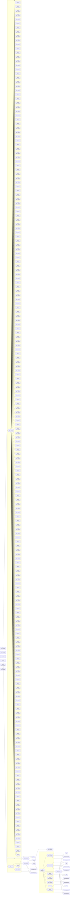

```mermaid
flowchart LR
  subgraph path7 [Path]
    7["Path<br>[1328, 1399, 0]"]
    8["Segment<br>[1328, 1399, 0]"]
    9[Solid2d]
  end
  subgraph path16 [Path]
    16["Path<br>[1878, 1915, 0]"]
    17["Segment<br>[1564, 1602, 0]"]
    18["Segment<br>[1564, 1602, 0]"]
    19["Segment<br>[1564, 1602, 0]"]
    20["Segment<br>[1564, 1602, 0]"]
    21["Segment<br>[1564, 1602, 0]"]
    22["Segment<br>[1564, 1602, 0]"]
    23["Segment<br>[1564, 1602, 0]"]
    24["Segment<br>[1564, 1602, 0]"]
    25["Segment<br>[1564, 1602, 0]"]
    26["Segment<br>[1564, 1602, 0]"]
    27["Segment<br>[1564, 1602, 0]"]
    28["Segment<br>[1564, 1602, 0]"]
    29["Segment<br>[1564, 1602, 0]"]
    30["Segment<br>[1564, 1602, 0]"]
    31["Segment<br>[1564, 1602, 0]"]
    32["Segment<br>[1564, 1602, 0]"]
    33["Segment<br>[1564, 1602, 0]"]
    34["Segment<br>[1564, 1602, 0]"]
    35["Segment<br>[1564, 1602, 0]"]
    36["Segment<br>[1564, 1602, 0]"]
    37["Segment<br>[1564, 1602, 0]"]
    38["Segment<br>[1564, 1602, 0]"]
    39["Segment<br>[1564, 1602, 0]"]
    40["Segment<br>[1564, 1602, 0]"]
    41["Segment<br>[1564, 1602, 0]"]
    42["Segment<br>[1564, 1602, 0]"]
    43["Segment<br>[1564, 1602, 0]"]
    44["Segment<br>[1564, 1602, 0]"]
    45["Segment<br>[1564, 1602, 0]"]
    46["Segment<br>[1564, 1602, 0]"]
    47["Segment<br>[1564, 1602, 0]"]
    48["Segment<br>[1564, 1602, 0]"]
    49["Segment<br>[1564, 1602, 0]"]
    50["Segment<br>[1564, 1602, 0]"]
    51["Segment<br>[1564, 1602, 0]"]
    52["Segment<br>[1564, 1602, 0]"]
    53["Segment<br>[1564, 1602, 0]"]
    54["Segment<br>[1564, 1602, 0]"]
    55["Segment<br>[1564, 1602, 0]"]
    56["Segment<br>[1564, 1602, 0]"]
    57["Segment<br>[1564, 1602, 0]"]
    58["Segment<br>[1564, 1602, 0]"]
    59["Segment<br>[1564, 1602, 0]"]
    60["Segment<br>[1564, 1602, 0]"]
    61["Segment<br>[1564, 1602, 0]"]
    62["Segment<br>[1564, 1602, 0]"]
    63["Segment<br>[1564, 1602, 0]"]
    64["Segment<br>[1564, 1602, 0]"]
    65["Segment<br>[1564, 1602, 0]"]
    66["Segment<br>[1564, 1602, 0]"]
    67["Segment<br>[1564, 1602, 0]"]
    68["Segment<br>[1564, 1602, 0]"]
    69["Segment<br>[1564, 1602, 0]"]
    70["Segment<br>[1564, 1602, 0]"]
    71["Segment<br>[1564, 1602, 0]"]
    72["Segment<br>[1564, 1602, 0]"]
    73["Segment<br>[1564, 1602, 0]"]
    74["Segment<br>[1564, 1602, 0]"]
    75["Segment<br>[1564, 1602, 0]"]
    76["Segment<br>[1564, 1602, 0]"]
    77["Segment<br>[1564, 1602, 0]"]
    78["Segment<br>[1564, 1602, 0]"]
    79["Segment<br>[1564, 1602, 0]"]
    80["Segment<br>[1564, 1602, 0]"]
    81["Segment<br>[1564, 1602, 0]"]
    82["Segment<br>[1564, 1602, 0]"]
    83["Segment<br>[1564, 1602, 0]"]
    84["Segment<br>[1564, 1602, 0]"]
    85["Segment<br>[1564, 1602, 0]"]
    86["Segment<br>[1564, 1602, 0]"]
    87["Segment<br>[1564, 1602, 0]"]
    88["Segment<br>[1564, 1602, 0]"]
    89["Segment<br>[1564, 1602, 0]"]
    90["Segment<br>[1564, 1602, 0]"]
    91["Segment<br>[1564, 1602, 0]"]
    92["Segment<br>[1564, 1602, 0]"]
    93["Segment<br>[1564, 1602, 0]"]
    94["Segment<br>[1564, 1602, 0]"]
    95["Segment<br>[1564, 1602, 0]"]
    96["Segment<br>[1564, 1602, 0]"]
    97["Segment<br>[1564, 1602, 0]"]
    98["Segment<br>[1564, 1602, 0]"]
    99["Segment<br>[1564, 1602, 0]"]
    100["Segment<br>[1564, 1602, 0]"]
    101["Segment<br>[1564, 1602, 0]"]
    102["Segment<br>[1564, 1602, 0]"]
    103["Segment<br>[1564, 1602, 0]"]
    104["Segment<br>[1564, 1602, 0]"]
    105["Segment<br>[1564, 1602, 0]"]
    106["Segment<br>[1564, 1602, 0]"]
    107["Segment<br>[1564, 1602, 0]"]
    108["Segment<br>[1564, 1602, 0]"]
    109["Segment<br>[1564, 1602, 0]"]
    110["Segment<br>[1564, 1602, 0]"]
    111["Segment<br>[1564, 1602, 0]"]
    112["Segment<br>[1564, 1602, 0]"]
    113["Segment<br>[1564, 1602, 0]"]
    114["Segment<br>[1564, 1602, 0]"]
    115["Segment<br>[1564, 1602, 0]"]
    116["Segment<br>[1564, 1602, 0]"]
    117["Segment<br>[1564, 1602, 0]"]
    118["Segment<br>[1967, 2069, 0]"]
    119["Segment<br>[1792, 1822, 0]"]
    120["Segment<br>[1792, 1822, 0]"]
    121["Segment<br>[1792, 1822, 0]"]
    122["Segment<br>[1792, 1822, 0]"]
    123["Segment<br>[1792, 1822, 0]"]
    124["Segment<br>[1792, 1822, 0]"]
    125["Segment<br>[1792, 1822, 0]"]
    126["Segment<br>[1792, 1822, 0]"]
    127["Segment<br>[1792, 1822, 0]"]
    128["Segment<br>[1792, 1822, 0]"]
    129["Segment<br>[1792, 1822, 0]"]
    130["Segment<br>[1792, 1822, 0]"]
    131["Segment<br>[1792, 1822, 0]"]
    132["Segment<br>[1792, 1822, 0]"]
    133["Segment<br>[1792, 1822, 0]"]
    134["Segment<br>[1792, 1822, 0]"]
    135["Segment<br>[1792, 1822, 0]"]
    136["Segment<br>[1792, 1822, 0]"]
    137["Segment<br>[1792, 1822, 0]"]
    138["Segment<br>[1792, 1822, 0]"]
    139["Segment<br>[1792, 1822, 0]"]
    140["Segment<br>[1792, 1822, 0]"]
    141["Segment<br>[1792, 1822, 0]"]
    142["Segment<br>[1792, 1822, 0]"]
    143["Segment<br>[1792, 1822, 0]"]
    144["Segment<br>[1792, 1822, 0]"]
    145["Segment<br>[1792, 1822, 0]"]
    146["Segment<br>[1792, 1822, 0]"]
    147["Segment<br>[1792, 1822, 0]"]
    148["Segment<br>[1792, 1822, 0]"]
    149["Segment<br>[1792, 1822, 0]"]
    150["Segment<br>[1792, 1822, 0]"]
    151["Segment<br>[1792, 1822, 0]"]
    152["Segment<br>[1792, 1822, 0]"]
    153["Segment<br>[1792, 1822, 0]"]
    154["Segment<br>[1792, 1822, 0]"]
    155["Segment<br>[1792, 1822, 0]"]
    156["Segment<br>[1792, 1822, 0]"]
    157["Segment<br>[1792, 1822, 0]"]
    158["Segment<br>[1792, 1822, 0]"]
    159["Segment<br>[1792, 1822, 0]"]
    160["Segment<br>[1792, 1822, 0]"]
    161["Segment<br>[1792, 1822, 0]"]
    162["Segment<br>[1792, 1822, 0]"]
    163["Segment<br>[1792, 1822, 0]"]
    164["Segment<br>[1792, 1822, 0]"]
    165["Segment<br>[1792, 1822, 0]"]
    166["Segment<br>[1792, 1822, 0]"]
    167["Segment<br>[1792, 1822, 0]"]
    168["Segment<br>[1792, 1822, 0]"]
    169["Segment<br>[1792, 1822, 0]"]
    170["Segment<br>[1792, 1822, 0]"]
    171["Segment<br>[1792, 1822, 0]"]
    172["Segment<br>[1792, 1822, 0]"]
    173["Segment<br>[1792, 1822, 0]"]
    174["Segment<br>[1792, 1822, 0]"]
    175["Segment<br>[1792, 1822, 0]"]
    176["Segment<br>[1792, 1822, 0]"]
    177["Segment<br>[1792, 1822, 0]"]
    178["Segment<br>[1792, 1822, 0]"]
    179["Segment<br>[1792, 1822, 0]"]
    180["Segment<br>[1792, 1822, 0]"]
    181["Segment<br>[1792, 1822, 0]"]
    182["Segment<br>[1792, 1822, 0]"]
    183["Segment<br>[1792, 1822, 0]"]
    184["Segment<br>[1792, 1822, 0]"]
    185["Segment<br>[1792, 1822, 0]"]
    186["Segment<br>[1792, 1822, 0]"]
    187["Segment<br>[1792, 1822, 0]"]
    188["Segment<br>[1792, 1822, 0]"]
    189["Segment<br>[1792, 1822, 0]"]
    190["Segment<br>[1792, 1822, 0]"]
    191["Segment<br>[1792, 1822, 0]"]
    192["Segment<br>[1792, 1822, 0]"]
    193["Segment<br>[1792, 1822, 0]"]
    194["Segment<br>[1792, 1822, 0]"]
    195["Segment<br>[1792, 1822, 0]"]
    196["Segment<br>[1792, 1822, 0]"]
    197["Segment<br>[1792, 1822, 0]"]
    198["Segment<br>[1792, 1822, 0]"]
    199["Segment<br>[1792, 1822, 0]"]
    200["Segment<br>[1792, 1822, 0]"]
    201["Segment<br>[1792, 1822, 0]"]
    202["Segment<br>[1792, 1822, 0]"]
    203["Segment<br>[1792, 1822, 0]"]
    204["Segment<br>[1792, 1822, 0]"]
    205["Segment<br>[1792, 1822, 0]"]
    206["Segment<br>[1792, 1822, 0]"]
    207["Segment<br>[1792, 1822, 0]"]
    208["Segment<br>[1792, 1822, 0]"]
    209["Segment<br>[1792, 1822, 0]"]
    210["Segment<br>[1792, 1822, 0]"]
    211["Segment<br>[1792, 1822, 0]"]
    212["Segment<br>[1792, 1822, 0]"]
    213["Segment<br>[1792, 1822, 0]"]
    214["Segment<br>[1792, 1822, 0]"]
    215["Segment<br>[1792, 1822, 0]"]
    216["Segment<br>[1792, 1822, 0]"]
    217["Segment<br>[1792, 1822, 0]"]
    218["Segment<br>[1792, 1822, 0]"]
    219["Segment<br>[1792, 1822, 0]"]
    220["Segment<br>[2115, 2122, 0]"]
    221[Solid2d]
  end
  subgraph path223 [Path]
    223["Path<br>[2597, 2697, 0]"]
    224["Segment<br>[2703, 2730, 0]"]
    225["Segment<br>[2736, 2764, 0]"]
    226["Segment<br>[2770, 2798, 0]"]
    227["Segment<br>[2804, 2924, 0]"]
    228["Segment<br>[2930, 3039, 0]"]
    229["Segment<br>[3045, 3052, 0]"]
    230[Solid2d]
  end
  1["Plane<br>[1303, 1322, 0]"]
  2["Plane<br>[1303, 1322, 0]"]
  3["Plane<br>[1303, 1322, 0]"]
  4["Plane<br>[1303, 1322, 0]"]
  5["Plane<br>[1303, 1322, 0]"]
  6["Plane<br>[1303, 1322, 0]"]
  10["Sweep Extrusion<br>[1405, 1433, 0]"]
  11[Wall]
  12["Cap Start"]
  13["Cap End"]
  14["SweepEdge Opposite"]
  15["SweepEdge Adjacent"]
  222["Sweep Extrusion<br>[2128, 2156, 0]"]
  231["Sweep Extrusion<br>[3058, 3087, 0]"]
  232[Wall]
  233[Wall]
  234[Wall]
  235[Wall]
  236["SweepEdge Opposite"]
  237["SweepEdge Adjacent"]
  238["SweepEdge Opposite"]
  239["SweepEdge Adjacent"]
  240["SweepEdge Opposite"]
  241["SweepEdge Adjacent"]
  242["SweepEdge Opposite"]
  243["SweepEdge Adjacent"]
  244["StartSketchOnFace<br>[2565, 2591, 0]"]
  1 --- 7
  1 --- 16
  7 --- 8
  7 ---- 10
  7 --- 9
  8 --- 11
  8 --- 14
  8 --- 15
  10 --- 11
  10 --- 12
  10 --- 13
  10 --- 14
  10 --- 15
  13 --- 223
  16 --- 17
  16 --- 18
  16 --- 19
  16 --- 20
  16 --- 21
  16 --- 22
  16 --- 23
  16 --- 24
  16 --- 25
  16 --- 26
  16 --- 27
  16 --- 28
  16 --- 29
  16 --- 30
  16 --- 31
  16 --- 32
  16 --- 33
  16 --- 34
  16 --- 35
  16 --- 36
  16 --- 37
  16 --- 38
  16 --- 39
  16 --- 40
  16 --- 41
  16 --- 42
  16 --- 43
  16 --- 44
  16 --- 45
  16 --- 46
  16 --- 47
  16 --- 48
  16 --- 49
  16 --- 50
  16 --- 51
  16 --- 52
  16 --- 53
  16 --- 54
  16 --- 55
  16 --- 56
  16 --- 57
  16 --- 58
  16 --- 59
  16 --- 60
  16 --- 61
  16 --- 62
  16 --- 63
  16 --- 64
  16 --- 65
  16 --- 66
  16 --- 67
  16 --- 68
  16 --- 69
  16 --- 70
  16 --- 71
  16 --- 72
  16 --- 73
  16 --- 74
  16 --- 75
  16 --- 76
  16 --- 77
  16 --- 78
  16 --- 79
  16 --- 80
  16 --- 81
  16 --- 82
  16 --- 83
  16 --- 84
  16 --- 85
  16 --- 86
  16 --- 87
  16 --- 88
  16 --- 89
  16 --- 90
  16 --- 91
  16 --- 92
  16 --- 93
  16 --- 94
  16 --- 95
  16 --- 96
  16 --- 97
  16 --- 98
  16 --- 99
  16 --- 100
  16 --- 101
  16 --- 102
  16 --- 103
  16 --- 104
  16 --- 105
  16 --- 106
  16 --- 107
  16 --- 108
  16 --- 109
  16 --- 110
  16 --- 111
  16 --- 112
  16 --- 113
  16 --- 114
  16 --- 115
  16 --- 116
  16 --- 117
  16 --- 118
  16 --- 119
  16 --- 120
  16 --- 121
  16 --- 122
  16 --- 123
  16 --- 124
  16 --- 125
  16 --- 126
  16 --- 127
  16 --- 128
  16 --- 129
  16 --- 130
  16 --- 131
  16 --- 132
  16 --- 133
  16 --- 134
  16 --- 135
  16 --- 136
  16 --- 137
  16 --- 138
  16 --- 139
  16 --- 140
  16 --- 141
  16 --- 142
  16 --- 143
  16 --- 144
  16 --- 145
  16 --- 146
  16 --- 147
  16 --- 148
  16 --- 149
  16 --- 150
  16 --- 151
  16 --- 152
  16 --- 153
  16 --- 154
  16 --- 155
  16 --- 156
  16 --- 157
  16 --- 158
  16 --- 159
  16 --- 160
  16 --- 161
  16 --- 162
  16 --- 163
  16 --- 164
  16 --- 165
  16 --- 166
  16 --- 167
  16 --- 168
  16 --- 169
  16 --- 170
  16 --- 171
  16 --- 172
  16 --- 173
  16 --- 174
  16 --- 175
  16 --- 176
  16 --- 177
  16 --- 178
  16 --- 179
  16 --- 180
  16 --- 181
  16 --- 182
  16 --- 183
  16 --- 184
  16 --- 185
  16 --- 186
  16 --- 187
  16 --- 188
  16 --- 189
  16 --- 190
  16 --- 191
  16 --- 192
  16 --- 193
  16 --- 194
  16 --- 195
  16 --- 196
  16 --- 197
  16 --- 198
  16 --- 199
  16 --- 200
  16 --- 201
  16 --- 202
  16 --- 203
  16 --- 204
  16 --- 205
  16 --- 206
  16 --- 207
  16 --- 208
  16 --- 209
  16 --- 210
  16 --- 211
  16 --- 212
  16 --- 213
  16 --- 214
  16 --- 215
  16 --- 216
  16 --- 217
  16 --- 218
  16 --- 219
  16 --- 220
  16 ---- 222
  16 --- 221
  223 --- 224
  223 --- 225
  223 --- 226
  223 --- 227
  223 --- 228
  223 --- 229
  223 ---- 231
  223 --- 230
  224 --- 235
  224 --- 242
  224 --- 243
  225 --- 234
  225 --- 240
  225 --- 241
  226 --- 233
  226 --- 238
  226 --- 239
  228 --- 232
  228 --- 236
  228 --- 237
  231 --- 232
  231 --- 233
  231 --- 234
  231 --- 235
  231 --- 236
  231 --- 237
  231 --- 238
  231 --- 239
  231 --- 240
  231 --- 241
  231 --- 242
  231 --- 243
  13 <--x 244
```
