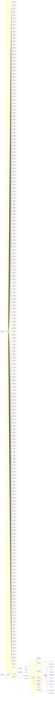

```mermaid
flowchart LR
  subgraph path2 [Path]
    2["Path<br>[1328, 1399, 0]"]
    3["Segment<br>[1328, 1399, 0]"]
    4[Solid2d]
  end
  subgraph path12 [Path]
    12["Path<br>[1878, 1915, 0]"]
    13["Segment<br>[1564, 1602, 0]"]
    14["Segment<br>[1564, 1602, 0]"]
    15["Segment<br>[1564, 1602, 0]"]
    16["Segment<br>[1564, 1602, 0]"]
    17["Segment<br>[1564, 1602, 0]"]
    18["Segment<br>[1564, 1602, 0]"]
    19["Segment<br>[1564, 1602, 0]"]
    20["Segment<br>[1564, 1602, 0]"]
    21["Segment<br>[1564, 1602, 0]"]
    22["Segment<br>[1564, 1602, 0]"]
    23["Segment<br>[1564, 1602, 0]"]
    24["Segment<br>[1564, 1602, 0]"]
    25["Segment<br>[1564, 1602, 0]"]
    26["Segment<br>[1564, 1602, 0]"]
    27["Segment<br>[1564, 1602, 0]"]
    28["Segment<br>[1564, 1602, 0]"]
    29["Segment<br>[1564, 1602, 0]"]
    30["Segment<br>[1564, 1602, 0]"]
    31["Segment<br>[1564, 1602, 0]"]
    32["Segment<br>[1564, 1602, 0]"]
    33["Segment<br>[1564, 1602, 0]"]
    34["Segment<br>[1564, 1602, 0]"]
    35["Segment<br>[1564, 1602, 0]"]
    36["Segment<br>[1564, 1602, 0]"]
    37["Segment<br>[1564, 1602, 0]"]
    38["Segment<br>[1564, 1602, 0]"]
    39["Segment<br>[1564, 1602, 0]"]
    40["Segment<br>[1564, 1602, 0]"]
    41["Segment<br>[1564, 1602, 0]"]
    42["Segment<br>[1564, 1602, 0]"]
    43["Segment<br>[1564, 1602, 0]"]
    44["Segment<br>[1564, 1602, 0]"]
    45["Segment<br>[1564, 1602, 0]"]
    46["Segment<br>[1564, 1602, 0]"]
    47["Segment<br>[1564, 1602, 0]"]
    48["Segment<br>[1564, 1602, 0]"]
    49["Segment<br>[1564, 1602, 0]"]
    50["Segment<br>[1564, 1602, 0]"]
    51["Segment<br>[1564, 1602, 0]"]
    52["Segment<br>[1564, 1602, 0]"]
    53["Segment<br>[1564, 1602, 0]"]
    54["Segment<br>[1564, 1602, 0]"]
    55["Segment<br>[1564, 1602, 0]"]
    56["Segment<br>[1564, 1602, 0]"]
    57["Segment<br>[1564, 1602, 0]"]
    58["Segment<br>[1564, 1602, 0]"]
    59["Segment<br>[1564, 1602, 0]"]
    60["Segment<br>[1564, 1602, 0]"]
    61["Segment<br>[1564, 1602, 0]"]
    62["Segment<br>[1564, 1602, 0]"]
    63["Segment<br>[1564, 1602, 0]"]
    64["Segment<br>[1564, 1602, 0]"]
    65["Segment<br>[1564, 1602, 0]"]
    66["Segment<br>[1564, 1602, 0]"]
    67["Segment<br>[1564, 1602, 0]"]
    68["Segment<br>[1564, 1602, 0]"]
    69["Segment<br>[1564, 1602, 0]"]
    70["Segment<br>[1564, 1602, 0]"]
    71["Segment<br>[1564, 1602, 0]"]
    72["Segment<br>[1564, 1602, 0]"]
    73["Segment<br>[1564, 1602, 0]"]
    74["Segment<br>[1564, 1602, 0]"]
    75["Segment<br>[1564, 1602, 0]"]
    76["Segment<br>[1564, 1602, 0]"]
    77["Segment<br>[1564, 1602, 0]"]
    78["Segment<br>[1564, 1602, 0]"]
    79["Segment<br>[1564, 1602, 0]"]
    80["Segment<br>[1564, 1602, 0]"]
    81["Segment<br>[1564, 1602, 0]"]
    82["Segment<br>[1564, 1602, 0]"]
    83["Segment<br>[1564, 1602, 0]"]
    84["Segment<br>[1564, 1602, 0]"]
    85["Segment<br>[1564, 1602, 0]"]
    86["Segment<br>[1564, 1602, 0]"]
    87["Segment<br>[1564, 1602, 0]"]
    88["Segment<br>[1564, 1602, 0]"]
    89["Segment<br>[1564, 1602, 0]"]
    90["Segment<br>[1564, 1602, 0]"]
    91["Segment<br>[1564, 1602, 0]"]
    92["Segment<br>[1564, 1602, 0]"]
    93["Segment<br>[1564, 1602, 0]"]
    94["Segment<br>[1564, 1602, 0]"]
    95["Segment<br>[1564, 1602, 0]"]
    96["Segment<br>[1564, 1602, 0]"]
    97["Segment<br>[1564, 1602, 0]"]
    98["Segment<br>[1564, 1602, 0]"]
    99["Segment<br>[1564, 1602, 0]"]
    100["Segment<br>[1564, 1602, 0]"]
    101["Segment<br>[1564, 1602, 0]"]
    102["Segment<br>[1564, 1602, 0]"]
    103["Segment<br>[1564, 1602, 0]"]
    104["Segment<br>[1564, 1602, 0]"]
    105["Segment<br>[1564, 1602, 0]"]
    106["Segment<br>[1564, 1602, 0]"]
    107["Segment<br>[1564, 1602, 0]"]
    108["Segment<br>[1564, 1602, 0]"]
    109["Segment<br>[1564, 1602, 0]"]
    110["Segment<br>[1564, 1602, 0]"]
    111["Segment<br>[1564, 1602, 0]"]
    112["Segment<br>[1564, 1602, 0]"]
    113["Segment<br>[1564, 1602, 0]"]
    114["Segment<br>[1967, 2069, 0]"]
    115["Segment<br>[1792, 1822, 0]"]
    116["Segment<br>[1792, 1822, 0]"]
    117["Segment<br>[1792, 1822, 0]"]
    118["Segment<br>[1792, 1822, 0]"]
    119["Segment<br>[1792, 1822, 0]"]
    120["Segment<br>[1792, 1822, 0]"]
    121["Segment<br>[1792, 1822, 0]"]
    122["Segment<br>[1792, 1822, 0]"]
    123["Segment<br>[1792, 1822, 0]"]
    124["Segment<br>[1792, 1822, 0]"]
    125["Segment<br>[1792, 1822, 0]"]
    126["Segment<br>[1792, 1822, 0]"]
    127["Segment<br>[1792, 1822, 0]"]
    128["Segment<br>[1792, 1822, 0]"]
    129["Segment<br>[1792, 1822, 0]"]
    130["Segment<br>[1792, 1822, 0]"]
    131["Segment<br>[1792, 1822, 0]"]
    132["Segment<br>[1792, 1822, 0]"]
    133["Segment<br>[1792, 1822, 0]"]
    134["Segment<br>[1792, 1822, 0]"]
    135["Segment<br>[1792, 1822, 0]"]
    136["Segment<br>[1792, 1822, 0]"]
    137["Segment<br>[1792, 1822, 0]"]
    138["Segment<br>[1792, 1822, 0]"]
    139["Segment<br>[1792, 1822, 0]"]
    140["Segment<br>[1792, 1822, 0]"]
    141["Segment<br>[1792, 1822, 0]"]
    142["Segment<br>[1792, 1822, 0]"]
    143["Segment<br>[1792, 1822, 0]"]
    144["Segment<br>[1792, 1822, 0]"]
    145["Segment<br>[1792, 1822, 0]"]
    146["Segment<br>[1792, 1822, 0]"]
    147["Segment<br>[1792, 1822, 0]"]
    148["Segment<br>[1792, 1822, 0]"]
    149["Segment<br>[1792, 1822, 0]"]
    150["Segment<br>[1792, 1822, 0]"]
    151["Segment<br>[1792, 1822, 0]"]
    152["Segment<br>[1792, 1822, 0]"]
    153["Segment<br>[1792, 1822, 0]"]
    154["Segment<br>[1792, 1822, 0]"]
    155["Segment<br>[1792, 1822, 0]"]
    156["Segment<br>[1792, 1822, 0]"]
    157["Segment<br>[1792, 1822, 0]"]
    158["Segment<br>[1792, 1822, 0]"]
    159["Segment<br>[1792, 1822, 0]"]
    160["Segment<br>[1792, 1822, 0]"]
    161["Segment<br>[1792, 1822, 0]"]
    162["Segment<br>[1792, 1822, 0]"]
    163["Segment<br>[1792, 1822, 0]"]
    164["Segment<br>[1792, 1822, 0]"]
    165["Segment<br>[1792, 1822, 0]"]
    166["Segment<br>[1792, 1822, 0]"]
    167["Segment<br>[1792, 1822, 0]"]
    168["Segment<br>[1792, 1822, 0]"]
    169["Segment<br>[1792, 1822, 0]"]
    170["Segment<br>[1792, 1822, 0]"]
    171["Segment<br>[1792, 1822, 0]"]
    172["Segment<br>[1792, 1822, 0]"]
    173["Segment<br>[1792, 1822, 0]"]
    174["Segment<br>[1792, 1822, 0]"]
    175["Segment<br>[1792, 1822, 0]"]
    176["Segment<br>[1792, 1822, 0]"]
    177["Segment<br>[1792, 1822, 0]"]
    178["Segment<br>[1792, 1822, 0]"]
    179["Segment<br>[1792, 1822, 0]"]
    180["Segment<br>[1792, 1822, 0]"]
    181["Segment<br>[1792, 1822, 0]"]
    182["Segment<br>[1792, 1822, 0]"]
    183["Segment<br>[1792, 1822, 0]"]
    184["Segment<br>[1792, 1822, 0]"]
    185["Segment<br>[1792, 1822, 0]"]
    186["Segment<br>[1792, 1822, 0]"]
    187["Segment<br>[1792, 1822, 0]"]
    188["Segment<br>[1792, 1822, 0]"]
    189["Segment<br>[1792, 1822, 0]"]
    190["Segment<br>[1792, 1822, 0]"]
    191["Segment<br>[1792, 1822, 0]"]
    192["Segment<br>[1792, 1822, 0]"]
    193["Segment<br>[1792, 1822, 0]"]
    194["Segment<br>[1792, 1822, 0]"]
    195["Segment<br>[1792, 1822, 0]"]
    196["Segment<br>[1792, 1822, 0]"]
    197["Segment<br>[1792, 1822, 0]"]
    198["Segment<br>[1792, 1822, 0]"]
    199["Segment<br>[1792, 1822, 0]"]
    200["Segment<br>[1792, 1822, 0]"]
    201["Segment<br>[1792, 1822, 0]"]
    202["Segment<br>[1792, 1822, 0]"]
    203["Segment<br>[1792, 1822, 0]"]
    204["Segment<br>[1792, 1822, 0]"]
    205["Segment<br>[1792, 1822, 0]"]
    206["Segment<br>[1792, 1822, 0]"]
    207["Segment<br>[1792, 1822, 0]"]
    208["Segment<br>[1792, 1822, 0]"]
    209["Segment<br>[1792, 1822, 0]"]
    210["Segment<br>[1792, 1822, 0]"]
    211["Segment<br>[1792, 1822, 0]"]
    212["Segment<br>[1792, 1822, 0]"]
    213["Segment<br>[1792, 1822, 0]"]
    214["Segment<br>[1792, 1822, 0]"]
    215["Segment<br>[1792, 1822, 0]"]
    216["Segment<br>[2115, 2122, 0]"]
    217[Solid2d]
  end
  subgraph path219 [Path]
    219["Path<br>[2597, 2697, 0]"]
    220["Segment<br>[2703, 2730, 0]"]
    221["Segment<br>[2736, 2764, 0]"]
    222["Segment<br>[2770, 2798, 0]"]
    223["Segment<br>[2804, 2924, 0]"]
    224["Segment<br>[2930, 3039, 0]"]
    225["Segment<br>[3045, 3052, 0]"]
    226[Solid2d]
  end
  1["Plane<br>[1303, 1322, 0]"]
  5["Sweep Extrusion<br>[1405, 1433, 0]"]
  6[Wall]
  7["Cap Start"]
  8["Cap End"]
  9["SweepEdge Opposite"]
  10["SweepEdge Adjacent"]
  11["Plane<br>[1853, 1872, 0]"]
  218["Sweep Extrusion<br>[2128, 2156, 0]"]
  227["Sweep Extrusion<br>[3058, 3087, 0]"]
  228[Wall]
  229[Wall]
  230[Wall]
  231[Wall]
  232["SweepEdge Opposite"]
  233["SweepEdge Adjacent"]
  234["SweepEdge Opposite"]
  235["SweepEdge Adjacent"]
  236["SweepEdge Opposite"]
  237["SweepEdge Adjacent"]
  238["SweepEdge Opposite"]
  239["SweepEdge Adjacent"]
  240["StartSketchOnFace<br>[2565, 2591, 0]"]
  1 --- 2
  2 --- 3
  2 ---- 5
  2 --- 4
  3 --- 6
  3 --- 9
  3 --- 10
  5 --- 6
  5 --- 7
  5 --- 8
  5 --- 9
  5 --- 10
  8 --- 219
  11 --- 12
  12 --- 13
  12 --- 14
  12 --- 15
  12 --- 16
  12 --- 17
  12 --- 18
  12 --- 19
  12 --- 20
  12 --- 21
  12 --- 22
  12 --- 23
  12 --- 24
  12 --- 25
  12 --- 26
  12 --- 27
  12 --- 28
  12 --- 29
  12 --- 30
  12 --- 31
  12 --- 32
  12 --- 33
  12 --- 34
  12 --- 35
  12 --- 36
  12 --- 37
  12 --- 38
  12 --- 39
  12 --- 40
  12 --- 41
  12 --- 42
  12 --- 43
  12 --- 44
  12 --- 45
  12 --- 46
  12 --- 47
  12 --- 48
  12 --- 49
  12 --- 50
  12 --- 51
  12 --- 52
  12 --- 53
  12 --- 54
  12 --- 55
  12 --- 56
  12 --- 57
  12 --- 58
  12 --- 59
  12 --- 60
  12 --- 61
  12 --- 62
  12 --- 63
  12 --- 64
  12 --- 65
  12 --- 66
  12 --- 67
  12 --- 68
  12 --- 69
  12 --- 70
  12 --- 71
  12 --- 72
  12 --- 73
  12 --- 74
  12 --- 75
  12 --- 76
  12 --- 77
  12 --- 78
  12 --- 79
  12 --- 80
  12 --- 81
  12 --- 82
  12 --- 83
  12 --- 84
  12 --- 85
  12 --- 86
  12 --- 87
  12 --- 88
  12 --- 89
  12 --- 90
  12 --- 91
  12 --- 92
  12 --- 93
  12 --- 94
  12 --- 95
  12 --- 96
  12 --- 97
  12 --- 98
  12 --- 99
  12 --- 100
  12 --- 101
  12 --- 102
  12 --- 103
  12 --- 104
  12 --- 105
  12 --- 106
  12 --- 107
  12 --- 108
  12 --- 109
  12 --- 110
  12 --- 111
  12 --- 112
  12 --- 113
  12 --- 114
  12 --- 115
  12 --- 116
  12 --- 117
  12 --- 118
  12 --- 119
  12 --- 120
  12 --- 121
  12 --- 122
  12 --- 123
  12 --- 124
  12 --- 125
  12 --- 126
  12 --- 127
  12 --- 128
  12 --- 129
  12 --- 130
  12 --- 131
  12 --- 132
  12 --- 133
  12 --- 134
  12 --- 135
  12 --- 136
  12 --- 137
  12 --- 138
  12 --- 139
  12 --- 140
  12 --- 141
  12 --- 142
  12 --- 143
  12 --- 144
  12 --- 145
  12 --- 146
  12 --- 147
  12 --- 148
  12 --- 149
  12 --- 150
  12 --- 151
  12 --- 152
  12 --- 153
  12 --- 154
  12 --- 155
  12 --- 156
  12 --- 157
  12 --- 158
  12 --- 159
  12 --- 160
  12 --- 161
  12 --- 162
  12 --- 163
  12 --- 164
  12 --- 165
  12 --- 166
  12 --- 167
  12 --- 168
  12 --- 169
  12 --- 170
  12 --- 171
  12 --- 172
  12 --- 173
  12 --- 174
  12 --- 175
  12 --- 176
  12 --- 177
  12 --- 178
  12 --- 179
  12 --- 180
  12 --- 181
  12 --- 182
  12 --- 183
  12 --- 184
  12 --- 185
  12 --- 186
  12 --- 187
  12 --- 188
  12 --- 189
  12 --- 190
  12 --- 191
  12 --- 192
  12 --- 193
  12 --- 194
  12 --- 195
  12 --- 196
  12 --- 197
  12 --- 198
  12 --- 199
  12 --- 200
  12 --- 201
  12 --- 202
  12 --- 203
  12 --- 204
  12 --- 205
  12 --- 206
  12 --- 207
  12 --- 208
  12 --- 209
  12 --- 210
  12 --- 211
  12 --- 212
  12 --- 213
  12 --- 214
  12 --- 215
  12 --- 216
  12 ---- 218
  12 --- 217
  219 --- 220
  219 --- 221
  219 --- 222
  219 --- 223
  219 --- 224
  219 --- 225
  219 ---- 227
  219 --- 226
  220 --- 231
  220 --- 238
  220 --- 239
  221 --- 230
  221 --- 236
  221 --- 237
  222 --- 229
  222 --- 234
  222 --- 235
  224 --- 228
  224 --- 232
  224 --- 233
  227 --- 228
  227 --- 229
  227 --- 230
  227 --- 231
  227 --- 232
  227 --- 233
  227 --- 234
  227 --- 235
  227 --- 236
  227 --- 237
  227 --- 238
  227 --- 239
  8 <--x 240
```
