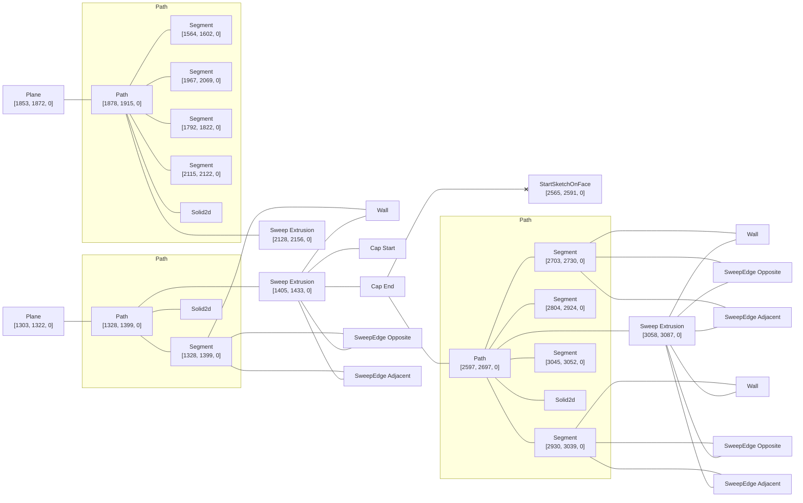

```mermaid
flowchart LR
  subgraph path2 [Path]
    2["Path<br>[1328, 1399, 0]"]
    3["Segment<br>[1328, 1399, 0]"]
    4[Solid2d]
  end
  subgraph path12 [Path]
    12["Path<br>[1878, 1915, 0]"]
    13["Segment<br>[1564, 1602, 0]"]
    14["Segment<br>[1967, 2069, 0]"]
    15["Segment<br>[1792, 1822, 0]"]
    16["Segment<br>[2115, 2122, 0]"]
    17[Solid2d]
  end
  subgraph path19 [Path]
    19["Path<br>[2597, 2697, 0]"]
    20["Segment<br>[2703, 2730, 0]"]
    21["Segment<br>[2804, 2924, 0]"]
    22["Segment<br>[2930, 3039, 0]"]
    23["Segment<br>[3045, 3052, 0]"]
    24[Solid2d]
  end
  1["Plane<br>[1303, 1322, 0]"]
  5["Sweep Extrusion<br>[1405, 1433, 0]"]
  6[Wall]
  7["Cap Start"]
  8["Cap End"]
  9["SweepEdge Opposite"]
  10["SweepEdge Adjacent"]
  11["Plane<br>[1853, 1872, 0]"]
  18["Sweep Extrusion<br>[2128, 2156, 0]"]
  25["Sweep Extrusion<br>[3058, 3087, 0]"]
  26[Wall]
  27[Wall]
  28["SweepEdge Opposite"]
  29["SweepEdge Adjacent"]
  30["SweepEdge Opposite"]
  31["SweepEdge Adjacent"]
  32["StartSketchOnFace<br>[2565, 2591, 0]"]
  1 --- 2
  2 --- 3
  2 ---- 5
  2 --- 4
  3 --- 6
  3 --- 9
  3 --- 10
  5 --- 6
  5 --- 7
  5 --- 8
  5 --- 9
  5 --- 10
  8 --- 19
  11 --- 12
  12 --- 13
  12 --- 14
  12 --- 15
  12 --- 16
  12 ---- 18
  12 --- 17
  19 --- 20
  19 --- 21
  19 --- 22
  19 --- 23
  19 ---- 25
  19 --- 24
  20 --- 27
  20 --- 30
  20 --- 31
  22 --- 26
  22 --- 28
  22 --- 29
  25 --- 26
  25 --- 27
  25 --- 28
  25 --- 29
  25 --- 30
  25 --- 31
  8 <--x 32
```
