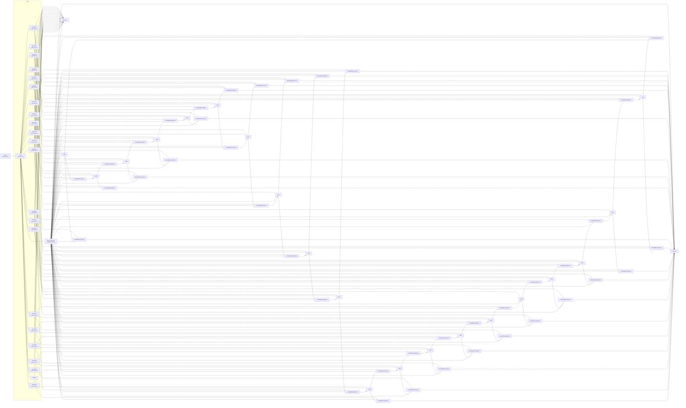

```mermaid
flowchart LR
  subgraph path2 [Path]
    2["Path<br>[706, 741, 0]"]
      %% [ProgramBodyItem { index: 4 }, VariableDeclarationDeclaration, VariableDeclarationInit, PipeBodyItem { index: 0 }]
    3["Segment<br>[747, 770, 0]"]
      %% [ProgramBodyItem { index: 4 }, VariableDeclarationDeclaration, VariableDeclarationInit, PipeBodyItem { index: 1 }]
    4["Segment<br>[776, 816, 0]"]
      %% [ProgramBodyItem { index: 4 }, VariableDeclarationDeclaration, VariableDeclarationInit, PipeBodyItem { index: 2 }]
    5["Segment<br>[822, 843, 0]"]
      %% [ProgramBodyItem { index: 4 }, VariableDeclarationDeclaration, VariableDeclarationInit, PipeBodyItem { index: 3 }]
    6["Segment<br>[849, 868, 0]"]
      %% [ProgramBodyItem { index: 4 }, VariableDeclarationDeclaration, VariableDeclarationInit, PipeBodyItem { index: 4 }]
    7["Segment<br>[874, 897, 0]"]
      %% [ProgramBodyItem { index: 4 }, VariableDeclarationDeclaration, VariableDeclarationInit, PipeBodyItem { index: 5 }]
    8["Segment<br>[903, 943, 0]"]
      %% [ProgramBodyItem { index: 4 }, VariableDeclarationDeclaration, VariableDeclarationInit, PipeBodyItem { index: 6 }]
    9["Segment<br>[949, 970, 0]"]
      %% [ProgramBodyItem { index: 4 }, VariableDeclarationDeclaration, VariableDeclarationInit, PipeBodyItem { index: 7 }]
    10["Segment<br>[976, 1015, 0]"]
      %% [ProgramBodyItem { index: 4 }, VariableDeclarationDeclaration, VariableDeclarationInit, PipeBodyItem { index: 8 }]
    11["Segment<br>[1021, 1039, 0]"]
      %% [ProgramBodyItem { index: 4 }, VariableDeclarationDeclaration, VariableDeclarationInit, PipeBodyItem { index: 9 }]
    12["Segment<br>[1045, 1104, 0]"]
      %% [ProgramBodyItem { index: 4 }, VariableDeclarationDeclaration, VariableDeclarationInit, PipeBodyItem { index: 10 }]
    13["Segment<br>[1110, 1128, 0]"]
      %% [ProgramBodyItem { index: 4 }, VariableDeclarationDeclaration, VariableDeclarationInit, PipeBodyItem { index: 11 }]
    14["Segment<br>[1110, 1128, 0]"]
      %% [ProgramBodyItem { index: 4 }, VariableDeclarationDeclaration, VariableDeclarationInit, PipeBodyItem { index: 11 }]
    15["Segment<br>[1110, 1128, 0]"]
      %% [ProgramBodyItem { index: 4 }, VariableDeclarationDeclaration, VariableDeclarationInit, PipeBodyItem { index: 11 }]
    16["Segment<br>[1110, 1128, 0]"]
      %% [ProgramBodyItem { index: 4 }, VariableDeclarationDeclaration, VariableDeclarationInit, PipeBodyItem { index: 11 }]
    17["Segment<br>[1110, 1128, 0]"]
      %% [ProgramBodyItem { index: 4 }, VariableDeclarationDeclaration, VariableDeclarationInit, PipeBodyItem { index: 11 }]
    18["Segment<br>[1110, 1128, 0]"]
      %% [ProgramBodyItem { index: 4 }, VariableDeclarationDeclaration, VariableDeclarationInit, PipeBodyItem { index: 11 }]
    19["Segment<br>[1110, 1128, 0]"]
      %% [ProgramBodyItem { index: 4 }, VariableDeclarationDeclaration, VariableDeclarationInit, PipeBodyItem { index: 11 }]
    20["Segment<br>[1110, 1128, 0]"]
      %% [ProgramBodyItem { index: 4 }, VariableDeclarationDeclaration, VariableDeclarationInit, PipeBodyItem { index: 11 }]
    21["Segment<br>[1110, 1128, 0]"]
      %% [ProgramBodyItem { index: 4 }, VariableDeclarationDeclaration, VariableDeclarationInit, PipeBodyItem { index: 11 }]
    22["Segment<br>[1110, 1128, 0]"]
      %% [ProgramBodyItem { index: 4 }, VariableDeclarationDeclaration, VariableDeclarationInit, PipeBodyItem { index: 11 }]
    23["Segment<br>[1134, 1141, 0]"]
      %% [ProgramBodyItem { index: 4 }, VariableDeclarationDeclaration, VariableDeclarationInit, PipeBodyItem { index: 12 }]
    24[Solid2d]
  end
  1["Plane<br>[659, 676, 0]"]
    %% [ProgramBodyItem { index: 3 }, VariableDeclarationDeclaration, VariableDeclarationInit]
  25["Sweep Extrusion<br>[1183, 1210, 0]"]
    %% [ProgramBodyItem { index: 4 }, VariableDeclarationDeclaration, VariableDeclarationInit, PipeBodyItem { index: 14 }]
  26[Wall]
    %% face_code_ref=Missing NodePath
  27[Wall]
    %% face_code_ref=Missing NodePath
  28[Wall]
    %% face_code_ref=Missing NodePath
  29[Wall]
    %% face_code_ref=Missing NodePath
  30[Wall]
    %% face_code_ref=Missing NodePath
  31[Wall]
    %% face_code_ref=Missing NodePath
  32[Wall]
    %% face_code_ref=Missing NodePath
  33[Wall]
    %% face_code_ref=Missing NodePath
  34[Wall]
    %% face_code_ref=Missing NodePath
  35[Wall]
    %% face_code_ref=Missing NodePath
  36[Wall]
    %% face_code_ref=Missing NodePath
  37[Wall]
    %% face_code_ref=Missing NodePath
  38[Wall]
    %% face_code_ref=Missing NodePath
  39[Wall]
    %% face_code_ref=Missing NodePath
  40[Wall]
    %% face_code_ref=Missing NodePath
  41[Wall]
    %% face_code_ref=Missing NodePath
  42[Wall]
    %% face_code_ref=Missing NodePath
  43[Wall]
    %% face_code_ref=Missing NodePath
  44[Wall]
    %% face_code_ref=Missing NodePath
  45[Wall]
    %% face_code_ref=Missing NodePath
  46["Cap Start"]
    %% face_code_ref=Missing NodePath
  47["Cap End"]
    %% face_code_ref=Missing NodePath
  48["SweepEdge Opposite"]
  49["SweepEdge Adjacent"]
  50["SweepEdge Opposite"]
  51["SweepEdge Adjacent"]
  52["SweepEdge Opposite"]
  53["SweepEdge Adjacent"]
  54["SweepEdge Opposite"]
  55["SweepEdge Adjacent"]
  56["SweepEdge Opposite"]
  57["SweepEdge Adjacent"]
  58["SweepEdge Opposite"]
  59["SweepEdge Adjacent"]
  60["SweepEdge Opposite"]
  61["SweepEdge Adjacent"]
  62["SweepEdge Opposite"]
  63["SweepEdge Adjacent"]
  64["SweepEdge Opposite"]
  65["SweepEdge Adjacent"]
  66["SweepEdge Opposite"]
  67["SweepEdge Adjacent"]
  68["SweepEdge Opposite"]
  69["SweepEdge Adjacent"]
  70["SweepEdge Opposite"]
  71["SweepEdge Adjacent"]
  72["SweepEdge Opposite"]
  73["SweepEdge Adjacent"]
  74["SweepEdge Opposite"]
  75["SweepEdge Adjacent"]
  76["SweepEdge Opposite"]
  77["SweepEdge Adjacent"]
  78["SweepEdge Opposite"]
  79["SweepEdge Adjacent"]
  80["SweepEdge Opposite"]
  81["SweepEdge Adjacent"]
  82["SweepEdge Opposite"]
  83["SweepEdge Adjacent"]
  84["SweepEdge Opposite"]
  85["SweepEdge Adjacent"]
  86["SweepEdge Opposite"]
  87["SweepEdge Adjacent"]
  1 --- 2
  2 --- 3
  2 --- 4
  2 --- 5
  2 --- 6
  2 --- 7
  2 --- 8
  2 --- 9
  2 --- 10
  2 --- 11
  2 --- 12
  2 --- 13
  2 --- 14
  2 --- 15
  2 --- 16
  2 --- 17
  2 --- 18
  2 --- 19
  2 --- 20
  2 --- 21
  2 --- 22
  2 --- 23
  2 --- 24
  2 ---- 25
  3 --- 35
  3 x--> 46
  3 --- 66
  3 --- 67
  4 --- 34
  4 x--> 46
  4 --- 64
  4 --- 65
  5 --- 33
  5 x--> 46
  5 --- 62
  5 --- 63
  6 --- 32
  6 x--> 46
  6 --- 60
  6 --- 61
  7 --- 31
  7 x--> 46
  7 --- 58
  7 --- 59
  8 --- 30
  8 x--> 46
  8 --- 56
  8 --- 57
  9 --- 29
  9 x--> 46
  9 --- 54
  9 --- 55
  10 --- 28
  10 x--> 46
  10 --- 52
  10 --- 53
  11 --- 27
  11 x--> 46
  11 --- 50
  11 --- 51
  12 --- 26
  12 x--> 46
  12 --- 48
  12 --- 49
  13 --- 45
  13 x--> 46
  13 --- 86
  13 --- 87
  14 --- 44
  14 x--> 46
  14 --- 84
  14 --- 85
  15 --- 43
  15 x--> 46
  15 --- 82
  15 --- 83
  16 --- 42
  16 x--> 46
  16 --- 80
  16 --- 81
  17 --- 41
  17 x--> 46
  17 --- 78
  17 --- 79
  18 --- 40
  18 x--> 46
  18 --- 76
  18 --- 77
  19 --- 39
  19 x--> 46
  19 --- 74
  19 --- 75
  20 --- 38
  20 x--> 46
  20 --- 72
  20 --- 73
  21 --- 37
  21 x--> 46
  21 --- 70
  21 --- 71
  22 --- 36
  22 x--> 46
  22 --- 68
  22 --- 69
  25 --- 26
  25 --- 27
  25 --- 28
  25 --- 29
  25 --- 30
  25 --- 31
  25 --- 32
  25 --- 33
  25 --- 34
  25 --- 35
  25 --- 36
  25 --- 37
  25 --- 38
  25 --- 39
  25 --- 40
  25 --- 41
  25 --- 42
  25 --- 43
  25 --- 44
  25 --- 45
  25 --- 46
  25 --- 47
  25 --- 48
  25 --- 49
  25 --- 50
  25 --- 51
  25 --- 52
  25 --- 53
  25 --- 54
  25 --- 55
  25 --- 56
  25 --- 57
  25 --- 58
  25 --- 59
  25 --- 60
  25 --- 61
  25 --- 62
  25 --- 63
  25 --- 64
  25 --- 65
  25 --- 66
  25 --- 67
  25 --- 68
  25 --- 69
  25 --- 70
  25 --- 71
  25 --- 72
  25 --- 73
  25 --- 74
  25 --- 75
  25 --- 76
  25 --- 77
  25 --- 78
  25 --- 79
  25 --- 80
  25 --- 81
  25 --- 82
  25 --- 83
  25 --- 84
  25 --- 85
  25 --- 86
  25 --- 87
  26 --- 48
  26 --- 49
  51 <--x 26
  27 --- 50
  27 --- 51
  53 <--x 27
  28 --- 52
  28 --- 53
  55 <--x 28
  29 --- 54
  29 --- 55
  57 <--x 29
  30 --- 56
  30 --- 57
  59 <--x 30
  31 --- 58
  31 --- 59
  61 <--x 31
  32 --- 60
  32 --- 61
  63 <--x 32
  33 --- 62
  33 --- 63
  65 <--x 33
  34 --- 64
  34 --- 65
  67 <--x 34
  35 --- 66
  35 --- 67
  69 <--x 35
  36 --- 68
  36 --- 69
  71 <--x 36
  37 --- 70
  37 --- 71
  73 <--x 37
  38 --- 72
  38 --- 73
  75 <--x 38
  39 --- 74
  39 --- 75
  77 <--x 39
  40 --- 76
  40 --- 77
  79 <--x 40
  41 --- 78
  41 --- 79
  81 <--x 41
  42 --- 80
  42 --- 81
  83 <--x 42
  43 --- 82
  43 --- 83
  85 <--x 43
  44 --- 84
  44 --- 85
  87 <--x 44
  49 <--x 45
  45 --- 86
  45 --- 87
  48 <--x 47
  50 <--x 47
  52 <--x 47
  54 <--x 47
  56 <--x 47
  58 <--x 47
  60 <--x 47
  62 <--x 47
  64 <--x 47
  66 <--x 47
  68 <--x 47
  70 <--x 47
  72 <--x 47
  74 <--x 47
  76 <--x 47
  78 <--x 47
  80 <--x 47
  82 <--x 47
  84 <--x 47
  86 <--x 47
```
