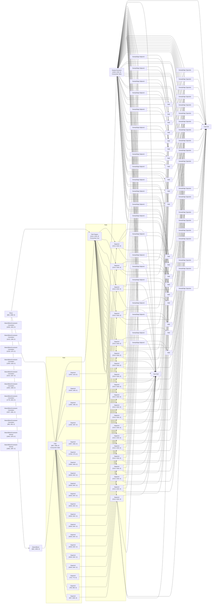

```mermaid
flowchart LR
  subgraph path3 [Path]
    3["Path Region<br>[2114, 2164, 0]<br>Consumed: true"]
      %% [ProgramBodyItem { index: 5 }, VariableDeclarationDeclaration, VariableDeclarationInit]
    23["Segment<br>[2114, 2164, 0]"]
      %% [ProgramBodyItem { index: 5 }, VariableDeclarationDeclaration, VariableDeclarationInit]
    24["Segment<br>[2114, 2164, 0]"]
      %% [ProgramBodyItem { index: 5 }, VariableDeclarationDeclaration, VariableDeclarationInit]
    25["Segment<br>[2114, 2164, 0]"]
      %% [ProgramBodyItem { index: 5 }, VariableDeclarationDeclaration, VariableDeclarationInit]
    26["Segment<br>[2114, 2164, 0]"]
      %% [ProgramBodyItem { index: 5 }, VariableDeclarationDeclaration, VariableDeclarationInit]
    27["Segment<br>[2114, 2164, 0]"]
      %% [ProgramBodyItem { index: 5 }, VariableDeclarationDeclaration, VariableDeclarationInit]
    28["Segment<br>[2114, 2164, 0]"]
      %% [ProgramBodyItem { index: 5 }, VariableDeclarationDeclaration, VariableDeclarationInit]
    29["Segment<br>[2114, 2164, 0]"]
      %% [ProgramBodyItem { index: 5 }, VariableDeclarationDeclaration, VariableDeclarationInit]
    30["Segment<br>[2114, 2164, 0]"]
      %% [ProgramBodyItem { index: 5 }, VariableDeclarationDeclaration, VariableDeclarationInit]
    31["Segment<br>[2114, 2164, 0]"]
      %% [ProgramBodyItem { index: 5 }, VariableDeclarationDeclaration, VariableDeclarationInit]
    32["Segment<br>[2114, 2164, 0]"]
      %% [ProgramBodyItem { index: 5 }, VariableDeclarationDeclaration, VariableDeclarationInit]
    33["Segment<br>[2114, 2164, 0]"]
      %% [ProgramBodyItem { index: 5 }, VariableDeclarationDeclaration, VariableDeclarationInit]
    34["Segment<br>[2114, 2164, 0]"]
      %% [ProgramBodyItem { index: 5 }, VariableDeclarationDeclaration, VariableDeclarationInit]
    35["Segment<br>[2114, 2164, 0]"]
      %% [ProgramBodyItem { index: 5 }, VariableDeclarationDeclaration, VariableDeclarationInit]
    36["Segment<br>[2114, 2164, 0]"]
      %% [ProgramBodyItem { index: 5 }, VariableDeclarationDeclaration, VariableDeclarationInit]
    37["Segment<br>[2114, 2164, 0]"]
      %% [ProgramBodyItem { index: 5 }, VariableDeclarationDeclaration, VariableDeclarationInit]
    38["Segment<br>[2114, 2164, 0]"]
      %% [ProgramBodyItem { index: 5 }, VariableDeclarationDeclaration, VariableDeclarationInit]
    39["Segment<br>[2114, 2164, 0]"]
      %% [ProgramBodyItem { index: 5 }, VariableDeclarationDeclaration, VariableDeclarationInit]
    40["Segment<br>[2114, 2164, 0]"]
      %% [ProgramBodyItem { index: 5 }, VariableDeclarationDeclaration, VariableDeclarationInit]
    41["Segment<br>[2114, 2164, 0]"]
      %% [ProgramBodyItem { index: 5 }, VariableDeclarationDeclaration, VariableDeclarationInit]
    42["Segment<br>[2114, 2164, 0]"]
      %% [ProgramBodyItem { index: 5 }, VariableDeclarationDeclaration, VariableDeclarationInit]
  end
  subgraph path4 [Path]
    4["Path<br>[682, 1999, 0]<br>Consumed: false"]
      %% [ProgramBodyItem { index: 3 }, VariableDeclarationDeclaration, VariableDeclarationInit]
    6["Segment<br>[1054, 1119, 0]"]
      %% [ProgramBodyItem { index: 3 }, VariableDeclarationDeclaration, VariableDeclarationInit, SketchBlockBody, SketchBlockBodyItem { index: 5 }, VariableDeclarationDeclaration, VariableDeclarationInit]
    7["Segment<br>[1169, 1236, 0]"]
      %% [ProgramBodyItem { index: 3 }, VariableDeclarationDeclaration, VariableDeclarationInit, SketchBlockBody, SketchBlockBodyItem { index: 7 }, VariableDeclarationDeclaration, VariableDeclarationInit]
    8["Segment<br>[1285, 1392, 0]"]
      %% [ProgramBodyItem { index: 3 }, VariableDeclarationDeclaration, VariableDeclarationInit, SketchBlockBody, SketchBlockBodyItem { index: 9 }, VariableDeclarationDeclaration, VariableDeclarationInit]
    9["Segment<br>[1439, 1507, 0]"]
      %% [ProgramBodyItem { index: 3 }, VariableDeclarationDeclaration, VariableDeclarationInit, SketchBlockBody, SketchBlockBodyItem { index: 11 }, VariableDeclarationDeclaration, VariableDeclarationInit]
    10["Segment<br>[1557, 1662, 0]"]
      %% [ProgramBodyItem { index: 3 }, VariableDeclarationDeclaration, VariableDeclarationInit, SketchBlockBody, SketchBlockBodyItem { index: 13 }, VariableDeclarationDeclaration, VariableDeclarationInit]
    11["Segment<br>[1709, 1775, 0]"]
      %% [ProgramBodyItem { index: 3 }, VariableDeclarationDeclaration, VariableDeclarationInit, SketchBlockBody, SketchBlockBodyItem { index: 15 }, VariableDeclarationDeclaration, VariableDeclarationInit]
    12["Segment<br>[1826, 1924, 0]"]
      %% [ProgramBodyItem { index: 3 }, VariableDeclarationDeclaration, VariableDeclarationInit, SketchBlockBody, SketchBlockBodyItem { index: 17 }, VariableDeclarationDeclaration, VariableDeclarationInit]
    13["Segment<br>[2029, 2047, 0]"]
      %% [ProgramBodyItem { index: 4 }, VariableDeclarationDeclaration, VariableDeclarationInit, PipeBodyItem { index: 1 }]
    14["Segment<br>[2029, 2047, 0]"]
      %% [ProgramBodyItem { index: 4 }, VariableDeclarationDeclaration, VariableDeclarationInit, PipeBodyItem { index: 1 }]
    15["Segment<br>[2029, 2047, 0]"]
      %% [ProgramBodyItem { index: 4 }, VariableDeclarationDeclaration, VariableDeclarationInit, PipeBodyItem { index: 1 }]
    16["Segment<br>[2029, 2047, 0]"]
      %% [ProgramBodyItem { index: 4 }, VariableDeclarationDeclaration, VariableDeclarationInit, PipeBodyItem { index: 1 }]
    17["Segment<br>[2029, 2047, 0]"]
      %% [ProgramBodyItem { index: 4 }, VariableDeclarationDeclaration, VariableDeclarationInit, PipeBodyItem { index: 1 }]
    18["Segment<br>[2029, 2047, 0]"]
      %% [ProgramBodyItem { index: 4 }, VariableDeclarationDeclaration, VariableDeclarationInit, PipeBodyItem { index: 1 }]
    19["Segment<br>[2029, 2047, 0]"]
      %% [ProgramBodyItem { index: 4 }, VariableDeclarationDeclaration, VariableDeclarationInit, PipeBodyItem { index: 1 }]
    20["Segment<br>[2029, 2047, 0]"]
      %% [ProgramBodyItem { index: 4 }, VariableDeclarationDeclaration, VariableDeclarationInit, PipeBodyItem { index: 1 }]
    21["Segment<br>[2029, 2047, 0]"]
      %% [ProgramBodyItem { index: 4 }, VariableDeclarationDeclaration, VariableDeclarationInit, PipeBodyItem { index: 1 }]
    22["Segment<br>[2029, 2047, 0]"]
      %% [ProgramBodyItem { index: 4 }, VariableDeclarationDeclaration, VariableDeclarationInit, PipeBodyItem { index: 1 }]
    43["Segment<br>[710, 773, 0]"]
      %% [ProgramBodyItem { index: 3 }, VariableDeclarationDeclaration, VariableDeclarationInit, SketchBlockBody, SketchBlockBodyItem { index: 0 }, VariableDeclarationDeclaration, VariableDeclarationInit]
    44["Segment<br>[783, 890, 0]"]
      %% [ProgramBodyItem { index: 3 }, VariableDeclarationDeclaration, VariableDeclarationInit, SketchBlockBody, SketchBlockBodyItem { index: 1 }, VariableDeclarationDeclaration, VariableDeclarationInit]
    45["Segment<br>[937, 1003, 0]"]
      %% [ProgramBodyItem { index: 3 }, VariableDeclarationDeclaration, VariableDeclarationInit, SketchBlockBody, SketchBlockBodyItem { index: 3 }, VariableDeclarationDeclaration, VariableDeclarationInit]
  end
  1["Cap End"]
    %% face_code_ref=Missing NodePath
  2["Cap Start"]
    %% face_code_ref=Missing NodePath
  5["Plane<br>[682, 1999, 0]"]
    %% [ProgramBodyItem { index: 3 }, VariableDeclarationDeclaration, VariableDeclarationInit]
  46["SketchBlock<br>[682, 1999, 0]"]
    %% [ProgramBodyItem { index: 3 }, VariableDeclarationDeclaration, VariableDeclarationInit]
  47["SketchBlockConstraint Coincident<br>[1006, 1043, 0]"]
    %% [ProgramBodyItem { index: 3 }, VariableDeclarationDeclaration, VariableDeclarationInit, SketchBlockBody, SketchBlockBodyItem { index: 4 }, ExpressionStatementExpr]
  48["SketchBlockConstraint Coincident<br>[1122, 1158, 0]"]
    %% [ProgramBodyItem { index: 3 }, VariableDeclarationDeclaration, VariableDeclarationInit, SketchBlockBody, SketchBlockBodyItem { index: 6 }, ExpressionStatementExpr]
  49["SketchBlockConstraint Coincident<br>[1239, 1275, 0]"]
    %% [ProgramBodyItem { index: 3 }, VariableDeclarationDeclaration, VariableDeclarationInit, SketchBlockBody, SketchBlockBodyItem { index: 8 }, ExpressionStatementExpr]
  50["SketchBlockConstraint Coincident<br>[1395, 1428, 0]"]
    %% [ProgramBodyItem { index: 3 }, VariableDeclarationDeclaration, VariableDeclarationInit, SketchBlockBody, SketchBlockBodyItem { index: 10 }, ExpressionStatementExpr]
  51["SketchBlockConstraint Coincident<br>[1510, 1547, 0]"]
    %% [ProgramBodyItem { index: 3 }, VariableDeclarationDeclaration, VariableDeclarationInit, SketchBlockBody, SketchBlockBodyItem { index: 12 }, ExpressionStatementExpr]
  52["SketchBlockConstraint Coincident<br>[1665, 1698, 0]"]
    %% [ProgramBodyItem { index: 3 }, VariableDeclarationDeclaration, VariableDeclarationInit, SketchBlockBody, SketchBlockBodyItem { index: 14 }, ExpressionStatementExpr]
  53["SketchBlockConstraint Coincident<br>[1778, 1815, 0]"]
    %% [ProgramBodyItem { index: 3 }, VariableDeclarationDeclaration, VariableDeclarationInit, SketchBlockBody, SketchBlockBodyItem { index: 16 }, ExpressionStatementExpr]
  54["SketchBlockConstraint Coincident<br>[1927, 1961, 0]"]
    %% [ProgramBodyItem { index: 3 }, VariableDeclarationDeclaration, VariableDeclarationInit, SketchBlockBody, SketchBlockBodyItem { index: 18 }, ExpressionStatementExpr]
  55["SketchBlockConstraint Coincident<br>[893, 926, 0]"]
    %% [ProgramBodyItem { index: 3 }, VariableDeclarationDeclaration, VariableDeclarationInit, SketchBlockBody, SketchBlockBodyItem { index: 2 }, ExpressionStatementExpr]
  56["SketchBlockConstraint Vertical<br>[1964, 1979, 0]"]
    %% [ProgramBodyItem { index: 3 }, VariableDeclarationDeclaration, VariableDeclarationInit, SketchBlockBody, SketchBlockBodyItem { index: 19 }, ExpressionStatementExpr]
  57["SketchBlockConstraint Vertical<br>[1982, 1997, 0]"]
    %% [ProgramBodyItem { index: 3 }, VariableDeclarationDeclaration, VariableDeclarationInit, SketchBlockBody, SketchBlockBodyItem { index: 20 }, ExpressionStatementExpr]
  58["Sweep Extrusion<br>[2194, 2233, 0]<br>Consumed: false"]
    %% [ProgramBodyItem { index: 6 }, VariableDeclarationDeclaration, VariableDeclarationInit, PipeBodyItem { index: 0 }]
  59["SweepEdge Adjacent"]
  60["SweepEdge Adjacent"]
  61["SweepEdge Adjacent"]
  62["SweepEdge Adjacent"]
  63["SweepEdge Adjacent"]
  64["SweepEdge Adjacent"]
  65["SweepEdge Adjacent"]
  66["SweepEdge Adjacent"]
  67["SweepEdge Adjacent"]
  68["SweepEdge Adjacent"]
  69["SweepEdge Adjacent"]
  70["SweepEdge Adjacent"]
  71["SweepEdge Adjacent"]
  72["SweepEdge Adjacent"]
  73["SweepEdge Adjacent"]
  74["SweepEdge Adjacent"]
  75["SweepEdge Adjacent"]
  76["SweepEdge Adjacent"]
  77["SweepEdge Adjacent"]
  78["SweepEdge Adjacent"]
  79["SweepEdge Opposite"]
  80["SweepEdge Opposite"]
  81["SweepEdge Opposite"]
  82["SweepEdge Opposite"]
  83["SweepEdge Opposite"]
  84["SweepEdge Opposite"]
  85["SweepEdge Opposite"]
  86["SweepEdge Opposite"]
  87["SweepEdge Opposite"]
  88["SweepEdge Opposite"]
  89["SweepEdge Opposite"]
  90["SweepEdge Opposite"]
  91["SweepEdge Opposite"]
  92["SweepEdge Opposite"]
  93["SweepEdge Opposite"]
  94["SweepEdge Opposite"]
  95["SweepEdge Opposite"]
  96["SweepEdge Opposite"]
  97["SweepEdge Opposite"]
  98["SweepEdge Opposite"]
  99[Wall]
    %% face_code_ref=Missing NodePath
  100[Wall]
    %% face_code_ref=Missing NodePath
  101[Wall]
    %% face_code_ref=Missing NodePath
  102[Wall]
    %% face_code_ref=Missing NodePath
  103[Wall]
    %% face_code_ref=Missing NodePath
  104[Wall]
    %% face_code_ref=Missing NodePath
  105[Wall]
    %% face_code_ref=Missing NodePath
  106[Wall]
    %% face_code_ref=Missing NodePath
  107[Wall]
    %% face_code_ref=Missing NodePath
  108[Wall]
    %% face_code_ref=Missing NodePath
  109[Wall]
    %% face_code_ref=Missing NodePath
  110[Wall]
    %% face_code_ref=Missing NodePath
  111[Wall]
    %% face_code_ref=Missing NodePath
  112[Wall]
    %% face_code_ref=Missing NodePath
  113[Wall]
    %% face_code_ref=Missing NodePath
  114[Wall]
    %% face_code_ref=Missing NodePath
  115[Wall]
    %% face_code_ref=Missing NodePath
  116[Wall]
    %% face_code_ref=Missing NodePath
  117[Wall]
    %% face_code_ref=Missing NodePath
  118[Wall]
    %% face_code_ref=Missing NodePath
  58 --- 1
  79 <--x 1
  80 <--x 1
  81 <--x 1
  82 <--x 1
  83 <--x 1
  84 <--x 1
  85 <--x 1
  86 <--x 1
  87 <--x 1
  88 <--x 1
  89 <--x 1
  90 <--x 1
  91 <--x 1
  92 <--x 1
  93 <--x 1
  94 <--x 1
  95 <--x 1
  96 <--x 1
  97 <--x 1
  98 <--x 1
  23 <--x 2
  24 <--x 2
  25 <--x 2
  26 <--x 2
  27 <--x 2
  28 <--x 2
  29 <--x 2
  30 <--x 2
  31 <--x 2
  32 <--x 2
  33 <--x 2
  34 <--x 2
  35 <--x 2
  36 <--x 2
  37 <--x 2
  38 <--x 2
  39 <--x 2
  40 <--x 2
  41 <--x 2
  42 <--x 2
  58 --- 2
  4 x--> 3
  5 x--> 3
  3 <--x 23
  3 <--x 24
  3 <--x 25
  3 <--x 26
  3 <--x 27
  3 <--x 28
  3 <--x 29
  3 <--x 30
  3 <--x 31
  3 <--x 32
  3 <--x 33
  3 <--x 34
  3 <--x 35
  3 <--x 36
  3 <--x 37
  3 <--x 38
  3 <--x 39
  3 <--x 40
  3 <--x 41
  3 <--x 42
  3 ---- 58
  5 --- 4
  4 --- 6
  4 --- 7
  4 --- 8
  4 --- 9
  4 --- 10
  4 --- 11
  4 --- 12
  4 --- 13
  4 --- 14
  4 --- 15
  4 --- 16
  4 --- 17
  4 --- 18
  4 --- 19
  4 --- 20
  4 --- 21
  4 --- 22
  4 --- 43
  4 --- 44
  4 --- 45
  46 --- 4
  5 <--x 46
  6 <--x 23
  7 <--x 24
  8 <--x 25
  9 <--x 26
  10 <--x 27
  11 <--x 28
  12 <--x 29
  13 <--x 30
  14 <--x 31
  15 <--x 32
  16 <--x 33
  17 <--x 34
  18 <--x 35
  19 <--x 36
  20 <--x 37
  21 <--x 38
  22 <--x 39
  23 --- 59
  23 --- 79
  23 --- 99
  24 --- 60
  24 --- 80
  24 --- 100
  25 --- 61
  25 --- 81
  25 --- 101
  26 --- 62
  26 --- 82
  26 --- 102
  27 --- 63
  27 --- 83
  27 --- 103
  28 --- 64
  28 --- 84
  28 --- 104
  29 --- 65
  29 --- 85
  29 --- 105
  30 --- 66
  30 --- 86
  30 --- 106
  31 --- 67
  31 --- 87
  31 --- 107
  32 --- 68
  32 --- 88
  32 --- 108
  33 --- 69
  33 --- 89
  33 --- 109
  34 --- 70
  34 --- 90
  34 --- 110
  35 --- 71
  35 --- 91
  35 --- 111
  36 --- 72
  36 --- 92
  36 --- 112
  37 --- 73
  37 --- 93
  37 --- 113
  38 --- 74
  38 --- 94
  38 --- 114
  39 --- 75
  39 --- 95
  39 --- 115
  43 x--> 40
  40 --- 76
  40 --- 96
  40 --- 116
  44 x--> 41
  41 --- 77
  41 --- 97
  41 --- 117
  45 x--> 42
  42 --- 78
  42 --- 98
  42 --- 118
  58 --- 59
  58 --- 60
  58 --- 61
  58 --- 62
  58 --- 63
  58 --- 64
  58 --- 65
  58 --- 66
  58 --- 67
  58 --- 68
  58 --- 69
  58 --- 70
  58 --- 71
  58 --- 72
  58 --- 73
  58 --- 74
  58 --- 75
  58 --- 76
  58 --- 77
  58 --- 78
  58 --- 79
  58 --- 80
  58 --- 81
  58 --- 82
  58 --- 83
  58 --- 84
  58 --- 85
  58 --- 86
  58 --- 87
  58 --- 88
  58 --- 89
  58 --- 90
  58 --- 91
  58 --- 92
  58 --- 93
  58 --- 94
  58 --- 95
  58 --- 96
  58 --- 97
  58 --- 98
  58 --- 99
  58 --- 100
  58 --- 101
  58 --- 102
  58 --- 103
  58 --- 104
  58 --- 105
  58 --- 106
  58 --- 107
  58 --- 108
  58 --- 109
  58 --- 110
  58 --- 111
  58 --- 112
  58 --- 113
  58 --- 114
  58 --- 115
  58 --- 116
  58 --- 117
  58 --- 118
  99 --- 59
  59 x--> 99
  60 x--> 100
  100 --- 60
  61 x--> 101
  101 --- 61
  62 x--> 102
  102 --- 62
  63 x--> 103
  103 --- 63
  64 x--> 104
  104 --- 64
  65 x--> 105
  105 --- 65
  66 x--> 106
  106 --- 66
  67 x--> 107
  107 --- 67
  68 x--> 108
  108 --- 68
  69 x--> 109
  109 --- 69
  70 x--> 110
  110 --- 70
  71 x--> 111
  111 --- 71
  72 x--> 112
  112 --- 72
  73 x--> 113
  113 --- 73
  74 x--> 114
  114 --- 74
  75 x--> 115
  115 --- 75
  76 x--> 116
  116 --- 76
  77 x--> 117
  117 --- 77
  78 x--> 118
  118 --- 78
  99 --- 79
  100 --- 80
  101 --- 81
  102 --- 82
  103 --- 83
  104 --- 84
  105 --- 85
  106 --- 86
  107 --- 87
  108 --- 88
  109 --- 89
  110 --- 90
  111 --- 91
  112 --- 92
  113 --- 93
  114 --- 94
  115 --- 95
  116 --- 96
  117 --- 97
  118 --- 98
```
