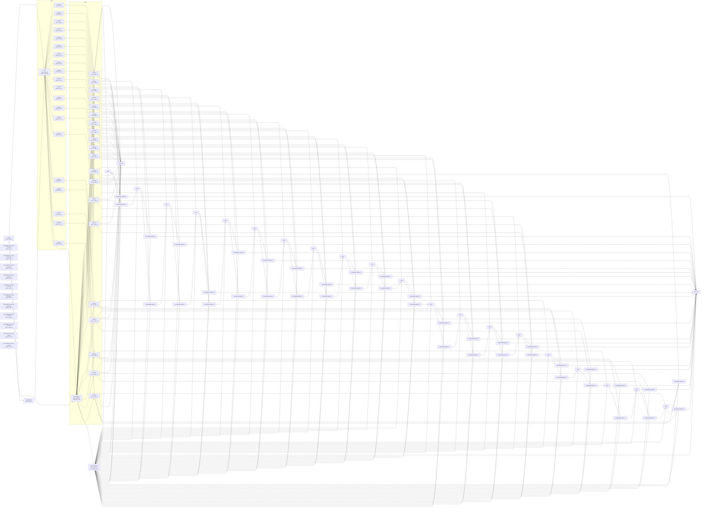

```mermaid
flowchart LR
  subgraph path2 [Path]
    2["Path<br>[682, 1999, 0]<br>Consumed: false"]
      %% [ProgramBodyItem { index: 3 }, VariableDeclarationDeclaration, VariableDeclarationInit]
    3["Segment<br>[710, 773, 0]"]
      %% [ProgramBodyItem { index: 3 }, VariableDeclarationDeclaration, VariableDeclarationInit, SketchBlockBody, SketchBlockBodyItem { index: 0 }, VariableDeclarationDeclaration, VariableDeclarationInit]
    4["Segment<br>[783, 890, 0]"]
      %% [ProgramBodyItem { index: 3 }, VariableDeclarationDeclaration, VariableDeclarationInit, SketchBlockBody, SketchBlockBodyItem { index: 1 }, VariableDeclarationDeclaration, VariableDeclarationInit]
    5["Segment<br>[937, 1003, 0]"]
      %% [ProgramBodyItem { index: 3 }, VariableDeclarationDeclaration, VariableDeclarationInit, SketchBlockBody, SketchBlockBodyItem { index: 3 }, VariableDeclarationDeclaration, VariableDeclarationInit]
    6["Segment<br>[1054, 1119, 0]"]
      %% [ProgramBodyItem { index: 3 }, VariableDeclarationDeclaration, VariableDeclarationInit, SketchBlockBody, SketchBlockBodyItem { index: 5 }, VariableDeclarationDeclaration, VariableDeclarationInit]
    7["Segment<br>[1169, 1236, 0]"]
      %% [ProgramBodyItem { index: 3 }, VariableDeclarationDeclaration, VariableDeclarationInit, SketchBlockBody, SketchBlockBodyItem { index: 7 }, VariableDeclarationDeclaration, VariableDeclarationInit]
    8["Segment<br>[1285, 1392, 0]"]
      %% [ProgramBodyItem { index: 3 }, VariableDeclarationDeclaration, VariableDeclarationInit, SketchBlockBody, SketchBlockBodyItem { index: 9 }, VariableDeclarationDeclaration, VariableDeclarationInit]
    9["Segment<br>[1439, 1507, 0]"]
      %% [ProgramBodyItem { index: 3 }, VariableDeclarationDeclaration, VariableDeclarationInit, SketchBlockBody, SketchBlockBodyItem { index: 11 }, VariableDeclarationDeclaration, VariableDeclarationInit]
    10["Segment<br>[1557, 1662, 0]"]
      %% [ProgramBodyItem { index: 3 }, VariableDeclarationDeclaration, VariableDeclarationInit, SketchBlockBody, SketchBlockBodyItem { index: 13 }, VariableDeclarationDeclaration, VariableDeclarationInit]
    11["Segment<br>[1709, 1775, 0]"]
      %% [ProgramBodyItem { index: 3 }, VariableDeclarationDeclaration, VariableDeclarationInit, SketchBlockBody, SketchBlockBodyItem { index: 15 }, VariableDeclarationDeclaration, VariableDeclarationInit]
    12["Segment<br>[1826, 1924, 0]"]
      %% [ProgramBodyItem { index: 3 }, VariableDeclarationDeclaration, VariableDeclarationInit, SketchBlockBody, SketchBlockBodyItem { index: 17 }, VariableDeclarationDeclaration, VariableDeclarationInit]
    13["Segment<br>[2029, 2047, 0]"]
      %% [ProgramBodyItem { index: 4 }, VariableDeclarationDeclaration, VariableDeclarationInit, PipeBodyItem { index: 1 }]
    14["Segment<br>[2029, 2047, 0]"]
      %% [ProgramBodyItem { index: 4 }, VariableDeclarationDeclaration, VariableDeclarationInit, PipeBodyItem { index: 1 }]
    15["Segment<br>[2029, 2047, 0]"]
      %% [ProgramBodyItem { index: 4 }, VariableDeclarationDeclaration, VariableDeclarationInit, PipeBodyItem { index: 1 }]
    16["Segment<br>[2029, 2047, 0]"]
      %% [ProgramBodyItem { index: 4 }, VariableDeclarationDeclaration, VariableDeclarationInit, PipeBodyItem { index: 1 }]
    17["Segment<br>[2029, 2047, 0]"]
      %% [ProgramBodyItem { index: 4 }, VariableDeclarationDeclaration, VariableDeclarationInit, PipeBodyItem { index: 1 }]
    18["Segment<br>[2029, 2047, 0]"]
      %% [ProgramBodyItem { index: 4 }, VariableDeclarationDeclaration, VariableDeclarationInit, PipeBodyItem { index: 1 }]
    19["Segment<br>[2029, 2047, 0]"]
      %% [ProgramBodyItem { index: 4 }, VariableDeclarationDeclaration, VariableDeclarationInit, PipeBodyItem { index: 1 }]
    20["Segment<br>[2029, 2047, 0]"]
      %% [ProgramBodyItem { index: 4 }, VariableDeclarationDeclaration, VariableDeclarationInit, PipeBodyItem { index: 1 }]
    21["Segment<br>[2029, 2047, 0]"]
      %% [ProgramBodyItem { index: 4 }, VariableDeclarationDeclaration, VariableDeclarationInit, PipeBodyItem { index: 1 }]
    22["Segment<br>[2029, 2047, 0]"]
      %% [ProgramBodyItem { index: 4 }, VariableDeclarationDeclaration, VariableDeclarationInit, PipeBodyItem { index: 1 }]
  end
  subgraph path23 [Path]
    23["Path Region<br>[2114, 2164, 0]<br>Consumed: true"]
      %% [ProgramBodyItem { index: 5 }, VariableDeclarationDeclaration, VariableDeclarationInit]
    24["Segment<br>[2114, 2164, 0]"]
      %% [ProgramBodyItem { index: 5 }, VariableDeclarationDeclaration, VariableDeclarationInit]
    25["Segment<br>[2114, 2164, 0]"]
      %% [ProgramBodyItem { index: 5 }, VariableDeclarationDeclaration, VariableDeclarationInit]
    26["Segment<br>[2114, 2164, 0]"]
      %% [ProgramBodyItem { index: 5 }, VariableDeclarationDeclaration, VariableDeclarationInit]
    27["Segment<br>[2114, 2164, 0]"]
      %% [ProgramBodyItem { index: 5 }, VariableDeclarationDeclaration, VariableDeclarationInit]
    28["Segment<br>[2114, 2164, 0]"]
      %% [ProgramBodyItem { index: 5 }, VariableDeclarationDeclaration, VariableDeclarationInit]
    29["Segment<br>[2114, 2164, 0]"]
      %% [ProgramBodyItem { index: 5 }, VariableDeclarationDeclaration, VariableDeclarationInit]
    30["Segment<br>[2114, 2164, 0]"]
      %% [ProgramBodyItem { index: 5 }, VariableDeclarationDeclaration, VariableDeclarationInit]
    31["Segment<br>[2114, 2164, 0]"]
      %% [ProgramBodyItem { index: 5 }, VariableDeclarationDeclaration, VariableDeclarationInit]
    32["Segment<br>[2114, 2164, 0]"]
      %% [ProgramBodyItem { index: 5 }, VariableDeclarationDeclaration, VariableDeclarationInit]
    33["Segment<br>[2114, 2164, 0]"]
      %% [ProgramBodyItem { index: 5 }, VariableDeclarationDeclaration, VariableDeclarationInit]
    34["Segment<br>[2114, 2164, 0]"]
      %% [ProgramBodyItem { index: 5 }, VariableDeclarationDeclaration, VariableDeclarationInit]
    35["Segment<br>[2114, 2164, 0]"]
      %% [ProgramBodyItem { index: 5 }, VariableDeclarationDeclaration, VariableDeclarationInit]
    36["Segment<br>[2114, 2164, 0]"]
      %% [ProgramBodyItem { index: 5 }, VariableDeclarationDeclaration, VariableDeclarationInit]
    37["Segment<br>[2114, 2164, 0]"]
      %% [ProgramBodyItem { index: 5 }, VariableDeclarationDeclaration, VariableDeclarationInit]
    38["Segment<br>[2114, 2164, 0]"]
      %% [ProgramBodyItem { index: 5 }, VariableDeclarationDeclaration, VariableDeclarationInit]
    39["Segment<br>[2114, 2164, 0]"]
      %% [ProgramBodyItem { index: 5 }, VariableDeclarationDeclaration, VariableDeclarationInit]
    40["Segment<br>[2114, 2164, 0]"]
      %% [ProgramBodyItem { index: 5 }, VariableDeclarationDeclaration, VariableDeclarationInit]
    41["Segment<br>[2114, 2164, 0]"]
      %% [ProgramBodyItem { index: 5 }, VariableDeclarationDeclaration, VariableDeclarationInit]
    42["Segment<br>[2114, 2164, 0]"]
      %% [ProgramBodyItem { index: 5 }, VariableDeclarationDeclaration, VariableDeclarationInit]
    43["Segment<br>[2114, 2164, 0]"]
      %% [ProgramBodyItem { index: 5 }, VariableDeclarationDeclaration, VariableDeclarationInit]
  end
  1["Plane<br>[682, 1999, 0]"]
    %% [ProgramBodyItem { index: 3 }, VariableDeclarationDeclaration, VariableDeclarationInit]
  44["Sweep Extrusion<br>[2194, 2233, 0]<br>Consumed: false"]
    %% [ProgramBodyItem { index: 6 }, VariableDeclarationDeclaration, VariableDeclarationInit, PipeBodyItem { index: 0 }]
  45[Wall]
    %% face_code_ref=Missing NodePath
  46[Wall]
    %% face_code_ref=Missing NodePath
  47[Wall]
    %% face_code_ref=Missing NodePath
  48[Wall]
    %% face_code_ref=Missing NodePath
  49[Wall]
    %% face_code_ref=Missing NodePath
  50[Wall]
    %% face_code_ref=Missing NodePath
  51[Wall]
    %% face_code_ref=Missing NodePath
  52[Wall]
    %% face_code_ref=Missing NodePath
  53[Wall]
    %% face_code_ref=Missing NodePath
  54[Wall]
    %% face_code_ref=Missing NodePath
  55[Wall]
    %% face_code_ref=Missing NodePath
  56[Wall]
    %% face_code_ref=Missing NodePath
  57[Wall]
    %% face_code_ref=Missing NodePath
  58[Wall]
    %% face_code_ref=Missing NodePath
  59[Wall]
    %% face_code_ref=Missing NodePath
  60[Wall]
    %% face_code_ref=Missing NodePath
  61[Wall]
    %% face_code_ref=Missing NodePath
  62[Wall]
    %% face_code_ref=Missing NodePath
  63[Wall]
    %% face_code_ref=Missing NodePath
  64[Wall]
    %% face_code_ref=Missing NodePath
  65["Cap Start"]
    %% face_code_ref=Missing NodePath
  66["Cap End"]
    %% face_code_ref=Missing NodePath
  67["SweepEdge Opposite"]
  68["SweepEdge Adjacent"]
  69["SweepEdge Opposite"]
  70["SweepEdge Adjacent"]
  71["SweepEdge Opposite"]
  72["SweepEdge Adjacent"]
  73["SweepEdge Opposite"]
  74["SweepEdge Adjacent"]
  75["SweepEdge Opposite"]
  76["SweepEdge Adjacent"]
  77["SweepEdge Opposite"]
  78["SweepEdge Adjacent"]
  79["SweepEdge Opposite"]
  80["SweepEdge Adjacent"]
  81["SweepEdge Opposite"]
  82["SweepEdge Adjacent"]
  83["SweepEdge Opposite"]
  84["SweepEdge Adjacent"]
  85["SweepEdge Opposite"]
  86["SweepEdge Adjacent"]
  87["SweepEdge Opposite"]
  88["SweepEdge Adjacent"]
  89["SweepEdge Opposite"]
  90["SweepEdge Adjacent"]
  91["SweepEdge Opposite"]
  92["SweepEdge Adjacent"]
  93["SweepEdge Opposite"]
  94["SweepEdge Adjacent"]
  95["SweepEdge Opposite"]
  96["SweepEdge Adjacent"]
  97["SweepEdge Opposite"]
  98["SweepEdge Adjacent"]
  99["SweepEdge Opposite"]
  100["SweepEdge Adjacent"]
  101["SweepEdge Opposite"]
  102["SweepEdge Adjacent"]
  103["SweepEdge Opposite"]
  104["SweepEdge Adjacent"]
  105["SweepEdge Opposite"]
  106["SweepEdge Adjacent"]
  107["SketchBlock<br>[682, 1999, 0]"]
    %% [ProgramBodyItem { index: 3 }, VariableDeclarationDeclaration, VariableDeclarationInit]
  108["SketchBlockConstraint Coincident<br>[893, 926, 0]"]
    %% [ProgramBodyItem { index: 3 }, VariableDeclarationDeclaration, VariableDeclarationInit, SketchBlockBody, SketchBlockBodyItem { index: 2 }, ExpressionStatementExpr]
  109["SketchBlockConstraint Coincident<br>[1006, 1043, 0]"]
    %% [ProgramBodyItem { index: 3 }, VariableDeclarationDeclaration, VariableDeclarationInit, SketchBlockBody, SketchBlockBodyItem { index: 4 }, ExpressionStatementExpr]
  110["SketchBlockConstraint Coincident<br>[1122, 1158, 0]"]
    %% [ProgramBodyItem { index: 3 }, VariableDeclarationDeclaration, VariableDeclarationInit, SketchBlockBody, SketchBlockBodyItem { index: 6 }, ExpressionStatementExpr]
  111["SketchBlockConstraint Coincident<br>[1239, 1275, 0]"]
    %% [ProgramBodyItem { index: 3 }, VariableDeclarationDeclaration, VariableDeclarationInit, SketchBlockBody, SketchBlockBodyItem { index: 8 }, ExpressionStatementExpr]
  112["SketchBlockConstraint Coincident<br>[1395, 1428, 0]"]
    %% [ProgramBodyItem { index: 3 }, VariableDeclarationDeclaration, VariableDeclarationInit, SketchBlockBody, SketchBlockBodyItem { index: 10 }, ExpressionStatementExpr]
  113["SketchBlockConstraint Coincident<br>[1510, 1547, 0]"]
    %% [ProgramBodyItem { index: 3 }, VariableDeclarationDeclaration, VariableDeclarationInit, SketchBlockBody, SketchBlockBodyItem { index: 12 }, ExpressionStatementExpr]
  114["SketchBlockConstraint Coincident<br>[1665, 1698, 0]"]
    %% [ProgramBodyItem { index: 3 }, VariableDeclarationDeclaration, VariableDeclarationInit, SketchBlockBody, SketchBlockBodyItem { index: 14 }, ExpressionStatementExpr]
  115["SketchBlockConstraint Coincident<br>[1778, 1815, 0]"]
    %% [ProgramBodyItem { index: 3 }, VariableDeclarationDeclaration, VariableDeclarationInit, SketchBlockBody, SketchBlockBodyItem { index: 16 }, ExpressionStatementExpr]
  116["SketchBlockConstraint Coincident<br>[1927, 1961, 0]"]
    %% [ProgramBodyItem { index: 3 }, VariableDeclarationDeclaration, VariableDeclarationInit, SketchBlockBody, SketchBlockBodyItem { index: 18 }, ExpressionStatementExpr]
  117["SketchBlockConstraint Vertical<br>[1964, 1979, 0]"]
    %% [ProgramBodyItem { index: 3 }, VariableDeclarationDeclaration, VariableDeclarationInit, SketchBlockBody, SketchBlockBodyItem { index: 19 }, ExpressionStatementExpr]
  118["SketchBlockConstraint Vertical<br>[1982, 1997, 0]"]
    %% [ProgramBodyItem { index: 3 }, VariableDeclarationDeclaration, VariableDeclarationInit, SketchBlockBody, SketchBlockBodyItem { index: 20 }, ExpressionStatementExpr]
  1 --- 2
  1 <--x 23
  1 <--x 107
  2 --- 3
  2 --- 4
  2 --- 5
  2 --- 6
  2 --- 7
  2 --- 8
  2 --- 9
  2 --- 10
  2 --- 11
  2 --- 12
  2 --- 13
  2 --- 14
  2 --- 15
  2 --- 16
  2 --- 17
  2 --- 18
  2 --- 19
  2 --- 20
  2 --- 21
  2 --- 22
  2 <--x 23
  107 --- 2
  3 <--x 24
  4 <--x 25
  5 <--x 26
  6 <--x 27
  7 <--x 28
  8 <--x 29
  9 <--x 30
  10 <--x 31
  11 <--x 32
  12 <--x 33
  13 <--x 34
  14 <--x 35
  15 <--x 36
  16 <--x 37
  17 <--x 38
  18 <--x 39
  19 <--x 40
  20 <--x 41
  21 <--x 42
  22 <--x 43
  23 <--x 24
  23 <--x 25
  23 <--x 26
  23 <--x 27
  23 <--x 28
  23 <--x 29
  23 <--x 30
  23 <--x 31
  23 <--x 32
  23 <--x 33
  23 <--x 34
  23 <--x 35
  23 <--x 36
  23 <--x 37
  23 <--x 38
  23 <--x 39
  23 <--x 40
  23 <--x 41
  23 <--x 42
  23 <--x 43
  23 ---- 44
  24 --- 55
  24 x--> 65
  24 --- 87
  24 --- 88
  25 --- 54
  25 x--> 65
  25 --- 85
  25 --- 86
  26 --- 53
  26 x--> 65
  26 --- 83
  26 --- 84
  27 --- 52
  27 x--> 65
  27 --- 81
  27 --- 82
  28 --- 51
  28 x--> 65
  28 --- 79
  28 --- 80
  29 --- 50
  29 x--> 65
  29 --- 77
  29 --- 78
  30 --- 49
  30 x--> 65
  30 --- 75
  30 --- 76
  31 --- 48
  31 x--> 65
  31 --- 73
  31 --- 74
  32 --- 47
  32 x--> 65
  32 --- 71
  32 --- 72
  33 --- 46
  33 x--> 65
  33 --- 69
  33 --- 70
  34 --- 64
  34 x--> 65
  34 --- 105
  34 --- 106
  35 --- 45
  35 x--> 65
  35 --- 67
  35 --- 68
  36 --- 63
  36 x--> 65
  36 --- 103
  36 --- 104
  37 --- 62
  37 x--> 65
  37 --- 101
  37 --- 102
  38 --- 61
  38 x--> 65
  38 --- 99
  38 --- 100
  39 --- 60
  39 x--> 65
  39 --- 97
  39 --- 98
  40 --- 59
  40 x--> 65
  40 --- 95
  40 --- 96
  41 --- 58
  41 x--> 65
  41 --- 93
  41 --- 94
  42 --- 57
  42 x--> 65
  42 --- 91
  42 --- 92
  43 --- 56
  43 x--> 65
  43 --- 89
  43 --- 90
  44 --- 45
  44 --- 46
  44 --- 47
  44 --- 48
  44 --- 49
  44 --- 50
  44 --- 51
  44 --- 52
  44 --- 53
  44 --- 54
  44 --- 55
  44 --- 56
  44 --- 57
  44 --- 58
  44 --- 59
  44 --- 60
  44 --- 61
  44 --- 62
  44 --- 63
  44 --- 64
  44 --- 65
  44 --- 66
  44 --- 67
  44 --- 68
  44 --- 69
  44 --- 70
  44 --- 71
  44 --- 72
  44 --- 73
  44 --- 74
  44 --- 75
  44 --- 76
  44 --- 77
  44 --- 78
  44 --- 79
  44 --- 80
  44 --- 81
  44 --- 82
  44 --- 83
  44 --- 84
  44 --- 85
  44 --- 86
  44 --- 87
  44 --- 88
  44 --- 89
  44 --- 90
  44 --- 91
  44 --- 92
  44 --- 93
  44 --- 94
  44 --- 95
  44 --- 96
  44 --- 97
  44 --- 98
  44 --- 99
  44 --- 100
  44 --- 101
  44 --- 102
  44 --- 103
  44 --- 104
  44 --- 105
  44 --- 106
  45 --- 67
  45 --- 68
  70 <--x 45
  46 --- 69
  46 --- 70
  72 <--x 46
  47 --- 71
  47 --- 72
  74 <--x 47
  48 --- 73
  48 --- 74
  76 <--x 48
  49 --- 75
  49 --- 76
  78 <--x 49
  50 --- 77
  50 --- 78
  80 <--x 50
  51 --- 79
  51 --- 80
  82 <--x 51
  52 --- 81
  52 --- 82
  84 <--x 52
  53 --- 83
  53 --- 84
  86 <--x 53
  54 --- 85
  54 --- 86
  88 <--x 54
  55 --- 87
  55 --- 88
  90 <--x 55
  56 --- 89
  56 --- 90
  92 <--x 56
  57 --- 91
  57 --- 92
  94 <--x 57
  58 --- 93
  58 --- 94
  96 <--x 58
  59 --- 95
  59 --- 96
  98 <--x 59
  60 --- 97
  60 --- 98
  100 <--x 60
  61 --- 99
  61 --- 100
  102 <--x 61
  62 --- 101
  62 --- 102
  104 <--x 62
  63 --- 103
  63 --- 104
  106 <--x 63
  68 <--x 64
  64 --- 105
  64 --- 106
  67 <--x 66
  69 <--x 66
  71 <--x 66
  73 <--x 66
  75 <--x 66
  77 <--x 66
  79 <--x 66
  81 <--x 66
  83 <--x 66
  85 <--x 66
  87 <--x 66
  89 <--x 66
  91 <--x 66
  93 <--x 66
  95 <--x 66
  97 <--x 66
  99 <--x 66
  101 <--x 66
  103 <--x 66
  105 <--x 66
```
