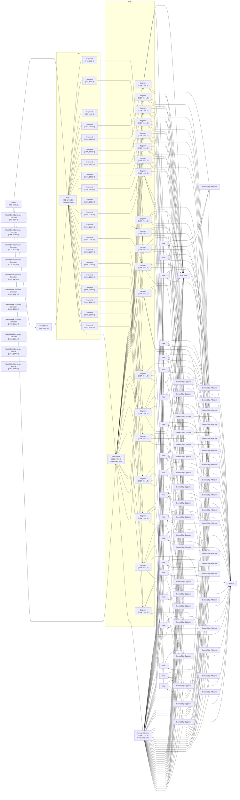

```mermaid
flowchart LR
  subgraph path23 [Path]
    23["Path<br>[682, 1999, 0]<br>Consumed: false"]
      %% [ProgramBodyItem { index: 3 }, VariableDeclarationDeclaration, VariableDeclarationInit]
    26["Segment<br>[710, 773, 0]"]
      %% [ProgramBodyItem { index: 3 }, VariableDeclarationDeclaration, VariableDeclarationInit, SketchBlockBody, SketchBlockBodyItem { index: 0 }, VariableDeclarationDeclaration, VariableDeclarationInit]
    27["Segment<br>[783, 890, 0]"]
      %% [ProgramBodyItem { index: 3 }, VariableDeclarationDeclaration, VariableDeclarationInit, SketchBlockBody, SketchBlockBodyItem { index: 1 }, VariableDeclarationDeclaration, VariableDeclarationInit]
    29["Segment<br>[937, 1003, 0]"]
      %% [ProgramBodyItem { index: 3 }, VariableDeclarationDeclaration, VariableDeclarationInit, SketchBlockBody, SketchBlockBodyItem { index: 3 }, VariableDeclarationDeclaration, VariableDeclarationInit]
    31["Segment<br>[1054, 1119, 0]"]
      %% [ProgramBodyItem { index: 3 }, VariableDeclarationDeclaration, VariableDeclarationInit, SketchBlockBody, SketchBlockBodyItem { index: 5 }, VariableDeclarationDeclaration, VariableDeclarationInit]
    33["Segment<br>[1169, 1236, 0]"]
      %% [ProgramBodyItem { index: 3 }, VariableDeclarationDeclaration, VariableDeclarationInit, SketchBlockBody, SketchBlockBodyItem { index: 7 }, VariableDeclarationDeclaration, VariableDeclarationInit]
    35["Segment<br>[1285, 1392, 0]"]
      %% [ProgramBodyItem { index: 3 }, VariableDeclarationDeclaration, VariableDeclarationInit, SketchBlockBody, SketchBlockBodyItem { index: 9 }, VariableDeclarationDeclaration, VariableDeclarationInit]
    37["Segment<br>[1439, 1507, 0]"]
      %% [ProgramBodyItem { index: 3 }, VariableDeclarationDeclaration, VariableDeclarationInit, SketchBlockBody, SketchBlockBodyItem { index: 11 }, VariableDeclarationDeclaration, VariableDeclarationInit]
    39["Segment<br>[1557, 1662, 0]"]
      %% [ProgramBodyItem { index: 3 }, VariableDeclarationDeclaration, VariableDeclarationInit, SketchBlockBody, SketchBlockBodyItem { index: 13 }, VariableDeclarationDeclaration, VariableDeclarationInit]
    41["Segment<br>[1709, 1775, 0]"]
      %% [ProgramBodyItem { index: 3 }, VariableDeclarationDeclaration, VariableDeclarationInit, SketchBlockBody, SketchBlockBodyItem { index: 15 }, VariableDeclarationDeclaration, VariableDeclarationInit]
    43["Segment<br>[1826, 1924, 0]"]
      %% [ProgramBodyItem { index: 3 }, VariableDeclarationDeclaration, VariableDeclarationInit, SketchBlockBody, SketchBlockBodyItem { index: 17 }, VariableDeclarationDeclaration, VariableDeclarationInit]
    47["Segment<br>[2029, 2047, 0]"]
      %% [ProgramBodyItem { index: 4 }, VariableDeclarationDeclaration, VariableDeclarationInit, PipeBodyItem { index: 1 }]
    48["Segment<br>[2029, 2047, 0]"]
      %% [ProgramBodyItem { index: 4 }, VariableDeclarationDeclaration, VariableDeclarationInit, PipeBodyItem { index: 1 }]
    49["Segment<br>[2029, 2047, 0]"]
      %% [ProgramBodyItem { index: 4 }, VariableDeclarationDeclaration, VariableDeclarationInit, PipeBodyItem { index: 1 }]
    50["Segment<br>[2029, 2047, 0]"]
      %% [ProgramBodyItem { index: 4 }, VariableDeclarationDeclaration, VariableDeclarationInit, PipeBodyItem { index: 1 }]
    51["Segment<br>[2029, 2047, 0]"]
      %% [ProgramBodyItem { index: 4 }, VariableDeclarationDeclaration, VariableDeclarationInit, PipeBodyItem { index: 1 }]
    52["Segment<br>[2029, 2047, 0]"]
      %% [ProgramBodyItem { index: 4 }, VariableDeclarationDeclaration, VariableDeclarationInit, PipeBodyItem { index: 1 }]
    53["Segment<br>[2029, 2047, 0]"]
      %% [ProgramBodyItem { index: 4 }, VariableDeclarationDeclaration, VariableDeclarationInit, PipeBodyItem { index: 1 }]
    54["Segment<br>[2029, 2047, 0]"]
      %% [ProgramBodyItem { index: 4 }, VariableDeclarationDeclaration, VariableDeclarationInit, PipeBodyItem { index: 1 }]
    55["Segment<br>[2029, 2047, 0]"]
      %% [ProgramBodyItem { index: 4 }, VariableDeclarationDeclaration, VariableDeclarationInit, PipeBodyItem { index: 1 }]
    56["Segment<br>[2029, 2047, 0]"]
      %% [ProgramBodyItem { index: 4 }, VariableDeclarationDeclaration, VariableDeclarationInit, PipeBodyItem { index: 1 }]
  end
  subgraph path57 [Path]
    57["Path Region<br>[2114, 2164, 0]<br>Consumed: true"]
      %% [ProgramBodyItem { index: 5 }, VariableDeclarationDeclaration, VariableDeclarationInit]
    58["Segment<br>[2114, 2164, 0]"]
      %% [ProgramBodyItem { index: 5 }, VariableDeclarationDeclaration, VariableDeclarationInit]
    59["Segment<br>[2114, 2164, 0]"]
      %% [ProgramBodyItem { index: 5 }, VariableDeclarationDeclaration, VariableDeclarationInit]
    60["Segment<br>[2114, 2164, 0]"]
      %% [ProgramBodyItem { index: 5 }, VariableDeclarationDeclaration, VariableDeclarationInit]
    61["Segment<br>[2114, 2164, 0]"]
      %% [ProgramBodyItem { index: 5 }, VariableDeclarationDeclaration, VariableDeclarationInit]
    62["Segment<br>[2114, 2164, 0]"]
      %% [ProgramBodyItem { index: 5 }, VariableDeclarationDeclaration, VariableDeclarationInit]
    63["Segment<br>[2114, 2164, 0]"]
      %% [ProgramBodyItem { index: 5 }, VariableDeclarationDeclaration, VariableDeclarationInit]
    64["Segment<br>[2114, 2164, 0]"]
      %% [ProgramBodyItem { index: 5 }, VariableDeclarationDeclaration, VariableDeclarationInit]
    65["Segment<br>[2114, 2164, 0]"]
      %% [ProgramBodyItem { index: 5 }, VariableDeclarationDeclaration, VariableDeclarationInit]
    66["Segment<br>[2114, 2164, 0]"]
      %% [ProgramBodyItem { index: 5 }, VariableDeclarationDeclaration, VariableDeclarationInit]
    67["Segment<br>[2114, 2164, 0]"]
      %% [ProgramBodyItem { index: 5 }, VariableDeclarationDeclaration, VariableDeclarationInit]
    68["Segment<br>[2114, 2164, 0]"]
      %% [ProgramBodyItem { index: 5 }, VariableDeclarationDeclaration, VariableDeclarationInit]
    69["Segment<br>[2114, 2164, 0]"]
      %% [ProgramBodyItem { index: 5 }, VariableDeclarationDeclaration, VariableDeclarationInit]
    70["Segment<br>[2114, 2164, 0]"]
      %% [ProgramBodyItem { index: 5 }, VariableDeclarationDeclaration, VariableDeclarationInit]
    71["Segment<br>[2114, 2164, 0]"]
      %% [ProgramBodyItem { index: 5 }, VariableDeclarationDeclaration, VariableDeclarationInit]
    72["Segment<br>[2114, 2164, 0]"]
      %% [ProgramBodyItem { index: 5 }, VariableDeclarationDeclaration, VariableDeclarationInit]
    73["Segment<br>[2114, 2164, 0]"]
      %% [ProgramBodyItem { index: 5 }, VariableDeclarationDeclaration, VariableDeclarationInit]
    74["Segment<br>[2114, 2164, 0]"]
      %% [ProgramBodyItem { index: 5 }, VariableDeclarationDeclaration, VariableDeclarationInit]
    75["Segment<br>[2114, 2164, 0]"]
      %% [ProgramBodyItem { index: 5 }, VariableDeclarationDeclaration, VariableDeclarationInit]
    76["Segment<br>[2114, 2164, 0]"]
      %% [ProgramBodyItem { index: 5 }, VariableDeclarationDeclaration, VariableDeclarationInit]
    77["Segment<br>[2114, 2164, 0]"]
      %% [ProgramBodyItem { index: 5 }, VariableDeclarationDeclaration, VariableDeclarationInit]
  end
  1["Cap End"]
    %% face_code_ref=Missing NodePath
  2["Cap Start"]
    %% face_code_ref=Missing NodePath
  3[Wall]
    %% face_code_ref=Missing NodePath
  4[Wall]
    %% face_code_ref=Missing NodePath
  5[Wall]
    %% face_code_ref=Missing NodePath
  6[Wall]
    %% face_code_ref=Missing NodePath
  7[Wall]
    %% face_code_ref=Missing NodePath
  8[Wall]
    %% face_code_ref=Missing NodePath
  9[Wall]
    %% face_code_ref=Missing NodePath
  10[Wall]
    %% face_code_ref=Missing NodePath
  11[Wall]
    %% face_code_ref=Missing NodePath
  12[Wall]
    %% face_code_ref=Missing NodePath
  13[Wall]
    %% face_code_ref=Missing NodePath
  14[Wall]
    %% face_code_ref=Missing NodePath
  15[Wall]
    %% face_code_ref=Missing NodePath
  16[Wall]
    %% face_code_ref=Missing NodePath
  17[Wall]
    %% face_code_ref=Missing NodePath
  18[Wall]
    %% face_code_ref=Missing NodePath
  19[Wall]
    %% face_code_ref=Missing NodePath
  20[Wall]
    %% face_code_ref=Missing NodePath
  21[Wall]
    %% face_code_ref=Missing NodePath
  22[Wall]
    %% face_code_ref=Missing NodePath
  24["Plane<br>[682, 1999, 0]"]
    %% [ProgramBodyItem { index: 3 }, VariableDeclarationDeclaration, VariableDeclarationInit]
  25["SketchBlock<br>[682, 1999, 0]"]
    %% [ProgramBodyItem { index: 3 }, VariableDeclarationDeclaration, VariableDeclarationInit]
  28["SketchBlockConstraint Coincident<br>[893, 926, 0]"]
    %% [ProgramBodyItem { index: 3 }, VariableDeclarationDeclaration, VariableDeclarationInit, SketchBlockBody, SketchBlockBodyItem { index: 2 }, ExpressionStatementExpr]
  30["SketchBlockConstraint Coincident<br>[1006, 1043, 0]"]
    %% [ProgramBodyItem { index: 3 }, VariableDeclarationDeclaration, VariableDeclarationInit, SketchBlockBody, SketchBlockBodyItem { index: 4 }, ExpressionStatementExpr]
  32["SketchBlockConstraint Coincident<br>[1122, 1158, 0]"]
    %% [ProgramBodyItem { index: 3 }, VariableDeclarationDeclaration, VariableDeclarationInit, SketchBlockBody, SketchBlockBodyItem { index: 6 }, ExpressionStatementExpr]
  34["SketchBlockConstraint Coincident<br>[1239, 1275, 0]"]
    %% [ProgramBodyItem { index: 3 }, VariableDeclarationDeclaration, VariableDeclarationInit, SketchBlockBody, SketchBlockBodyItem { index: 8 }, ExpressionStatementExpr]
  36["SketchBlockConstraint Coincident<br>[1395, 1428, 0]"]
    %% [ProgramBodyItem { index: 3 }, VariableDeclarationDeclaration, VariableDeclarationInit, SketchBlockBody, SketchBlockBodyItem { index: 10 }, ExpressionStatementExpr]
  38["SketchBlockConstraint Coincident<br>[1510, 1547, 0]"]
    %% [ProgramBodyItem { index: 3 }, VariableDeclarationDeclaration, VariableDeclarationInit, SketchBlockBody, SketchBlockBodyItem { index: 12 }, ExpressionStatementExpr]
  40["SketchBlockConstraint Coincident<br>[1665, 1698, 0]"]
    %% [ProgramBodyItem { index: 3 }, VariableDeclarationDeclaration, VariableDeclarationInit, SketchBlockBody, SketchBlockBodyItem { index: 14 }, ExpressionStatementExpr]
  42["SketchBlockConstraint Coincident<br>[1778, 1815, 0]"]
    %% [ProgramBodyItem { index: 3 }, VariableDeclarationDeclaration, VariableDeclarationInit, SketchBlockBody, SketchBlockBodyItem { index: 16 }, ExpressionStatementExpr]
  44["SketchBlockConstraint Coincident<br>[1927, 1961, 0]"]
    %% [ProgramBodyItem { index: 3 }, VariableDeclarationDeclaration, VariableDeclarationInit, SketchBlockBody, SketchBlockBodyItem { index: 18 }, ExpressionStatementExpr]
  45["SketchBlockConstraint Vertical<br>[1964, 1979, 0]"]
    %% [ProgramBodyItem { index: 3 }, VariableDeclarationDeclaration, VariableDeclarationInit, SketchBlockBody, SketchBlockBodyItem { index: 19 }, ExpressionStatementExpr]
  46["SketchBlockConstraint Vertical<br>[1982, 1997, 0]"]
    %% [ProgramBodyItem { index: 3 }, VariableDeclarationDeclaration, VariableDeclarationInit, SketchBlockBody, SketchBlockBodyItem { index: 20 }, ExpressionStatementExpr]
  78["Sweep Extrusion<br>[2194, 2233, 0]<br>Consumed: false"]
    %% [ProgramBodyItem { index: 6 }, VariableDeclarationDeclaration, VariableDeclarationInit, PipeBodyItem { index: 0 }]
  79["SweepEdge Adjacent"]
  80["SweepEdge Adjacent"]
  81["SweepEdge Adjacent"]
  82["SweepEdge Adjacent"]
  83["SweepEdge Adjacent"]
  84["SweepEdge Adjacent"]
  85["SweepEdge Adjacent"]
  86["SweepEdge Adjacent"]
  87["SweepEdge Adjacent"]
  88["SweepEdge Adjacent"]
  89["SweepEdge Adjacent"]
  90["SweepEdge Adjacent"]
  91["SweepEdge Adjacent"]
  92["SweepEdge Adjacent"]
  93["SweepEdge Adjacent"]
  94["SweepEdge Adjacent"]
  95["SweepEdge Adjacent"]
  96["SweepEdge Adjacent"]
  97["SweepEdge Adjacent"]
  98["SweepEdge Adjacent"]
  99["SweepEdge Opposite"]
  100["SweepEdge Opposite"]
  101["SweepEdge Opposite"]
  102["SweepEdge Opposite"]
  103["SweepEdge Opposite"]
  104["SweepEdge Opposite"]
  105["SweepEdge Opposite"]
  106["SweepEdge Opposite"]
  107["SweepEdge Opposite"]
  108["SweepEdge Opposite"]
  109["SweepEdge Opposite"]
  110["SweepEdge Opposite"]
  111["SweepEdge Opposite"]
  112["SweepEdge Opposite"]
  113["SweepEdge Opposite"]
  114["SweepEdge Opposite"]
  115["SweepEdge Opposite"]
  116["SweepEdge Opposite"]
  117["SweepEdge Opposite"]
  118["SweepEdge Opposite"]
  78 --- 1
  99 <--x 1
  100 <--x 1
  101 <--x 1
  102 <--x 1
  103 <--x 1
  104 <--x 1
  105 <--x 1
  106 <--x 1
  107 <--x 1
  108 <--x 1
  109 <--x 1
  110 <--x 1
  111 <--x 1
  112 <--x 1
  113 <--x 1
  114 <--x 1
  115 <--x 1
  116 <--x 1
  117 <--x 1
  118 <--x 1
  58 <--x 2
  59 <--x 2
  60 <--x 2
  61 <--x 2
  62 <--x 2
  63 <--x 2
  64 <--x 2
  65 <--x 2
  66 <--x 2
  67 <--x 2
  68 <--x 2
  69 <--x 2
  70 <--x 2
  71 <--x 2
  72 <--x 2
  73 <--x 2
  74 <--x 2
  75 <--x 2
  76 <--x 2
  77 <--x 2
  78 --- 2
  58 --- 3
  78 --- 3
  3 --- 79
  79 <--x 3
  3 --- 99
  59 --- 4
  78 --- 4
  4 --- 80
  80 <--x 4
  4 --- 100
  60 --- 5
  78 --- 5
  5 --- 81
  81 <--x 5
  5 --- 101
  61 --- 6
  78 --- 6
  6 --- 82
  82 <--x 6
  6 --- 102
  62 --- 7
  78 --- 7
  7 --- 83
  83 <--x 7
  7 --- 103
  63 --- 8
  78 --- 8
  8 --- 84
  84 <--x 8
  8 --- 104
  64 --- 9
  78 --- 9
  9 --- 85
  85 <--x 9
  9 --- 105
  65 --- 10
  78 --- 10
  10 --- 86
  86 <--x 10
  10 --- 106
  66 --- 11
  78 --- 11
  11 --- 87
  87 <--x 11
  11 --- 107
  67 --- 12
  78 --- 12
  12 --- 88
  88 <--x 12
  12 --- 108
  68 --- 13
  78 --- 13
  13 --- 89
  89 <--x 13
  13 --- 109
  69 --- 14
  78 --- 14
  14 --- 90
  90 <--x 14
  14 --- 110
  70 --- 15
  78 --- 15
  15 --- 91
  91 <--x 15
  15 --- 111
  71 --- 16
  78 --- 16
  16 --- 92
  92 <--x 16
  16 --- 112
  72 --- 17
  78 --- 17
  17 --- 93
  93 <--x 17
  17 --- 113
  73 --- 18
  78 --- 18
  18 --- 94
  94 <--x 18
  18 --- 114
  74 --- 19
  78 --- 19
  19 --- 95
  95 <--x 19
  19 --- 115
  75 --- 20
  78 --- 20
  20 --- 96
  96 <--x 20
  20 --- 116
  76 --- 21
  78 --- 21
  21 --- 97
  97 <--x 21
  21 --- 117
  77 --- 22
  78 --- 22
  22 --- 98
  98 <--x 22
  22 --- 118
  24 --- 23
  25 --- 23
  23 --- 26
  23 --- 27
  23 --- 29
  23 --- 31
  23 --- 33
  23 --- 35
  23 --- 37
  23 --- 39
  23 --- 41
  23 --- 43
  23 --- 47
  23 --- 48
  23 --- 49
  23 --- 50
  23 --- 51
  23 --- 52
  23 --- 53
  23 --- 54
  23 --- 55
  23 --- 56
  23 <--x 57
  24 <--x 25
  24 <--x 57
  26 <--x 75
  27 <--x 76
  29 <--x 77
  31 <--x 58
  33 <--x 59
  35 <--x 60
  37 <--x 61
  39 <--x 62
  41 <--x 63
  43 <--x 64
  47 <--x 65
  48 <--x 66
  49 <--x 67
  50 <--x 68
  51 <--x 69
  52 <--x 70
  53 <--x 71
  54 <--x 72
  55 <--x 73
  56 <--x 74
  57 <--x 58
  57 <--x 59
  57 <--x 60
  57 <--x 61
  57 <--x 62
  57 <--x 63
  57 <--x 64
  57 <--x 65
  57 <--x 66
  57 <--x 67
  57 <--x 68
  57 <--x 69
  57 <--x 70
  57 <--x 71
  57 <--x 72
  57 <--x 73
  57 <--x 74
  57 <--x 75
  57 <--x 76
  57 <--x 77
  57 ---- 78
  58 --- 79
  58 --- 99
  59 --- 80
  59 --- 100
  60 --- 81
  60 --- 101
  61 --- 82
  61 --- 102
  62 --- 83
  62 --- 103
  63 --- 84
  63 --- 104
  64 --- 85
  64 --- 105
  65 --- 86
  65 --- 106
  66 --- 87
  66 --- 107
  67 --- 88
  67 --- 108
  68 --- 89
  68 --- 109
  69 --- 90
  69 --- 110
  70 --- 91
  70 --- 111
  71 --- 92
  71 --- 112
  72 --- 93
  72 --- 113
  73 --- 94
  73 --- 114
  74 --- 95
  74 --- 115
  75 --- 96
  75 --- 116
  76 --- 97
  76 --- 117
  77 --- 98
  77 --- 118
  78 --- 79
  78 --- 80
  78 --- 81
  78 --- 82
  78 --- 83
  78 --- 84
  78 --- 85
  78 --- 86
  78 --- 87
  78 --- 88
  78 --- 89
  78 --- 90
  78 --- 91
  78 --- 92
  78 --- 93
  78 --- 94
  78 --- 95
  78 --- 96
  78 --- 97
  78 --- 98
  78 --- 99
  78 --- 100
  78 --- 101
  78 --- 102
  78 --- 103
  78 --- 104
  78 --- 105
  78 --- 106
  78 --- 107
  78 --- 108
  78 --- 109
  78 --- 110
  78 --- 111
  78 --- 112
  78 --- 113
  78 --- 114
  78 --- 115
  78 --- 116
  78 --- 117
  78 --- 118
```
