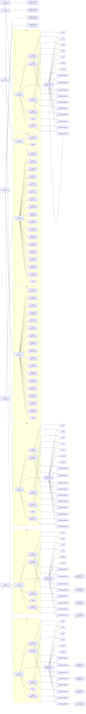

```mermaid
flowchart LR
  subgraph path2 [Path]
    2["Path<br>[921, 946, 0]"]
    3["Segment<br>[954, 976, 0]"]
    4["Segment<br>[984, 1043, 0]"]
    5["Segment<br>[1051, 1078, 0]"]
    6["Segment<br>[1086, 1145, 0]"]
    7["Segment<br>[1153, 1160, 0]"]
    8[Solid2d]
  end
  subgraph path28 [Path]
    28["Path<br>[921, 946, 0]"]
    29["Segment<br>[954, 976, 0]"]
    30["Segment<br>[984, 1043, 0]"]
    31["Segment<br>[1051, 1078, 0]"]
    32["Segment<br>[1086, 1145, 0]"]
    33["Segment<br>[1153, 1160, 0]"]
    34[Solid2d]
  end
  subgraph path54 [Path]
    54["Path<br>[4776, 4856, 0]"]
    55["Segment<br>[4776, 4856, 0]"]
    56[Solid2d]
  end
  subgraph path58 [Path]
    58["Path<br>[4407, 4432, 0]"]
    59["Segment<br>[4440, 4481, 0]"]
    60["Segment<br>[4489, 4530, 0]"]
    61["Segment<br>[4538, 4591, 0]"]
    62["Segment<br>[4599, 4620, 0]"]
    63[Solid2d]
  end
  subgraph path65 [Path]
    65["Path<br>[2752, 2839, 0]"]
    66["Segment<br>[2847, 2926, 0]"]
    67["Segment<br>[2934, 3040, 0]"]
    68["Segment<br>[3048, 3130, 0]"]
    69["Segment<br>[3138, 3184, 0]"]
    70["Segment<br>[3192, 3271, 0]"]
    71["Segment<br>[3279, 3387, 0]"]
    72["Segment<br>[3395, 3474, 0]"]
    73["Segment<br>[3482, 3528, 0]"]
    74["Segment<br>[3536, 3618, 0]"]
    75["Segment<br>[3626, 3735, 0]"]
    76["Segment<br>[3743, 3822, 0]"]
    77["Segment<br>[3830, 3895, 0]"]
    78["Segment<br>[3903, 3985, 0]"]
    79["Segment<br>[3993, 4102, 0]"]
    80["Segment<br>[4110, 4192, 0]"]
    81["Segment<br>[4200, 4249, 0]"]
    82["Segment<br>[4257, 4264, 0]"]
    83[Solid2d]
  end
  subgraph path100 [Path]
    100["Path<br>[4407, 4432, 0]"]
    101["Segment<br>[4440, 4481, 0]"]
    102["Segment<br>[4489, 4530, 0]"]
    103["Segment<br>[4538, 4591, 0]"]
    104["Segment<br>[4599, 4620, 0]"]
    105[Solid2d]
  end
  subgraph path106 [Path]
    106["Path<br>[2752, 2839, 0]"]
    107["Segment<br>[2847, 2926, 0]"]
    108["Segment<br>[2934, 3040, 0]"]
    109["Segment<br>[3048, 3130, 0]"]
    110["Segment<br>[3138, 3184, 0]"]
    111["Segment<br>[3192, 3271, 0]"]
    112["Segment<br>[3279, 3387, 0]"]
    113["Segment<br>[3395, 3474, 0]"]
    114["Segment<br>[3482, 3528, 0]"]
    115["Segment<br>[3536, 3618, 0]"]
    116["Segment<br>[3626, 3735, 0]"]
    117["Segment<br>[3743, 3822, 0]"]
    118["Segment<br>[3830, 3895, 0]"]
    119["Segment<br>[3903, 3985, 0]"]
    120["Segment<br>[3993, 4102, 0]"]
    121["Segment<br>[4110, 4192, 0]"]
    122["Segment<br>[4200, 4249, 0]"]
    123["Segment<br>[4257, 4264, 0]"]
    124[Solid2d]
  end
  1["Plane<br>[1246, 1284, 0]"]
  9["Sweep Extrusion<br>[1233, 1327, 0]"]
  10[Wall]
  11[Wall]
  12[Wall]
  13[Wall]
  14[Wall]
  15["Cap Start"]
  16["Cap End"]
  17["SweepEdge Opposite"]
  18["SweepEdge Adjacent"]
  19["SweepEdge Opposite"]
  20["SweepEdge Adjacent"]
  21["SweepEdge Opposite"]
  22["SweepEdge Adjacent"]
  23["SweepEdge Opposite"]
  24["SweepEdge Adjacent"]
  25["SweepEdge Opposite"]
  26["SweepEdge Adjacent"]
  27["Plane<br>[1740, 1778, 0]"]
  35["Sweep Revolve<br>[1727, 1809, 0]"]
  36[Wall]
  37[Wall]
  38[Wall]
  39[Wall]
  40[Wall]
  41["Cap Start"]
  42["Cap End"]
  43["SweepEdge Opposite"]
  44["SweepEdge Adjacent"]
  45["SweepEdge Opposite"]
  46["SweepEdge Adjacent"]
  47["SweepEdge Opposite"]
  48["SweepEdge Adjacent"]
  49["SweepEdge Opposite"]
  50["SweepEdge Adjacent"]
  51["SweepEdge Opposite"]
  52["SweepEdge Adjacent"]
  53["Plane<br>[4753, 4770, 0]"]
  57["Plane<br>[4379, 4399, 0]"]
  64["Plane<br>[2724, 2744, 0]"]
  84["Sweep Extrusion<br>[5199, 5241, 0]"]
  85[Wall]
  86[Wall]
  87[Wall]
  88[Wall]
  89["Cap Start"]
  90["Cap End"]
  91["SweepEdge Opposite"]
  92["SweepEdge Adjacent"]
  93["SweepEdge Opposite"]
  94["SweepEdge Adjacent"]
  95["SweepEdge Opposite"]
  96["SweepEdge Adjacent"]
  97["SweepEdge Opposite"]
  98["SweepEdge Adjacent"]
  99["Plane<br>[5735, 5770, 0]"]
  125["Sweep Extrusion<br>[5853, 5904, 0]"]
  126[Wall]
  127[Wall]
  128[Wall]
  129[Wall]
  130["Cap Start"]
  131["Cap End"]
  132["SweepEdge Opposite"]
  133["SweepEdge Adjacent"]
  134["SweepEdge Opposite"]
  135["SweepEdge Adjacent"]
  136["SweepEdge Opposite"]
  137["SweepEdge Adjacent"]
  138["SweepEdge Opposite"]
  139["SweepEdge Adjacent"]
  140["EdgeCut Fillet<br>[5304, 5643, 0]"]
  141["EdgeCut Fillet<br>[5304, 5643, 0]"]
  142["EdgeCut Fillet<br>[5304, 5643, 0]"]
  143["EdgeCut Fillet<br>[5304, 5643, 0]"]
  144["EdgeCut Fillet<br>[5968, 6312, 0]"]
  145["EdgeCut Fillet<br>[5968, 6312, 0]"]
  146["EdgeCut Fillet<br>[5968, 6312, 0]"]
  147["EdgeCut Fillet<br>[5968, 6312, 0]"]
  148["StartSketchOnPlane<br>[893, 913, 0]"]
  149["StartSketchOnPlane<br>[893, 913, 0]"]
  150["StartSketchOnPlane<br>[4379, 4399, 0]"]
  151["StartSketchOnPlane<br>[2724, 2744, 0]"]
  1 --- 2
  2 --- 3
  2 --- 4
  2 --- 5
  2 --- 6
  2 --- 7
  2 ---- 9
  2 --- 8
  3 --- 14
  3 --- 25
  3 --- 26
  4 --- 13
  4 --- 23
  4 --- 24
  5 --- 12
  5 --- 21
  5 --- 22
  6 --- 11
  6 --- 19
  6 --- 20
  7 --- 10
  7 --- 17
  7 --- 18
  9 --- 10
  9 --- 11
  9 --- 12
  9 --- 13
  9 --- 14
  9 --- 15
  9 --- 16
  9 --- 17
  9 --- 18
  9 --- 19
  9 --- 20
  9 --- 21
  9 --- 22
  9 --- 23
  9 --- 24
  9 --- 25
  9 --- 26
  27 --- 28
  28 --- 29
  28 --- 30
  28 --- 31
  28 --- 32
  28 --- 33
  28 ---- 35
  28 --- 34
  29 --- 36
  29 --- 43
  29 --- 44
  30 --- 37
  30 --- 45
  30 --- 46
  31 --- 38
  31 --- 47
  31 --- 48
  32 --- 39
  32 --- 49
  32 --- 50
  33 --- 40
  33 --- 51
  33 --- 52
  35 --- 36
  35 --- 37
  35 --- 38
  35 --- 39
  35 --- 40
  35 --- 41
  35 --- 42
  35 --- 43
  35 --- 44
  35 --- 45
  35 --- 46
  35 --- 47
  35 --- 48
  35 --- 49
  35 --- 50
  35 --- 51
  35 --- 52
  53 --- 54
  54 --- 55
  54 --- 56
  57 --- 58
  58 --- 59
  58 --- 60
  58 --- 61
  58 --- 62
  58 ---- 84
  58 --- 63
  59 --- 85
  59 --- 91
  59 --- 92
  60 --- 86
  60 --- 93
  60 --- 94
  61 --- 87
  61 --- 95
  61 --- 96
  62 --- 88
  62 --- 97
  62 --- 98
  64 --- 65
  65 --- 66
  65 --- 67
  65 --- 68
  65 --- 69
  65 --- 70
  65 --- 71
  65 --- 72
  65 --- 73
  65 --- 74
  65 --- 75
  65 --- 76
  65 --- 77
  65 --- 78
  65 --- 79
  65 --- 80
  65 --- 81
  65 --- 82
  65 --- 83
  84 --- 85
  84 --- 86
  84 --- 87
  84 --- 88
  84 --- 89
  84 --- 90
  84 --- 91
  84 --- 92
  84 --- 93
  84 --- 94
  84 --- 95
  84 --- 96
  84 --- 97
  84 --- 98
  99 --- 100
  99 --- 106
  100 --- 101
  100 --- 102
  100 --- 103
  100 --- 104
  100 ---- 125
  100 --- 105
  101 --- 126
  101 --- 132
  101 --- 133
  102 --- 127
  102 --- 134
  102 --- 135
  103 --- 128
  103 --- 136
  103 --- 137
  104 --- 129
  104 --- 138
  104 --- 139
  106 --- 107
  106 --- 108
  106 --- 109
  106 --- 110
  106 --- 111
  106 --- 112
  106 --- 113
  106 --- 114
  106 --- 115
  106 --- 116
  106 --- 117
  106 --- 118
  106 --- 119
  106 --- 120
  106 --- 121
  106 --- 122
  106 --- 123
  106 --- 124
  125 --- 126
  125 --- 127
  125 --- 128
  125 --- 129
  125 --- 130
  125 --- 131
  125 --- 132
  125 --- 133
  125 --- 134
  125 --- 135
  125 --- 136
  125 --- 137
  125 --- 138
  125 --- 139
  92 <--x 140
  98 <--x 141
  96 <--x 142
  94 <--x 143
  133 <--x 144
  139 <--x 145
  137 <--x 146
  135 <--x 147
  1 <--x 148
  27 <--x 149
  99 <--x 150
  99 <--x 151
```
