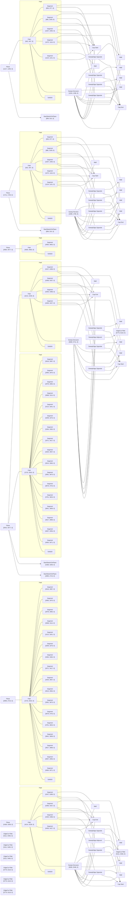

```mermaid
flowchart LR
  subgraph path2 [Path]
    2["Path<br>[922, 947, 0]"]
    3["Segment<br>[955, 977, 0]"]
    4["Segment<br>[985, 1029, 0]"]
    5["Segment<br>[1037, 1064, 0]"]
    6["Segment<br>[1072, 1116, 0]"]
    7["Segment<br>[1124, 1131, 0]"]
    8[Solid2d]
  end
  subgraph path22 [Path]
    22["Path<br>[922, 947, 0]"]
    23["Segment<br>[955, 977, 0]"]
    24["Segment<br>[985, 1029, 0]"]
    25["Segment<br>[1037, 1064, 0]"]
    26["Segment<br>[1072, 1116, 0]"]
    27["Segment<br>[1124, 1131, 0]"]
    28[Solid2d]
  end
  subgraph path42 [Path]
    42["Path<br>[4583, 4663, 0]"]
    43["Segment<br>[4583, 4663, 0]"]
    44[Solid2d]
  end
  subgraph path46 [Path]
    46["Path<br>[4214, 4239, 0]"]
    47["Segment<br>[4247, 4288, 0]"]
    48["Segment<br>[4296, 4337, 0]"]
    49["Segment<br>[4345, 4398, 0]"]
    50["Segment<br>[4406, 4427, 0]"]
    51[Solid2d]
  end
  subgraph path53 [Path]
    53["Path<br>[2723, 2810, 0]"]
    54["Segment<br>[2818, 2897, 0]"]
    55["Segment<br>[2905, 2970, 0]"]
    56["Segment<br>[2978, 3060, 0]"]
    57["Segment<br>[3068, 3114, 0]"]
    58["Segment<br>[3122, 3201, 0]"]
    59["Segment<br>[3209, 3276, 0]"]
    60["Segment<br>[3284, 3363, 0]"]
    61["Segment<br>[3371, 3417, 0]"]
    62["Segment<br>[3425, 3507, 0]"]
    63["Segment<br>[3515, 3583, 0]"]
    64["Segment<br>[3591, 3670, 0]"]
    65["Segment<br>[3678, 3743, 0]"]
    66["Segment<br>[3751, 3833, 0]"]
    67["Segment<br>[3841, 3909, 0]"]
    68["Segment<br>[3917, 3999, 0]"]
    69["Segment<br>[4007, 4056, 0]"]
    70["Segment<br>[4064, 4071, 0]"]
    71[Solid2d]
  end
  subgraph path84 [Path]
    84["Path<br>[4214, 4239, 0]"]
    85["Segment<br>[4247, 4288, 0]"]
    86["Segment<br>[4296, 4337, 0]"]
    87["Segment<br>[4345, 4398, 0]"]
    88["Segment<br>[4406, 4427, 0]"]
    89[Solid2d]
  end
  subgraph path90 [Path]
    90["Path<br>[2723, 2810, 0]"]
    91["Segment<br>[2818, 2897, 0]"]
    92["Segment<br>[2905, 2970, 0]"]
    93["Segment<br>[2978, 3060, 0]"]
    94["Segment<br>[3068, 3114, 0]"]
    95["Segment<br>[3122, 3201, 0]"]
    96["Segment<br>[3209, 3276, 0]"]
    97["Segment<br>[3284, 3363, 0]"]
    98["Segment<br>[3371, 3417, 0]"]
    99["Segment<br>[3425, 3507, 0]"]
    100["Segment<br>[3515, 3583, 0]"]
    101["Segment<br>[3591, 3670, 0]"]
    102["Segment<br>[3678, 3743, 0]"]
    103["Segment<br>[3751, 3833, 0]"]
    104["Segment<br>[3841, 3909, 0]"]
    105["Segment<br>[3917, 3999, 0]"]
    106["Segment<br>[4007, 4056, 0]"]
    107["Segment<br>[4064, 4071, 0]"]
    108[Solid2d]
  end
  1["Plane<br>[1217, 1255, 0]"]
  9["Sweep Extrusion<br>[1204, 1298, 0]"]
  10[Wall]
  11[Wall]
  12[Wall]
  13[Wall]
  14[Wall]
  15["Cap Start"]
  16["Cap End"]
  17["SweepEdge Opposite"]
  18["SweepEdge Opposite"]
  19["SweepEdge Opposite"]
  20["SweepEdge Opposite"]
  21["Plane<br>[1711, 1749, 0]"]
  29["Sweep Revolve<br>[1698, 1780, 0]"]
  30[Wall]
  31[Wall]
  32[Wall]
  33[Wall]
  34[Wall]
  35["Cap Start"]
  36["Cap End"]
  37["SweepEdge Opposite"]
  38["SweepEdge Opposite"]
  39["SweepEdge Opposite"]
  40["SweepEdge Opposite"]
  41["Plane<br>[4560, 4577, 0]"]
  45["Plane<br>[4186, 4206, 0]"]
  52["Plane<br>[2695, 2715, 0]"]
  72["Sweep Extrusion<br>[5006, 5048, 0]"]
  73[Wall]
  74[Wall]
  75[Wall]
  76[Wall]
  77["Cap Start"]
  78["Cap End"]
  79["SweepEdge Opposite"]
  80["SweepEdge Opposite"]
  81["SweepEdge Opposite"]
  82["SweepEdge Adjacent"]
  83["Plane<br>[5542, 5577, 0]"]
  109["Sweep Extrusion<br>[5660, 5711, 0]"]
  110[Wall]
  111[Wall]
  112[Wall]
  113[Wall]
  114["Cap Start"]
  115["Cap End"]
  116["SweepEdge Opposite"]
  117["SweepEdge Opposite"]
  118["SweepEdge Opposite"]
  119["SweepEdge Adjacent"]
  120["EdgeCut Fillet<br>[5111, 5450, 0]"]
  121["EdgeCut Fillet<br>[5111, 5450, 0]"]
  122["EdgeCut Fillet<br>[5111, 5450, 0]"]
  123["EdgeCut Fillet<br>[5111, 5450, 0]"]
  124["EdgeCut Fillet<br>[5775, 6119, 0]"]
  125["EdgeCut Fillet<br>[5775, 6119, 0]"]
  126["EdgeCut Fillet<br>[5775, 6119, 0]"]
  127["EdgeCut Fillet<br>[5775, 6119, 0]"]
  128["StartSketchOnPlane<br>[894, 914, 0]"]
  129["StartSketchOnPlane<br>[894, 914, 0]"]
  130["StartSketchOnPlane<br>[4186, 4206, 0]"]
  131["StartSketchOnPlane<br>[2695, 2715, 0]"]
  1 --- 2
  2 --- 3
  2 --- 4
  2 --- 5
  2 --- 6
  2 --- 7
  2 ---- 9
  2 --- 8
  3 --- 14
  3 --- 20
  3 x--> 15
  4 --- 13
  4 --- 19
  4 x--> 15
  5 --- 12
  5 --- 18
  5 x--> 15
  6 --- 11
  6 --- 17
  6 x--> 15
  7 --- 10
  7 x--> 15
  9 --- 10
  9 --- 11
  9 --- 12
  9 --- 13
  9 --- 14
  9 --- 15
  9 --- 16
  9 --- 17
  9 --- 18
  9 --- 19
  9 --- 20
  17 <--x 11
  17 <--x 16
  18 <--x 12
  18 <--x 16
  19 <--x 13
  19 <--x 16
  20 <--x 14
  20 <--x 16
  21 --- 22
  22 --- 23
  22 --- 24
  22 --- 25
  22 --- 26
  22 --- 27
  22 ---- 29
  22 --- 28
  23 --- 30
  23 x--> 35
  24 --- 31
  24 --- 37
  24 x--> 35
  25 --- 32
  25 --- 38
  25 x--> 35
  26 --- 33
  26 --- 39
  26 x--> 35
  27 --- 34
  27 --- 40
  27 x--> 35
  29 --- 30
  29 --- 31
  29 --- 32
  29 --- 33
  29 --- 34
  29 --- 35
  29 --- 36
  29 --- 37
  29 --- 38
  29 --- 39
  29 --- 40
  37 <--x 31
  37 <--x 36
  38 <--x 32
  38 <--x 36
  39 <--x 33
  39 <--x 36
  40 <--x 34
  40 <--x 36
  41 --- 42
  42 --- 43
  42 --- 44
  45 --- 46
  46 --- 47
  46 --- 48
  46 --- 49
  46 --- 50
  46 ---- 72
  46 --- 51
  47 --- 73
  47 --- 82
  47 x--> 78
  48 --- 74
  48 --- 79
  48 x--> 78
  49 --- 75
  49 --- 80
  49 x--> 78
  50 --- 76
  50 --- 81
  50 x--> 78
  52 --- 53
  53 --- 54
  53 --- 55
  53 --- 56
  53 --- 57
  53 --- 58
  53 --- 59
  53 --- 60
  53 --- 61
  53 --- 62
  53 --- 63
  53 --- 64
  53 --- 65
  53 --- 66
  53 --- 67
  53 --- 68
  53 --- 69
  53 --- 70
  53 --- 71
  72 --- 73
  72 --- 74
  72 --- 75
  72 --- 76
  72 --- 77
  72 --- 78
  72 --- 79
  72 --- 80
  72 --- 81
  72 --- 82
  79 <--x 74
  79 <--x 77
  80 <--x 75
  80 <--x 77
  81 <--x 76
  81 <--x 77
  83 --- 84
  83 --- 90
  84 --- 85
  84 --- 86
  84 --- 87
  84 --- 88
  84 ---- 109
  84 --- 89
  85 --- 110
  85 --- 119
  85 x--> 115
  86 --- 111
  86 --- 116
  86 x--> 115
  87 --- 112
  87 --- 117
  87 x--> 115
  88 --- 113
  88 --- 118
  88 x--> 115
  90 --- 91
  90 --- 92
  90 --- 93
  90 --- 94
  90 --- 95
  90 --- 96
  90 --- 97
  90 --- 98
  90 --- 99
  90 --- 100
  90 --- 101
  90 --- 102
  90 --- 103
  90 --- 104
  90 --- 105
  90 --- 106
  90 --- 107
  90 --- 108
  109 --- 110
  109 --- 111
  109 --- 112
  109 --- 113
  109 --- 114
  109 --- 115
  109 --- 116
  109 --- 117
  109 --- 118
  109 --- 119
  116 <--x 111
  116 <--x 114
  117 <--x 112
  117 <--x 114
  118 <--x 113
  118 <--x 114
  82 <--x 120
  119 <--x 124
  1 <--x 128
  21 <--x 129
  83 <--x 130
  83 <--x 131
```
