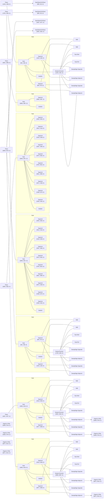

```mermaid
flowchart LR
  subgraph path2 [Path]
    2["Path<br>[921, 946, 0]"]
    3["Segment<br>[954, 976, 0]"]
    4["Segment<br>[1153, 1160, 0]"]
    5[Solid2d]
  end
  subgraph path16 [Path]
    16["Path<br>[921, 946, 0]"]
    17["Segment<br>[954, 976, 0]"]
    18["Segment<br>[1153, 1160, 0]"]
    19[Solid2d]
  end
  subgraph path30 [Path]
    30["Path<br>[4856, 4957, 0]"]
    31["Segment<br>[4856, 4957, 0]"]
    32[Solid2d]
  end
  subgraph path34 [Path]
    34["Path<br>[4485, 4510, 0]"]
    35["Segment<br>[4518, 4559, 0]"]
    36["Segment<br>[4677, 4698, 0]"]
    37[Solid2d]
  end
  subgraph path39 [Path]
    39["Path<br>[2830, 2917, 0]"]
    40["Segment<br>[2925, 3004, 0]"]
    41["Segment<br>[3012, 3118, 0]"]
    42["Segment<br>[3126, 3208, 0]"]
    43["Segment<br>[3357, 3465, 0]"]
    44["Segment<br>[3473, 3552, 0]"]
    45["Segment<br>[3704, 3813, 0]"]
    46["Segment<br>[3821, 3900, 0]"]
    47["Segment<br>[4071, 4180, 0]"]
    48["Segment<br>[4188, 4270, 0]"]
    49["Segment<br>[4335, 4342, 0]"]
    50[Solid2d]
  end
  subgraph path61 [Path]
    61["Path<br>[4485, 4510, 0]"]
    62["Segment<br>[4518, 4559, 0]"]
    67["Segment<br>[4677, 4698, 0]"]
    68[Solid2d]
  end
  subgraph path69 [Path]
    69["Path<br>[2830, 2917, 0]"]
    70["Segment<br>[2925, 3004, 0]"]
    71["Segment<br>[3012, 3118, 0]"]
    72["Segment<br>[3126, 3208, 0]"]
    73["Segment<br>[3357, 3465, 0]"]
    74["Segment<br>[3473, 3552, 0]"]
    75["Segment<br>[3704, 3813, 0]"]
    76["Segment<br>[3821, 3900, 0]"]
    77["Segment<br>[4071, 4180, 0]"]
    78["Segment<br>[4188, 4270, 0]"]
    79["Segment<br>[4335, 4342, 0]"]
    80[Solid2d]
  end
  1["Plane<br>[1246, 1286, 0]"]
  6["Sweep Extrusion<br>[1233, 1331, 0]"]
  7[Wall]
  8[Wall]
  9["Cap Start"]
  10["Cap End"]
  11["SweepEdge Opposite"]
  12["SweepEdge Adjacent"]
  13["SweepEdge Opposite"]
  14["SweepEdge Adjacent"]
  15["Plane<br>[1792, 1832, 0]"]
  20["Sweep Revolve<br>[1746, 1834, 0]"]
  21[Wall]
  22[Wall]
  23["Cap Start"]
  24["Cap End"]
  25["SweepEdge Opposite"]
  26["SweepEdge Adjacent"]
  27["SweepEdge Opposite"]
  28["SweepEdge Adjacent"]
  29["Plane<br>[4831, 4850, 0]"]
  33["Plane<br>[4457, 4477, 0]"]
  38["Plane<br>[2802, 2822, 0]"]
  51["Sweep Extrusion<br>[5301, 5343, 0]"]
  52[Wall]
  53[Wall]
  54["Cap Start"]
  55["Cap End"]
  56["SweepEdge Opposite"]
  57["SweepEdge Adjacent"]
  58["SweepEdge Opposite"]
  59["SweepEdge Adjacent"]
  60["Plane<br>[5836, 5873, 0]"]
  63["EdgeCut Fillet<br>[5406, 5744, 0]"]
  64["EdgeCut Fillet<br>[5406, 5744, 0]"]
  65["EdgeCut Fillet<br>[5406, 5744, 0]"]
  66["EdgeCut Fillet<br>[5406, 5744, 0]"]
  81["Sweep Extrusion<br>[5956, 6007, 0]"]
  82[Wall]
  83[Wall]
  84["Cap Start"]
  85["Cap End"]
  86["SweepEdge Opposite"]
  87["SweepEdge Adjacent"]
  88["SweepEdge Opposite"]
  89["SweepEdge Adjacent"]
  90["EdgeCut Fillet<br>[6071, 6414, 0]"]
  91["EdgeCut Fillet<br>[6071, 6414, 0]"]
  92["EdgeCut Fillet<br>[6071, 6414, 0]"]
  93["EdgeCut Fillet<br>[6071, 6414, 0]"]
  94["StartSketchOnPlane<br>[893, 913, 0]"]
  95["StartSketchOnPlane<br>[893, 913, 0]"]
  96["StartSketchOnPlane<br>[4457, 4477, 0]"]
  97["StartSketchOnPlane<br>[2802, 2822, 0]"]
  1 --- 2
  2 --- 3
  2 --- 4
  2 ---- 6
  2 --- 5
  3 --- 8
  3 --- 13
  3 --- 14
  4 --- 7
  4 --- 11
  4 --- 12
  6 --- 7
  6 --- 8
  6 --- 9
  6 --- 10
  6 --- 11
  6 --- 12
  6 --- 13
  6 --- 14
  15 --- 16
  16 --- 17
  16 --- 18
  16 ---- 20
  16 --- 19
  17 --- 21
  17 --- 25
  17 --- 26
  18 --- 22
  18 --- 27
  18 --- 28
  20 --- 21
  20 --- 22
  20 --- 23
  20 --- 24
  20 --- 25
  20 --- 26
  20 --- 27
  20 --- 28
  29 --- 30
  30 --- 31
  30 --- 32
  33 --- 34
  34 --- 35
  34 --- 36
  34 ---- 51
  34 --- 37
  35 --- 52
  35 --- 56
  35 --- 57
  36 --- 53
  36 --- 58
  36 --- 59
  38 --- 39
  39 --- 40
  39 --- 41
  39 --- 42
  39 --- 43
  39 --- 44
  39 --- 45
  39 --- 46
  39 --- 47
  39 --- 48
  39 --- 49
  39 --- 50
  51 --- 52
  51 --- 53
  51 --- 54
  51 --- 55
  51 --- 56
  51 --- 57
  51 --- 58
  51 --- 59
  60 --- 61
  60 --- 69
  61 --- 62
  61 --- 67
  61 ---- 81
  61 --- 68
  62 --- 82
  62 --- 86
  62 --- 87
  57 <--x 63
  59 <--x 64
  67 --- 83
  67 --- 88
  67 --- 89
  69 --- 70
  69 --- 71
  69 --- 72
  69 --- 73
  69 --- 74
  69 --- 75
  69 --- 76
  69 --- 77
  69 --- 78
  69 --- 79
  69 --- 80
  81 --- 82
  81 --- 83
  81 --- 84
  81 --- 85
  81 --- 86
  81 --- 87
  81 --- 88
  81 --- 89
  87 <--x 90
  89 <--x 91
  1 <--x 94
  15 <--x 95
  60 <--x 96
  60 <--x 97
```
