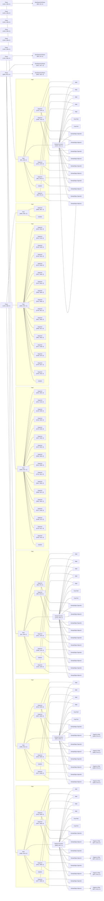

```mermaid
flowchart LR
  subgraph path8 [Path]
    8["Path<br>[921, 946, 0]"]
    9["Segment<br>[954, 976, 0]"]
    10["Segment<br>[984, 1043, 0]"]
    11["Segment<br>[1051, 1078, 0]"]
    12["Segment<br>[1086, 1145, 0]"]
    13["Segment<br>[1153, 1160, 0]"]
    14[Solid2d]
  end
  subgraph path34 [Path]
    34["Path<br>[921, 946, 0]"]
    35["Segment<br>[954, 976, 0]"]
    36["Segment<br>[984, 1043, 0]"]
    37["Segment<br>[1051, 1078, 0]"]
    38["Segment<br>[1086, 1145, 0]"]
    39["Segment<br>[1153, 1160, 0]"]
    40[Solid2d]
  end
  subgraph path59 [Path]
    59["Path<br>[4856, 4957, 0]"]
    60["Segment<br>[4856, 4957, 0]"]
    61[Solid2d]
  end
  subgraph path62 [Path]
    62["Path<br>[4485, 4510, 0]"]
    63["Segment<br>[4518, 4559, 0]"]
    64["Segment<br>[4567, 4608, 0]"]
    65["Segment<br>[4616, 4669, 0]"]
    66["Segment<br>[4677, 4698, 0]"]
    67[Solid2d]
  end
  subgraph path68 [Path]
    68["Path<br>[2830, 2917, 0]"]
    69["Segment<br>[2925, 3004, 0]"]
    70["Segment<br>[3012, 3118, 0]"]
    71["Segment<br>[3126, 3208, 0]"]
    72["Segment<br>[3216, 3262, 0]"]
    73["Segment<br>[3270, 3349, 0]"]
    74["Segment<br>[3357, 3465, 0]"]
    75["Segment<br>[3473, 3552, 0]"]
    76["Segment<br>[3560, 3606, 0]"]
    77["Segment<br>[3614, 3696, 0]"]
    78["Segment<br>[3704, 3813, 0]"]
    79["Segment<br>[3821, 3900, 0]"]
    80["Segment<br>[3908, 3973, 0]"]
    81["Segment<br>[3981, 4063, 0]"]
    82["Segment<br>[4071, 4180, 0]"]
    83["Segment<br>[4188, 4270, 0]"]
    84["Segment<br>[4278, 4327, 0]"]
    85["Segment<br>[4335, 4342, 0]"]
    86[Solid2d]
  end
  subgraph path103 [Path]
    103["Path<br>[4485, 4510, 0]"]
    104["Segment<br>[4518, 4559, 0]"]
    105["Segment<br>[4567, 4608, 0]"]
    106["Segment<br>[4616, 4669, 0]"]
    107["Segment<br>[4677, 4698, 0]"]
    108[Solid2d]
  end
  subgraph path109 [Path]
    109["Path<br>[2830, 2917, 0]"]
    110["Segment<br>[2925, 3004, 0]"]
    111["Segment<br>[3012, 3118, 0]"]
    112["Segment<br>[3126, 3208, 0]"]
    113["Segment<br>[3216, 3262, 0]"]
    114["Segment<br>[3270, 3349, 0]"]
    115["Segment<br>[3357, 3465, 0]"]
    116["Segment<br>[3473, 3552, 0]"]
    117["Segment<br>[3560, 3606, 0]"]
    118["Segment<br>[3614, 3696, 0]"]
    119["Segment<br>[3704, 3813, 0]"]
    120["Segment<br>[3821, 3900, 0]"]
    121["Segment<br>[3908, 3973, 0]"]
    122["Segment<br>[3981, 4063, 0]"]
    123["Segment<br>[4071, 4180, 0]"]
    124["Segment<br>[4188, 4270, 0]"]
    125["Segment<br>[4278, 4327, 0]"]
    126["Segment<br>[4335, 4342, 0]"]
    127[Solid2d]
  end
  1["Plane<br>[1246, 1286, 0]"]
  2["Plane<br>[1246, 1286, 0]"]
  3["Plane<br>[1246, 1286, 0]"]
  4["Plane<br>[1246, 1286, 0]"]
  5["Plane<br>[1246, 1286, 0]"]
  6["Plane<br>[1246, 1286, 0]"]
  7["Plane<br>[1246, 1286, 0]"]
  15["Sweep Extrusion<br>[1233, 1331, 0]"]
  16[Wall]
  17[Wall]
  18[Wall]
  19[Wall]
  20[Wall]
  21["Cap Start"]
  22["Cap End"]
  23["SweepEdge Opposite"]
  24["SweepEdge Adjacent"]
  25["SweepEdge Opposite"]
  26["SweepEdge Adjacent"]
  27["SweepEdge Opposite"]
  28["SweepEdge Adjacent"]
  29["SweepEdge Opposite"]
  30["SweepEdge Adjacent"]
  31["SweepEdge Opposite"]
  32["SweepEdge Adjacent"]
  33["Plane<br>[1792, 1832, 0]"]
  41["Sweep Revolve<br>[1746, 1834, 0]"]
  42[Wall]
  43[Wall]
  44[Wall]
  45[Wall]
  46[Wall]
  47["Cap Start"]
  48["Cap End"]
  49["SweepEdge Opposite"]
  50["SweepEdge Adjacent"]
  51["SweepEdge Opposite"]
  52["SweepEdge Adjacent"]
  53["SweepEdge Opposite"]
  54["SweepEdge Adjacent"]
  55["SweepEdge Opposite"]
  56["SweepEdge Adjacent"]
  57["SweepEdge Opposite"]
  58["SweepEdge Adjacent"]
  87["Sweep Extrusion<br>[5301, 5343, 0]"]
  88[Wall]
  89[Wall]
  90[Wall]
  91[Wall]
  92["Cap Start"]
  93["Cap End"]
  94["SweepEdge Opposite"]
  95["SweepEdge Adjacent"]
  96["SweepEdge Opposite"]
  97["SweepEdge Adjacent"]
  98["SweepEdge Opposite"]
  99["SweepEdge Adjacent"]
  100["SweepEdge Opposite"]
  101["SweepEdge Adjacent"]
  102["Plane<br>[5836, 5873, 0]"]
  128["Sweep Extrusion<br>[5956, 6007, 0]"]
  129[Wall]
  130[Wall]
  131[Wall]
  132[Wall]
  133["Cap Start"]
  134["Cap End"]
  135["SweepEdge Opposite"]
  136["SweepEdge Adjacent"]
  137["SweepEdge Opposite"]
  138["SweepEdge Adjacent"]
  139["SweepEdge Opposite"]
  140["SweepEdge Adjacent"]
  141["SweepEdge Opposite"]
  142["SweepEdge Adjacent"]
  143["EdgeCut Fillet<br>[5406, 5744, 0]"]
  144["EdgeCut Fillet<br>[5406, 5744, 0]"]
  145["EdgeCut Fillet<br>[5406, 5744, 0]"]
  146["EdgeCut Fillet<br>[5406, 5744, 0]"]
  147["EdgeCut Fillet<br>[6071, 6414, 0]"]
  148["EdgeCut Fillet<br>[6071, 6414, 0]"]
  149["EdgeCut Fillet<br>[6071, 6414, 0]"]
  150["EdgeCut Fillet<br>[6071, 6414, 0]"]
  151["StartSketchOnPlane<br>[893, 913, 0]"]
  152["StartSketchOnPlane<br>[893, 913, 0]"]
  153["StartSketchOnPlane<br>[4457, 4477, 0]"]
  154["StartSketchOnPlane<br>[2802, 2822, 0]"]
  1 --- 59
  1 --- 62
  1 --- 68
  7 --- 8
  8 --- 9
  8 --- 10
  8 --- 11
  8 --- 12
  8 --- 13
  8 ---- 15
  8 --- 14
  9 --- 20
  9 --- 31
  9 --- 32
  10 --- 19
  10 --- 29
  10 --- 30
  11 --- 18
  11 --- 27
  11 --- 28
  12 --- 17
  12 --- 25
  12 --- 26
  13 --- 16
  13 --- 23
  13 --- 24
  15 --- 16
  15 --- 17
  15 --- 18
  15 --- 19
  15 --- 20
  15 --- 21
  15 --- 22
  15 --- 23
  15 --- 24
  15 --- 25
  15 --- 26
  15 --- 27
  15 --- 28
  15 --- 29
  15 --- 30
  15 --- 31
  15 --- 32
  33 --- 34
  34 --- 35
  34 --- 36
  34 --- 37
  34 --- 38
  34 --- 39
  34 ---- 41
  34 --- 40
  35 --- 42
  35 --- 49
  35 --- 50
  36 --- 43
  36 --- 51
  36 --- 52
  37 --- 44
  37 --- 53
  37 --- 54
  38 --- 45
  38 --- 55
  38 --- 56
  39 --- 46
  39 --- 57
  39 --- 58
  41 --- 42
  41 --- 43
  41 --- 44
  41 --- 45
  41 --- 46
  41 --- 47
  41 --- 48
  41 --- 49
  41 --- 50
  41 --- 51
  41 --- 52
  41 --- 53
  41 --- 54
  41 --- 55
  41 --- 56
  41 --- 57
  41 --- 58
  59 --- 60
  59 --- 61
  62 --- 63
  62 --- 64
  62 --- 65
  62 --- 66
  62 ---- 87
  62 --- 67
  63 --- 88
  63 --- 94
  63 --- 95
  64 --- 89
  64 --- 96
  64 --- 97
  65 --- 90
  65 --- 98
  65 --- 99
  66 --- 91
  66 --- 100
  66 --- 101
  68 --- 69
  68 --- 70
  68 --- 71
  68 --- 72
  68 --- 73
  68 --- 74
  68 --- 75
  68 --- 76
  68 --- 77
  68 --- 78
  68 --- 79
  68 --- 80
  68 --- 81
  68 --- 82
  68 --- 83
  68 --- 84
  68 --- 85
  68 --- 86
  87 --- 88
  87 --- 89
  87 --- 90
  87 --- 91
  87 --- 92
  87 --- 93
  87 --- 94
  87 --- 95
  87 --- 96
  87 --- 97
  87 --- 98
  87 --- 99
  87 --- 100
  87 --- 101
  102 --- 103
  102 --- 109
  103 --- 104
  103 --- 105
  103 --- 106
  103 --- 107
  103 ---- 128
  103 --- 108
  104 --- 129
  104 --- 135
  104 --- 136
  105 --- 130
  105 --- 137
  105 --- 138
  106 --- 131
  106 --- 139
  106 --- 140
  107 --- 132
  107 --- 141
  107 --- 142
  109 --- 110
  109 --- 111
  109 --- 112
  109 --- 113
  109 --- 114
  109 --- 115
  109 --- 116
  109 --- 117
  109 --- 118
  109 --- 119
  109 --- 120
  109 --- 121
  109 --- 122
  109 --- 123
  109 --- 124
  109 --- 125
  109 --- 126
  109 --- 127
  128 --- 129
  128 --- 130
  128 --- 131
  128 --- 132
  128 --- 133
  128 --- 134
  128 --- 135
  128 --- 136
  128 --- 137
  128 --- 138
  128 --- 139
  128 --- 140
  128 --- 141
  128 --- 142
  95 <--x 143
  101 <--x 144
  99 <--x 145
  97 <--x 146
  136 <--x 147
  142 <--x 148
  140 <--x 149
  138 <--x 150
  7 <--x 151
  33 <--x 152
  102 <--x 153
  102 <--x 154
```
