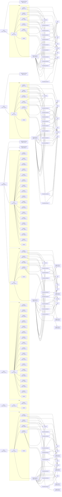

```mermaid
flowchart LR
  subgraph path11 [Path]
    11["Path<br>[922, 947, 0]"]
    18["Segment<br>[955, 977, 0]"]
    21["Segment<br>[985, 1029, 0]"]
    23["Segment<br>[1037, 1064, 0]"]
    25["Segment<br>[1072, 1116, 0]"]
    27["Segment<br>[1124, 1131, 0]"]
    72[Solid2d]
  end
  subgraph path12 [Path]
    12["Path<br>[922, 947, 0]"]
    19["Segment<br>[955, 977, 0]"]
    20["Segment<br>[985, 1029, 0]"]
    22["Segment<br>[1037, 1064, 0]"]
    24["Segment<br>[1072, 1116, 0]"]
    26["Segment<br>[1124, 1131, 0]"]
    76[Solid2d]
  end
  subgraph path13 [Path]
    13["Path<br>[2723, 2810, 0]"]
    29["Segment<br>[2818, 2897, 0]"]
    30["Segment<br>[2905, 2970, 0]"]
    33["Segment<br>[2978, 3060, 0]"]
    35["Segment<br>[3068, 3114, 0]"]
    37["Segment<br>[3122, 3201, 0]"]
    39["Segment<br>[3209, 3276, 0]"]
    40["Segment<br>[3284, 3363, 0]"]
    43["Segment<br>[3371, 3417, 0]"]
    44["Segment<br>[3425, 3507, 0]"]
    47["Segment<br>[3515, 3583, 0]"]
    49["Segment<br>[3591, 3670, 0]"]
    50["Segment<br>[3678, 3743, 0]"]
    52["Segment<br>[3751, 3833, 0]"]
    55["Segment<br>[3841, 3909, 0]"]
    56["Segment<br>[3917, 3999, 0]"]
    58["Segment<br>[4007, 4056, 0]"]
    61["Segment<br>[4064, 4071, 0]"]
    73[Solid2d]
  end
  subgraph path14 [Path]
    14["Path<br>[2723, 2810, 0]"]
    28["Segment<br>[2818, 2897, 0]"]
    31["Segment<br>[2905, 2970, 0]"]
    32["Segment<br>[2978, 3060, 0]"]
    34["Segment<br>[3068, 3114, 0]"]
    36["Segment<br>[3122, 3201, 0]"]
    38["Segment<br>[3209, 3276, 0]"]
    41["Segment<br>[3284, 3363, 0]"]
    42["Segment<br>[3371, 3417, 0]"]
    45["Segment<br>[3425, 3507, 0]"]
    46["Segment<br>[3515, 3583, 0]"]
    48["Segment<br>[3591, 3670, 0]"]
    51["Segment<br>[3678, 3743, 0]"]
    53["Segment<br>[3751, 3833, 0]"]
    54["Segment<br>[3841, 3909, 0]"]
    57["Segment<br>[3917, 3999, 0]"]
    59["Segment<br>[4007, 4056, 0]"]
    60["Segment<br>[4064, 4071, 0]"]
    75[Solid2d]
  end
  subgraph path15 [Path]
    15["Path<br>[4214, 4239, 0]"]
    62["Segment<br>[4247, 4288, 0]"]
    65["Segment<br>[4296, 4337, 0]"]
    66["Segment<br>[4345, 4398, 0]"]
    68["Segment<br>[4406, 4427, 0]"]
    74[Solid2d]
  end
  subgraph path16 [Path]
    16["Path<br>[4214, 4239, 0]"]
    63["Segment<br>[4247, 4288, 0]"]
    64["Segment<br>[4296, 4337, 0]"]
    67["Segment<br>[4345, 4398, 0]"]
    69["Segment<br>[4406, 4427, 0]"]
    77[Solid2d]
  end
  subgraph path17 [Path]
    17["Path<br>[4593, 4673, 0]"]
    70["Segment<br>[4593, 4673, 0]"]
    71[Solid2d]
  end
  1["Plane<br>[1217, 1255, 0]"]
  2["Plane<br>[1711, 1749, 0]"]
  3["Plane<br>[2695, 2715, 0]"]
  4["Plane<br>[4186, 4206, 0]"]
  5["Plane<br>[4570, 4587, 0]"]
  6["Plane<br>[5562, 5597, 0]"]
  7["StartSketchOnPlane<br>[2695, 2715, 0]"]
  8["StartSketchOnPlane<br>[894, 914, 0]"]
  9["StartSketchOnPlane<br>[894, 914, 0]"]
  10["StartSketchOnPlane<br>[4186, 4206, 0]"]
  78["Sweep Extrusion<br>[1204, 1298, 0]"]
  79["Sweep Revolve<br>[1698, 1780, 0]"]
  80["Sweep Extrusion<br>[5026, 5068, 0]"]
  81["Sweep Extrusion<br>[5680, 5731, 0]"]
  82[Wall]
  83[Wall]
  84[Wall]
  85[Wall]
  86[Wall]
  87[Wall]
  88[Wall]
  89[Wall]
  90[Wall]
  91[Wall]
  92[Wall]
  93[Wall]
  94[Wall]
  95[Wall]
  96[Wall]
  97[Wall]
  98[Wall]
  99[Wall]
  100["Cap Start"]
  101["Cap Start"]
  102["Cap Start"]
  103["Cap Start"]
  104["Cap End"]
  105["Cap End"]
  106["Cap End"]
  107["Cap End"]
  108["SweepEdge Opposite"]
  109["SweepEdge Adjacent"]
  110["SweepEdge Opposite"]
  111["SweepEdge Adjacent"]
  112["SweepEdge Opposite"]
  113["SweepEdge Adjacent"]
  114["SweepEdge Opposite"]
  115["SweepEdge Adjacent"]
  116["SweepEdge Opposite"]
  117["SweepEdge Adjacent"]
  118["SweepEdge Opposite"]
  119["SweepEdge Adjacent"]
  120["SweepEdge Opposite"]
  121["SweepEdge Adjacent"]
  122["SweepEdge Opposite"]
  123["SweepEdge Adjacent"]
  124["SweepEdge Opposite"]
  125["SweepEdge Adjacent"]
  126["SweepEdge Opposite"]
  127["SweepEdge Adjacent"]
  128["SweepEdge Opposite"]
  129["SweepEdge Adjacent"]
  130["SweepEdge Opposite"]
  131["SweepEdge Adjacent"]
  132["SweepEdge Opposite"]
  133["SweepEdge Adjacent"]
  134["SweepEdge Opposite"]
  135["SweepEdge Adjacent"]
  136["SweepEdge Opposite"]
  137["SweepEdge Adjacent"]
  138["SweepEdge Opposite"]
  139["SweepEdge Adjacent"]
  140["SweepEdge Opposite"]
  141["SweepEdge Adjacent"]
  142["SweepEdge Opposite"]
  143["SweepEdge Adjacent"]
  144["EdgeCut Fillet<br>[5131, 5470, 0]"]
  145["EdgeCut Fillet<br>[5131, 5470, 0]"]
  146["EdgeCut Fillet<br>[5131, 5470, 0]"]
  147["EdgeCut Fillet<br>[5131, 5470, 0]"]
  148["EdgeCut Fillet<br>[5795, 6139, 0]"]
  149["EdgeCut Fillet<br>[5795, 6139, 0]"]
  150["EdgeCut Fillet<br>[5795, 6139, 0]"]
  151["EdgeCut Fillet<br>[5795, 6139, 0]"]
  1 <--x 9
  1 --- 11
  2 <--x 8
  2 --- 12
  3 --- 14
  4 --- 16
  5 --- 17
  6 <--x 7
  6 <--x 10
  6 --- 13
  6 --- 15
  11 --- 18
  11 --- 21
  11 --- 23
  11 --- 25
  11 --- 27
  11 --- 72
  11 ---- 78
  12 --- 19
  12 --- 20
  12 --- 22
  12 --- 24
  12 --- 26
  12 --- 76
  12 ---- 79
  13 --- 29
  13 --- 30
  13 --- 33
  13 --- 35
  13 --- 37
  13 --- 39
  13 --- 40
  13 --- 43
  13 --- 44
  13 --- 47
  13 --- 49
  13 --- 50
  13 --- 52
  13 --- 55
  13 --- 56
  13 --- 58
  13 --- 61
  13 --- 73
  14 --- 28
  14 --- 31
  14 --- 32
  14 --- 34
  14 --- 36
  14 --- 38
  14 --- 41
  14 --- 42
  14 --- 45
  14 --- 46
  14 --- 48
  14 --- 51
  14 --- 53
  14 --- 54
  14 --- 57
  14 --- 59
  14 --- 60
  14 --- 75
  15 --- 62
  15 --- 65
  15 --- 66
  15 --- 68
  15 --- 74
  15 ---- 81
  16 --- 63
  16 --- 64
  16 --- 67
  16 --- 69
  16 --- 77
  16 ---- 80
  17 --- 70
  17 --- 71
  18 --- 87
  18 x--> 100
  18 --- 118
  18 --- 119
  19 --- 93
  19 x--> 101
  19 --- 130
  19 --- 131
  20 --- 91
  20 x--> 101
  20 --- 126
  20 --- 127
  21 --- 86
  21 x--> 100
  21 --- 116
  21 --- 117
  22 --- 92
  22 x--> 101
  22 --- 128
  22 --- 129
  23 --- 88
  23 x--> 100
  23 --- 120
  23 --- 121
  24 --- 94
  24 x--> 101
  24 --- 132
  24 --- 133
  25 --- 90
  25 x--> 100
  25 --- 124
  25 --- 125
  26 --- 95
  26 x--> 101
  26 --- 134
  26 --- 135
  27 --- 89
  27 x--> 100
  27 --- 122
  27 --- 123
  62 --- 84
  62 x--> 107
  62 --- 112
  62 --- 113
  63 --- 99
  63 x--> 106
  63 --- 142
  63 --- 143
  64 --- 97
  64 x--> 106
  64 --- 138
  64 --- 139
  65 --- 85
  65 x--> 107
  65 --- 114
  65 --- 115
  66 --- 82
  66 x--> 107
  66 --- 108
  66 --- 109
  67 --- 96
  67 x--> 106
  67 --- 136
  67 --- 137
  68 --- 83
  68 x--> 107
  68 --- 110
  68 --- 111
  69 --- 98
  69 x--> 106
  69 --- 140
  69 --- 141
  78 --- 86
  78 --- 87
  78 --- 88
  78 --- 89
  78 --- 90
  78 --- 100
  78 --- 104
  78 --- 116
  78 --- 117
  78 --- 118
  78 --- 119
  78 --- 120
  78 --- 121
  78 --- 122
  78 --- 123
  78 --- 124
  78 --- 125
  79 --- 91
  79 --- 92
  79 --- 93
  79 --- 94
  79 --- 95
  79 --- 101
  79 --- 105
  79 --- 126
  79 --- 127
  79 --- 128
  79 --- 129
  79 --- 130
  79 --- 131
  79 --- 132
  79 --- 133
  79 --- 134
  79 --- 135
  80 --- 96
  80 --- 97
  80 --- 98
  80 --- 99
  80 --- 102
  80 --- 106
  80 --- 136
  80 --- 137
  80 --- 138
  80 --- 139
  80 --- 140
  80 --- 141
  80 --- 142
  80 --- 143
  81 --- 82
  81 --- 83
  81 --- 84
  81 --- 85
  81 --- 103
  81 --- 107
  81 --- 108
  81 --- 109
  81 --- 110
  81 --- 111
  81 --- 112
  81 --- 113
  81 --- 114
  81 --- 115
  108 <--x 82
  115 <--x 82
  110 <--x 83
  111 <--x 83
  111 <--x 84
  112 <--x 84
  113 <--x 84
  113 <--x 85
  114 <--x 85
  115 <--x 85
  116 <--x 86
  117 <--x 86
  119 <--x 86
  118 <--x 87
  119 <--x 87
  123 <--x 87
  117 <--x 88
  120 <--x 88
  121 <--x 88
  122 <--x 89
  123 <--x 89
  125 <--x 89
  121 <--x 90
  124 <--x 90
  125 <--x 90
  126 <--x 91
  127 <--x 91
  131 <--x 91
  127 <--x 92
  128 <--x 92
  129 <--x 92
  130 <--x 93
  131 <--x 93
  135 <--x 93
  129 <--x 94
  132 <--x 94
  133 <--x 94
  133 <--x 95
  134 <--x 95
  135 <--x 95
  136 <--x 96
  139 <--x 96
  138 <--x 97
  139 <--x 97
  143 <--x 97
  140 <--x 98
  141 <--x 98
  141 <--x 99
  142 <--x 99
  143 <--x 99
  136 <--x 102
  138 <--x 102
  140 <--x 102
  142 <--x 102
  108 <--x 103
  110 <--x 103
  112 <--x 103
  114 <--x 103
  116 <--x 104
  118 <--x 104
  120 <--x 104
  122 <--x 104
  124 <--x 104
  126 <--x 105
  128 <--x 105
  130 <--x 105
  132 <--x 105
  134 <--x 105
  109 <--x 150
  111 <--x 149
  113 <--x 148
  115 <--x 151
  137 <--x 146
  139 <--x 147
  141 <--x 145
  143 <--x 144
```
