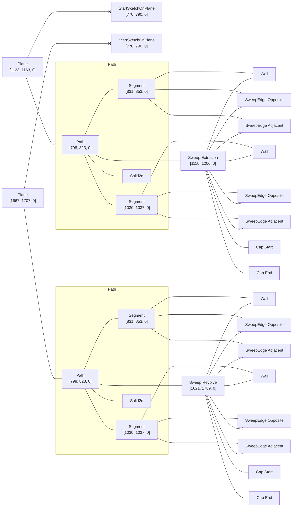

```mermaid
flowchart LR
  subgraph path2 [Path]
    2["Path<br>[798, 823, 0]"]
    3["Segment<br>[831, 853, 0]"]
    4["Segment<br>[1030, 1037, 0]"]
    5[Solid2d]
  end
  subgraph path16 [Path]
    16["Path<br>[798, 823, 0]"]
    17["Segment<br>[831, 853, 0]"]
    18["Segment<br>[1030, 1037, 0]"]
    19[Solid2d]
  end
  1["Plane<br>[1123, 1163, 0]"]
  6["Sweep Extrusion<br>[1110, 1206, 0]"]
  7[Wall]
  8[Wall]
  9["Cap Start"]
  10["Cap End"]
  11["SweepEdge Opposite"]
  12["SweepEdge Adjacent"]
  13["SweepEdge Opposite"]
  14["SweepEdge Adjacent"]
  15["Plane<br>[1667, 1707, 0]"]
  20["Sweep Revolve<br>[1621, 1709, 0]"]
  21[Wall]
  22[Wall]
  23["Cap Start"]
  24["Cap End"]
  25["SweepEdge Opposite"]
  26["SweepEdge Adjacent"]
  27["SweepEdge Opposite"]
  28["SweepEdge Adjacent"]
  29["StartSketchOnPlane<br>[770, 790, 0]"]
  30["StartSketchOnPlane<br>[770, 790, 0]"]
  1 --- 2
  2 --- 3
  2 --- 4
  2 ---- 6
  2 --- 5
  3 --- 8
  3 --- 13
  3 --- 14
  4 --- 7
  4 --- 11
  4 --- 12
  6 --- 7
  6 --- 8
  6 --- 9
  6 --- 10
  6 --- 11
  6 --- 12
  6 --- 13
  6 --- 14
  15 --- 16
  16 --- 17
  16 --- 18
  16 ---- 20
  16 --- 19
  17 --- 21
  17 --- 25
  17 --- 26
  18 --- 22
  18 --- 27
  18 --- 28
  20 --- 21
  20 --- 22
  20 --- 23
  20 --- 24
  20 --- 25
  20 --- 26
  20 --- 27
  20 --- 28
  1 <--x 29
  15 <--x 30
```
