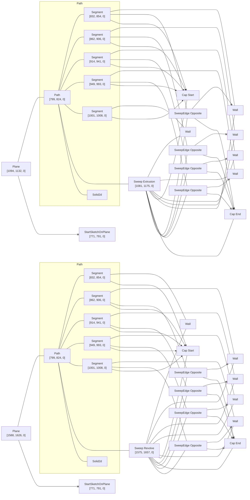

```mermaid
flowchart LR
  subgraph path2 [Path]
    2["Path<br>[799, 824, 0]"]
    3["Segment<br>[832, 854, 0]"]
    4["Segment<br>[862, 906, 0]"]
    5["Segment<br>[914, 941, 0]"]
    6["Segment<br>[949, 993, 0]"]
    7["Segment<br>[1001, 1008, 0]"]
    8[Solid2d]
  end
  subgraph path22 [Path]
    22["Path<br>[799, 824, 0]"]
    23["Segment<br>[832, 854, 0]"]
    24["Segment<br>[862, 906, 0]"]
    25["Segment<br>[914, 941, 0]"]
    26["Segment<br>[949, 993, 0]"]
    27["Segment<br>[1001, 1008, 0]"]
    28[Solid2d]
  end
  1["Plane<br>[1094, 1132, 0]"]
  9["Sweep Extrusion<br>[1081, 1175, 0]"]
  10[Wall]
  11[Wall]
  12[Wall]
  13[Wall]
  14[Wall]
  15["Cap Start"]
  16["Cap End"]
  17["SweepEdge Opposite"]
  18["SweepEdge Opposite"]
  19["SweepEdge Opposite"]
  20["SweepEdge Opposite"]
  21["Plane<br>[1588, 1626, 0]"]
  29["Sweep Revolve<br>[1575, 1657, 0]"]
  30[Wall]
  31[Wall]
  32[Wall]
  33[Wall]
  34[Wall]
  35["Cap Start"]
  36["Cap End"]
  37["SweepEdge Opposite"]
  38["SweepEdge Opposite"]
  39["SweepEdge Opposite"]
  40["SweepEdge Opposite"]
  41["StartSketchOnPlane<br>[771, 791, 0]"]
  42["StartSketchOnPlane<br>[771, 791, 0]"]
  1 --- 2
  2 --- 3
  2 --- 4
  2 --- 5
  2 --- 6
  2 --- 7
  2 ---- 9
  2 --- 8
  3 --- 14
  3 --- 20
  3 x--> 15
  4 --- 13
  4 --- 19
  4 x--> 15
  5 --- 12
  5 --- 18
  5 x--> 15
  6 --- 11
  6 --- 17
  6 x--> 15
  7 --- 10
  7 x--> 15
  9 --- 10
  9 --- 11
  9 --- 12
  9 --- 13
  9 --- 14
  9 --- 15
  9 --- 16
  9 --- 17
  9 --- 18
  9 --- 19
  9 --- 20
  17 <--x 11
  17 <--x 16
  18 <--x 12
  18 <--x 16
  19 <--x 13
  19 <--x 16
  20 <--x 14
  20 <--x 16
  21 --- 22
  22 --- 23
  22 --- 24
  22 --- 25
  22 --- 26
  22 --- 27
  22 ---- 29
  22 --- 28
  23 --- 30
  23 x--> 35
  24 --- 31
  24 --- 37
  24 x--> 35
  25 --- 32
  25 --- 38
  25 x--> 35
  26 --- 33
  26 --- 39
  26 x--> 35
  27 --- 34
  27 --- 40
  27 x--> 35
  29 --- 30
  29 --- 31
  29 --- 32
  29 --- 33
  29 --- 34
  29 --- 35
  29 --- 36
  29 --- 37
  29 --- 38
  29 --- 39
  29 --- 40
  37 <--x 31
  37 <--x 36
  38 <--x 32
  38 <--x 36
  39 <--x 33
  39 <--x 36
  40 <--x 34
  40 <--x 36
  1 <--x 41
  21 <--x 42
```
