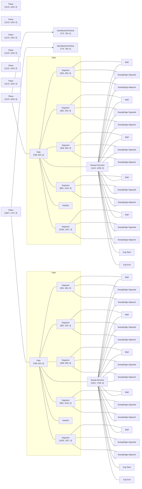

```mermaid
flowchart LR
  subgraph path8 [Path]
    8["Path<br>[798, 823, 0]"]
    9["Segment<br>[831, 853, 0]"]
    10["Segment<br>[861, 920, 0]"]
    11["Segment<br>[928, 955, 0]"]
    12["Segment<br>[963, 1022, 0]"]
    13["Segment<br>[1030, 1037, 0]"]
    14[Solid2d]
  end
  subgraph path34 [Path]
    34["Path<br>[798, 823, 0]"]
    35["Segment<br>[831, 853, 0]"]
    36["Segment<br>[861, 920, 0]"]
    37["Segment<br>[928, 955, 0]"]
    38["Segment<br>[963, 1022, 0]"]
    39["Segment<br>[1030, 1037, 0]"]
    40[Solid2d]
  end
  1["Plane<br>[1123, 1163, 0]"]
  2["Plane<br>[1123, 1163, 0]"]
  3["Plane<br>[1123, 1163, 0]"]
  4["Plane<br>[1123, 1163, 0]"]
  5["Plane<br>[1123, 1163, 0]"]
  6["Plane<br>[1123, 1163, 0]"]
  7["Plane<br>[1123, 1163, 0]"]
  15["Sweep Extrusion<br>[1110, 1206, 0]"]
  16[Wall]
  17[Wall]
  18[Wall]
  19[Wall]
  20[Wall]
  21["Cap Start"]
  22["Cap End"]
  23["SweepEdge Opposite"]
  24["SweepEdge Adjacent"]
  25["SweepEdge Opposite"]
  26["SweepEdge Adjacent"]
  27["SweepEdge Opposite"]
  28["SweepEdge Adjacent"]
  29["SweepEdge Opposite"]
  30["SweepEdge Adjacent"]
  31["SweepEdge Opposite"]
  32["SweepEdge Adjacent"]
  33["Plane<br>[1667, 1707, 0]"]
  41["Sweep Revolve<br>[1621, 1709, 0]"]
  42[Wall]
  43[Wall]
  44[Wall]
  45[Wall]
  46[Wall]
  47["Cap Start"]
  48["Cap End"]
  49["SweepEdge Opposite"]
  50["SweepEdge Adjacent"]
  51["SweepEdge Opposite"]
  52["SweepEdge Adjacent"]
  53["SweepEdge Opposite"]
  54["SweepEdge Adjacent"]
  55["SweepEdge Opposite"]
  56["SweepEdge Adjacent"]
  57["SweepEdge Opposite"]
  58["SweepEdge Adjacent"]
  59["StartSketchOnPlane<br>[770, 790, 0]"]
  60["StartSketchOnPlane<br>[770, 790, 0]"]
  7 --- 8
  8 --- 9
  8 --- 10
  8 --- 11
  8 --- 12
  8 --- 13
  8 ---- 15
  8 --- 14
  9 --- 20
  9 --- 31
  9 --- 32
  10 --- 19
  10 --- 29
  10 --- 30
  11 --- 18
  11 --- 27
  11 --- 28
  12 --- 17
  12 --- 25
  12 --- 26
  13 --- 16
  13 --- 23
  13 --- 24
  15 --- 16
  15 --- 17
  15 --- 18
  15 --- 19
  15 --- 20
  15 --- 21
  15 --- 22
  15 --- 23
  15 --- 24
  15 --- 25
  15 --- 26
  15 --- 27
  15 --- 28
  15 --- 29
  15 --- 30
  15 --- 31
  15 --- 32
  33 --- 34
  34 --- 35
  34 --- 36
  34 --- 37
  34 --- 38
  34 --- 39
  34 ---- 41
  34 --- 40
  35 --- 42
  35 --- 49
  35 --- 50
  36 --- 43
  36 --- 51
  36 --- 52
  37 --- 44
  37 --- 53
  37 --- 54
  38 --- 45
  38 --- 55
  38 --- 56
  39 --- 46
  39 --- 57
  39 --- 58
  41 --- 42
  41 --- 43
  41 --- 44
  41 --- 45
  41 --- 46
  41 --- 47
  41 --- 48
  41 --- 49
  41 --- 50
  41 --- 51
  41 --- 52
  41 --- 53
  41 --- 54
  41 --- 55
  41 --- 56
  41 --- 57
  41 --- 58
  7 <--x 59
  33 <--x 60
```
