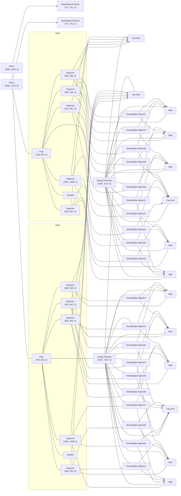

```mermaid
flowchart LR
  subgraph path5 [Path]
    5["Path<br>[799, 824, 0]"]
    7["Segment<br>[832, 854, 0]"]
    10["Segment<br>[862, 906, 0]"]
    12["Segment<br>[914, 941, 0]"]
    14["Segment<br>[949, 993, 0]"]
    16["Segment<br>[1001, 1008, 0]"]
    17[Solid2d]
  end
  subgraph path6 [Path]
    6["Path<br>[799, 824, 0]"]
    8["Segment<br>[832, 854, 0]"]
    9["Segment<br>[862, 906, 0]"]
    11["Segment<br>[914, 941, 0]"]
    13["Segment<br>[949, 993, 0]"]
    15["Segment<br>[1001, 1008, 0]"]
    18[Solid2d]
  end
  1["Plane<br>[1094, 1132, 0]"]
  2["Plane<br>[1588, 1626, 0]"]
  3["StartSketchOnPlane<br>[771, 791, 0]"]
  4["StartSketchOnPlane<br>[771, 791, 0]"]
  19["Sweep Extrusion<br>[1081, 1175, 0]"]
  20["Sweep Revolve<br>[1575, 1657, 0]"]
  21[Wall]
  22[Wall]
  23[Wall]
  24[Wall]
  25[Wall]
  26[Wall]
  27[Wall]
  28[Wall]
  29[Wall]
  30[Wall]
  31["Cap Start"]
  32["Cap Start"]
  33["Cap End"]
  34["Cap End"]
  35["SweepEdge Opposite"]
  36["SweepEdge Opposite"]
  37["SweepEdge Opposite"]
  38["SweepEdge Opposite"]
  39["SweepEdge Opposite"]
  40["SweepEdge Opposite"]
  41["SweepEdge Opposite"]
  42["SweepEdge Opposite"]
  43["SweepEdge Opposite"]
  44["SweepEdge Opposite"]
  45["SweepEdge Adjacent"]
  46["SweepEdge Adjacent"]
  47["SweepEdge Adjacent"]
  48["SweepEdge Adjacent"]
  49["SweepEdge Adjacent"]
  50["SweepEdge Adjacent"]
  51["SweepEdge Adjacent"]
  52["SweepEdge Adjacent"]
  53["SweepEdge Adjacent"]
  54["SweepEdge Adjacent"]
  1 <--x 4
  1 --- 5
  2 <--x 3
  2 --- 6
  5 --- 7
  5 --- 10
  5 --- 12
  5 --- 14
  5 --- 16
  5 --- 17
  5 ---- 19
  6 --- 8
  6 --- 9
  6 --- 11
  6 --- 13
  6 --- 15
  6 --- 18
  6 ---- 20
  7 --- 22
  7 x--> 31
  7 --- 39
  7 --- 48
  8 --- 28
  8 x--> 32
  8 --- 42
  8 --- 54
  9 --- 26
  9 x--> 32
  9 --- 43
  9 --- 50
  10 --- 21
  10 x--> 31
  10 --- 38
  10 --- 46
  11 --- 27
  11 x--> 32
  11 --- 40
  11 --- 53
  12 --- 23
  12 x--> 31
  12 --- 36
  12 --- 45
  13 --- 29
  13 x--> 32
  13 --- 44
  13 --- 51
  14 --- 25
  14 x--> 31
  14 --- 37
  14 --- 47
  15 --- 30
  15 x--> 32
  15 --- 41
  15 --- 52
  16 --- 24
  16 x--> 31
  16 --- 35
  16 --- 49
  19 --- 21
  19 --- 22
  19 --- 23
  19 --- 24
  19 --- 25
  19 --- 31
  19 --- 33
  19 --- 35
  19 --- 36
  19 --- 37
  19 --- 38
  19 --- 39
  19 --- 45
  19 --- 46
  19 --- 47
  19 --- 48
  19 --- 49
  20 --- 26
  20 --- 27
  20 --- 28
  20 --- 29
  20 --- 30
  20 --- 32
  20 --- 34
  20 --- 40
  20 --- 41
  20 --- 42
  20 --- 43
  20 --- 44
  20 --- 50
  20 --- 51
  20 --- 52
  20 --- 53
  20 --- 54
  38 <--x 21
  46 <--x 21
  48 <--x 21
  39 <--x 22
  48 <--x 22
  49 <--x 22
  36 <--x 23
  45 <--x 23
  46 <--x 23
  35 <--x 24
  47 <--x 24
  49 <--x 24
  37 <--x 25
  45 <--x 25
  47 <--x 25
  43 <--x 26
  50 <--x 26
  54 <--x 26
  40 <--x 27
  50 <--x 27
  53 <--x 27
  42 <--x 28
  52 <--x 28
  54 <--x 28
  44 <--x 29
  51 <--x 29
  53 <--x 29
  41 <--x 30
  51 <--x 30
  52 <--x 30
  35 <--x 33
  36 <--x 33
  37 <--x 33
  38 <--x 33
  39 <--x 33
  40 <--x 34
  41 <--x 34
  42 <--x 34
  43 <--x 34
  44 <--x 34
```
