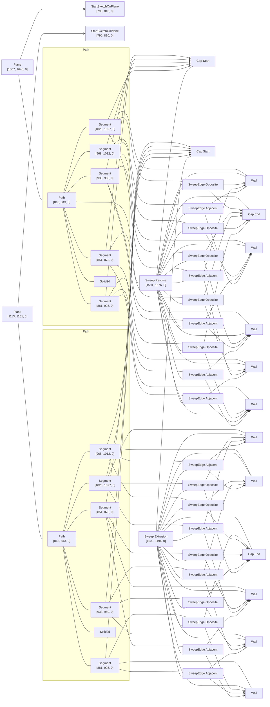

```mermaid
flowchart LR
  subgraph path5 [Path]
    5["Path<br>[818, 843, 0]"]
      %% [ProgramBodyItem { index: 8 }, VariableDeclarationDeclaration, VariableDeclarationInit, FunctionExpressionBody, FunctionExpressionBodyItem { index: 0 }, VariableDeclarationDeclaration, VariableDeclarationInit, PipeBodyItem { index: 1 }]
    7["Segment<br>[851, 873, 0]"]
      %% [ProgramBodyItem { index: 8 }, VariableDeclarationDeclaration, VariableDeclarationInit, FunctionExpressionBody, FunctionExpressionBodyItem { index: 0 }, VariableDeclarationDeclaration, VariableDeclarationInit, PipeBodyItem { index: 2 }]
    10["Segment<br>[881, 925, 0]"]
      %% [ProgramBodyItem { index: 8 }, VariableDeclarationDeclaration, VariableDeclarationInit, FunctionExpressionBody, FunctionExpressionBodyItem { index: 0 }, VariableDeclarationDeclaration, VariableDeclarationInit, PipeBodyItem { index: 3 }]
    12["Segment<br>[933, 960, 0]"]
      %% [ProgramBodyItem { index: 8 }, VariableDeclarationDeclaration, VariableDeclarationInit, FunctionExpressionBody, FunctionExpressionBodyItem { index: 0 }, VariableDeclarationDeclaration, VariableDeclarationInit, PipeBodyItem { index: 4 }]
    13["Segment<br>[968, 1012, 0]"]
      %% [ProgramBodyItem { index: 8 }, VariableDeclarationDeclaration, VariableDeclarationInit, FunctionExpressionBody, FunctionExpressionBodyItem { index: 0 }, VariableDeclarationDeclaration, VariableDeclarationInit, PipeBodyItem { index: 5 }]
    15["Segment<br>[1020, 1027, 0]"]
      %% [ProgramBodyItem { index: 8 }, VariableDeclarationDeclaration, VariableDeclarationInit, FunctionExpressionBody, FunctionExpressionBodyItem { index: 0 }, VariableDeclarationDeclaration, VariableDeclarationInit, PipeBodyItem { index: 6 }]
    17[Solid2d]
  end
  subgraph path6 [Path]
    6["Path<br>[818, 843, 0]"]
      %% [ProgramBodyItem { index: 8 }, VariableDeclarationDeclaration, VariableDeclarationInit, FunctionExpressionBody, FunctionExpressionBodyItem { index: 0 }, VariableDeclarationDeclaration, VariableDeclarationInit, PipeBodyItem { index: 1 }]
    8["Segment<br>[851, 873, 0]"]
      %% [ProgramBodyItem { index: 8 }, VariableDeclarationDeclaration, VariableDeclarationInit, FunctionExpressionBody, FunctionExpressionBodyItem { index: 0 }, VariableDeclarationDeclaration, VariableDeclarationInit, PipeBodyItem { index: 2 }]
    9["Segment<br>[881, 925, 0]"]
      %% [ProgramBodyItem { index: 8 }, VariableDeclarationDeclaration, VariableDeclarationInit, FunctionExpressionBody, FunctionExpressionBodyItem { index: 0 }, VariableDeclarationDeclaration, VariableDeclarationInit, PipeBodyItem { index: 3 }]
    11["Segment<br>[933, 960, 0]"]
      %% [ProgramBodyItem { index: 8 }, VariableDeclarationDeclaration, VariableDeclarationInit, FunctionExpressionBody, FunctionExpressionBodyItem { index: 0 }, VariableDeclarationDeclaration, VariableDeclarationInit, PipeBodyItem { index: 4 }]
    14["Segment<br>[968, 1012, 0]"]
      %% [ProgramBodyItem { index: 8 }, VariableDeclarationDeclaration, VariableDeclarationInit, FunctionExpressionBody, FunctionExpressionBodyItem { index: 0 }, VariableDeclarationDeclaration, VariableDeclarationInit, PipeBodyItem { index: 5 }]
    16["Segment<br>[1020, 1027, 0]"]
      %% [ProgramBodyItem { index: 8 }, VariableDeclarationDeclaration, VariableDeclarationInit, FunctionExpressionBody, FunctionExpressionBodyItem { index: 0 }, VariableDeclarationDeclaration, VariableDeclarationInit, PipeBodyItem { index: 6 }]
    18[Solid2d]
  end
  1["Plane<br>[1113, 1151, 0]"]
    %% [ProgramBodyItem { index: 9 }, VariableDeclarationDeclaration, VariableDeclarationInit, CallKwUnlabeledArg, CallKwUnlabeledArg]
  2["Plane<br>[1607, 1645, 0]"]
    %% [ProgramBodyItem { index: 12 }, VariableDeclarationDeclaration, VariableDeclarationInit, CallKwUnlabeledArg, CallKwUnlabeledArg]
  3["StartSketchOnPlane<br>[790, 810, 0]"]
    %% Missing NodePath
  4["StartSketchOnPlane<br>[790, 810, 0]"]
    %% Missing NodePath
  19["Sweep Extrusion<br>[1100, 1194, 0]"]
    %% [ProgramBodyItem { index: 9 }, VariableDeclarationDeclaration, VariableDeclarationInit]
  20["Sweep Revolve<br>[1594, 1676, 0]"]
    %% [ProgramBodyItem { index: 12 }, VariableDeclarationDeclaration, VariableDeclarationInit]
  21[Wall]
  22[Wall]
  23[Wall]
  24[Wall]
  25[Wall]
  26[Wall]
  27[Wall]
  28[Wall]
  29[Wall]
  30[Wall]
  31["Cap Start"]
  32["Cap Start"]
  33["Cap End"]
  34["Cap End"]
  35["SweepEdge Opposite"]
  36["SweepEdge Opposite"]
  37["SweepEdge Opposite"]
  38["SweepEdge Opposite"]
  39["SweepEdge Opposite"]
  40["SweepEdge Opposite"]
  41["SweepEdge Opposite"]
  42["SweepEdge Opposite"]
  43["SweepEdge Opposite"]
  44["SweepEdge Opposite"]
  45["SweepEdge Adjacent"]
  46["SweepEdge Adjacent"]
  47["SweepEdge Adjacent"]
  48["SweepEdge Adjacent"]
  49["SweepEdge Adjacent"]
  50["SweepEdge Adjacent"]
  51["SweepEdge Adjacent"]
  52["SweepEdge Adjacent"]
  53["SweepEdge Adjacent"]
  54["SweepEdge Adjacent"]
  1 <--x 4
  1 --- 6
  2 <--x 3
  2 --- 5
  5 --- 7
  5 --- 10
  5 --- 12
  5 --- 13
  5 --- 15
  5 --- 17
  5 ---- 20
  6 --- 8
  6 --- 9
  6 --- 11
  6 --- 14
  6 --- 16
  6 --- 18
  6 ---- 19
  7 --- 21
  7 x--> 31
  7 --- 37
  7 --- 47
  8 --- 28
  8 x--> 32
  8 --- 42
  8 --- 54
  9 --- 27
  9 x--> 32
  9 --- 40
  9 --- 53
  10 --- 23
  10 x--> 31
  10 --- 39
  10 --- 48
  11 --- 26
  11 x--> 32
  11 --- 43
  11 --- 51
  12 --- 25
  12 x--> 31
  12 --- 36
  12 --- 45
  13 --- 22
  13 x--> 31
  13 --- 38
  13 --- 49
  14 --- 29
  14 x--> 32
  14 --- 41
  14 --- 52
  15 --- 24
  15 x--> 31
  15 --- 35
  15 --- 46
  16 --- 30
  16 x--> 32
  16 --- 44
  16 --- 50
  19 --- 26
  19 --- 27
  19 --- 28
  19 --- 29
  19 --- 30
  19 --- 32
  19 --- 34
  19 --- 40
  19 --- 41
  19 --- 42
  19 --- 43
  19 --- 44
  19 --- 50
  19 --- 51
  19 --- 52
  19 --- 53
  19 --- 54
  20 --- 21
  20 --- 22
  20 --- 23
  20 --- 24
  20 --- 25
  20 --- 31
  20 --- 33
  20 --- 35
  20 --- 36
  20 --- 37
  20 --- 38
  20 --- 39
  20 --- 45
  20 --- 46
  20 --- 47
  20 --- 48
  20 --- 49
  37 <--x 21
  46 <--x 21
  47 <--x 21
  38 <--x 22
  45 <--x 22
  49 <--x 22
  39 <--x 23
  47 <--x 23
  48 <--x 23
  35 <--x 24
  46 <--x 24
  49 <--x 24
  36 <--x 25
  45 <--x 25
  48 <--x 25
  43 <--x 26
  51 <--x 26
  53 <--x 26
  40 <--x 27
  53 <--x 27
  54 <--x 27
  42 <--x 28
  50 <--x 28
  54 <--x 28
  41 <--x 29
  51 <--x 29
  52 <--x 29
  44 <--x 30
  50 <--x 30
  52 <--x 30
  35 <--x 33
  36 <--x 33
  37 <--x 33
  38 <--x 33
  39 <--x 33
  40 <--x 34
  41 <--x 34
  42 <--x 34
  43 <--x 34
  44 <--x 34
```
