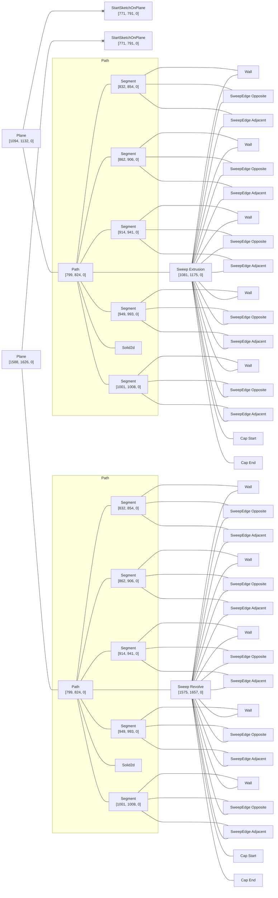

```mermaid
flowchart LR
  subgraph path2 [Path]
    2["Path<br>[799, 824, 0]"]
    3["Segment<br>[832, 854, 0]"]
    4["Segment<br>[862, 906, 0]"]
    5["Segment<br>[914, 941, 0]"]
    6["Segment<br>[949, 993, 0]"]
    7["Segment<br>[1001, 1008, 0]"]
    8[Solid2d]
  end
  subgraph path28 [Path]
    28["Path<br>[799, 824, 0]"]
    29["Segment<br>[832, 854, 0]"]
    30["Segment<br>[862, 906, 0]"]
    31["Segment<br>[914, 941, 0]"]
    32["Segment<br>[949, 993, 0]"]
    33["Segment<br>[1001, 1008, 0]"]
    34[Solid2d]
  end
  1["Plane<br>[1094, 1132, 0]"]
  9["Sweep Extrusion<br>[1081, 1175, 0]"]
  10[Wall]
  11[Wall]
  12[Wall]
  13[Wall]
  14[Wall]
  15["Cap Start"]
  16["Cap End"]
  17["SweepEdge Opposite"]
  18["SweepEdge Adjacent"]
  19["SweepEdge Opposite"]
  20["SweepEdge Adjacent"]
  21["SweepEdge Opposite"]
  22["SweepEdge Adjacent"]
  23["SweepEdge Opposite"]
  24["SweepEdge Adjacent"]
  25["SweepEdge Opposite"]
  26["SweepEdge Adjacent"]
  27["Plane<br>[1588, 1626, 0]"]
  35["Sweep Revolve<br>[1575, 1657, 0]"]
  36[Wall]
  37[Wall]
  38[Wall]
  39[Wall]
  40[Wall]
  41["Cap Start"]
  42["Cap End"]
  43["SweepEdge Opposite"]
  44["SweepEdge Adjacent"]
  45["SweepEdge Opposite"]
  46["SweepEdge Adjacent"]
  47["SweepEdge Opposite"]
  48["SweepEdge Adjacent"]
  49["SweepEdge Opposite"]
  50["SweepEdge Adjacent"]
  51["SweepEdge Opposite"]
  52["SweepEdge Adjacent"]
  53["StartSketchOnPlane<br>[771, 791, 0]"]
  54["StartSketchOnPlane<br>[771, 791, 0]"]
  1 --- 2
  2 --- 3
  2 --- 4
  2 --- 5
  2 --- 6
  2 --- 7
  2 ---- 9
  2 --- 8
  3 --- 14
  3 --- 25
  3 --- 26
  4 --- 13
  4 --- 23
  4 --- 24
  5 --- 12
  5 --- 21
  5 --- 22
  6 --- 11
  6 --- 19
  6 --- 20
  7 --- 10
  7 --- 17
  7 --- 18
  9 --- 10
  9 --- 11
  9 --- 12
  9 --- 13
  9 --- 14
  9 --- 15
  9 --- 16
  9 --- 17
  9 --- 18
  9 --- 19
  9 --- 20
  9 --- 21
  9 --- 22
  9 --- 23
  9 --- 24
  9 --- 25
  9 --- 26
  27 --- 28
  28 --- 29
  28 --- 30
  28 --- 31
  28 --- 32
  28 --- 33
  28 ---- 35
  28 --- 34
  29 --- 36
  29 --- 43
  29 --- 44
  30 --- 37
  30 --- 45
  30 --- 46
  31 --- 38
  31 --- 47
  31 --- 48
  32 --- 39
  32 --- 49
  32 --- 50
  33 --- 40
  33 --- 51
  33 --- 52
  35 --- 36
  35 --- 37
  35 --- 38
  35 --- 39
  35 --- 40
  35 --- 41
  35 --- 42
  35 --- 43
  35 --- 44
  35 --- 45
  35 --- 46
  35 --- 47
  35 --- 48
  35 --- 49
  35 --- 50
  35 --- 51
  35 --- 52
  1 <--x 53
  27 <--x 54
```
