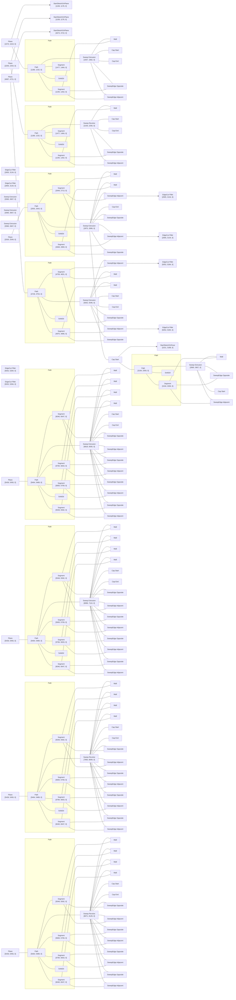

```mermaid
flowchart LR
  subgraph path2 [Path]
    2["Path<br>[1186, 1232, 0]"]
    3["Segment<br>[1240, 1262, 0]"]
    4["Segment<br>[1477, 1484, 0]"]
    5[Solid2d]
  end
  subgraph path13 [Path]
    13["Path<br>[1186, 1232, 0]"]
    14["Segment<br>[1240, 1262, 0]"]
    15["Segment<br>[1477, 1484, 0]"]
    16[Solid2d]
  end
  subgraph path24 [Path]
    24["Path<br>[2555, 2643, 0]"]
    25["Segment<br>[2649, 2713, 0]"]
    26["Segment<br>[2848, 2869, 0]"]
    27[Solid2d]
  end
  subgraph path41 [Path]
    41["Path<br>[3194, 3359, 0]"]
    42["Segment<br>[3194, 3359, 0]"]
    43[Solid2d]
  end
  subgraph path53 [Path]
    53["Path<br>[4728, 4753, 0]"]
    54["Segment<br>[4759, 4831, 0]"]
    55["Segment<br>[4975, 4996, 0]"]
    56[Solid2d]
  end
  subgraph path71 [Path]
    71["Path<br>[5464, 5489, 0]"]
    72["Segment<br>[5549, 5592, 0]"]
    73["Segment<br>[5600, 5709, 0]"]
    74["Segment<br>[5784, 5833, 0]"]
    75["Segment<br>[6040, 6047, 0]"]
    76[Solid2d]
  end
  subgraph path93 [Path]
    93["Path<br>[5464, 5489, 0]"]
    94["Segment<br>[5549, 5592, 0]"]
    95["Segment<br>[5600, 5709, 0]"]
    96["Segment<br>[5784, 5833, 0]"]
    97["Segment<br>[6040, 6047, 0]"]
    98[Solid2d]
  end
  subgraph path115 [Path]
    115["Path<br>[5464, 5489, 0]"]
    116["Segment<br>[5549, 5592, 0]"]
    117["Segment<br>[5600, 5709, 0]"]
    118["Segment<br>[5784, 5833, 0]"]
    119["Segment<br>[6040, 6047, 0]"]
    120[Solid2d]
  end
  subgraph path137 [Path]
    137["Path<br>[5464, 5489, 0]"]
    138["Segment<br>[5549, 5592, 0]"]
    139["Segment<br>[5600, 5709, 0]"]
    140["Segment<br>[5784, 5833, 0]"]
    141["Segment<br>[6040, 6047, 0]"]
    142[Solid2d]
  end
  1["Plane<br>[1570, 1619, 0]"]
  6["Sweep Extrusion<br>[1557, 1662, 0]"]
  7[Wall]
  8["Cap Start"]
  9["Cap End"]
  10["SweepEdge Opposite"]
  11["SweepEdge Adjacent"]
  12["Plane<br>[2205, 2254, 0]"]
  17["Sweep Revolve<br>[2159, 2256, 0]"]
  18[Wall]
  19["Cap Start"]
  20["Cap End"]
  21["SweepEdge Opposite"]
  22["SweepEdge Adjacent"]
  23["Plane<br>[2530, 2549, 0]"]
  28["Sweep Extrusion<br>[2875, 2899, 0]"]
  29[Wall]
  30[Wall]
  31["Cap Start"]
  32["Cap End"]
  33["SweepEdge Opposite"]
  34["SweepEdge Adjacent"]
  35["SweepEdge Opposite"]
  36["SweepEdge Adjacent"]
  37["EdgeCut Fillet<br>[2905, 3134, 0]"]
  38["EdgeCut Fillet<br>[2905, 3134, 0]"]
  39["EdgeCut Fillet<br>[2905, 3134, 0]"]
  40["EdgeCut Fillet<br>[2905, 3134, 0]"]
  44["Sweep Extrusion<br>[3580, 3607, 0]"]
  45[Wall]
  46["Cap Start"]
  47["SweepEdge Opposite"]
  48["SweepEdge Adjacent"]
  49["Sweep Extrusion<br>[3580, 3607, 0]"]
  50["Sweep Extrusion<br>[3580, 3607, 0]"]
  51["Sweep Extrusion<br>[3580, 3607, 0]"]
  52["Plane<br>[4687, 4721, 0]"]
  57["Sweep Extrusion<br>[5002, 5046, 0]"]
  58[Wall]
  59[Wall]
  60["Cap Start"]
  61["Cap End"]
  62["SweepEdge Opposite"]
  63["SweepEdge Adjacent"]
  64["SweepEdge Opposite"]
  65["SweepEdge Adjacent"]
  66["EdgeCut Fillet<br>[5052, 5284, 0]"]
  67["EdgeCut Fillet<br>[5052, 5284, 0]"]
  68["EdgeCut Fillet<br>[5052, 5284, 0]"]
  69["EdgeCut Fillet<br>[5052, 5284, 0]"]
  70["Plane<br>[5436, 5456, 0]"]
  77["Sweep Extrusion<br>[6818, 6930, 0]"]
  78[Wall]
  79[Wall]
  80[Wall]
  81[Wall]
  82["Cap Start"]
  83["Cap End"]
  84["SweepEdge Opposite"]
  85["SweepEdge Adjacent"]
  86["SweepEdge Opposite"]
  87["SweepEdge Adjacent"]
  88["SweepEdge Opposite"]
  89["SweepEdge Adjacent"]
  90["SweepEdge Opposite"]
  91["SweepEdge Adjacent"]
  92["Plane<br>[5436, 5456, 0]"]
  99["Sweep Extrusion<br>[6996, 7110, 0]"]
  100[Wall]
  101[Wall]
  102[Wall]
  103[Wall]
  104["Cap Start"]
  105["Cap End"]
  106["SweepEdge Opposite"]
  107["SweepEdge Adjacent"]
  108["SweepEdge Opposite"]
  109["SweepEdge Adjacent"]
  110["SweepEdge Opposite"]
  111["SweepEdge Adjacent"]
  112["SweepEdge Opposite"]
  113["SweepEdge Adjacent"]
  114["Plane<br>[5436, 5456, 0]"]
  121["Sweep Revolve<br>[7950, 8009, 0]"]
  122[Wall]
  123[Wall]
  124[Wall]
  125[Wall]
  126["Cap Start"]
  127["Cap End"]
  128["SweepEdge Opposite"]
  129["SweepEdge Adjacent"]
  130["SweepEdge Opposite"]
  131["SweepEdge Adjacent"]
  132["SweepEdge Opposite"]
  133["SweepEdge Adjacent"]
  134["SweepEdge Opposite"]
  135["SweepEdge Adjacent"]
  136["Plane<br>[5436, 5456, 0]"]
  143["Sweep Revolve<br>[8071, 8129, 0]"]
  144[Wall]
  145[Wall]
  146[Wall]
  147[Wall]
  148["Cap Start"]
  149["Cap End"]
  150["SweepEdge Opposite"]
  151["SweepEdge Adjacent"]
  152["SweepEdge Opposite"]
  153["SweepEdge Adjacent"]
  154["SweepEdge Opposite"]
  155["SweepEdge Adjacent"]
  156["SweepEdge Opposite"]
  157["SweepEdge Adjacent"]
  158["StartSketchOnPlane<br>[1158, 1178, 0]"]
  159["StartSketchOnPlane<br>[1158, 1178, 0]"]
  160["StartSketchOnFace<br>[3151, 3188, 0]"]
  161["StartSketchOnPlane<br>[4673, 4722, 0]"]
  1 --- 2
  2 --- 3
  2 --- 4
  2 ---- 6
  2 --- 5
  3 --- 7
  3 --- 10
  3 --- 11
  6 --- 7
  6 --- 8
  6 --- 9
  6 --- 10
  6 --- 11
  12 --- 13
  13 --- 14
  13 --- 15
  13 ---- 17
  13 --- 16
  14 --- 18
  14 --- 21
  14 --- 22
  17 --- 18
  17 --- 19
  17 --- 20
  17 --- 21
  17 --- 22
  23 --- 24
  24 --- 25
  24 --- 26
  24 ---- 28
  24 --- 27
  25 --- 29
  25 --- 33
  25 --- 34
  26 --- 30
  26 --- 35
  26 --- 36
  28 --- 29
  28 --- 30
  28 --- 31
  28 --- 32
  28 --- 33
  28 --- 34
  28 --- 35
  28 --- 36
  31 --- 41
  34 <--x 37
  36 <--x 38
  41 --- 42
  41 ---- 44
  41 --- 43
  42 --- 45
  42 --- 47
  42 --- 48
  44 --- 45
  44 --- 46
  44 --- 47
  44 --- 48
  52 --- 53
  53 --- 54
  53 --- 55
  53 ---- 57
  53 --- 56
  54 --- 58
  54 --- 62
  54 --- 63
  55 --- 59
  55 --- 64
  55 --- 65
  57 --- 58
  57 --- 59
  57 --- 60
  57 --- 61
  57 --- 62
  57 --- 63
  57 --- 64
  57 --- 65
  63 <--x 66
  65 <--x 67
  70 --- 71
  71 --- 72
  71 --- 73
  71 --- 74
  71 --- 75
  71 ---- 77
  71 --- 76
  72 --- 81
  72 --- 90
  72 --- 91
  73 --- 80
  73 --- 88
  73 --- 89
  74 --- 79
  74 --- 86
  74 --- 87
  75 --- 78
  75 --- 84
  75 --- 85
  77 --- 78
  77 --- 79
  77 --- 80
  77 --- 81
  77 --- 82
  77 --- 83
  77 --- 84
  77 --- 85
  77 --- 86
  77 --- 87
  77 --- 88
  77 --- 89
  77 --- 90
  77 --- 91
  92 --- 93
  93 --- 94
  93 --- 95
  93 --- 96
  93 --- 97
  93 ---- 99
  93 --- 98
  94 --- 100
  94 --- 106
  94 --- 107
  95 --- 101
  95 --- 108
  95 --- 109
  96 --- 102
  96 --- 110
  96 --- 111
  97 --- 103
  97 --- 112
  97 --- 113
  99 --- 100
  99 --- 101
  99 --- 102
  99 --- 103
  99 --- 104
  99 --- 105
  99 --- 106
  99 --- 107
  99 --- 108
  99 --- 109
  99 --- 110
  99 --- 111
  99 --- 112
  99 --- 113
  114 --- 115
  115 --- 116
  115 --- 117
  115 --- 118
  115 --- 119
  115 ---- 121
  115 --- 120
  116 --- 122
  116 --- 128
  116 --- 129
  117 --- 123
  117 --- 130
  117 --- 131
  118 --- 124
  118 --- 132
  118 --- 133
  119 --- 125
  119 --- 134
  119 --- 135
  121 --- 122
  121 --- 123
  121 --- 124
  121 --- 125
  121 --- 126
  121 --- 127
  121 --- 128
  121 --- 129
  121 --- 130
  121 --- 131
  121 --- 132
  121 --- 133
  121 --- 134
  121 --- 135
  136 --- 137
  137 --- 138
  137 --- 139
  137 --- 140
  137 --- 141
  137 ---- 143
  137 --- 142
  138 --- 144
  138 --- 150
  138 --- 151
  139 --- 145
  139 --- 152
  139 --- 153
  140 --- 146
  140 --- 154
  140 --- 155
  141 --- 147
  141 --- 156
  141 --- 157
  143 --- 144
  143 --- 145
  143 --- 146
  143 --- 147
  143 --- 148
  143 --- 149
  143 --- 150
  143 --- 151
  143 --- 152
  143 --- 153
  143 --- 154
  143 --- 155
  143 --- 156
  143 --- 157
  1 <--x 158
  12 <--x 159
  31 <--x 160
  52 <--x 161
```
