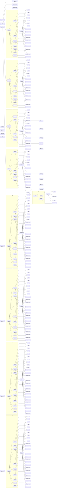

```mermaid
flowchart LR
  subgraph path2 [Path]
    2["Path<br>[1186, 1232, 0]"]
    3["Segment<br>[1240, 1262, 0]"]
    4["Segment<br>[1270, 1300, 0]"]
    5["Segment<br>[1308, 1352, 0]"]
    6["Segment<br>[1360, 1387, 0]"]
    7["Segment<br>[1395, 1439, 0]"]
    8["Segment<br>[1447, 1454, 0]"]
    9[Solid2d]
  end
  subgraph path29 [Path]
    29["Path<br>[1186, 1232, 0]"]
    30["Segment<br>[1240, 1262, 0]"]
    31["Segment<br>[1270, 1300, 0]"]
    32["Segment<br>[1308, 1352, 0]"]
    33["Segment<br>[1360, 1387, 0]"]
    34["Segment<br>[1395, 1439, 0]"]
    35["Segment<br>[1447, 1454, 0]"]
    36[Solid2d]
  end
  subgraph path56 [Path]
    56["Path<br>[2525, 2613, 0]"]
    57["Segment<br>[2619, 2683, 0]"]
    58["Segment<br>[2689, 2753, 0]"]
    59["Segment<br>[2759, 2812, 0]"]
    60["Segment<br>[2818, 2839, 0]"]
    61[Solid2d]
  end
  subgraph path81 [Path]
    81["Path<br>[3164, 3329, 0]"]
    82["Segment<br>[3164, 3329, 0]"]
    83[Solid2d]
  end
  subgraph path93 [Path]
    93["Path<br>[4698, 4723, 0]"]
    94["Segment<br>[4729, 4801, 0]"]
    95["Segment<br>[4807, 4880, 0]"]
    96["Segment<br>[4886, 4939, 0]"]
    97["Segment<br>[4945, 4966, 0]"]
    98[Solid2d]
  end
  subgraph path119 [Path]
    119["Path<br>[5434, 5459, 0]"]
    120["Segment<br>[5519, 5562, 0]"]
    121["Segment<br>[5570, 5679, 0]"]
    122["Segment<br>[5754, 5803, 0]"]
    123["Segment<br>[5811, 5836, 0]"]
    124["Segment<br>[5844, 5887, 0]"]
    125["Segment<br>[5895, 5920, 0]"]
    126["Segment<br>[5928, 5972, 0]"]
    127["Segment<br>[5980, 5987, 0]"]
    128[Solid2d]
  end
  subgraph path157 [Path]
    157["Path<br>[5434, 5459, 0]"]
    158["Segment<br>[5519, 5562, 0]"]
    159["Segment<br>[5570, 5679, 0]"]
    160["Segment<br>[5754, 5803, 0]"]
    161["Segment<br>[5811, 5836, 0]"]
    162["Segment<br>[5844, 5887, 0]"]
    163["Segment<br>[5895, 5920, 0]"]
    164["Segment<br>[5928, 5972, 0]"]
    165["Segment<br>[5980, 5987, 0]"]
    166[Solid2d]
  end
  subgraph path195 [Path]
    195["Path<br>[5434, 5459, 0]"]
    196["Segment<br>[5519, 5562, 0]"]
    197["Segment<br>[5570, 5679, 0]"]
    198["Segment<br>[5754, 5803, 0]"]
    199["Segment<br>[5811, 5836, 0]"]
    200["Segment<br>[5844, 5887, 0]"]
    201["Segment<br>[5895, 5920, 0]"]
    202["Segment<br>[5928, 5972, 0]"]
    203["Segment<br>[5980, 5987, 0]"]
    204[Solid2d]
  end
  subgraph path233 [Path]
    233["Path<br>[5434, 5459, 0]"]
    234["Segment<br>[5519, 5562, 0]"]
    235["Segment<br>[5570, 5679, 0]"]
    236["Segment<br>[5754, 5803, 0]"]
    237["Segment<br>[5811, 5836, 0]"]
    238["Segment<br>[5844, 5887, 0]"]
    239["Segment<br>[5895, 5920, 0]"]
    240["Segment<br>[5928, 5972, 0]"]
    241["Segment<br>[5980, 5987, 0]"]
    242[Solid2d]
  end
  1["Plane<br>[1540, 1589, 0]"]
  10["Sweep Extrusion<br>[1527, 1632, 0]"]
  11[Wall]
  12[Wall]
  13[Wall]
  14[Wall]
  15[Wall]
  16["Cap Start"]
  17["Cap End"]
  18["SweepEdge Opposite"]
  19["SweepEdge Adjacent"]
  20["SweepEdge Opposite"]
  21["SweepEdge Adjacent"]
  22["SweepEdge Opposite"]
  23["SweepEdge Adjacent"]
  24["SweepEdge Opposite"]
  25["SweepEdge Adjacent"]
  26["SweepEdge Opposite"]
  27["SweepEdge Adjacent"]
  28["Plane<br>[2175, 2224, 0]"]
  37["Sweep Revolve<br>[2129, 2226, 0]"]
  38[Wall]
  39[Wall]
  40[Wall]
  41[Wall]
  42[Wall]
  43["Cap Start"]
  44["Cap End"]
  45["SweepEdge Opposite"]
  46["SweepEdge Adjacent"]
  47["SweepEdge Opposite"]
  48["SweepEdge Adjacent"]
  49["SweepEdge Opposite"]
  50["SweepEdge Adjacent"]
  51["SweepEdge Opposite"]
  52["SweepEdge Adjacent"]
  53["SweepEdge Opposite"]
  54["SweepEdge Adjacent"]
  55["Plane<br>[2500, 2519, 0]"]
  62["Sweep Extrusion<br>[2845, 2869, 0]"]
  63[Wall]
  64[Wall]
  65[Wall]
  66[Wall]
  67["Cap Start"]
  68["Cap End"]
  69["SweepEdge Opposite"]
  70["SweepEdge Adjacent"]
  71["SweepEdge Opposite"]
  72["SweepEdge Adjacent"]
  73["SweepEdge Opposite"]
  74["SweepEdge Adjacent"]
  75["SweepEdge Opposite"]
  76["SweepEdge Adjacent"]
  77["EdgeCut Fillet<br>[2875, 3104, 0]"]
  78["EdgeCut Fillet<br>[2875, 3104, 0]"]
  79["EdgeCut Fillet<br>[2875, 3104, 0]"]
  80["EdgeCut Fillet<br>[2875, 3104, 0]"]
  84["Sweep Extrusion<br>[3550, 3577, 0]"]
  85[Wall]
  86["Cap Start"]
  87["SweepEdge Opposite"]
  88["SweepEdge Adjacent"]
  89["Sweep Extrusion<br>[3550, 3577, 0]"]
  90["Sweep Extrusion<br>[3550, 3577, 0]"]
  91["Sweep Extrusion<br>[3550, 3577, 0]"]
  92["Plane<br>[4657, 4691, 0]"]
  99["Sweep Extrusion<br>[4972, 5016, 0]"]
  100[Wall]
  101[Wall]
  102[Wall]
  103[Wall]
  104["Cap Start"]
  105["Cap End"]
  106["SweepEdge Opposite"]
  107["SweepEdge Adjacent"]
  108["SweepEdge Opposite"]
  109["SweepEdge Adjacent"]
  110["SweepEdge Opposite"]
  111["SweepEdge Adjacent"]
  112["SweepEdge Opposite"]
  113["SweepEdge Adjacent"]
  114["EdgeCut Fillet<br>[5022, 5254, 0]"]
  115["EdgeCut Fillet<br>[5022, 5254, 0]"]
  116["EdgeCut Fillet<br>[5022, 5254, 0]"]
  117["EdgeCut Fillet<br>[5022, 5254, 0]"]
  118["Plane<br>[5406, 5426, 0]"]
  129["Sweep Extrusion<br>[6758, 6870, 0]"]
  130[Wall]
  131[Wall]
  132[Wall]
  133[Wall]
  134[Wall]
  135[Wall]
  136[Wall]
  137[Wall]
  138["Cap Start"]
  139["Cap End"]
  140["SweepEdge Opposite"]
  141["SweepEdge Adjacent"]
  142["SweepEdge Opposite"]
  143["SweepEdge Adjacent"]
  144["SweepEdge Opposite"]
  145["SweepEdge Adjacent"]
  146["SweepEdge Opposite"]
  147["SweepEdge Adjacent"]
  148["SweepEdge Opposite"]
  149["SweepEdge Adjacent"]
  150["SweepEdge Opposite"]
  151["SweepEdge Adjacent"]
  152["SweepEdge Opposite"]
  153["SweepEdge Adjacent"]
  154["SweepEdge Opposite"]
  155["SweepEdge Adjacent"]
  156["Plane<br>[5406, 5426, 0]"]
  167["Sweep Extrusion<br>[6936, 7050, 0]"]
  168[Wall]
  169[Wall]
  170[Wall]
  171[Wall]
  172[Wall]
  173[Wall]
  174[Wall]
  175[Wall]
  176["Cap Start"]
  177["Cap End"]
  178["SweepEdge Opposite"]
  179["SweepEdge Adjacent"]
  180["SweepEdge Opposite"]
  181["SweepEdge Adjacent"]
  182["SweepEdge Opposite"]
  183["SweepEdge Adjacent"]
  184["SweepEdge Opposite"]
  185["SweepEdge Adjacent"]
  186["SweepEdge Opposite"]
  187["SweepEdge Adjacent"]
  188["SweepEdge Opposite"]
  189["SweepEdge Adjacent"]
  190["SweepEdge Opposite"]
  191["SweepEdge Adjacent"]
  192["SweepEdge Opposite"]
  193["SweepEdge Adjacent"]
  194["Plane<br>[5406, 5426, 0]"]
  205["Sweep Revolve<br>[7890, 7949, 0]"]
  206[Wall]
  207[Wall]
  208[Wall]
  209[Wall]
  210[Wall]
  211[Wall]
  212[Wall]
  213[Wall]
  214["Cap Start"]
  215["Cap End"]
  216["SweepEdge Opposite"]
  217["SweepEdge Adjacent"]
  218["SweepEdge Opposite"]
  219["SweepEdge Adjacent"]
  220["SweepEdge Opposite"]
  221["SweepEdge Adjacent"]
  222["SweepEdge Opposite"]
  223["SweepEdge Adjacent"]
  224["SweepEdge Opposite"]
  225["SweepEdge Adjacent"]
  226["SweepEdge Opposite"]
  227["SweepEdge Adjacent"]
  228["SweepEdge Opposite"]
  229["SweepEdge Adjacent"]
  230["SweepEdge Opposite"]
  231["SweepEdge Adjacent"]
  232["Plane<br>[5406, 5426, 0]"]
  243["Sweep Revolve<br>[8011, 8069, 0]"]
  244[Wall]
  245[Wall]
  246[Wall]
  247[Wall]
  248[Wall]
  249[Wall]
  250[Wall]
  251[Wall]
  252["Cap Start"]
  253["Cap End"]
  254["SweepEdge Opposite"]
  255["SweepEdge Adjacent"]
  256["SweepEdge Opposite"]
  257["SweepEdge Adjacent"]
  258["SweepEdge Opposite"]
  259["SweepEdge Adjacent"]
  260["SweepEdge Opposite"]
  261["SweepEdge Adjacent"]
  262["SweepEdge Opposite"]
  263["SweepEdge Adjacent"]
  264["SweepEdge Opposite"]
  265["SweepEdge Adjacent"]
  266["SweepEdge Opposite"]
  267["SweepEdge Adjacent"]
  268["SweepEdge Opposite"]
  269["SweepEdge Adjacent"]
  270["StartSketchOnPlane<br>[1158, 1178, 0]"]
  271["StartSketchOnPlane<br>[1158, 1178, 0]"]
  272["StartSketchOnFace<br>[3121, 3158, 0]"]
  273["StartSketchOnPlane<br>[4643, 4692, 0]"]
  1 --- 2
  2 --- 3
  2 --- 4
  2 --- 5
  2 --- 6
  2 --- 7
  2 --- 8
  2 ---- 10
  2 --- 9
  3 --- 11
  3 --- 18
  3 --- 19
  4 --- 12
  4 --- 20
  4 --- 21
  5 --- 13
  5 --- 22
  5 --- 23
  6 --- 14
  6 --- 24
  6 --- 25
  7 --- 15
  7 --- 26
  7 --- 27
  10 --- 11
  10 --- 12
  10 --- 13
  10 --- 14
  10 --- 15
  10 --- 16
  10 --- 17
  10 --- 18
  10 --- 19
  10 --- 20
  10 --- 21
  10 --- 22
  10 --- 23
  10 --- 24
  10 --- 25
  10 --- 26
  10 --- 27
  28 --- 29
  29 --- 30
  29 --- 31
  29 --- 32
  29 --- 33
  29 --- 34
  29 --- 35
  29 ---- 37
  29 --- 36
  30 --- 38
  30 --- 45
  30 --- 46
  31 --- 39
  31 --- 47
  31 --- 48
  32 --- 40
  32 --- 49
  32 --- 50
  33 --- 41
  33 --- 51
  33 --- 52
  34 --- 42
  34 --- 53
  34 --- 54
  37 --- 38
  37 --- 39
  37 --- 40
  37 --- 41
  37 --- 42
  37 --- 43
  37 --- 44
  37 --- 45
  37 --- 46
  37 --- 47
  37 --- 48
  37 --- 49
  37 --- 50
  37 --- 51
  37 --- 52
  37 --- 53
  37 --- 54
  55 --- 56
  56 --- 57
  56 --- 58
  56 --- 59
  56 --- 60
  56 ---- 62
  56 --- 61
  57 --- 63
  57 --- 69
  57 --- 70
  58 --- 64
  58 --- 71
  58 --- 72
  59 --- 65
  59 --- 73
  59 --- 74
  60 --- 66
  60 --- 75
  60 --- 76
  62 --- 63
  62 --- 64
  62 --- 65
  62 --- 66
  62 --- 67
  62 --- 68
  62 --- 69
  62 --- 70
  62 --- 71
  62 --- 72
  62 --- 73
  62 --- 74
  62 --- 75
  62 --- 76
  67 --- 81
  70 <--x 77
  76 <--x 78
  74 <--x 79
  72 <--x 80
  81 --- 82
  81 ---- 84
  81 --- 83
  82 --- 85
  82 --- 87
  82 --- 88
  84 --- 85
  84 --- 86
  84 --- 87
  84 --- 88
  92 --- 93
  93 --- 94
  93 --- 95
  93 --- 96
  93 --- 97
  93 ---- 99
  93 --- 98
  94 --- 100
  94 --- 106
  94 --- 107
  95 --- 101
  95 --- 108
  95 --- 109
  96 --- 102
  96 --- 110
  96 --- 111
  97 --- 103
  97 --- 112
  97 --- 113
  99 --- 100
  99 --- 101
  99 --- 102
  99 --- 103
  99 --- 104
  99 --- 105
  99 --- 106
  99 --- 107
  99 --- 108
  99 --- 109
  99 --- 110
  99 --- 111
  99 --- 112
  99 --- 113
  107 <--x 114
  113 <--x 115
  111 <--x 116
  109 <--x 117
  118 --- 119
  119 --- 120
  119 --- 121
  119 --- 122
  119 --- 123
  119 --- 124
  119 --- 125
  119 --- 126
  119 --- 127
  119 ---- 129
  119 --- 128
  120 --- 137
  120 --- 154
  120 --- 155
  121 --- 136
  121 --- 152
  121 --- 153
  122 --- 135
  122 --- 150
  122 --- 151
  123 --- 134
  123 --- 148
  123 --- 149
  124 --- 133
  124 --- 146
  124 --- 147
  125 --- 132
  125 --- 144
  125 --- 145
  126 --- 131
  126 --- 142
  126 --- 143
  127 --- 130
  127 --- 140
  127 --- 141
  129 --- 130
  129 --- 131
  129 --- 132
  129 --- 133
  129 --- 134
  129 --- 135
  129 --- 136
  129 --- 137
  129 --- 138
  129 --- 139
  129 --- 140
  129 --- 141
  129 --- 142
  129 --- 143
  129 --- 144
  129 --- 145
  129 --- 146
  129 --- 147
  129 --- 148
  129 --- 149
  129 --- 150
  129 --- 151
  129 --- 152
  129 --- 153
  129 --- 154
  129 --- 155
  156 --- 157
  157 --- 158
  157 --- 159
  157 --- 160
  157 --- 161
  157 --- 162
  157 --- 163
  157 --- 164
  157 --- 165
  157 ---- 167
  157 --- 166
  158 --- 168
  158 --- 178
  158 --- 179
  159 --- 169
  159 --- 180
  159 --- 181
  160 --- 170
  160 --- 182
  160 --- 183
  161 --- 171
  161 --- 184
  161 --- 185
  162 --- 172
  162 --- 186
  162 --- 187
  163 --- 173
  163 --- 188
  163 --- 189
  164 --- 174
  164 --- 190
  164 --- 191
  165 --- 175
  165 --- 192
  165 --- 193
  167 --- 168
  167 --- 169
  167 --- 170
  167 --- 171
  167 --- 172
  167 --- 173
  167 --- 174
  167 --- 175
  167 --- 176
  167 --- 177
  167 --- 178
  167 --- 179
  167 --- 180
  167 --- 181
  167 --- 182
  167 --- 183
  167 --- 184
  167 --- 185
  167 --- 186
  167 --- 187
  167 --- 188
  167 --- 189
  167 --- 190
  167 --- 191
  167 --- 192
  167 --- 193
  194 --- 195
  195 --- 196
  195 --- 197
  195 --- 198
  195 --- 199
  195 --- 200
  195 --- 201
  195 --- 202
  195 --- 203
  195 ---- 205
  195 --- 204
  196 --- 206
  196 --- 216
  196 --- 217
  197 --- 207
  197 --- 218
  197 --- 219
  198 --- 208
  198 --- 220
  198 --- 221
  199 --- 209
  199 --- 222
  199 --- 223
  200 --- 210
  200 --- 224
  200 --- 225
  201 --- 211
  201 --- 226
  201 --- 227
  202 --- 212
  202 --- 228
  202 --- 229
  203 --- 213
  203 --- 230
  203 --- 231
  205 --- 206
  205 --- 207
  205 --- 208
  205 --- 209
  205 --- 210
  205 --- 211
  205 --- 212
  205 --- 213
  205 --- 214
  205 --- 215
  205 --- 216
  205 --- 217
  205 --- 218
  205 --- 219
  205 --- 220
  205 --- 221
  205 --- 222
  205 --- 223
  205 --- 224
  205 --- 225
  205 --- 226
  205 --- 227
  205 --- 228
  205 --- 229
  205 --- 230
  205 --- 231
  232 --- 233
  233 --- 234
  233 --- 235
  233 --- 236
  233 --- 237
  233 --- 238
  233 --- 239
  233 --- 240
  233 --- 241
  233 ---- 243
  233 --- 242
  234 --- 244
  234 --- 254
  234 --- 255
  235 --- 245
  235 --- 256
  235 --- 257
  236 --- 246
  236 --- 258
  236 --- 259
  237 --- 247
  237 --- 260
  237 --- 261
  238 --- 248
  238 --- 262
  238 --- 263
  239 --- 249
  239 --- 264
  239 --- 265
  240 --- 250
  240 --- 266
  240 --- 267
  241 --- 251
  241 --- 268
  241 --- 269
  243 --- 244
  243 --- 245
  243 --- 246
  243 --- 247
  243 --- 248
  243 --- 249
  243 --- 250
  243 --- 251
  243 --- 252
  243 --- 253
  243 --- 254
  243 --- 255
  243 --- 256
  243 --- 257
  243 --- 258
  243 --- 259
  243 --- 260
  243 --- 261
  243 --- 262
  243 --- 263
  243 --- 264
  243 --- 265
  243 --- 266
  243 --- 267
  243 --- 268
  243 --- 269
  1 <--x 270
  28 <--x 271
  67 <--x 272
  92 <--x 273
```
