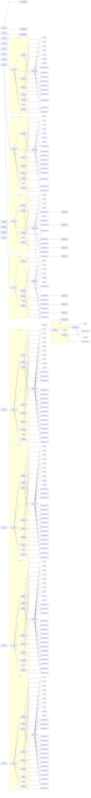

```mermaid
flowchart LR
  subgraph path8 [Path]
    8["Path<br>[1186, 1232, 0]"]
    9["Segment<br>[1240, 1262, 0]"]
    10["Segment<br>[1270, 1300, 0]"]
    11["Segment<br>[1308, 1367, 0]"]
    12["Segment<br>[1375, 1402, 0]"]
    13["Segment<br>[1410, 1469, 0]"]
    14["Segment<br>[1477, 1484, 0]"]
    15[Solid2d]
  end
  subgraph path35 [Path]
    35["Path<br>[1186, 1232, 0]"]
    36["Segment<br>[1240, 1262, 0]"]
    37["Segment<br>[1270, 1300, 0]"]
    38["Segment<br>[1308, 1367, 0]"]
    39["Segment<br>[1375, 1402, 0]"]
    40["Segment<br>[1410, 1469, 0]"]
    41["Segment<br>[1477, 1484, 0]"]
    42[Solid2d]
  end
  subgraph path61 [Path]
    61["Path<br>[2555, 2643, 0]"]
    62["Segment<br>[2649, 2713, 0]"]
    63["Segment<br>[2719, 2783, 0]"]
    64["Segment<br>[2789, 2842, 0]"]
    65["Segment<br>[2848, 2869, 0]"]
    66[Solid2d]
  end
  subgraph path86 [Path]
    86["Path<br>[3194, 3359, 0]"]
    87["Segment<br>[3194, 3359, 0]"]
    88[Solid2d]
  end
  subgraph path98 [Path]
    98["Path<br>[4728, 4753, 0]"]
    99["Segment<br>[4759, 4831, 0]"]
    100["Segment<br>[4837, 4910, 0]"]
    101["Segment<br>[4916, 4969, 0]"]
    102["Segment<br>[4975, 4996, 0]"]
    103[Solid2d]
  end
  subgraph path124 [Path]
    124["Path<br>[5464, 5489, 0]"]
    125["Segment<br>[5549, 5592, 0]"]
    126["Segment<br>[5600, 5709, 0]"]
    127["Segment<br>[5784, 5833, 0]"]
    128["Segment<br>[5841, 5866, 0]"]
    129["Segment<br>[5874, 5932, 0]"]
    130["Segment<br>[5940, 5965, 0]"]
    131["Segment<br>[5973, 6032, 0]"]
    132["Segment<br>[6040, 6047, 0]"]
    133[Solid2d]
  end
  subgraph path162 [Path]
    162["Path<br>[5464, 5489, 0]"]
    163["Segment<br>[5549, 5592, 0]"]
    164["Segment<br>[5600, 5709, 0]"]
    165["Segment<br>[5784, 5833, 0]"]
    166["Segment<br>[5841, 5866, 0]"]
    167["Segment<br>[5874, 5932, 0]"]
    168["Segment<br>[5940, 5965, 0]"]
    169["Segment<br>[5973, 6032, 0]"]
    170["Segment<br>[6040, 6047, 0]"]
    171[Solid2d]
  end
  subgraph path200 [Path]
    200["Path<br>[5464, 5489, 0]"]
    201["Segment<br>[5549, 5592, 0]"]
    202["Segment<br>[5600, 5709, 0]"]
    203["Segment<br>[5784, 5833, 0]"]
    204["Segment<br>[5841, 5866, 0]"]
    205["Segment<br>[5874, 5932, 0]"]
    206["Segment<br>[5940, 5965, 0]"]
    207["Segment<br>[5973, 6032, 0]"]
    208["Segment<br>[6040, 6047, 0]"]
    209[Solid2d]
  end
  subgraph path238 [Path]
    238["Path<br>[5464, 5489, 0]"]
    239["Segment<br>[5549, 5592, 0]"]
    240["Segment<br>[5600, 5709, 0]"]
    241["Segment<br>[5784, 5833, 0]"]
    242["Segment<br>[5841, 5866, 0]"]
    243["Segment<br>[5874, 5932, 0]"]
    244["Segment<br>[5940, 5965, 0]"]
    245["Segment<br>[5973, 6032, 0]"]
    246["Segment<br>[6040, 6047, 0]"]
    247[Solid2d]
  end
  1["Plane<br>[1570, 1619, 0]"]
  2["Plane<br>[1570, 1619, 0]"]
  3["Plane<br>[1570, 1619, 0]"]
  4["Plane<br>[1570, 1619, 0]"]
  5["Plane<br>[1570, 1619, 0]"]
  6["Plane<br>[1570, 1619, 0]"]
  7["Plane<br>[1570, 1619, 0]"]
  16["Sweep Extrusion<br>[1557, 1662, 0]"]
  17[Wall]
  18[Wall]
  19[Wall]
  20[Wall]
  21[Wall]
  22["Cap Start"]
  23["Cap End"]
  24["SweepEdge Opposite"]
  25["SweepEdge Adjacent"]
  26["SweepEdge Opposite"]
  27["SweepEdge Adjacent"]
  28["SweepEdge Opposite"]
  29["SweepEdge Adjacent"]
  30["SweepEdge Opposite"]
  31["SweepEdge Adjacent"]
  32["SweepEdge Opposite"]
  33["SweepEdge Adjacent"]
  34["Plane<br>[2205, 2254, 0]"]
  43["Sweep Revolve<br>[2159, 2256, 0]"]
  44[Wall]
  45[Wall]
  46[Wall]
  47[Wall]
  48[Wall]
  49["Cap Start"]
  50["Cap End"]
  51["SweepEdge Opposite"]
  52["SweepEdge Adjacent"]
  53["SweepEdge Opposite"]
  54["SweepEdge Adjacent"]
  55["SweepEdge Opposite"]
  56["SweepEdge Adjacent"]
  57["SweepEdge Opposite"]
  58["SweepEdge Adjacent"]
  59["SweepEdge Opposite"]
  60["SweepEdge Adjacent"]
  67["Sweep Extrusion<br>[2875, 2899, 0]"]
  68[Wall]
  69[Wall]
  70[Wall]
  71[Wall]
  72["Cap Start"]
  73["Cap End"]
  74["SweepEdge Opposite"]
  75["SweepEdge Adjacent"]
  76["SweepEdge Opposite"]
  77["SweepEdge Adjacent"]
  78["SweepEdge Opposite"]
  79["SweepEdge Adjacent"]
  80["SweepEdge Opposite"]
  81["SweepEdge Adjacent"]
  82["EdgeCut Fillet<br>[2905, 3134, 0]"]
  83["EdgeCut Fillet<br>[2905, 3134, 0]"]
  84["EdgeCut Fillet<br>[2905, 3134, 0]"]
  85["EdgeCut Fillet<br>[2905, 3134, 0]"]
  89["Sweep Extrusion<br>[3580, 3607, 0]"]
  90[Wall]
  91["Cap Start"]
  92["SweepEdge Opposite"]
  93["SweepEdge Adjacent"]
  94["Sweep Extrusion<br>[3580, 3607, 0]"]
  95["Sweep Extrusion<br>[3580, 3607, 0]"]
  96["Sweep Extrusion<br>[3580, 3607, 0]"]
  97["Plane<br>[4687, 4721, 0]"]
  104["Sweep Extrusion<br>[5002, 5046, 0]"]
  105[Wall]
  106[Wall]
  107[Wall]
  108[Wall]
  109["Cap Start"]
  110["Cap End"]
  111["SweepEdge Opposite"]
  112["SweepEdge Adjacent"]
  113["SweepEdge Opposite"]
  114["SweepEdge Adjacent"]
  115["SweepEdge Opposite"]
  116["SweepEdge Adjacent"]
  117["SweepEdge Opposite"]
  118["SweepEdge Adjacent"]
  119["EdgeCut Fillet<br>[5052, 5284, 0]"]
  120["EdgeCut Fillet<br>[5052, 5284, 0]"]
  121["EdgeCut Fillet<br>[5052, 5284, 0]"]
  122["EdgeCut Fillet<br>[5052, 5284, 0]"]
  123["Plane<br>[5436, 5456, 0]"]
  134["Sweep Extrusion<br>[6818, 6930, 0]"]
  135[Wall]
  136[Wall]
  137[Wall]
  138[Wall]
  139[Wall]
  140[Wall]
  141[Wall]
  142[Wall]
  143["Cap Start"]
  144["Cap End"]
  145["SweepEdge Opposite"]
  146["SweepEdge Adjacent"]
  147["SweepEdge Opposite"]
  148["SweepEdge Adjacent"]
  149["SweepEdge Opposite"]
  150["SweepEdge Adjacent"]
  151["SweepEdge Opposite"]
  152["SweepEdge Adjacent"]
  153["SweepEdge Opposite"]
  154["SweepEdge Adjacent"]
  155["SweepEdge Opposite"]
  156["SweepEdge Adjacent"]
  157["SweepEdge Opposite"]
  158["SweepEdge Adjacent"]
  159["SweepEdge Opposite"]
  160["SweepEdge Adjacent"]
  161["Plane<br>[5436, 5456, 0]"]
  172["Sweep Extrusion<br>[6996, 7110, 0]"]
  173[Wall]
  174[Wall]
  175[Wall]
  176[Wall]
  177[Wall]
  178[Wall]
  179[Wall]
  180[Wall]
  181["Cap Start"]
  182["Cap End"]
  183["SweepEdge Opposite"]
  184["SweepEdge Adjacent"]
  185["SweepEdge Opposite"]
  186["SweepEdge Adjacent"]
  187["SweepEdge Opposite"]
  188["SweepEdge Adjacent"]
  189["SweepEdge Opposite"]
  190["SweepEdge Adjacent"]
  191["SweepEdge Opposite"]
  192["SweepEdge Adjacent"]
  193["SweepEdge Opposite"]
  194["SweepEdge Adjacent"]
  195["SweepEdge Opposite"]
  196["SweepEdge Adjacent"]
  197["SweepEdge Opposite"]
  198["SweepEdge Adjacent"]
  199["Plane<br>[5436, 5456, 0]"]
  210["Sweep Revolve<br>[7950, 8009, 0]"]
  211[Wall]
  212[Wall]
  213[Wall]
  214[Wall]
  215[Wall]
  216[Wall]
  217[Wall]
  218[Wall]
  219["Cap Start"]
  220["Cap End"]
  221["SweepEdge Opposite"]
  222["SweepEdge Adjacent"]
  223["SweepEdge Opposite"]
  224["SweepEdge Adjacent"]
  225["SweepEdge Opposite"]
  226["SweepEdge Adjacent"]
  227["SweepEdge Opposite"]
  228["SweepEdge Adjacent"]
  229["SweepEdge Opposite"]
  230["SweepEdge Adjacent"]
  231["SweepEdge Opposite"]
  232["SweepEdge Adjacent"]
  233["SweepEdge Opposite"]
  234["SweepEdge Adjacent"]
  235["SweepEdge Opposite"]
  236["SweepEdge Adjacent"]
  237["Plane<br>[5436, 5456, 0]"]
  248["Sweep Revolve<br>[8071, 8129, 0]"]
  249[Wall]
  250[Wall]
  251[Wall]
  252[Wall]
  253[Wall]
  254[Wall]
  255[Wall]
  256[Wall]
  257["Cap Start"]
  258["Cap End"]
  259["SweepEdge Opposite"]
  260["SweepEdge Adjacent"]
  261["SweepEdge Opposite"]
  262["SweepEdge Adjacent"]
  263["SweepEdge Opposite"]
  264["SweepEdge Adjacent"]
  265["SweepEdge Opposite"]
  266["SweepEdge Adjacent"]
  267["SweepEdge Opposite"]
  268["SweepEdge Adjacent"]
  269["SweepEdge Opposite"]
  270["SweepEdge Adjacent"]
  271["SweepEdge Opposite"]
  272["SweepEdge Adjacent"]
  273["SweepEdge Opposite"]
  274["SweepEdge Adjacent"]
  275["StartSketchOnPlane<br>[1158, 1178, 0]"]
  276["StartSketchOnPlane<br>[1158, 1178, 0]"]
  277["StartSketchOnFace<br>[3151, 3188, 0]"]
  278["StartSketchOnPlane<br>[4673, 4722, 0]"]
  1 --- 61
  7 --- 8
  8 --- 9
  8 --- 10
  8 --- 11
  8 --- 12
  8 --- 13
  8 --- 14
  8 ---- 16
  8 --- 15
  9 --- 17
  9 --- 24
  9 --- 25
  10 --- 18
  10 --- 26
  10 --- 27
  11 --- 19
  11 --- 28
  11 --- 29
  12 --- 20
  12 --- 30
  12 --- 31
  13 --- 21
  13 --- 32
  13 --- 33
  16 --- 17
  16 --- 18
  16 --- 19
  16 --- 20
  16 --- 21
  16 --- 22
  16 --- 23
  16 --- 24
  16 --- 25
  16 --- 26
  16 --- 27
  16 --- 28
  16 --- 29
  16 --- 30
  16 --- 31
  16 --- 32
  16 --- 33
  34 --- 35
  35 --- 36
  35 --- 37
  35 --- 38
  35 --- 39
  35 --- 40
  35 --- 41
  35 ---- 43
  35 --- 42
  36 --- 44
  36 --- 51
  36 --- 52
  37 --- 45
  37 --- 53
  37 --- 54
  38 --- 46
  38 --- 55
  38 --- 56
  39 --- 47
  39 --- 57
  39 --- 58
  40 --- 48
  40 --- 59
  40 --- 60
  43 --- 44
  43 --- 45
  43 --- 46
  43 --- 47
  43 --- 48
  43 --- 49
  43 --- 50
  43 --- 51
  43 --- 52
  43 --- 53
  43 --- 54
  43 --- 55
  43 --- 56
  43 --- 57
  43 --- 58
  43 --- 59
  43 --- 60
  61 --- 62
  61 --- 63
  61 --- 64
  61 --- 65
  61 ---- 67
  61 --- 66
  62 --- 68
  62 --- 74
  62 --- 75
  63 --- 69
  63 --- 76
  63 --- 77
  64 --- 70
  64 --- 78
  64 --- 79
  65 --- 71
  65 --- 80
  65 --- 81
  67 --- 68
  67 --- 69
  67 --- 70
  67 --- 71
  67 --- 72
  67 --- 73
  67 --- 74
  67 --- 75
  67 --- 76
  67 --- 77
  67 --- 78
  67 --- 79
  67 --- 80
  67 --- 81
  72 --- 86
  75 <--x 82
  81 <--x 83
  79 <--x 84
  77 <--x 85
  86 --- 87
  86 ---- 89
  86 --- 88
  87 --- 90
  87 --- 92
  87 --- 93
  89 --- 90
  89 --- 91
  89 --- 92
  89 --- 93
  97 --- 98
  98 --- 99
  98 --- 100
  98 --- 101
  98 --- 102
  98 ---- 104
  98 --- 103
  99 --- 105
  99 --- 111
  99 --- 112
  100 --- 106
  100 --- 113
  100 --- 114
  101 --- 107
  101 --- 115
  101 --- 116
  102 --- 108
  102 --- 117
  102 --- 118
  104 --- 105
  104 --- 106
  104 --- 107
  104 --- 108
  104 --- 109
  104 --- 110
  104 --- 111
  104 --- 112
  104 --- 113
  104 --- 114
  104 --- 115
  104 --- 116
  104 --- 117
  104 --- 118
  112 <--x 119
  118 <--x 120
  116 <--x 121
  114 <--x 122
  123 --- 124
  124 --- 125
  124 --- 126
  124 --- 127
  124 --- 128
  124 --- 129
  124 --- 130
  124 --- 131
  124 --- 132
  124 ---- 134
  124 --- 133
  125 --- 142
  125 --- 159
  125 --- 160
  126 --- 141
  126 --- 157
  126 --- 158
  127 --- 140
  127 --- 155
  127 --- 156
  128 --- 139
  128 --- 153
  128 --- 154
  129 --- 138
  129 --- 151
  129 --- 152
  130 --- 137
  130 --- 149
  130 --- 150
  131 --- 136
  131 --- 147
  131 --- 148
  132 --- 135
  132 --- 145
  132 --- 146
  134 --- 135
  134 --- 136
  134 --- 137
  134 --- 138
  134 --- 139
  134 --- 140
  134 --- 141
  134 --- 142
  134 --- 143
  134 --- 144
  134 --- 145
  134 --- 146
  134 --- 147
  134 --- 148
  134 --- 149
  134 --- 150
  134 --- 151
  134 --- 152
  134 --- 153
  134 --- 154
  134 --- 155
  134 --- 156
  134 --- 157
  134 --- 158
  134 --- 159
  134 --- 160
  161 --- 162
  162 --- 163
  162 --- 164
  162 --- 165
  162 --- 166
  162 --- 167
  162 --- 168
  162 --- 169
  162 --- 170
  162 ---- 172
  162 --- 171
  163 --- 173
  163 --- 183
  163 --- 184
  164 --- 174
  164 --- 185
  164 --- 186
  165 --- 175
  165 --- 187
  165 --- 188
  166 --- 176
  166 --- 189
  166 --- 190
  167 --- 177
  167 --- 191
  167 --- 192
  168 --- 178
  168 --- 193
  168 --- 194
  169 --- 179
  169 --- 195
  169 --- 196
  170 --- 180
  170 --- 197
  170 --- 198
  172 --- 173
  172 --- 174
  172 --- 175
  172 --- 176
  172 --- 177
  172 --- 178
  172 --- 179
  172 --- 180
  172 --- 181
  172 --- 182
  172 --- 183
  172 --- 184
  172 --- 185
  172 --- 186
  172 --- 187
  172 --- 188
  172 --- 189
  172 --- 190
  172 --- 191
  172 --- 192
  172 --- 193
  172 --- 194
  172 --- 195
  172 --- 196
  172 --- 197
  172 --- 198
  199 --- 200
  200 --- 201
  200 --- 202
  200 --- 203
  200 --- 204
  200 --- 205
  200 --- 206
  200 --- 207
  200 --- 208
  200 ---- 210
  200 --- 209
  201 --- 211
  201 --- 221
  201 --- 222
  202 --- 212
  202 --- 223
  202 --- 224
  203 --- 213
  203 --- 225
  203 --- 226
  204 --- 214
  204 --- 227
  204 --- 228
  205 --- 215
  205 --- 229
  205 --- 230
  206 --- 216
  206 --- 231
  206 --- 232
  207 --- 217
  207 --- 233
  207 --- 234
  208 --- 218
  208 --- 235
  208 --- 236
  210 --- 211
  210 --- 212
  210 --- 213
  210 --- 214
  210 --- 215
  210 --- 216
  210 --- 217
  210 --- 218
  210 --- 219
  210 --- 220
  210 --- 221
  210 --- 222
  210 --- 223
  210 --- 224
  210 --- 225
  210 --- 226
  210 --- 227
  210 --- 228
  210 --- 229
  210 --- 230
  210 --- 231
  210 --- 232
  210 --- 233
  210 --- 234
  210 --- 235
  210 --- 236
  237 --- 238
  238 --- 239
  238 --- 240
  238 --- 241
  238 --- 242
  238 --- 243
  238 --- 244
  238 --- 245
  238 --- 246
  238 ---- 248
  238 --- 247
  239 --- 249
  239 --- 259
  239 --- 260
  240 --- 250
  240 --- 261
  240 --- 262
  241 --- 251
  241 --- 263
  241 --- 264
  242 --- 252
  242 --- 265
  242 --- 266
  243 --- 253
  243 --- 267
  243 --- 268
  244 --- 254
  244 --- 269
  244 --- 270
  245 --- 255
  245 --- 271
  245 --- 272
  246 --- 256
  246 --- 273
  246 --- 274
  248 --- 249
  248 --- 250
  248 --- 251
  248 --- 252
  248 --- 253
  248 --- 254
  248 --- 255
  248 --- 256
  248 --- 257
  248 --- 258
  248 --- 259
  248 --- 260
  248 --- 261
  248 --- 262
  248 --- 263
  248 --- 264
  248 --- 265
  248 --- 266
  248 --- 267
  248 --- 268
  248 --- 269
  248 --- 270
  248 --- 271
  248 --- 272
  248 --- 273
  248 --- 274
  7 <--x 275
  34 <--x 276
  72 <--x 277
  97 <--x 278
```
