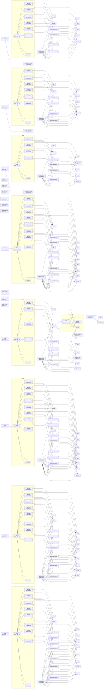

```mermaid
flowchart LR
  subgraph path2 [Path]
    2["Path<br>[1187, 1233, 0]"]
    3["Segment<br>[1241, 1263, 0]"]
    4["Segment<br>[1271, 1301, 0]"]
    5["Segment<br>[1309, 1353, 0]"]
    6["Segment<br>[1361, 1388, 0]"]
    7["Segment<br>[1396, 1440, 0]"]
    8["Segment<br>[1448, 1455, 0]"]
    9[Solid2d]
  end
  subgraph path23 [Path]
    23["Path<br>[1187, 1233, 0]"]
    24["Segment<br>[1241, 1263, 0]"]
    25["Segment<br>[1271, 1301, 0]"]
    26["Segment<br>[1309, 1353, 0]"]
    27["Segment<br>[1361, 1388, 0]"]
    28["Segment<br>[1396, 1440, 0]"]
    29["Segment<br>[1448, 1455, 0]"]
    30[Solid2d]
  end
  subgraph path44 [Path]
    44["Path<br>[2496, 2584, 0]"]
    45["Segment<br>[2590, 2654, 0]"]
    46["Segment<br>[2660, 2724, 0]"]
    47["Segment<br>[2730, 2783, 0]"]
    48["Segment<br>[2789, 2810, 0]"]
    49[Solid2d]
  end
  subgraph path65 [Path]
    65["Path<br>[3141, 3307, 0]"]
    66["Segment<br>[3141, 3307, 0]"]
    67[Solid2d]
  end
  subgraph path75 [Path]
    75["Path<br>[4591, 4616, 0]"]
    76["Segment<br>[4622, 4694, 0]"]
    77["Segment<br>[4700, 4773, 0]"]
    78["Segment<br>[4779, 4832, 0]"]
    79["Segment<br>[4838, 4859, 0]"]
    80[Solid2d]
  end
  subgraph path97 [Path]
    97["Path<br>[5326, 5351, 0]"]
    98["Segment<br>[5411, 5454, 0]"]
    99["Segment<br>[5462, 5582, 0]"]
    100["Segment<br>[5645, 5694, 0]"]
    101["Segment<br>[5702, 5727, 0]"]
    102["Segment<br>[5735, 5778, 0]"]
    103["Segment<br>[5786, 5811, 0]"]
    104["Segment<br>[5819, 5863, 0]"]
    105["Segment<br>[5871, 5878, 0]"]
    106[Solid2d]
  end
  subgraph path126 [Path]
    126["Path<br>[5326, 5351, 0]"]
    127["Segment<br>[5411, 5454, 0]"]
    128["Segment<br>[5462, 5582, 0]"]
    129["Segment<br>[5645, 5694, 0]"]
    130["Segment<br>[5702, 5727, 0]"]
    131["Segment<br>[5735, 5778, 0]"]
    132["Segment<br>[5786, 5811, 0]"]
    133["Segment<br>[5819, 5863, 0]"]
    134["Segment<br>[5871, 5878, 0]"]
    135[Solid2d]
  end
  subgraph path155 [Path]
    155["Path<br>[5326, 5351, 0]"]
    156["Segment<br>[5411, 5454, 0]"]
    157["Segment<br>[5462, 5582, 0]"]
    158["Segment<br>[5645, 5694, 0]"]
    159["Segment<br>[5702, 5727, 0]"]
    160["Segment<br>[5735, 5778, 0]"]
    161["Segment<br>[5786, 5811, 0]"]
    162["Segment<br>[5819, 5863, 0]"]
    163["Segment<br>[5871, 5878, 0]"]
    164[Solid2d]
  end
  subgraph path184 [Path]
    184["Path<br>[5326, 5351, 0]"]
    185["Segment<br>[5411, 5454, 0]"]
    186["Segment<br>[5462, 5582, 0]"]
    187["Segment<br>[5645, 5694, 0]"]
    188["Segment<br>[5702, 5727, 0]"]
    189["Segment<br>[5735, 5778, 0]"]
    190["Segment<br>[5786, 5811, 0]"]
    191["Segment<br>[5819, 5863, 0]"]
    192["Segment<br>[5871, 5878, 0]"]
    193[Solid2d]
  end
  1["Plane<br>[1541, 1588, 0]"]
  10["Sweep Extrusion<br>[1528, 1631, 0]"]
  11[Wall]
  12[Wall]
  13[Wall]
  14[Wall]
  15[Wall]
  16["Cap Start"]
  17["Cap End"]
  18["SweepEdge Opposite"]
  19["SweepEdge Opposite"]
  20["SweepEdge Opposite"]
  21["SweepEdge Opposite"]
  22["Plane<br>[2120, 2167, 0]"]
  31["Sweep Revolve<br>[2107, 2198, 0]"]
  32[Wall]
  33[Wall]
  34[Wall]
  35[Wall]
  36[Wall]
  37["Cap Start"]
  38["Cap End"]
  39["SweepEdge Opposite"]
  40["SweepEdge Opposite"]
  41["SweepEdge Opposite"]
  42["SweepEdge Opposite"]
  43["Plane<br>[2473, 2490, 0]"]
  50["Sweep Extrusion<br>[2816, 2840, 0]"]
  51[Wall]
  52[Wall]
  53[Wall]
  54[Wall]
  55["Cap Start"]
  56["Cap End"]
  57["SweepEdge Opposite"]
  58["SweepEdge Opposite"]
  59["SweepEdge Opposite"]
  60["SweepEdge Adjacent"]
  61["EdgeCut Fillet<br>[2846, 3076, 0]"]
  62["EdgeCut Fillet<br>[2846, 3076, 0]"]
  63["EdgeCut Fillet<br>[2846, 3076, 0]"]
  64["EdgeCut Fillet<br>[2846, 3076, 0]"]
  68["Sweep Extrusion<br>[3529, 3556, 0]"]
  69[Wall]
  70["Cap Start"]
  71["Sweep Extrusion<br>[3529, 3556, 0]"]
  72["Sweep Extrusion<br>[3529, 3556, 0]"]
  73["Sweep Extrusion<br>[3529, 3556, 0]"]
  74["Plane<br>[4552, 4584, 0]"]
  81["Sweep Extrusion<br>[4865, 4909, 0]"]
  82[Wall]
  83[Wall]
  84[Wall]
  85[Wall]
  86["Cap Start"]
  87["Cap End"]
  88["SweepEdge Opposite"]
  89["SweepEdge Opposite"]
  90["SweepEdge Opposite"]
  91["SweepEdge Adjacent"]
  92["EdgeCut Fillet<br>[4915, 5148, 0]"]
  93["EdgeCut Fillet<br>[4915, 5148, 0]"]
  94["EdgeCut Fillet<br>[4915, 5148, 0]"]
  95["EdgeCut Fillet<br>[4915, 5148, 0]"]
  96["Plane<br>[5298, 5318, 0]"]
  107["Sweep Extrusion<br>[6516, 6628, 0]"]
  108[Wall]
  109[Wall]
  110[Wall]
  111[Wall]
  112[Wall]
  113[Wall]
  114[Wall]
  115[Wall]
  116["Cap Start"]
  117["Cap End"]
  118["SweepEdge Opposite"]
  119["SweepEdge Opposite"]
  120["SweepEdge Opposite"]
  121["SweepEdge Opposite"]
  122["SweepEdge Opposite"]
  123["SweepEdge Opposite"]
  124["SweepEdge Opposite"]
  125["Plane<br>[5298, 5318, 0]"]
  136["Sweep Extrusion<br>[6694, 6808, 0]"]
  137[Wall]
  138[Wall]
  139[Wall]
  140[Wall]
  141[Wall]
  142[Wall]
  143[Wall]
  144[Wall]
  145["Cap Start"]
  146["Cap End"]
  147["SweepEdge Opposite"]
  148["SweepEdge Opposite"]
  149["SweepEdge Opposite"]
  150["SweepEdge Opposite"]
  151["SweepEdge Opposite"]
  152["SweepEdge Opposite"]
  153["SweepEdge Opposite"]
  154["Plane<br>[5298, 5318, 0]"]
  165["Sweep Revolve<br>[7634, 7689, 0]"]
  166[Wall]
  167[Wall]
  168[Wall]
  169[Wall]
  170[Wall]
  171[Wall]
  172[Wall]
  173[Wall]
  174["Cap Start"]
  175["Cap End"]
  176["SweepEdge Opposite"]
  177["SweepEdge Opposite"]
  178["SweepEdge Opposite"]
  179["SweepEdge Opposite"]
  180["SweepEdge Opposite"]
  181["SweepEdge Opposite"]
  182["SweepEdge Opposite"]
  183["Plane<br>[5298, 5318, 0]"]
  194["Sweep Revolve<br>[7751, 7805, 0]"]
  195[Wall]
  196[Wall]
  197[Wall]
  198[Wall]
  199[Wall]
  200[Wall]
  201[Wall]
  202[Wall]
  203["Cap Start"]
  204["Cap End"]
  205["SweepEdge Opposite"]
  206["SweepEdge Opposite"]
  207["SweepEdge Opposite"]
  208["SweepEdge Opposite"]
  209["SweepEdge Opposite"]
  210["SweepEdge Opposite"]
  211["SweepEdge Opposite"]
  212["StartSketchOnPlane<br>[1159, 1179, 0]"]
  213["StartSketchOnPlane<br>[1159, 1179, 0]"]
  214["StartSketchOnFace<br>[3093, 3135, 0]"]
  215["StartSketchOnPlane<br>[4538, 4585, 0]"]
  1 --- 2
  2 --- 3
  2 --- 4
  2 --- 5
  2 --- 6
  2 --- 7
  2 --- 8
  2 ---- 10
  2 --- 9
  3 --- 11
  3 x--> 16
  4 --- 12
  4 --- 18
  4 x--> 16
  5 --- 13
  5 --- 19
  5 x--> 16
  6 --- 14
  6 --- 20
  6 x--> 16
  7 --- 15
  7 --- 21
  7 x--> 16
  10 --- 11
  10 --- 12
  10 --- 13
  10 --- 14
  10 --- 15
  10 --- 16
  10 --- 17
  10 --- 18
  10 --- 19
  10 --- 20
  10 --- 21
  18 <--x 12
  18 <--x 17
  19 <--x 13
  19 <--x 17
  20 <--x 14
  20 <--x 17
  21 <--x 15
  21 <--x 17
  22 --- 23
  23 --- 24
  23 --- 25
  23 --- 26
  23 --- 27
  23 --- 28
  23 --- 29
  23 ---- 31
  23 --- 30
  24 --- 32
  24 x--> 37
  25 --- 33
  25 --- 39
  25 x--> 37
  26 --- 34
  26 --- 40
  26 x--> 37
  27 --- 35
  27 --- 41
  27 x--> 37
  28 --- 36
  28 --- 42
  28 x--> 37
  31 --- 32
  31 --- 33
  31 --- 34
  31 --- 35
  31 --- 36
  31 --- 37
  31 --- 38
  31 --- 39
  31 --- 40
  31 --- 41
  31 --- 42
  39 <--x 33
  39 <--x 38
  40 <--x 34
  40 <--x 38
  41 <--x 35
  41 <--x 38
  42 <--x 36
  42 <--x 38
  43 --- 44
  44 --- 45
  44 --- 46
  44 --- 47
  44 --- 48
  44 ---- 50
  44 --- 49
  45 --- 51
  45 --- 60
  45 x--> 55
  46 --- 52
  46 --- 57
  46 x--> 55
  47 --- 53
  47 --- 58
  47 x--> 55
  48 --- 54
  48 --- 59
  48 x--> 55
  50 --- 51
  50 --- 52
  50 --- 53
  50 --- 54
  50 --- 55
  50 --- 56
  50 --- 57
  50 --- 58
  50 --- 59
  50 --- 60
  55 --- 65
  57 <--x 52
  57 <--x 56
  58 <--x 53
  58 <--x 56
  59 <--x 54
  59 <--x 56
  60 <--x 61
  65 --- 66
  65 ---- 68
  65 --- 67
  66 --- 69
  66 <--x 55
  68 --- 69
  68 --- 70
  74 --- 75
  75 --- 76
  75 --- 77
  75 --- 78
  75 --- 79
  75 ---- 81
  75 --- 80
  76 --- 82
  76 --- 91
  76 x--> 86
  77 --- 83
  77 --- 88
  77 x--> 86
  78 --- 84
  78 --- 89
  78 x--> 86
  79 --- 85
  79 --- 90
  79 x--> 86
  81 --- 82
  81 --- 83
  81 --- 84
  81 --- 85
  81 --- 86
  81 --- 87
  81 --- 88
  81 --- 89
  81 --- 90
  81 --- 91
  88 <--x 83
  88 <--x 87
  89 <--x 84
  89 <--x 87
  90 <--x 85
  90 <--x 87
  91 <--x 92
  96 --- 97
  97 --- 98
  97 --- 99
  97 --- 100
  97 --- 101
  97 --- 102
  97 --- 103
  97 --- 104
  97 --- 105
  97 ---- 107
  97 --- 106
  98 --- 115
  98 --- 124
  98 x--> 116
  99 --- 114
  99 --- 123
  99 x--> 116
  100 --- 113
  100 --- 122
  100 x--> 116
  101 --- 112
  101 --- 121
  101 x--> 116
  102 --- 111
  102 --- 120
  102 x--> 116
  103 --- 110
  103 --- 119
  103 x--> 116
  104 --- 109
  104 --- 118
  104 x--> 116
  105 --- 108
  105 x--> 116
  107 --- 108
  107 --- 109
  107 --- 110
  107 --- 111
  107 --- 112
  107 --- 113
  107 --- 114
  107 --- 115
  107 --- 116
  107 --- 117
  107 --- 118
  107 --- 119
  107 --- 120
  107 --- 121
  107 --- 122
  107 --- 123
  107 --- 124
  118 <--x 109
  118 <--x 117
  119 <--x 110
  119 <--x 117
  120 <--x 111
  120 <--x 117
  121 <--x 112
  121 <--x 117
  122 <--x 113
  122 <--x 117
  123 <--x 114
  123 <--x 117
  124 <--x 115
  124 <--x 117
  125 --- 126
  126 --- 127
  126 --- 128
  126 --- 129
  126 --- 130
  126 --- 131
  126 --- 132
  126 --- 133
  126 --- 134
  126 ---- 136
  126 --- 135
  127 --- 144
  127 --- 153
  127 x--> 145
  128 --- 143
  128 --- 152
  128 x--> 145
  129 --- 142
  129 --- 151
  129 x--> 145
  130 --- 141
  130 --- 150
  130 x--> 145
  131 --- 140
  131 --- 149
  131 x--> 145
  132 --- 139
  132 --- 148
  132 x--> 145
  133 --- 138
  133 --- 147
  133 x--> 145
  134 --- 137
  134 x--> 145
  136 --- 137
  136 --- 138
  136 --- 139
  136 --- 140
  136 --- 141
  136 --- 142
  136 --- 143
  136 --- 144
  136 --- 145
  136 --- 146
  136 --- 147
  136 --- 148
  136 --- 149
  136 --- 150
  136 --- 151
  136 --- 152
  136 --- 153
  147 <--x 138
  147 <--x 146
  148 <--x 139
  148 <--x 146
  149 <--x 140
  149 <--x 146
  150 <--x 141
  150 <--x 146
  151 <--x 142
  151 <--x 146
  152 <--x 143
  152 <--x 146
  153 <--x 144
  153 <--x 146
  154 --- 155
  155 --- 156
  155 --- 157
  155 --- 158
  155 --- 159
  155 --- 160
  155 --- 161
  155 --- 162
  155 --- 163
  155 ---- 165
  155 --- 164
  156 --- 166
  156 x--> 174
  157 --- 167
  157 --- 176
  157 x--> 174
  158 --- 168
  158 --- 177
  158 x--> 174
  159 --- 169
  159 --- 178
  159 x--> 174
  160 --- 170
  160 --- 179
  160 x--> 174
  161 --- 171
  161 --- 180
  161 x--> 174
  162 --- 172
  162 --- 181
  162 x--> 174
  163 --- 173
  163 --- 182
  163 x--> 174
  165 --- 166
  165 --- 167
  165 --- 168
  165 --- 169
  165 --- 170
  165 --- 171
  165 --- 172
  165 --- 173
  165 --- 174
  165 --- 175
  165 --- 176
  165 --- 177
  165 --- 178
  165 --- 179
  165 --- 180
  165 --- 181
  165 --- 182
  176 <--x 167
  176 <--x 175
  177 <--x 168
  177 <--x 175
  178 <--x 169
  178 <--x 175
  179 <--x 170
  179 <--x 175
  180 <--x 171
  180 <--x 175
  181 <--x 172
  181 <--x 175
  182 <--x 173
  182 <--x 175
  183 --- 184
  184 --- 185
  184 --- 186
  184 --- 187
  184 --- 188
  184 --- 189
  184 --- 190
  184 --- 191
  184 --- 192
  184 ---- 194
  184 --- 193
  185 --- 195
  185 x--> 203
  186 --- 196
  186 --- 205
  186 x--> 203
  187 --- 197
  187 --- 206
  187 x--> 203
  188 --- 198
  188 --- 207
  188 x--> 203
  189 --- 199
  189 --- 208
  189 x--> 203
  190 --- 200
  190 --- 209
  190 x--> 203
  191 --- 201
  191 --- 210
  191 x--> 203
  192 --- 202
  192 --- 211
  192 x--> 203
  194 --- 195
  194 --- 196
  194 --- 197
  194 --- 198
  194 --- 199
  194 --- 200
  194 --- 201
  194 --- 202
  194 --- 203
  194 --- 204
  194 --- 205
  194 --- 206
  194 --- 207
  194 --- 208
  194 --- 209
  194 --- 210
  194 --- 211
  205 <--x 196
  205 <--x 204
  206 <--x 197
  206 <--x 204
  207 <--x 198
  207 <--x 204
  208 <--x 199
  208 <--x 204
  209 <--x 200
  209 <--x 204
  210 <--x 201
  210 <--x 204
  211 <--x 202
  211 <--x 204
  1 <--x 212
  22 <--x 213
  55 <--x 214
  74 <--x 215
```
