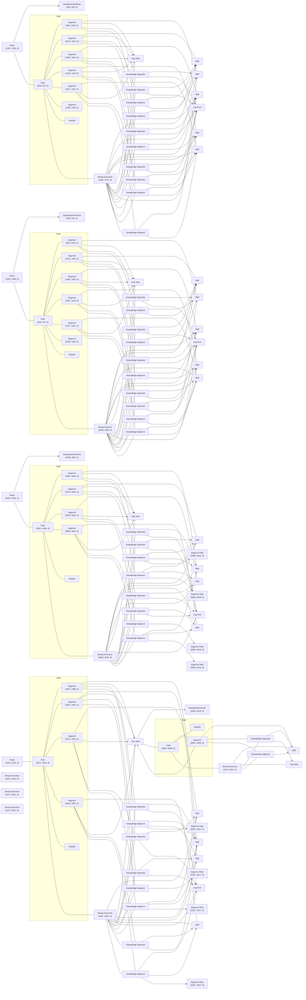

```mermaid
flowchart LR
  subgraph path9 [Path]
    9["Path<br>[928, 974, 0]"]
    14["Segment<br>[982, 1004, 0]"]
    17["Segment<br>[1012, 1042, 0]"]
    18["Segment<br>[1050, 1094, 0]"]
    20["Segment<br>[1102, 1129, 0]"]
    22["Segment<br>[1137, 1181, 0]"]
    25["Segment<br>[1189, 1196, 0]"]
    35[Solid2d]
  end
  subgraph path10 [Path]
    10["Path<br>[928, 974, 0]"]
    15["Segment<br>[982, 1004, 0]"]
    16["Segment<br>[1012, 1042, 0]"]
    19["Segment<br>[1050, 1094, 0]"]
    21["Segment<br>[1102, 1129, 0]"]
    23["Segment<br>[1137, 1181, 0]"]
    24["Segment<br>[1189, 1196, 0]"]
    39[Solid2d]
  end
  subgraph path11 [Path]
    11["Path<br>[2237, 2325, 0]"]
    26["Segment<br>[2331, 2395, 0]"]
    27["Segment<br>[2401, 2465, 0]"]
    28["Segment<br>[2471, 2524, 0]"]
    29["Segment<br>[2530, 2551, 0]"]
    37[Solid2d]
  end
  subgraph path12 [Path]
    12["Path<br>[2882, 3048, 0]"]
    30["Segment<br>[2882, 3048, 0]"]
    36[Solid2d]
  end
  subgraph path13 [Path]
    13["Path<br>[4361, 4386, 0]"]
    31["Segment<br>[4392, 4464, 0]"]
    32["Segment<br>[4470, 4543, 0]"]
    33["Segment<br>[4549, 4602, 0]"]
    34["Segment<br>[4608, 4629, 0]"]
    38[Solid2d]
  end
  1["Plane<br>[1282, 1329, 0]"]
  2["Plane<br>[1861, 1908, 0]"]
  3["Plane<br>[2214, 2231, 0]"]
  4["Plane<br>[4322, 4354, 0]"]
  5["StartSketchOnPlane<br>[4308, 4355, 0]"]
  6["StartSketchOnPlane<br>[900, 920, 0]"]
  7["StartSketchOnPlane<br>[900, 920, 0]"]
  8["StartSketchOnFace<br>[2834, 2876, 0]"]
  40["Sweep Extrusion<br>[1269, 1372, 0]"]
  41["Sweep Revolve<br>[1848, 1939, 0]"]
  42["Sweep Extrusion<br>[2557, 2581, 0]"]
  43["Sweep Extrusion<br>[3270, 3297, 0]"]
  44["Sweep Extrusion<br>[3270, 3297, 0]"]
  45["Sweep Extrusion<br>[3270, 3297, 0]"]
  46["Sweep Extrusion<br>[3270, 3297, 0]"]
  47["Sweep Extrusion<br>[4635, 4679, 0]"]
  48[Wall]
  49[Wall]
  50[Wall]
  51[Wall]
  52[Wall]
  53[Wall]
  54[Wall]
  55[Wall]
  56[Wall]
  57[Wall]
  58[Wall]
  59[Wall]
  60[Wall]
  61[Wall]
  62[Wall]
  63[Wall]
  64[Wall]
  65[Wall]
  66[Wall]
  67["Cap Start"]
  68["Cap Start"]
  69["Cap Start"]
  70["Cap Start"]
  71["Cap End"]
  72["Cap End"]
  73["Cap End"]
  74["Cap End"]
  75["Cap Start"]
  76["SweepEdge Opposite"]
  77["SweepEdge Adjacent"]
  78["SweepEdge Opposite"]
  79["SweepEdge Adjacent"]
  80["SweepEdge Opposite"]
  81["SweepEdge Adjacent"]
  82["SweepEdge Opposite"]
  83["SweepEdge Adjacent"]
  84["SweepEdge Opposite"]
  85["SweepEdge Adjacent"]
  86["SweepEdge Opposite"]
  87["SweepEdge Adjacent"]
  88["SweepEdge Opposite"]
  89["SweepEdge Adjacent"]
  90["SweepEdge Opposite"]
  91["SweepEdge Adjacent"]
  92["SweepEdge Opposite"]
  93["SweepEdge Adjacent"]
  94["SweepEdge Opposite"]
  95["SweepEdge Adjacent"]
  96["SweepEdge Opposite"]
  97["SweepEdge Adjacent"]
  98["SweepEdge Opposite"]
  99["SweepEdge Adjacent"]
  100["SweepEdge Opposite"]
  101["SweepEdge Adjacent"]
  102["SweepEdge Opposite"]
  103["SweepEdge Adjacent"]
  104["SweepEdge Opposite"]
  105["SweepEdge Adjacent"]
  106["SweepEdge Opposite"]
  107["SweepEdge Adjacent"]
  108["SweepEdge Opposite"]
  109["SweepEdge Adjacent"]
  110["SweepEdge Opposite"]
  111["SweepEdge Adjacent"]
  112["SweepEdge Opposite"]
  113["SweepEdge Adjacent"]
  114["EdgeCut Fillet<br>[2587, 2817, 0]"]
  115["EdgeCut Fillet<br>[2587, 2817, 0]"]
  116["EdgeCut Fillet<br>[2587, 2817, 0]"]
  117["EdgeCut Fillet<br>[2587, 2817, 0]"]
  118["EdgeCut Fillet<br>[4685, 4918, 0]"]
  119["EdgeCut Fillet<br>[4685, 4918, 0]"]
  120["EdgeCut Fillet<br>[4685, 4918, 0]"]
  121["EdgeCut Fillet<br>[4685, 4918, 0]"]
  1 <--x 7
  1 --- 10
  2 <--x 6
  2 --- 9
  3 --- 11
  4 <--x 5
  4 --- 13
  75 x--> 8
  9 --- 14
  9 --- 17
  9 --- 18
  9 --- 20
  9 --- 22
  9 --- 25
  9 --- 35
  9 ---- 41
  10 --- 15
  10 --- 16
  10 --- 19
  10 --- 21
  10 --- 23
  10 --- 24
  10 --- 39
  10 ---- 40
  11 --- 26
  11 --- 27
  11 --- 28
  11 --- 29
  11 --- 37
  11 ---- 42
  12 --- 30
  12 --- 36
  12 ---- 45
  75 --- 12
  13 --- 31
  13 --- 32
  13 --- 33
  13 --- 34
  13 --- 38
  13 ---- 47
  14 --- 57
  14 x--> 68
  14 --- 94
  14 --- 95
  15 --- 49
  15 x--> 67
  15 --- 78
  15 --- 79
  16 --- 48
  16 x--> 67
  16 --- 76
  16 --- 77
  17 --- 58
  17 x--> 68
  17 --- 96
  17 --- 97
  18 --- 60
  18 x--> 68
  18 --- 100
  18 --- 101
  19 --- 50
  19 x--> 67
  19 --- 80
  19 --- 81
  20 --- 61
  20 x--> 68
  20 --- 102
  20 --- 103
  21 --- 52
  21 x--> 67
  21 --- 84
  21 --- 85
  22 --- 59
  22 x--> 68
  22 --- 98
  22 --- 99
  23 --- 51
  23 x--> 67
  23 --- 82
  23 --- 83
  26 --- 54
  26 x--> 75
  26 --- 88
  26 --- 89
  27 --- 55
  27 x--> 75
  27 --- 90
  27 --- 91
  28 --- 53
  28 x--> 75
  28 --- 86
  28 --- 87
  29 --- 56
  29 x--> 75
  29 --- 92
  29 --- 93
  30 --- 66
  30 x--> 75
  30 --- 112
  30 --- 113
  31 --- 63
  31 x--> 70
  31 --- 106
  31 --- 107
  32 --- 62
  32 x--> 70
  32 --- 104
  32 --- 105
  33 --- 65
  33 x--> 70
  33 --- 110
  33 --- 111
  34 --- 64
  34 x--> 70
  34 --- 108
  34 --- 109
  40 --- 48
  40 --- 49
  40 --- 50
  40 --- 51
  40 --- 52
  40 --- 67
  40 --- 71
  40 --- 76
  40 --- 77
  40 --- 78
  40 --- 79
  40 --- 80
  40 --- 81
  40 --- 82
  40 --- 83
  40 --- 84
  40 --- 85
  41 --- 57
  41 --- 58
  41 --- 59
  41 --- 60
  41 --- 61
  41 --- 68
  41 --- 72
  41 --- 94
  41 --- 95
  41 --- 96
  41 --- 97
  41 --- 98
  41 --- 99
  41 --- 100
  41 --- 101
  41 --- 102
  41 --- 103
  42 --- 53
  42 --- 54
  42 --- 55
  42 --- 56
  42 --- 73
  42 --- 75
  42 --- 86
  42 --- 87
  42 --- 88
  42 --- 89
  42 --- 90
  42 --- 91
  42 --- 92
  42 --- 93
  45 --- 66
  45 --- 69
  45 --- 112
  45 --- 113
  47 --- 62
  47 --- 63
  47 --- 64
  47 --- 65
  47 --- 70
  47 --- 74
  47 --- 104
  47 --- 105
  47 --- 106
  47 --- 107
  47 --- 108
  47 --- 109
  47 --- 110
  47 --- 111
  76 <--x 48
  77 <--x 48
  79 <--x 48
  78 <--x 49
  79 <--x 49
  83 <--x 49
  77 <--x 50
  80 <--x 50
  81 <--x 50
  82 <--x 51
  83 <--x 51
  85 <--x 51
  81 <--x 52
  84 <--x 52
  85 <--x 52
  86 <--x 53
  91 <--x 53
  88 <--x 54
  89 <--x 54
  93 <--x 54
  89 <--x 55
  90 <--x 55
  91 <--x 55
  92 <--x 56
  93 <--x 56
  94 <--x 57
  95 <--x 57
  99 <--x 57
  95 <--x 58
  96 <--x 58
  97 <--x 58
  98 <--x 59
  99 <--x 59
  103 <--x 59
  97 <--x 60
  100 <--x 60
  101 <--x 60
  101 <--x 61
  102 <--x 61
  103 <--x 61
  104 <--x 62
  105 <--x 62
  107 <--x 62
  106 <--x 63
  107 <--x 63
  109 <--x 63
  108 <--x 64
  109 <--x 64
  105 <--x 65
  110 <--x 65
  112 <--x 66
  113 <--x 66
  112 <--x 69
  76 <--x 71
  78 <--x 71
  80 <--x 71
  82 <--x 71
  84 <--x 71
  94 <--x 72
  96 <--x 72
  98 <--x 72
  100 <--x 72
  102 <--x 72
  86 <--x 73
  88 <--x 73
  90 <--x 73
  92 <--x 73
  104 <--x 74
  106 <--x 74
  108 <--x 74
  110 <--x 74
  87 <--x 116
  89 <--x 114
  91 <--x 117
  93 <--x 115
  105 <--x 121
  107 <--x 118
  109 <--x 119
  111 <--x 120
```
