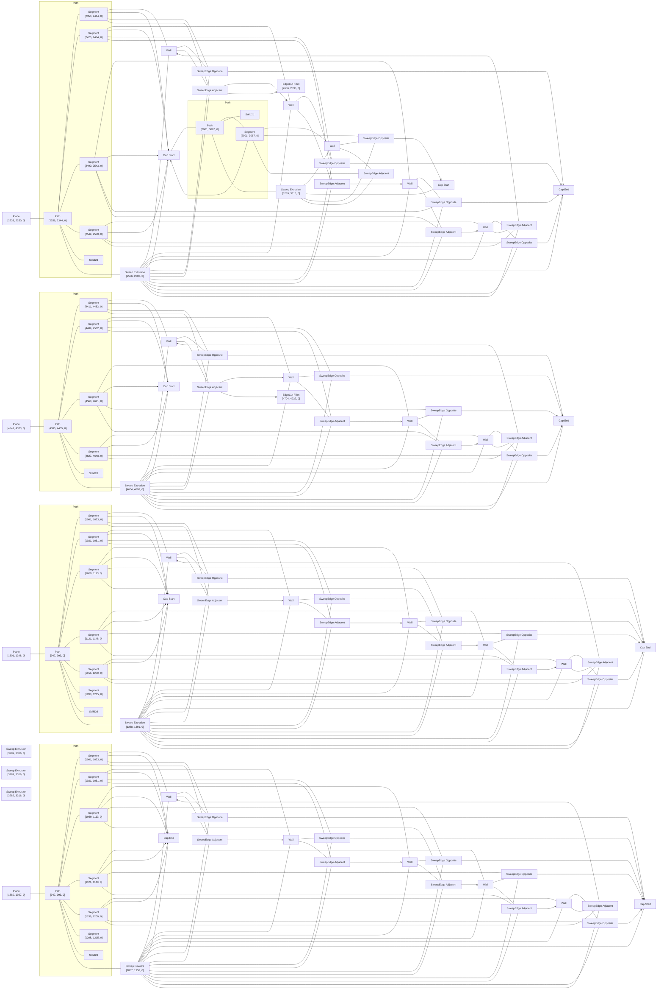

```mermaid
flowchart LR
  subgraph path2 [Path]
    2["Path<br>[947, 993, 0]"]
      %% [ProgramBodyItem { index: 16 }, VariableDeclarationDeclaration, VariableDeclarationInit, FunctionExpressionBody, FunctionExpressionBodyItem { index: 0 }, VariableDeclarationDeclaration, VariableDeclarationInit, PipeBodyItem { index: 1 }]
    3["Segment<br>[1001, 1023, 0]"]
      %% [ProgramBodyItem { index: 16 }, VariableDeclarationDeclaration, VariableDeclarationInit, FunctionExpressionBody, FunctionExpressionBodyItem { index: 0 }, VariableDeclarationDeclaration, VariableDeclarationInit, PipeBodyItem { index: 2 }]
    4["Segment<br>[1031, 1061, 0]"]
      %% [ProgramBodyItem { index: 16 }, VariableDeclarationDeclaration, VariableDeclarationInit, FunctionExpressionBody, FunctionExpressionBodyItem { index: 0 }, VariableDeclarationDeclaration, VariableDeclarationInit, PipeBodyItem { index: 3 }]
    5["Segment<br>[1069, 1113, 0]"]
      %% [ProgramBodyItem { index: 16 }, VariableDeclarationDeclaration, VariableDeclarationInit, FunctionExpressionBody, FunctionExpressionBodyItem { index: 0 }, VariableDeclarationDeclaration, VariableDeclarationInit, PipeBodyItem { index: 4 }]
    6["Segment<br>[1121, 1148, 0]"]
      %% [ProgramBodyItem { index: 16 }, VariableDeclarationDeclaration, VariableDeclarationInit, FunctionExpressionBody, FunctionExpressionBodyItem { index: 0 }, VariableDeclarationDeclaration, VariableDeclarationInit, PipeBodyItem { index: 5 }]
    7["Segment<br>[1156, 1200, 0]"]
      %% [ProgramBodyItem { index: 16 }, VariableDeclarationDeclaration, VariableDeclarationInit, FunctionExpressionBody, FunctionExpressionBodyItem { index: 0 }, VariableDeclarationDeclaration, VariableDeclarationInit, PipeBodyItem { index: 6 }]
    8["Segment<br>[1208, 1215, 0]"]
      %% [ProgramBodyItem { index: 16 }, VariableDeclarationDeclaration, VariableDeclarationInit, FunctionExpressionBody, FunctionExpressionBodyItem { index: 0 }, VariableDeclarationDeclaration, VariableDeclarationInit, PipeBodyItem { index: 7 }]
    9[Solid2d]
  end
  subgraph path29 [Path]
    29["Path<br>[947, 993, 0]"]
      %% [ProgramBodyItem { index: 16 }, VariableDeclarationDeclaration, VariableDeclarationInit, FunctionExpressionBody, FunctionExpressionBodyItem { index: 0 }, VariableDeclarationDeclaration, VariableDeclarationInit, PipeBodyItem { index: 1 }]
    30["Segment<br>[1001, 1023, 0]"]
      %% [ProgramBodyItem { index: 16 }, VariableDeclarationDeclaration, VariableDeclarationInit, FunctionExpressionBody, FunctionExpressionBodyItem { index: 0 }, VariableDeclarationDeclaration, VariableDeclarationInit, PipeBodyItem { index: 2 }]
    31["Segment<br>[1031, 1061, 0]"]
      %% [ProgramBodyItem { index: 16 }, VariableDeclarationDeclaration, VariableDeclarationInit, FunctionExpressionBody, FunctionExpressionBodyItem { index: 0 }, VariableDeclarationDeclaration, VariableDeclarationInit, PipeBodyItem { index: 3 }]
    32["Segment<br>[1069, 1113, 0]"]
      %% [ProgramBodyItem { index: 16 }, VariableDeclarationDeclaration, VariableDeclarationInit, FunctionExpressionBody, FunctionExpressionBodyItem { index: 0 }, VariableDeclarationDeclaration, VariableDeclarationInit, PipeBodyItem { index: 4 }]
    33["Segment<br>[1121, 1148, 0]"]
      %% [ProgramBodyItem { index: 16 }, VariableDeclarationDeclaration, VariableDeclarationInit, FunctionExpressionBody, FunctionExpressionBodyItem { index: 0 }, VariableDeclarationDeclaration, VariableDeclarationInit, PipeBodyItem { index: 5 }]
    34["Segment<br>[1156, 1200, 0]"]
      %% [ProgramBodyItem { index: 16 }, VariableDeclarationDeclaration, VariableDeclarationInit, FunctionExpressionBody, FunctionExpressionBodyItem { index: 0 }, VariableDeclarationDeclaration, VariableDeclarationInit, PipeBodyItem { index: 6 }]
    35["Segment<br>[1208, 1215, 0]"]
      %% [ProgramBodyItem { index: 16 }, VariableDeclarationDeclaration, VariableDeclarationInit, FunctionExpressionBody, FunctionExpressionBodyItem { index: 0 }, VariableDeclarationDeclaration, VariableDeclarationInit, PipeBodyItem { index: 7 }]
    36[Solid2d]
  end
  subgraph path56 [Path]
    56["Path<br>[2256, 2344, 0]"]
      %% [ProgramBodyItem { index: 22 }, VariableDeclarationDeclaration, VariableDeclarationInit, PipeBodyItem { index: 1 }]
    57["Segment<br>[2350, 2414, 0]"]
      %% [ProgramBodyItem { index: 22 }, VariableDeclarationDeclaration, VariableDeclarationInit, PipeBodyItem { index: 2 }]
    58["Segment<br>[2420, 2484, 0]"]
      %% [ProgramBodyItem { index: 22 }, VariableDeclarationDeclaration, VariableDeclarationInit, PipeBodyItem { index: 3 }]
    59["Segment<br>[2490, 2543, 0]"]
      %% [ProgramBodyItem { index: 22 }, VariableDeclarationDeclaration, VariableDeclarationInit, PipeBodyItem { index: 4 }]
    60["Segment<br>[2549, 2570, 0]"]
      %% [ProgramBodyItem { index: 22 }, VariableDeclarationDeclaration, VariableDeclarationInit, PipeBodyItem { index: 5 }]
    61[Solid2d]
  end
  subgraph path78 [Path]
    78["Path<br>[2901, 3067, 0]"]
      %% [ProgramBodyItem { index: 23 }, VariableDeclarationDeclaration, VariableDeclarationInit, PipeBodyItem { index: 1 }]
    79["Segment<br>[2901, 3067, 0]"]
      %% [ProgramBodyItem { index: 23 }, VariableDeclarationDeclaration, VariableDeclarationInit, PipeBodyItem { index: 1 }]
    80[Solid2d]
  end
  subgraph path90 [Path]
    90["Path<br>[4380, 4405, 0]"]
      %% [ProgramBodyItem { index: 27 }, VariableDeclarationDeclaration, VariableDeclarationInit, PipeBodyItem { index: 1 }]
    91["Segment<br>[4411, 4483, 0]"]
      %% [ProgramBodyItem { index: 27 }, VariableDeclarationDeclaration, VariableDeclarationInit, PipeBodyItem { index: 2 }]
    92["Segment<br>[4489, 4562, 0]"]
      %% [ProgramBodyItem { index: 27 }, VariableDeclarationDeclaration, VariableDeclarationInit, PipeBodyItem { index: 3 }]
    93["Segment<br>[4568, 4621, 0]"]
      %% [ProgramBodyItem { index: 27 }, VariableDeclarationDeclaration, VariableDeclarationInit, PipeBodyItem { index: 4 }]
    94["Segment<br>[4627, 4648, 0]"]
      %% [ProgramBodyItem { index: 27 }, VariableDeclarationDeclaration, VariableDeclarationInit, PipeBodyItem { index: 5 }]
    95[Solid2d]
  end
  1["Plane<br>[1301, 1348, 0]"]
    %% [ProgramBodyItem { index: 17 }, VariableDeclarationDeclaration, VariableDeclarationInit, CallKwUnlabeledArg, CallKwUnlabeledArg]
  10["Sweep Extrusion<br>[1288, 1391, 0]"]
    %% [ProgramBodyItem { index: 17 }, VariableDeclarationDeclaration, VariableDeclarationInit]
  11[Wall]
    %% face_code_ref=Missing NodePath
  12[Wall]
    %% face_code_ref=Missing NodePath
  13[Wall]
    %% face_code_ref=Missing NodePath
  14[Wall]
    %% face_code_ref=Missing NodePath
  15[Wall]
    %% face_code_ref=Missing NodePath
  16["Cap Start"]
    %% face_code_ref=Missing NodePath
  17["Cap End"]
    %% face_code_ref=Missing NodePath
  18["SweepEdge Opposite"]
  19["SweepEdge Adjacent"]
  20["SweepEdge Opposite"]
  21["SweepEdge Adjacent"]
  22["SweepEdge Opposite"]
  23["SweepEdge Adjacent"]
  24["SweepEdge Opposite"]
  25["SweepEdge Adjacent"]
  26["SweepEdge Opposite"]
  27["SweepEdge Adjacent"]
  28["Plane<br>[1880, 1927, 0]"]
    %% [ProgramBodyItem { index: 20 }, VariableDeclarationDeclaration, VariableDeclarationInit, CallKwUnlabeledArg, CallKwUnlabeledArg]
  37["Sweep Revolve<br>[1867, 1958, 0]"]
    %% [ProgramBodyItem { index: 20 }, VariableDeclarationDeclaration, VariableDeclarationInit]
  38[Wall]
    %% face_code_ref=Missing NodePath
  39[Wall]
    %% face_code_ref=Missing NodePath
  40[Wall]
    %% face_code_ref=Missing NodePath
  41[Wall]
    %% face_code_ref=Missing NodePath
  42[Wall]
    %% face_code_ref=Missing NodePath
  43["Cap Start"]
    %% face_code_ref=Missing NodePath
  44["Cap End"]
    %% face_code_ref=Missing NodePath
  45["SweepEdge Opposite"]
  46["SweepEdge Adjacent"]
  47["SweepEdge Opposite"]
  48["SweepEdge Adjacent"]
  49["SweepEdge Opposite"]
  50["SweepEdge Adjacent"]
  51["SweepEdge Opposite"]
  52["SweepEdge Adjacent"]
  53["SweepEdge Opposite"]
  54["SweepEdge Adjacent"]
  55["Plane<br>[2233, 2250, 0]"]
    %% [ProgramBodyItem { index: 22 }, VariableDeclarationDeclaration, VariableDeclarationInit, PipeBodyItem { index: 0 }]
  62["Sweep Extrusion<br>[2576, 2600, 0]"]
    %% [ProgramBodyItem { index: 22 }, VariableDeclarationDeclaration, VariableDeclarationInit, PipeBodyItem { index: 6 }]
  63[Wall]
    %% face_code_ref=Missing NodePath
  64[Wall]
    %% face_code_ref=Missing NodePath
  65[Wall]
    %% face_code_ref=Missing NodePath
  66[Wall]
    %% face_code_ref=Missing NodePath
  67["Cap Start"]
    %% face_code_ref=Missing NodePath
  68["Cap End"]
    %% face_code_ref=Missing NodePath
  69["SweepEdge Opposite"]
  70["SweepEdge Adjacent"]
  71["SweepEdge Opposite"]
  72["SweepEdge Adjacent"]
  73["SweepEdge Opposite"]
  74["SweepEdge Adjacent"]
  75["SweepEdge Opposite"]
  76["SweepEdge Adjacent"]
  77["EdgeCut Fillet<br>[2606, 2836, 0]"]
    %% [ProgramBodyItem { index: 22 }, VariableDeclarationDeclaration, VariableDeclarationInit, PipeBodyItem { index: 7 }]
  81["Sweep Extrusion<br>[3289, 3316, 0]"]
    %% [ProgramBodyItem { index: 23 }, VariableDeclarationDeclaration, VariableDeclarationInit, PipeBodyItem { index: 3 }]
  82[Wall]
    %% face_code_ref=Missing NodePath
  83["Cap Start"]
    %% face_code_ref=Missing NodePath
  84["SweepEdge Opposite"]
  85["SweepEdge Adjacent"]
  86["Sweep Extrusion<br>[3289, 3316, 0]"]
    %% [ProgramBodyItem { index: 23 }, VariableDeclarationDeclaration, VariableDeclarationInit, PipeBodyItem { index: 3 }]
  87["Sweep Extrusion<br>[3289, 3316, 0]"]
    %% [ProgramBodyItem { index: 23 }, VariableDeclarationDeclaration, VariableDeclarationInit, PipeBodyItem { index: 3 }]
  88["Sweep Extrusion<br>[3289, 3316, 0]"]
    %% [ProgramBodyItem { index: 23 }, VariableDeclarationDeclaration, VariableDeclarationInit, PipeBodyItem { index: 3 }]
  89["Plane<br>[4341, 4373, 0]"]
    %% [ProgramBodyItem { index: 27 }, VariableDeclarationDeclaration, VariableDeclarationInit, PipeBodyItem { index: 0 }, CallKwUnlabeledArg]
  96["Sweep Extrusion<br>[4654, 4698, 0]"]
    %% [ProgramBodyItem { index: 27 }, VariableDeclarationDeclaration, VariableDeclarationInit, PipeBodyItem { index: 6 }]
  97[Wall]
    %% face_code_ref=Missing NodePath
  98[Wall]
    %% face_code_ref=Missing NodePath
  99[Wall]
    %% face_code_ref=Missing NodePath
  100[Wall]
    %% face_code_ref=Missing NodePath
  101["Cap Start"]
    %% face_code_ref=Missing NodePath
  102["Cap End"]
    %% face_code_ref=Missing NodePath
  103["SweepEdge Opposite"]
  104["SweepEdge Adjacent"]
  105["SweepEdge Opposite"]
  106["SweepEdge Adjacent"]
  107["SweepEdge Opposite"]
  108["SweepEdge Adjacent"]
  109["SweepEdge Opposite"]
  110["SweepEdge Adjacent"]
  111["EdgeCut Fillet<br>[4704, 4937, 0]"]
    %% [ProgramBodyItem { index: 27 }, VariableDeclarationDeclaration, VariableDeclarationInit, PipeBodyItem { index: 7 }]
  1 --- 2
  2 --- 3
  2 --- 4
  2 --- 5
  2 --- 6
  2 --- 7
  2 --- 8
  2 --- 9
  2 ---- 10
  3 --- 11
  3 x--> 16
  3 --- 18
  3 --- 19
  4 --- 12
  4 x--> 16
  4 --- 20
  4 --- 21
  5 --- 13
  5 x--> 16
  5 --- 22
  5 --- 23
  6 --- 14
  6 x--> 16
  6 --- 24
  6 --- 25
  7 --- 15
  7 x--> 16
  7 --- 26
  7 --- 27
  10 --- 11
  10 --- 12
  10 --- 13
  10 --- 14
  10 --- 15
  10 --- 16
  10 --- 17
  10 --- 18
  10 --- 19
  10 --- 20
  10 --- 21
  10 --- 22
  10 --- 23
  10 --- 24
  10 --- 25
  10 --- 26
  10 --- 27
  11 --- 18
  11 --- 19
  27 <--x 11
  19 <--x 12
  12 --- 20
  12 --- 21
  21 <--x 13
  13 --- 22
  13 --- 23
  23 <--x 14
  14 --- 24
  14 --- 25
  25 <--x 15
  15 --- 26
  15 --- 27
  18 <--x 17
  20 <--x 17
  22 <--x 17
  24 <--x 17
  26 <--x 17
  28 --- 29
  29 --- 30
  29 --- 31
  29 --- 32
  29 --- 33
  29 --- 34
  29 --- 35
  29 --- 36
  29 ---- 37
  30 --- 38
  30 x--> 44
  30 --- 45
  30 --- 46
  31 --- 39
  31 x--> 44
  31 --- 47
  31 --- 48
  32 --- 40
  32 x--> 44
  32 --- 49
  32 --- 50
  33 --- 41
  33 x--> 44
  33 --- 51
  33 --- 52
  34 --- 42
  34 x--> 44
  34 --- 53
  34 --- 54
  37 --- 38
  37 --- 39
  37 --- 40
  37 --- 41
  37 --- 42
  37 --- 43
  37 --- 44
  37 --- 45
  37 --- 46
  37 --- 47
  37 --- 48
  37 --- 49
  37 --- 50
  37 --- 51
  37 --- 52
  37 --- 53
  37 --- 54
  38 --- 45
  38 --- 46
  54 <--x 38
  46 <--x 39
  39 --- 47
  39 --- 48
  48 <--x 40
  40 --- 49
  40 --- 50
  50 <--x 41
  41 --- 51
  41 --- 52
  52 <--x 42
  42 --- 53
  42 --- 54
  45 <--x 43
  47 <--x 43
  49 <--x 43
  51 <--x 43
  53 <--x 43
  55 --- 56
  56 --- 57
  56 --- 58
  56 --- 59
  56 --- 60
  56 --- 61
  56 ---- 62
  57 --- 63
  57 x--> 67
  57 --- 69
  57 --- 70
  58 --- 64
  58 x--> 67
  58 --- 71
  58 --- 72
  59 --- 65
  59 x--> 67
  59 --- 73
  59 --- 74
  60 --- 66
  60 x--> 67
  60 --- 75
  60 --- 76
  62 --- 63
  62 --- 64
  62 --- 65
  62 --- 66
  62 --- 67
  62 --- 68
  62 --- 69
  62 --- 70
  62 --- 71
  62 --- 72
  62 --- 73
  62 --- 74
  62 --- 75
  62 --- 76
  63 --- 69
  63 --- 70
  76 <--x 63
  70 <--x 64
  64 --- 71
  64 --- 72
  72 <--x 65
  65 --- 73
  65 --- 74
  74 <--x 66
  66 --- 75
  66 --- 76
  67 --- 78
  79 <--x 67
  69 <--x 68
  71 <--x 68
  73 <--x 68
  75 <--x 68
  70 <--x 77
  78 --- 79
  78 --- 80
  78 ---- 81
  79 --- 82
  79 --- 84
  79 --- 85
  81 --- 82
  81 --- 83
  81 --- 84
  81 --- 85
  82 --- 84
  82 --- 85
  84 <--x 83
  89 --- 90
  90 --- 91
  90 --- 92
  90 --- 93
  90 --- 94
  90 --- 95
  90 ---- 96
  91 --- 97
  91 x--> 101
  91 --- 103
  91 --- 104
  92 --- 98
  92 x--> 101
  92 --- 105
  92 --- 106
  93 --- 99
  93 x--> 101
  93 --- 107
  93 --- 108
  94 --- 100
  94 x--> 101
  94 --- 109
  94 --- 110
  96 --- 97
  96 --- 98
  96 --- 99
  96 --- 100
  96 --- 101
  96 --- 102
  96 --- 103
  96 --- 104
  96 --- 105
  96 --- 106
  96 --- 107
  96 --- 108
  96 --- 109
  96 --- 110
  97 --- 103
  97 --- 104
  110 <--x 97
  104 <--x 98
  98 --- 105
  98 --- 106
  106 <--x 99
  99 --- 107
  99 --- 108
  108 <--x 100
  100 --- 109
  100 --- 110
  103 <--x 102
  105 <--x 102
  107 <--x 102
  109 <--x 102
  104 <--x 111
```
