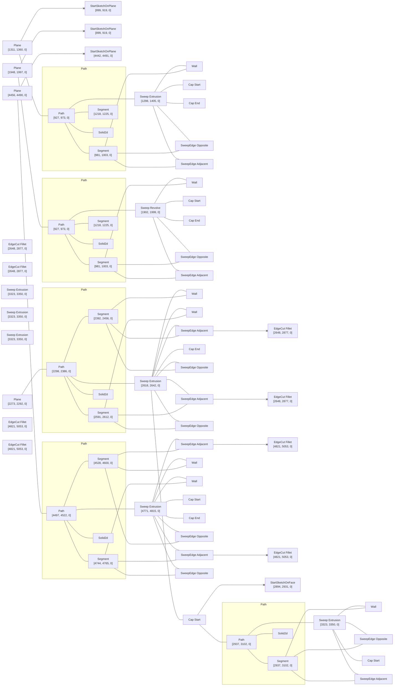

```mermaid
flowchart LR
  subgraph path2 [Path]
    2["Path<br>[927, 973, 0]"]
    3["Segment<br>[981, 1003, 0]"]
    4["Segment<br>[1218, 1225, 0]"]
    5[Solid2d]
  end
  subgraph path13 [Path]
    13["Path<br>[927, 973, 0]"]
    14["Segment<br>[981, 1003, 0]"]
    15["Segment<br>[1218, 1225, 0]"]
    16[Solid2d]
  end
  subgraph path24 [Path]
    24["Path<br>[2298, 2386, 0]"]
    25["Segment<br>[2392, 2456, 0]"]
    26["Segment<br>[2591, 2612, 0]"]
    27[Solid2d]
  end
  subgraph path41 [Path]
    41["Path<br>[2937, 3102, 0]"]
    42["Segment<br>[2937, 3102, 0]"]
    43[Solid2d]
  end
  subgraph path53 [Path]
    53["Path<br>[4497, 4522, 0]"]
    54["Segment<br>[4528, 4600, 0]"]
    55["Segment<br>[4744, 4765, 0]"]
    56[Solid2d]
  end
  1["Plane<br>[1311, 1360, 0]"]
  6["Sweep Extrusion<br>[1298, 1405, 0]"]
  7[Wall]
  8["Cap Start"]
  9["Cap End"]
  10["SweepEdge Opposite"]
  11["SweepEdge Adjacent"]
  12["Plane<br>[1948, 1997, 0]"]
  17["Sweep Revolve<br>[1902, 1999, 0]"]
  18[Wall]
  19["Cap Start"]
  20["Cap End"]
  21["SweepEdge Opposite"]
  22["SweepEdge Adjacent"]
  23["Plane<br>[2273, 2292, 0]"]
  28["Sweep Extrusion<br>[2618, 2642, 0]"]
  29[Wall]
  30[Wall]
  31["Cap Start"]
  32["Cap End"]
  33["SweepEdge Opposite"]
  34["SweepEdge Adjacent"]
  35["SweepEdge Opposite"]
  36["SweepEdge Adjacent"]
  37["EdgeCut Fillet<br>[2648, 2877, 0]"]
  38["EdgeCut Fillet<br>[2648, 2877, 0]"]
  39["EdgeCut Fillet<br>[2648, 2877, 0]"]
  40["EdgeCut Fillet<br>[2648, 2877, 0]"]
  44["Sweep Extrusion<br>[3323, 3350, 0]"]
  45[Wall]
  46["Cap Start"]
  47["SweepEdge Opposite"]
  48["SweepEdge Adjacent"]
  49["Sweep Extrusion<br>[3323, 3350, 0]"]
  50["Sweep Extrusion<br>[3323, 3350, 0]"]
  51["Sweep Extrusion<br>[3323, 3350, 0]"]
  52["Plane<br>[4456, 4490, 0]"]
  57["Sweep Extrusion<br>[4771, 4815, 0]"]
  58[Wall]
  59[Wall]
  60["Cap Start"]
  61["Cap End"]
  62["SweepEdge Opposite"]
  63["SweepEdge Adjacent"]
  64["SweepEdge Opposite"]
  65["SweepEdge Adjacent"]
  66["EdgeCut Fillet<br>[4821, 5053, 0]"]
  67["EdgeCut Fillet<br>[4821, 5053, 0]"]
  68["EdgeCut Fillet<br>[4821, 5053, 0]"]
  69["EdgeCut Fillet<br>[4821, 5053, 0]"]
  70["StartSketchOnPlane<br>[899, 919, 0]"]
  71["StartSketchOnPlane<br>[899, 919, 0]"]
  72["StartSketchOnFace<br>[2894, 2931, 0]"]
  73["StartSketchOnPlane<br>[4442, 4491, 0]"]
  1 --- 2
  2 --- 3
  2 --- 4
  2 ---- 6
  2 --- 5
  3 --- 7
  3 --- 10
  3 --- 11
  6 --- 7
  6 --- 8
  6 --- 9
  6 --- 10
  6 --- 11
  12 --- 13
  13 --- 14
  13 --- 15
  13 ---- 17
  13 --- 16
  14 --- 18
  14 --- 21
  14 --- 22
  17 --- 18
  17 --- 19
  17 --- 20
  17 --- 21
  17 --- 22
  23 --- 24
  24 --- 25
  24 --- 26
  24 ---- 28
  24 --- 27
  25 --- 29
  25 --- 33
  25 --- 34
  26 --- 30
  26 --- 35
  26 --- 36
  28 --- 29
  28 --- 30
  28 --- 31
  28 --- 32
  28 --- 33
  28 --- 34
  28 --- 35
  28 --- 36
  31 --- 41
  34 <--x 37
  36 <--x 38
  41 --- 42
  41 ---- 44
  41 --- 43
  42 --- 45
  42 --- 47
  42 --- 48
  44 --- 45
  44 --- 46
  44 --- 47
  44 --- 48
  52 --- 53
  53 --- 54
  53 --- 55
  53 ---- 57
  53 --- 56
  54 --- 58
  54 --- 62
  54 --- 63
  55 --- 59
  55 --- 64
  55 --- 65
  57 --- 58
  57 --- 59
  57 --- 60
  57 --- 61
  57 --- 62
  57 --- 63
  57 --- 64
  57 --- 65
  63 <--x 66
  65 <--x 67
  1 <--x 70
  12 <--x 71
  31 <--x 72
  52 <--x 73
```
