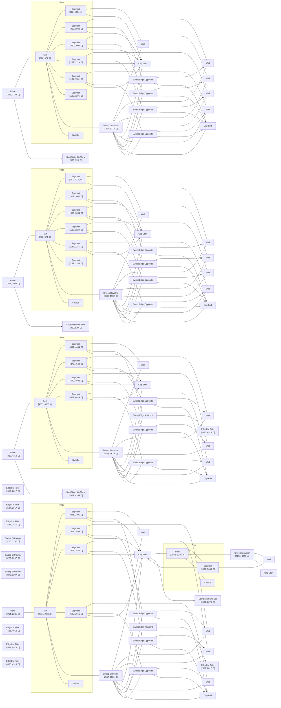

```mermaid
flowchart LR
  subgraph path2 [Path]
    2["Path<br>[928, 974, 0]"]
    3["Segment<br>[982, 1004, 0]"]
    4["Segment<br>[1012, 1042, 0]"]
    5["Segment<br>[1050, 1094, 0]"]
    6["Segment<br>[1102, 1129, 0]"]
    7["Segment<br>[1137, 1181, 0]"]
    8["Segment<br>[1189, 1196, 0]"]
    9[Solid2d]
  end
  subgraph path23 [Path]
    23["Path<br>[928, 974, 0]"]
    24["Segment<br>[982, 1004, 0]"]
    25["Segment<br>[1012, 1042, 0]"]
    26["Segment<br>[1050, 1094, 0]"]
    27["Segment<br>[1102, 1129, 0]"]
    28["Segment<br>[1137, 1181, 0]"]
    29["Segment<br>[1189, 1196, 0]"]
    30[Solid2d]
  end
  subgraph path44 [Path]
    44["Path<br>[2237, 2325, 0]"]
    45["Segment<br>[2331, 2395, 0]"]
    46["Segment<br>[2401, 2465, 0]"]
    47["Segment<br>[2471, 2524, 0]"]
    48["Segment<br>[2530, 2551, 0]"]
    49[Solid2d]
  end
  subgraph path65 [Path]
    65["Path<br>[2882, 3048, 0]"]
    66["Segment<br>[2882, 3048, 0]"]
    67[Solid2d]
  end
  subgraph path75 [Path]
    75["Path<br>[4361, 4386, 0]"]
    76["Segment<br>[4392, 4464, 0]"]
    77["Segment<br>[4470, 4543, 0]"]
    78["Segment<br>[4549, 4602, 0]"]
    79["Segment<br>[4608, 4629, 0]"]
    80[Solid2d]
  end
  1["Plane<br>[1282, 1329, 0]"]
  10["Sweep Extrusion<br>[1269, 1372, 0]"]
  11[Wall]
  12[Wall]
  13[Wall]
  14[Wall]
  15[Wall]
  16["Cap Start"]
  17["Cap End"]
  18["SweepEdge Opposite"]
  19["SweepEdge Opposite"]
  20["SweepEdge Opposite"]
  21["SweepEdge Opposite"]
  22["Plane<br>[1861, 1908, 0]"]
  31["Sweep Revolve<br>[1848, 1939, 0]"]
  32[Wall]
  33[Wall]
  34[Wall]
  35[Wall]
  36[Wall]
  37["Cap Start"]
  38["Cap End"]
  39["SweepEdge Opposite"]
  40["SweepEdge Opposite"]
  41["SweepEdge Opposite"]
  42["SweepEdge Opposite"]
  43["Plane<br>[2214, 2231, 0]"]
  50["Sweep Extrusion<br>[2557, 2581, 0]"]
  51[Wall]
  52[Wall]
  53[Wall]
  54[Wall]
  55["Cap Start"]
  56["Cap End"]
  57["SweepEdge Opposite"]
  58["SweepEdge Opposite"]
  59["SweepEdge Opposite"]
  60["SweepEdge Adjacent"]
  61["EdgeCut Fillet<br>[2587, 2817, 0]"]
  62["EdgeCut Fillet<br>[2587, 2817, 0]"]
  63["EdgeCut Fillet<br>[2587, 2817, 0]"]
  64["EdgeCut Fillet<br>[2587, 2817, 0]"]
  68["Sweep Extrusion<br>[3270, 3297, 0]"]
  69[Wall]
  70["Cap Start"]
  71["Sweep Extrusion<br>[3270, 3297, 0]"]
  72["Sweep Extrusion<br>[3270, 3297, 0]"]
  73["Sweep Extrusion<br>[3270, 3297, 0]"]
  74["Plane<br>[4322, 4354, 0]"]
  81["Sweep Extrusion<br>[4635, 4679, 0]"]
  82[Wall]
  83[Wall]
  84[Wall]
  85[Wall]
  86["Cap Start"]
  87["Cap End"]
  88["SweepEdge Opposite"]
  89["SweepEdge Opposite"]
  90["SweepEdge Opposite"]
  91["SweepEdge Adjacent"]
  92["EdgeCut Fillet<br>[4685, 4918, 0]"]
  93["EdgeCut Fillet<br>[4685, 4918, 0]"]
  94["EdgeCut Fillet<br>[4685, 4918, 0]"]
  95["EdgeCut Fillet<br>[4685, 4918, 0]"]
  96["StartSketchOnPlane<br>[900, 920, 0]"]
  97["StartSketchOnPlane<br>[900, 920, 0]"]
  98["StartSketchOnFace<br>[2834, 2876, 0]"]
  99["StartSketchOnPlane<br>[4308, 4355, 0]"]
  1 --- 2
  2 --- 3
  2 --- 4
  2 --- 5
  2 --- 6
  2 --- 7
  2 --- 8
  2 ---- 10
  2 --- 9
  3 --- 11
  3 x--> 16
  4 --- 12
  4 --- 18
  4 x--> 16
  5 --- 13
  5 --- 19
  5 x--> 16
  6 --- 14
  6 --- 20
  6 x--> 16
  7 --- 15
  7 --- 21
  7 x--> 16
  10 --- 11
  10 --- 12
  10 --- 13
  10 --- 14
  10 --- 15
  10 --- 16
  10 --- 17
  10 --- 18
  10 --- 19
  10 --- 20
  10 --- 21
  18 <--x 12
  18 <--x 17
  19 <--x 13
  19 <--x 17
  20 <--x 14
  20 <--x 17
  21 <--x 15
  21 <--x 17
  22 --- 23
  23 --- 24
  23 --- 25
  23 --- 26
  23 --- 27
  23 --- 28
  23 --- 29
  23 ---- 31
  23 --- 30
  24 --- 32
  24 x--> 37
  25 --- 33
  25 --- 39
  25 x--> 37
  26 --- 34
  26 --- 40
  26 x--> 37
  27 --- 35
  27 --- 41
  27 x--> 37
  28 --- 36
  28 --- 42
  28 x--> 37
  31 --- 32
  31 --- 33
  31 --- 34
  31 --- 35
  31 --- 36
  31 --- 37
  31 --- 38
  31 --- 39
  31 --- 40
  31 --- 41
  31 --- 42
  39 <--x 33
  39 <--x 38
  40 <--x 34
  40 <--x 38
  41 <--x 35
  41 <--x 38
  42 <--x 36
  42 <--x 38
  43 --- 44
  44 --- 45
  44 --- 46
  44 --- 47
  44 --- 48
  44 ---- 50
  44 --- 49
  45 --- 51
  45 --- 60
  45 x--> 55
  46 --- 52
  46 --- 57
  46 x--> 55
  47 --- 53
  47 --- 58
  47 x--> 55
  48 --- 54
  48 --- 59
  48 x--> 55
  50 --- 51
  50 --- 52
  50 --- 53
  50 --- 54
  50 --- 55
  50 --- 56
  50 --- 57
  50 --- 58
  50 --- 59
  50 --- 60
  55 --- 65
  57 <--x 52
  57 <--x 56
  58 <--x 53
  58 <--x 56
  59 <--x 54
  59 <--x 56
  60 <--x 61
  65 --- 66
  65 ---- 68
  65 --- 67
  66 --- 69
  66 <--x 55
  68 --- 69
  68 --- 70
  74 --- 75
  75 --- 76
  75 --- 77
  75 --- 78
  75 --- 79
  75 ---- 81
  75 --- 80
  76 --- 82
  76 --- 91
  76 x--> 86
  77 --- 83
  77 --- 88
  77 x--> 86
  78 --- 84
  78 --- 89
  78 x--> 86
  79 --- 85
  79 --- 90
  79 x--> 86
  81 --- 82
  81 --- 83
  81 --- 84
  81 --- 85
  81 --- 86
  81 --- 87
  81 --- 88
  81 --- 89
  81 --- 90
  81 --- 91
  88 <--x 83
  88 <--x 87
  89 <--x 84
  89 <--x 87
  90 <--x 85
  90 <--x 87
  91 <--x 92
  1 <--x 96
  22 <--x 97
  55 <--x 98
  74 <--x 99
```
