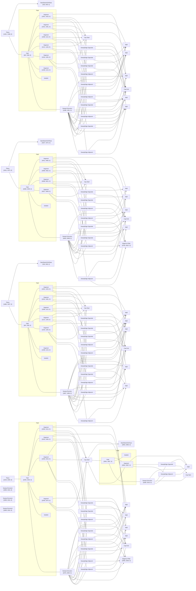

```mermaid
flowchart LR
  subgraph path9 [Path]
    9["Path<br>[947, 993, 0]"]
    14["Segment<br>[1001, 1023, 0]"]
    17["Segment<br>[1031, 1061, 0]"]
    18["Segment<br>[1069, 1113, 0]"]
    20["Segment<br>[1121, 1148, 0]"]
    22["Segment<br>[1156, 1200, 0]"]
    24["Segment<br>[1208, 1215, 0]"]
    38[Solid2d]
  end
  subgraph path10 [Path]
    10["Path<br>[947, 993, 0]"]
    15["Segment<br>[1001, 1023, 0]"]
    16["Segment<br>[1031, 1061, 0]"]
    19["Segment<br>[1069, 1113, 0]"]
    21["Segment<br>[1121, 1148, 0]"]
    23["Segment<br>[1156, 1200, 0]"]
    25["Segment<br>[1208, 1215, 0]"]
    39[Solid2d]
  end
  subgraph path11 [Path]
    11["Path<br>[2256, 2344, 0]"]
    26["Segment<br>[2350, 2414, 0]"]
    27["Segment<br>[2420, 2484, 0]"]
    28["Segment<br>[2490, 2543, 0]"]
    29["Segment<br>[2549, 2570, 0]"]
    37[Solid2d]
  end
  subgraph path12 [Path]
    12["Path<br>[2901, 3067, 0]"]
    30["Segment<br>[2901, 3067, 0]"]
    36[Solid2d]
  end
  subgraph path13 [Path]
    13["Path<br>[4380, 4405, 0]"]
    31["Segment<br>[4411, 4483, 0]"]
    32["Segment<br>[4489, 4562, 0]"]
    33["Segment<br>[4568, 4621, 0]"]
    34["Segment<br>[4627, 4648, 0]"]
    35[Solid2d]
  end
  1["Plane<br>[1301, 1348, 0]"]
  2["Plane<br>[1880, 1927, 0]"]
  3["Plane<br>[2233, 2250, 0]"]
  4["Plane<br>[4341, 4373, 0]"]
  5["StartSketchOnPlane<br>[4327, 4374, 0]"]
  6["StartSketchOnPlane<br>[919, 939, 0]"]
  7["StartSketchOnPlane<br>[919, 939, 0]"]
  8["StartSketchOnFace<br>[2853, 2895, 0]"]
  40["Sweep Extrusion<br>[1288, 1391, 0]"]
  41["Sweep Revolve<br>[1867, 1958, 0]"]
  42["Sweep Extrusion<br>[2576, 2600, 0]"]
  43["Sweep Extrusion<br>[3289, 3316, 0]"]
  44["Sweep Extrusion<br>[3289, 3316, 0]"]
  45["Sweep Extrusion<br>[3289, 3316, 0]"]
  46["Sweep Extrusion<br>[3289, 3316, 0]"]
  47["Sweep Extrusion<br>[4654, 4698, 0]"]
  48[Wall]
  49[Wall]
  50[Wall]
  51[Wall]
  52[Wall]
  53[Wall]
  54[Wall]
  55[Wall]
  56[Wall]
  57[Wall]
  58[Wall]
  59[Wall]
  60[Wall]
  61[Wall]
  62[Wall]
  63[Wall]
  64[Wall]
  65[Wall]
  66[Wall]
  67["Cap Start"]
  68["Cap Start"]
  69["Cap Start"]
  70["Cap Start"]
  71["Cap Start"]
  72["Cap End"]
  73["Cap End"]
  74["Cap End"]
  75["Cap End"]
  76["SweepEdge Opposite"]
  77["SweepEdge Opposite"]
  78["SweepEdge Opposite"]
  79["SweepEdge Opposite"]
  80["SweepEdge Opposite"]
  81["SweepEdge Opposite"]
  82["SweepEdge Opposite"]
  83["SweepEdge Opposite"]
  84["SweepEdge Opposite"]
  85["SweepEdge Opposite"]
  86["SweepEdge Opposite"]
  87["SweepEdge Opposite"]
  88["SweepEdge Opposite"]
  89["SweepEdge Opposite"]
  90["SweepEdge Opposite"]
  91["SweepEdge Opposite"]
  92["SweepEdge Opposite"]
  93["SweepEdge Opposite"]
  94["SweepEdge Opposite"]
  95["SweepEdge Adjacent"]
  96["SweepEdge Adjacent"]
  97["SweepEdge Adjacent"]
  98["SweepEdge Adjacent"]
  99["SweepEdge Adjacent"]
  100["SweepEdge Adjacent"]
  101["SweepEdge Adjacent"]
  102["SweepEdge Adjacent"]
  103["SweepEdge Adjacent"]
  104["SweepEdge Adjacent"]
  105["SweepEdge Adjacent"]
  106["SweepEdge Adjacent"]
  107["SweepEdge Adjacent"]
  108["SweepEdge Adjacent"]
  109["SweepEdge Adjacent"]
  110["SweepEdge Adjacent"]
  111["SweepEdge Adjacent"]
  112["SweepEdge Adjacent"]
  113["SweepEdge Adjacent"]
  114["EdgeCut Fillet<br>[2606, 2836, 0]"]
  115["EdgeCut Fillet<br>[4704, 4937, 0]"]
  1 <--x 6
  1 --- 10
  2 <--x 7
  2 --- 9
  3 --- 11
  4 <--x 5
  4 --- 13
  70 x--> 8
  9 --- 14
  9 --- 17
  9 --- 18
  9 --- 20
  9 --- 22
  9 --- 24
  9 --- 38
  9 ---- 41
  10 --- 15
  10 --- 16
  10 --- 19
  10 --- 21
  10 --- 23
  10 --- 25
  10 --- 39
  10 ---- 40
  11 --- 26
  11 --- 27
  11 --- 28
  11 --- 29
  11 --- 37
  11 ---- 42
  12 --- 30
  12 --- 36
  12 ---- 44
  70 --- 12
  13 --- 31
  13 --- 32
  13 --- 33
  13 --- 34
  13 --- 35
  13 ---- 47
  14 --- 63
  14 x--> 68
  14 --- 92
  14 --- 113
  15 --- 54
  15 x--> 69
  15 --- 80
  15 --- 103
  16 --- 53
  16 x--> 69
  16 --- 82
  16 --- 101
  17 --- 65
  17 x--> 68
  17 --- 93
  17 --- 109
  18 --- 62
  18 x--> 68
  18 --- 90
  18 --- 112
  19 --- 52
  19 x--> 69
  19 --- 81
  19 --- 99
  20 --- 64
  20 x--> 68
  20 --- 94
  20 --- 110
  21 --- 55
  21 x--> 69
  21 --- 83
  21 --- 100
  22 --- 66
  22 x--> 68
  22 --- 91
  22 --- 111
  23 --- 56
  23 x--> 69
  23 --- 84
  23 --- 102
  26 --- 51
  26 x--> 70
  26 --- 77
  26 --- 95
  27 --- 50
  27 x--> 70
  27 --- 76
  27 --- 98
  28 --- 48
  28 x--> 70
  28 --- 79
  28 --- 97
  29 --- 49
  29 x--> 70
  29 --- 78
  29 --- 96
  30 --- 57
  30 x--> 70
  30 --- 85
  30 --- 104
  31 --- 58
  31 x--> 67
  31 --- 89
  31 --- 108
  32 --- 61
  32 x--> 67
  32 --- 86
  32 --- 105
  33 --- 59
  33 x--> 67
  33 --- 88
  33 --- 106
  34 --- 60
  34 x--> 67
  34 --- 87
  34 --- 107
  40 --- 52
  40 --- 53
  40 --- 54
  40 --- 55
  40 --- 56
  40 --- 69
  40 --- 74
  40 --- 80
  40 --- 81
  40 --- 82
  40 --- 83
  40 --- 84
  40 --- 99
  40 --- 100
  40 --- 101
  40 --- 102
  40 --- 103
  41 --- 62
  41 --- 63
  41 --- 64
  41 --- 65
  41 --- 66
  41 --- 68
  41 --- 73
  41 --- 90
  41 --- 91
  41 --- 92
  41 --- 93
  41 --- 94
  41 --- 109
  41 --- 110
  41 --- 111
  41 --- 112
  41 --- 113
  42 --- 48
  42 --- 49
  42 --- 50
  42 --- 51
  42 --- 70
  42 --- 75
  42 --- 76
  42 --- 77
  42 --- 78
  42 --- 79
  42 --- 95
  42 --- 96
  42 --- 97
  42 --- 98
  44 --- 57
  44 --- 71
  44 --- 85
  44 --- 104
  47 --- 58
  47 --- 59
  47 --- 60
  47 --- 61
  47 --- 67
  47 --- 72
  47 --- 86
  47 --- 87
  47 --- 88
  47 --- 89
  47 --- 105
  47 --- 106
  47 --- 107
  47 --- 108
  79 <--x 48
  98 <--x 48
  78 <--x 49
  96 <--x 49
  76 <--x 50
  98 <--x 50
  77 <--x 51
  96 <--x 51
  81 <--x 52
  99 <--x 52
  101 <--x 52
  82 <--x 53
  101 <--x 53
  103 <--x 53
  80 <--x 54
  102 <--x 54
  103 <--x 54
  83 <--x 55
  99 <--x 55
  100 <--x 55
  84 <--x 56
  100 <--x 56
  102 <--x 56
  85 <--x 57
  104 <--x 57
  89 <--x 58
  107 <--x 58
  88 <--x 59
  105 <--x 59
  87 <--x 60
  107 <--x 60
  86 <--x 61
  105 <--x 61
  90 <--x 62
  109 <--x 62
  112 <--x 62
  92 <--x 63
  111 <--x 63
  113 <--x 63
  94 <--x 64
  110 <--x 64
  112 <--x 64
  93 <--x 65
  109 <--x 65
  113 <--x 65
  91 <--x 66
  110 <--x 66
  111 <--x 66
  85 <--x 71
  86 <--x 72
  87 <--x 72
  88 <--x 72
  89 <--x 72
  90 <--x 73
  91 <--x 73
  92 <--x 73
  93 <--x 73
  94 <--x 73
  80 <--x 74
  81 <--x 74
  82 <--x 74
  83 <--x 74
  84 <--x 74
  76 <--x 75
  77 <--x 75
  78 <--x 75
  79 <--x 75
  95 <--x 114
  96 <--x 114
  97 <--x 114
  98 <--x 114
  105 <--x 115
  106 <--x 115
  107 <--x 115
  108 <--x 115
```
