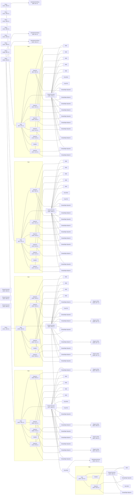

```mermaid
flowchart LR
  subgraph path8 [Path]
    8["Path<br>[927, 973, 0]"]
    9["Segment<br>[981, 1003, 0]"]
    10["Segment<br>[1011, 1041, 0]"]
    11["Segment<br>[1049, 1108, 0]"]
    12["Segment<br>[1116, 1143, 0]"]
    13["Segment<br>[1151, 1210, 0]"]
    14["Segment<br>[1218, 1225, 0]"]
    15[Solid2d]
  end
  subgraph path35 [Path]
    35["Path<br>[927, 973, 0]"]
    36["Segment<br>[981, 1003, 0]"]
    37["Segment<br>[1011, 1041, 0]"]
    38["Segment<br>[1049, 1108, 0]"]
    39["Segment<br>[1116, 1143, 0]"]
    40["Segment<br>[1151, 1210, 0]"]
    41["Segment<br>[1218, 1225, 0]"]
    42[Solid2d]
  end
  subgraph path61 [Path]
    61["Path<br>[2298, 2386, 0]"]
    62["Segment<br>[2392, 2456, 0]"]
    63["Segment<br>[2462, 2526, 0]"]
    64["Segment<br>[2532, 2585, 0]"]
    65["Segment<br>[2591, 2612, 0]"]
    66[Solid2d]
  end
  subgraph path86 [Path]
    86["Path<br>[2937, 3102, 0]"]
    87["Segment<br>[2937, 3102, 0]"]
    88[Solid2d]
  end
  subgraph path98 [Path]
    98["Path<br>[4497, 4522, 0]"]
    99["Segment<br>[4528, 4600, 0]"]
    100["Segment<br>[4606, 4679, 0]"]
    101["Segment<br>[4685, 4738, 0]"]
    102["Segment<br>[4744, 4765, 0]"]
    103[Solid2d]
  end
  1["Plane<br>[1311, 1360, 0]"]
  2["Plane<br>[1311, 1360, 0]"]
  3["Plane<br>[1311, 1360, 0]"]
  4["Plane<br>[1311, 1360, 0]"]
  5["Plane<br>[1311, 1360, 0]"]
  6["Plane<br>[1311, 1360, 0]"]
  7["Plane<br>[1311, 1360, 0]"]
  16["Sweep Extrusion<br>[1298, 1405, 0]"]
  17[Wall]
  18[Wall]
  19[Wall]
  20[Wall]
  21[Wall]
  22["Cap Start"]
  23["Cap End"]
  24["SweepEdge Opposite"]
  25["SweepEdge Adjacent"]
  26["SweepEdge Opposite"]
  27["SweepEdge Adjacent"]
  28["SweepEdge Opposite"]
  29["SweepEdge Adjacent"]
  30["SweepEdge Opposite"]
  31["SweepEdge Adjacent"]
  32["SweepEdge Opposite"]
  33["SweepEdge Adjacent"]
  34["Plane<br>[1948, 1997, 0]"]
  43["Sweep Revolve<br>[1902, 1999, 0]"]
  44[Wall]
  45[Wall]
  46[Wall]
  47[Wall]
  48[Wall]
  49["Cap Start"]
  50["Cap End"]
  51["SweepEdge Opposite"]
  52["SweepEdge Adjacent"]
  53["SweepEdge Opposite"]
  54["SweepEdge Adjacent"]
  55["SweepEdge Opposite"]
  56["SweepEdge Adjacent"]
  57["SweepEdge Opposite"]
  58["SweepEdge Adjacent"]
  59["SweepEdge Opposite"]
  60["SweepEdge Adjacent"]
  67["Sweep Extrusion<br>[2618, 2642, 0]"]
  68[Wall]
  69[Wall]
  70[Wall]
  71[Wall]
  72["Cap Start"]
  73["Cap End"]
  74["SweepEdge Opposite"]
  75["SweepEdge Adjacent"]
  76["SweepEdge Opposite"]
  77["SweepEdge Adjacent"]
  78["SweepEdge Opposite"]
  79["SweepEdge Adjacent"]
  80["SweepEdge Opposite"]
  81["SweepEdge Adjacent"]
  82["EdgeCut Fillet<br>[2648, 2877, 0]"]
  83["EdgeCut Fillet<br>[2648, 2877, 0]"]
  84["EdgeCut Fillet<br>[2648, 2877, 0]"]
  85["EdgeCut Fillet<br>[2648, 2877, 0]"]
  89["Sweep Extrusion<br>[3323, 3350, 0]"]
  90[Wall]
  91["Cap Start"]
  92["SweepEdge Opposite"]
  93["SweepEdge Adjacent"]
  94["Sweep Extrusion<br>[3323, 3350, 0]"]
  95["Sweep Extrusion<br>[3323, 3350, 0]"]
  96["Sweep Extrusion<br>[3323, 3350, 0]"]
  97["Plane<br>[4456, 4490, 0]"]
  104["Sweep Extrusion<br>[4771, 4815, 0]"]
  105[Wall]
  106[Wall]
  107[Wall]
  108[Wall]
  109["Cap Start"]
  110["Cap End"]
  111["SweepEdge Opposite"]
  112["SweepEdge Adjacent"]
  113["SweepEdge Opposite"]
  114["SweepEdge Adjacent"]
  115["SweepEdge Opposite"]
  116["SweepEdge Adjacent"]
  117["SweepEdge Opposite"]
  118["SweepEdge Adjacent"]
  119["EdgeCut Fillet<br>[4821, 5053, 0]"]
  120["EdgeCut Fillet<br>[4821, 5053, 0]"]
  121["EdgeCut Fillet<br>[4821, 5053, 0]"]
  122["EdgeCut Fillet<br>[4821, 5053, 0]"]
  123["StartSketchOnPlane<br>[899, 919, 0]"]
  124["StartSketchOnPlane<br>[899, 919, 0]"]
  125["StartSketchOnFace<br>[2894, 2931, 0]"]
  126["StartSketchOnPlane<br>[4442, 4491, 0]"]
  1 --- 61
  7 --- 8
  8 --- 9
  8 --- 10
  8 --- 11
  8 --- 12
  8 --- 13
  8 --- 14
  8 ---- 16
  8 --- 15
  9 --- 17
  9 --- 24
  9 --- 25
  10 --- 18
  10 --- 26
  10 --- 27
  11 --- 19
  11 --- 28
  11 --- 29
  12 --- 20
  12 --- 30
  12 --- 31
  13 --- 21
  13 --- 32
  13 --- 33
  16 --- 17
  16 --- 18
  16 --- 19
  16 --- 20
  16 --- 21
  16 --- 22
  16 --- 23
  16 --- 24
  16 --- 25
  16 --- 26
  16 --- 27
  16 --- 28
  16 --- 29
  16 --- 30
  16 --- 31
  16 --- 32
  16 --- 33
  34 --- 35
  35 --- 36
  35 --- 37
  35 --- 38
  35 --- 39
  35 --- 40
  35 --- 41
  35 ---- 43
  35 --- 42
  36 --- 44
  36 --- 51
  36 --- 52
  37 --- 45
  37 --- 53
  37 --- 54
  38 --- 46
  38 --- 55
  38 --- 56
  39 --- 47
  39 --- 57
  39 --- 58
  40 --- 48
  40 --- 59
  40 --- 60
  43 --- 44
  43 --- 45
  43 --- 46
  43 --- 47
  43 --- 48
  43 --- 49
  43 --- 50
  43 --- 51
  43 --- 52
  43 --- 53
  43 --- 54
  43 --- 55
  43 --- 56
  43 --- 57
  43 --- 58
  43 --- 59
  43 --- 60
  61 --- 62
  61 --- 63
  61 --- 64
  61 --- 65
  61 ---- 67
  61 --- 66
  62 --- 68
  62 --- 74
  62 --- 75
  63 --- 69
  63 --- 76
  63 --- 77
  64 --- 70
  64 --- 78
  64 --- 79
  65 --- 71
  65 --- 80
  65 --- 81
  67 --- 68
  67 --- 69
  67 --- 70
  67 --- 71
  67 --- 72
  67 --- 73
  67 --- 74
  67 --- 75
  67 --- 76
  67 --- 77
  67 --- 78
  67 --- 79
  67 --- 80
  67 --- 81
  72 --- 86
  75 <--x 82
  81 <--x 83
  79 <--x 84
  77 <--x 85
  86 --- 87
  86 ---- 89
  86 --- 88
  87 --- 90
  87 --- 92
  87 --- 93
  89 --- 90
  89 --- 91
  89 --- 92
  89 --- 93
  97 --- 98
  98 --- 99
  98 --- 100
  98 --- 101
  98 --- 102
  98 ---- 104
  98 --- 103
  99 --- 105
  99 --- 111
  99 --- 112
  100 --- 106
  100 --- 113
  100 --- 114
  101 --- 107
  101 --- 115
  101 --- 116
  102 --- 108
  102 --- 117
  102 --- 118
  104 --- 105
  104 --- 106
  104 --- 107
  104 --- 108
  104 --- 109
  104 --- 110
  104 --- 111
  104 --- 112
  104 --- 113
  104 --- 114
  104 --- 115
  104 --- 116
  104 --- 117
  104 --- 118
  112 <--x 119
  118 <--x 120
  116 <--x 121
  114 <--x 122
  7 <--x 123
  34 <--x 124
  72 <--x 125
  97 <--x 126
```
