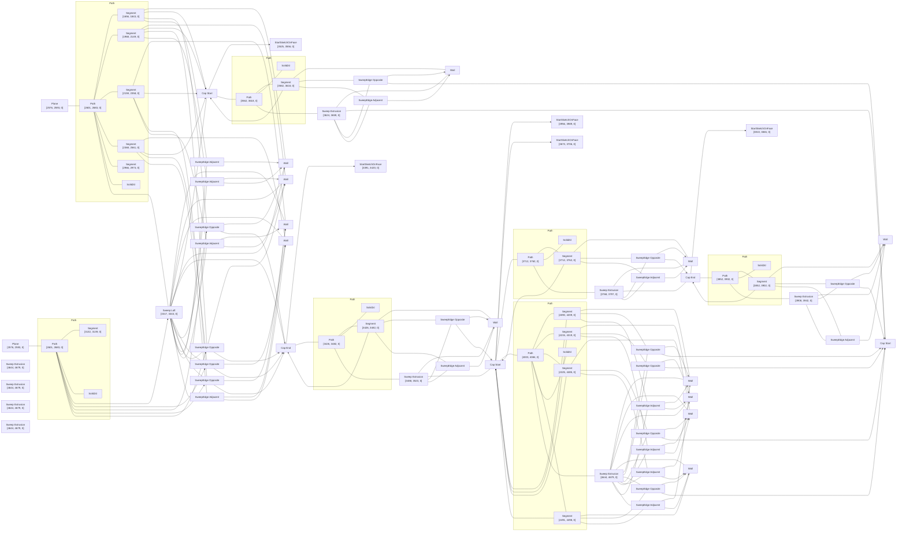

```mermaid
flowchart LR
  subgraph path8 [Path]
    8["Path<br>[2601, 2683, 0]"]
    15["Segment<br>[1656, 1843, 0]"]
    16["Segment<br>[1968, 2149, 0]"]
    17["Segment<br>[2159, 2358, 0]"]
    18["Segment<br>[2368, 2561, 0]"]
    19["Segment<br>[2966, 2973, 0]"]
    32[Solid2d]
  end
  subgraph path9 [Path]
    9["Path<br>[2601, 2683, 0]"]
    20["Segment<br>[3132, 3139, 0]"]
    35[Solid2d]
  end
  subgraph path10 [Path]
    10["Path<br>[3426, 3482, 0]"]
    21["Segment<br>[3426, 3482, 0]"]
    31[Solid2d]
  end
  subgraph path11 [Path]
    11["Path<br>[3562, 3618, 0]"]
    22["Segment<br>[3562, 3618, 0]"]
    29[Solid2d]
  end
  subgraph path12 [Path]
    12["Path<br>[3712, 3762, 0]"]
    23["Segment<br>[3712, 3762, 0]"]
    30[Solid2d]
  end
  subgraph path13 [Path]
    13["Path<br>[3852, 3902, 0]"]
    24["Segment<br>[3852, 3902, 0]"]
    34[Solid2d]
  end
  subgraph path14 [Path]
    14["Path<br>[4003, 4084, 0]"]
    25["Segment<br>[4090, 4209, 0]"]
    26["Segment<br>[4215, 4319, 0]"]
    27["Segment<br>[4325, 4485, 0]"]
    28["Segment<br>[4491, 4498, 0]"]
    33[Solid2d]
  end
  1["Plane<br>[2576, 2593, 0]"]
  2["Plane<br>[2576, 2593, 0]"]
  3["StartSketchOnFace<br>[3956, 3989, 0]"]
  4["StartSketchOnFace<br>[3525, 3556, 0]"]
  5["StartSketchOnFace<br>[3810, 3846, 0]"]
  6["StartSketchOnFace<br>[3391, 3420, 0]"]
  7["StartSketchOnFace<br>[3673, 3706, 0]"]
  36["Sweep Loft<br>[3317, 3343, 0]"]
  37["Sweep Extrusion<br>[3488, 3523, 0]"]
  38["Sweep Extrusion<br>[3624, 3659, 0]"]
  39["Sweep Extrusion<br>[3768, 3797, 0]"]
  40["Sweep Extrusion<br>[3908, 3942, 0]"]
  41["Sweep Extrusion<br>[4644, 4679, 0]"]
  42["Sweep Extrusion<br>[4644, 4679, 0]"]
  43["Sweep Extrusion<br>[4644, 4679, 0]"]
  44["Sweep Extrusion<br>[4644, 4679, 0]"]
  45["Sweep Extrusion<br>[4644, 4679, 0]"]
  46[Wall]
  47[Wall]
  48[Wall]
  49[Wall]
  50[Wall]
  51[Wall]
  52[Wall]
  53[Wall]
  54[Wall]
  55[Wall]
  56[Wall]
  57[Wall]
  58["Cap Start"]
  59["Cap Start"]
  60["Cap Start"]
  61["Cap End"]
  62["Cap End"]
  63["SweepEdge Opposite"]
  64["SweepEdge Opposite"]
  65["SweepEdge Opposite"]
  66["SweepEdge Opposite"]
  67["SweepEdge Opposite"]
  68["SweepEdge Opposite"]
  69["SweepEdge Opposite"]
  70["SweepEdge Opposite"]
  71["SweepEdge Opposite"]
  72["SweepEdge Opposite"]
  73["SweepEdge Opposite"]
  74["SweepEdge Opposite"]
  75["SweepEdge Adjacent"]
  76["SweepEdge Adjacent"]
  77["SweepEdge Adjacent"]
  78["SweepEdge Adjacent"]
  79["SweepEdge Adjacent"]
  80["SweepEdge Adjacent"]
  81["SweepEdge Adjacent"]
  82["SweepEdge Adjacent"]
  83["SweepEdge Adjacent"]
  84["SweepEdge Adjacent"]
  85["SweepEdge Adjacent"]
  86["SweepEdge Adjacent"]
  1 --- 9
  2 --- 8
  60 x--> 3
  59 x--> 4
  61 x--> 5
  62 x--> 6
  60 x--> 7
  8 --- 15
  8 --- 16
  8 --- 17
  8 --- 18
  8 --- 19
  8 --- 32
  8 ---- 36
  9 --- 20
  9 --- 35
  9 x---> 36
  9 x--> 68
  9 x--> 69
  9 x--> 70
  9 x--> 71
  10 --- 21
  10 --- 31
  10 ---- 37
  62 --- 10
  11 --- 22
  11 --- 29
  11 ---- 38
  59 --- 11
  12 --- 23
  12 --- 30
  12 ---- 39
  60 --- 12
  13 --- 24
  13 --- 34
  13 ---- 40
  61 --- 13
  14 --- 25
  14 --- 26
  14 --- 27
  14 --- 28
  14 --- 33
  14 ---- 41
  60 --- 14
  15 --- 54
  15 x--> 59
  15 --- 69
  15 --- 82
  16 --- 52
  16 x--> 59
  16 --- 71
  16 --- 80
  17 --- 51
  17 x--> 59
  17 --- 70
  17 --- 81
  18 --- 53
  18 x--> 59
  18 --- 68
  18 --- 83
  21 --- 56
  21 x--> 62
  21 --- 73
  21 --- 85
  22 --- 50
  22 x--> 59
  22 --- 67
  22 --- 79
  23 --- 55
  23 x--> 60
  23 --- 72
  23 --- 84
  24 --- 57
  24 x--> 61
  24 --- 74
  24 --- 86
  25 --- 46
  25 x--> 60
  25 --- 63
  25 --- 78
  26 --- 48
  26 x--> 60
  26 --- 64
  26 --- 76
  27 --- 47
  27 x--> 60
  27 --- 66
  27 --- 75
  28 --- 49
  28 x--> 60
  28 --- 65
  28 --- 77
  36 --- 51
  36 --- 52
  36 --- 53
  36 --- 54
  36 --- 59
  36 --- 62
  36 --- 68
  36 --- 69
  36 --- 70
  36 --- 71
  36 --- 80
  36 --- 81
  36 --- 82
  36 --- 83
  37 --- 56
  37 --- 60
  37 --- 73
  37 --- 85
  38 --- 50
  38 --- 58
  38 --- 67
  38 --- 79
  39 --- 55
  39 --- 61
  39 --- 72
  39 --- 84
  40 --- 57
  40 --- 74
  40 --- 86
  41 --- 46
  41 --- 47
  41 --- 48
  41 --- 49
  41 --- 63
  41 --- 64
  41 --- 65
  41 --- 66
  41 --- 75
  41 --- 76
  41 --- 77
  41 --- 78
  63 <--x 46
  77 <--x 46
  78 <--x 46
  66 <--x 47
  75 <--x 47
  76 <--x 47
  64 <--x 48
  76 <--x 48
  78 <--x 48
  65 <--x 49
  75 <--x 49
  77 <--x 49
  67 <--x 50
  79 <--x 50
  70 <--x 51
  81 <--x 51
  83 <--x 51
  71 <--x 52
  80 <--x 52
  81 <--x 52
  68 <--x 53
  83 <--x 53
  69 <--x 54
  80 <--x 54
  82 <--x 54
  72 <--x 55
  84 <--x 55
  73 <--x 56
  85 <--x 56
  74 <--x 57
  86 <--x 57
  63 <--x 58
  64 <--x 58
  65 <--x 58
  66 <--x 58
  67 <--x 58
  74 <--x 58
  73 <--x 60
  72 <--x 61
  68 <--x 62
  69 <--x 62
  70 <--x 62
  71 <--x 62
```
