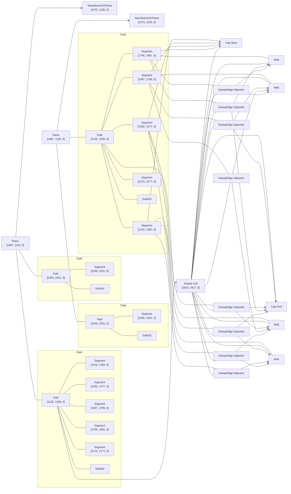

```mermaid
flowchart LR
  subgraph path5 [Path]
    5["Path<br>[1136, 1206, 0]"]
    9["Segment<br>[1216, 1382, 0]"]
    11["Segment<br>[1392, 1477, 0]"]
    14["Segment<br>[1487, 1708, 0]"]
    15["Segment<br>[1795, 1881, 0]"]
    17["Segment<br>[2170, 2177, 0]"]
    22[Solid2d]
  end
  subgraph path6 [Path]
    6["Path<br>[1136, 1206, 0]"]
    10["Segment<br>[1216, 1382, 0]"]
    12["Segment<br>[1392, 1477, 0]"]
    13["Segment<br>[1487, 1708, 0]"]
    16["Segment<br>[1795, 1881, 0]"]
    18["Segment<br>[2170, 2177, 0]"]
    23[Solid2d]
  end
  subgraph path7 [Path]
    7["Path<br>[2256, 2291, 0]"]
    20["Segment<br>[2256, 2291, 0]"]
    21[Solid2d]
  end
  subgraph path8 [Path]
    8["Path<br>[2256, 2291, 0]"]
    19["Segment<br>[2256, 2291, 0]"]
    24[Solid2d]
  end
  1["Plane<br>[1087, 1125, 0]"]
  2["Plane<br>[1087, 1125, 0]"]
  3["StartSketchOnPlane<br>[1073, 1126, 0]"]
  4["StartSketchOnPlane<br>[1073, 1126, 0]"]
  25["Sweep Loft<br>[2816, 2917, 0]"]
  26[Wall]
  27[Wall]
  28[Wall]
  29[Wall]
  30["Cap Start"]
  31["Cap End"]
  32["SweepEdge Opposite"]
  33["SweepEdge Opposite"]
  34["SweepEdge Opposite"]
  35["SweepEdge Opposite"]
  36["SweepEdge Adjacent"]
  37["SweepEdge Adjacent"]
  38["SweepEdge Adjacent"]
  39["SweepEdge Adjacent"]
  1 <--x 4
  1 --- 5
  1 --- 7
  2 <--x 3
  2 --- 6
  2 --- 8
  5 --- 9
  5 --- 11
  5 --- 14
  5 --- 15
  5 --- 17
  5 --- 22
  5 x---> 25
  6 --- 10
  6 --- 12
  6 --- 13
  6 --- 16
  6 --- 18
  6 --- 23
  6 ---- 25
  7 --- 20
  7 --- 21
  8 --- 19
  8 --- 24
  10 --- 28
  10 x--> 30
  10 --- 35
  10 --- 36
  12 --- 27
  12 x--> 30
  12 --- 33
  12 --- 39
  13 --- 26
  13 x--> 30
  13 --- 32
  13 --- 37
  16 --- 29
  16 x--> 30
  16 --- 34
  16 --- 38
  25 --- 26
  25 --- 27
  25 --- 28
  25 --- 29
  25 --- 30
  25 --- 31
  25 --- 32
  25 --- 33
  25 --- 34
  25 --- 35
  25 --- 36
  25 --- 37
  25 --- 38
  25 --- 39
  32 <--x 26
  37 <--x 26
  38 <--x 26
  33 <--x 27
  37 <--x 27
  39 <--x 27
  35 <--x 28
  36 <--x 28
  39 <--x 28
  34 <--x 29
  38 <--x 29
  32 <--x 31
  33 <--x 31
  34 <--x 31
  35 <--x 31
```
