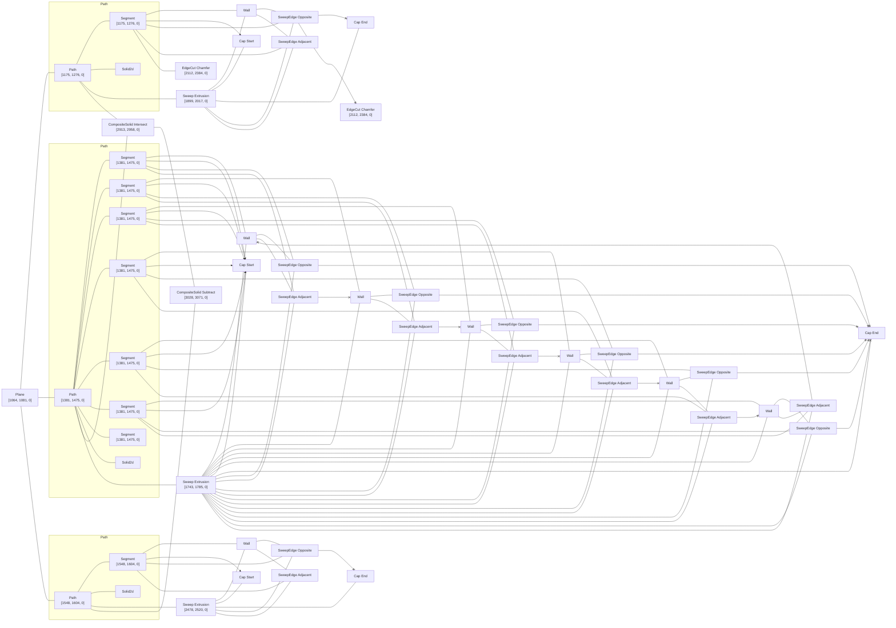

```mermaid
flowchart LR
  subgraph path2 [Path]
    2["Path<br>[1175, 1276, 0]"]
      %% [ProgramBodyItem { index: 7 }, VariableDeclarationDeclaration, VariableDeclarationInit]
    3["Segment<br>[1175, 1276, 0]"]
      %% [ProgramBodyItem { index: 7 }, VariableDeclarationDeclaration, VariableDeclarationInit]
    4[Solid2d]
  end
  subgraph path5 [Path]
    5["Path<br>[1381, 1475, 0]"]
      %% [ProgramBodyItem { index: 8 }, VariableDeclarationDeclaration, VariableDeclarationInit]
    6["Segment<br>[1381, 1475, 0]"]
      %% [ProgramBodyItem { index: 8 }, VariableDeclarationDeclaration, VariableDeclarationInit]
    7["Segment<br>[1381, 1475, 0]"]
      %% [ProgramBodyItem { index: 8 }, VariableDeclarationDeclaration, VariableDeclarationInit]
    8["Segment<br>[1381, 1475, 0]"]
      %% [ProgramBodyItem { index: 8 }, VariableDeclarationDeclaration, VariableDeclarationInit]
    9["Segment<br>[1381, 1475, 0]"]
      %% [ProgramBodyItem { index: 8 }, VariableDeclarationDeclaration, VariableDeclarationInit]
    10["Segment<br>[1381, 1475, 0]"]
      %% [ProgramBodyItem { index: 8 }, VariableDeclarationDeclaration, VariableDeclarationInit]
    11["Segment<br>[1381, 1475, 0]"]
      %% [ProgramBodyItem { index: 8 }, VariableDeclarationDeclaration, VariableDeclarationInit]
    12["Segment<br>[1381, 1475, 0]"]
      %% [ProgramBodyItem { index: 8 }, VariableDeclarationDeclaration, VariableDeclarationInit]
    13[Solid2d]
  end
  subgraph path14 [Path]
    14["Path<br>[1548, 1604, 0]"]
      %% [ProgramBodyItem { index: 9 }, VariableDeclarationDeclaration, VariableDeclarationInit]
    15["Segment<br>[1548, 1604, 0]"]
      %% [ProgramBodyItem { index: 9 }, VariableDeclarationDeclaration, VariableDeclarationInit]
    16[Solid2d]
  end
  1["Plane<br>[1064, 1081, 0]"]
    %% [ProgramBodyItem { index: 6 }, VariableDeclarationDeclaration, VariableDeclarationInit]
  17["Sweep Extrusion<br>[1743, 1785, 0]"]
    %% [ProgramBodyItem { index: 10 }, VariableDeclarationDeclaration, VariableDeclarationInit]
  18[Wall]
    %% face_code_ref=Missing NodePath
  19[Wall]
    %% face_code_ref=Missing NodePath
  20[Wall]
    %% face_code_ref=Missing NodePath
  21[Wall]
    %% face_code_ref=Missing NodePath
  22[Wall]
    %% face_code_ref=Missing NodePath
  23[Wall]
    %% face_code_ref=Missing NodePath
  24["Cap Start"]
    %% face_code_ref=Missing NodePath
  25["Cap End"]
    %% face_code_ref=Missing NodePath
  26["SweepEdge Opposite"]
  27["SweepEdge Adjacent"]
  28["SweepEdge Opposite"]
  29["SweepEdge Adjacent"]
  30["SweepEdge Opposite"]
  31["SweepEdge Adjacent"]
  32["SweepEdge Opposite"]
  33["SweepEdge Adjacent"]
  34["SweepEdge Opposite"]
  35["SweepEdge Adjacent"]
  36["SweepEdge Opposite"]
  37["SweepEdge Adjacent"]
  38["Sweep Extrusion<br>[1899, 2017, 0]"]
    %% [ProgramBodyItem { index: 11 }, VariableDeclarationDeclaration, VariableDeclarationInit]
  39[Wall]
    %% face_code_ref=Missing NodePath
  40["Cap Start"]
    %% face_code_ref=Missing NodePath
  41["Cap End"]
    %% face_code_ref=Missing NodePath
  42["SweepEdge Opposite"]
  43["SweepEdge Adjacent"]
  44["EdgeCut Chamfer<br>[2112, 2384, 0]"]
    %% [ProgramBodyItem { index: 12 }, VariableDeclarationDeclaration, VariableDeclarationInit]
  45["EdgeCut Chamfer<br>[2112, 2384, 0]"]
    %% [ProgramBodyItem { index: 12 }, VariableDeclarationDeclaration, VariableDeclarationInit]
  46["Sweep Extrusion<br>[2478, 2520, 0]"]
    %% [ProgramBodyItem { index: 13 }, VariableDeclarationDeclaration, VariableDeclarationInit]
  47[Wall]
    %% face_code_ref=Missing NodePath
  48["Cap Start"]
    %% face_code_ref=Missing NodePath
  49["Cap End"]
    %% face_code_ref=Missing NodePath
  50["SweepEdge Opposite"]
  51["SweepEdge Adjacent"]
  52["CompositeSolid Intersect<br>[2913, 2958, 0]"]
    %% [ProgramBodyItem { index: 14 }, VariableDeclarationDeclaration, VariableDeclarationInit]
  53["CompositeSolid Subtract<br>[3028, 3071, 0]"]
    %% [ProgramBodyItem { index: 15 }, VariableDeclarationDeclaration, VariableDeclarationInit]
  1 --- 2
  1 --- 5
  1 --- 14
  2 --- 3
  2 --- 4
  2 ---- 38
  2 --- 52
  3 --- 39
  3 x--> 40
  3 --- 42
  3 --- 43
  3 --- 44
  5 --- 6
  5 --- 7
  5 --- 8
  5 --- 9
  5 --- 10
  5 --- 11
  5 --- 12
  5 --- 13
  5 ---- 17
  5 --- 52
  6 --- 18
  6 x--> 24
  6 --- 26
  6 --- 27
  7 --- 19
  7 x--> 24
  7 --- 28
  7 --- 29
  8 --- 20
  8 x--> 24
  8 --- 30
  8 --- 31
  9 --- 21
  9 x--> 24
  9 --- 32
  9 --- 33
  10 --- 22
  10 x--> 24
  10 --- 34
  10 --- 35
  11 --- 23
  11 x--> 24
  11 --- 36
  11 --- 37
  14 --- 15
  14 --- 16
  14 ---- 46
  14 --- 53
  15 --- 47
  15 x--> 48
  15 --- 50
  15 --- 51
  17 --- 18
  17 --- 19
  17 --- 20
  17 --- 21
  17 --- 22
  17 --- 23
  17 --- 24
  17 --- 25
  17 --- 26
  17 --- 27
  17 --- 28
  17 --- 29
  17 --- 30
  17 --- 31
  17 --- 32
  17 --- 33
  17 --- 34
  17 --- 35
  17 --- 36
  17 --- 37
  18 --- 26
  18 --- 27
  37 <--x 18
  27 <--x 19
  19 --- 28
  19 --- 29
  29 <--x 20
  20 --- 30
  20 --- 31
  31 <--x 21
  21 --- 32
  21 --- 33
  33 <--x 22
  22 --- 34
  22 --- 35
  35 <--x 23
  23 --- 36
  23 --- 37
  26 <--x 25
  28 <--x 25
  30 <--x 25
  32 <--x 25
  34 <--x 25
  36 <--x 25
  38 --- 39
  38 --- 40
  38 --- 41
  38 --- 42
  38 --- 43
  39 --- 42
  39 --- 43
  42 <--x 41
  42 <--x 45
  46 --- 47
  46 --- 48
  46 --- 49
  46 --- 50
  46 --- 51
  47 --- 50
  47 --- 51
  50 <--x 49
  52 --- 53
```
