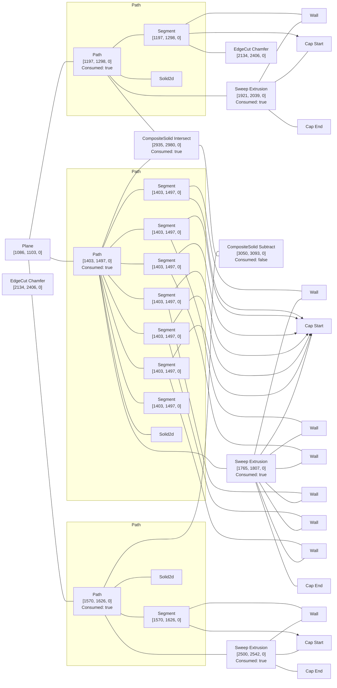

```mermaid
flowchart LR
  subgraph path2 [Path]
    2["Path<br>[1197, 1298, 0]<br>Consumed: true"]
      %% [ProgramBodyItem { index: 7 }, VariableDeclarationDeclaration, VariableDeclarationInit]
    3["Segment<br>[1197, 1298, 0]"]
      %% [ProgramBodyItem { index: 7 }, VariableDeclarationDeclaration, VariableDeclarationInit]
    4[Solid2d]
  end
  subgraph path5 [Path]
    5["Path<br>[1403, 1497, 0]<br>Consumed: true"]
      %% [ProgramBodyItem { index: 8 }, VariableDeclarationDeclaration, VariableDeclarationInit]
    6["Segment<br>[1403, 1497, 0]"]
      %% [ProgramBodyItem { index: 8 }, VariableDeclarationDeclaration, VariableDeclarationInit]
    7["Segment<br>[1403, 1497, 0]"]
      %% [ProgramBodyItem { index: 8 }, VariableDeclarationDeclaration, VariableDeclarationInit]
    8["Segment<br>[1403, 1497, 0]"]
      %% [ProgramBodyItem { index: 8 }, VariableDeclarationDeclaration, VariableDeclarationInit]
    9["Segment<br>[1403, 1497, 0]"]
      %% [ProgramBodyItem { index: 8 }, VariableDeclarationDeclaration, VariableDeclarationInit]
    10["Segment<br>[1403, 1497, 0]"]
      %% [ProgramBodyItem { index: 8 }, VariableDeclarationDeclaration, VariableDeclarationInit]
    11["Segment<br>[1403, 1497, 0]"]
      %% [ProgramBodyItem { index: 8 }, VariableDeclarationDeclaration, VariableDeclarationInit]
    12["Segment<br>[1403, 1497, 0]"]
      %% [ProgramBodyItem { index: 8 }, VariableDeclarationDeclaration, VariableDeclarationInit]
    13[Solid2d]
  end
  subgraph path14 [Path]
    14["Path<br>[1570, 1626, 0]<br>Consumed: true"]
      %% [ProgramBodyItem { index: 9 }, VariableDeclarationDeclaration, VariableDeclarationInit]
    15["Segment<br>[1570, 1626, 0]"]
      %% [ProgramBodyItem { index: 9 }, VariableDeclarationDeclaration, VariableDeclarationInit]
    16[Solid2d]
  end
  1["Plane<br>[1086, 1103, 0]"]
    %% [ProgramBodyItem { index: 6 }, VariableDeclarationDeclaration, VariableDeclarationInit]
  17["Sweep Extrusion<br>[1765, 1807, 0]<br>Consumed: true"]
    %% [ProgramBodyItem { index: 10 }, VariableDeclarationDeclaration, VariableDeclarationInit]
  18[Wall]
    %% face_code_ref=Missing NodePath
  19[Wall]
    %% face_code_ref=Missing NodePath
  20[Wall]
    %% face_code_ref=Missing NodePath
  21[Wall]
    %% face_code_ref=Missing NodePath
  22[Wall]
    %% face_code_ref=Missing NodePath
  23[Wall]
    %% face_code_ref=Missing NodePath
  24["Cap Start"]
    %% face_code_ref=Missing NodePath
  25["Cap End"]
    %% face_code_ref=Missing NodePath
  26["Sweep Extrusion<br>[1921, 2039, 0]<br>Consumed: true"]
    %% [ProgramBodyItem { index: 11 }, VariableDeclarationDeclaration, VariableDeclarationInit]
  27[Wall]
    %% face_code_ref=Missing NodePath
  28["Cap Start"]
    %% face_code_ref=Missing NodePath
  29["Cap End"]
    %% face_code_ref=Missing NodePath
  30["EdgeCut Chamfer<br>[2134, 2406, 0]"]
    %% [ProgramBodyItem { index: 12 }, VariableDeclarationDeclaration, VariableDeclarationInit]
  31["EdgeCut Chamfer<br>[2134, 2406, 0]"]
    %% [ProgramBodyItem { index: 12 }, VariableDeclarationDeclaration, VariableDeclarationInit]
  32["Sweep Extrusion<br>[2500, 2542, 0]<br>Consumed: true"]
    %% [ProgramBodyItem { index: 13 }, VariableDeclarationDeclaration, VariableDeclarationInit]
  33[Wall]
    %% face_code_ref=Missing NodePath
  34["Cap Start"]
    %% face_code_ref=Missing NodePath
  35["Cap End"]
    %% face_code_ref=Missing NodePath
  36["CompositeSolid Intersect<br>[2935, 2980, 0]<br>Consumed: true"]
    %% [ProgramBodyItem { index: 14 }, VariableDeclarationDeclaration, VariableDeclarationInit]
  37["CompositeSolid Subtract<br>[3050, 3093, 0]<br>Consumed: false"]
    %% [ProgramBodyItem { index: 15 }, VariableDeclarationDeclaration, VariableDeclarationInit]
  1 --- 2
  1 --- 5
  1 --- 14
  2 --- 3
  2 --- 4
  2 ---- 26
  2 --- 36
  3 --- 27
  3 x--> 28
  3 --- 30
  5 --- 6
  5 --- 7
  5 --- 8
  5 --- 9
  5 --- 10
  5 --- 11
  5 --- 12
  5 --- 13
  5 ---- 17
  5 --- 36
  6 --- 18
  6 x--> 24
  7 --- 19
  7 x--> 24
  8 --- 20
  8 x--> 24
  9 --- 21
  9 x--> 24
  10 --- 22
  10 x--> 24
  11 --- 23
  11 x--> 24
  14 --- 15
  14 --- 16
  14 ---- 32
  14 --- 37
  15 --- 33
  15 x--> 34
  17 --- 18
  17 --- 19
  17 --- 20
  17 --- 21
  17 --- 22
  17 --- 23
  17 --- 24
  17 --- 25
  26 --- 27
  26 --- 28
  26 --- 29
  32 --- 33
  32 --- 34
  32 --- 35
  36 --- 37
```
