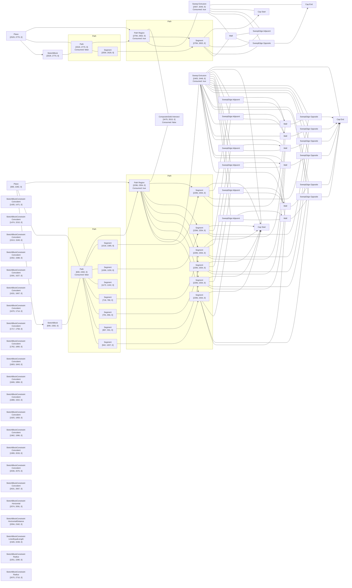

```mermaid
flowchart LR
  subgraph path9 [Path]
    9["Path<br>[690, 2282, 0]<br>Consumed: false"]
      %% [ProgramBodyItem { index: 6 }, VariableDeclarationDeclaration, VariableDeclarationInit]
    23["Segment<br>[718, 780, 0]"]
      %% [ProgramBodyItem { index: 6 }, VariableDeclarationDeclaration, VariableDeclarationInit, SketchBlockBody, SketchBlockBodyItem { index: 0 }, VariableDeclarationDeclaration, VariableDeclarationInit]
    24["Segment<br>[791, 856, 0]"]
      %% [ProgramBodyItem { index: 6 }, VariableDeclarationDeclaration, VariableDeclarationInit, SketchBlockBody, SketchBlockBodyItem { index: 1 }, VariableDeclarationDeclaration, VariableDeclarationInit]
    25["Segment<br>[867, 931, 0]"]
      %% [ProgramBodyItem { index: 6 }, VariableDeclarationDeclaration, VariableDeclarationInit, SketchBlockBody, SketchBlockBodyItem { index: 2 }, VariableDeclarationDeclaration, VariableDeclarationInit]
    26["Segment<br>[942, 1007, 0]"]
      %% [ProgramBodyItem { index: 6 }, VariableDeclarationDeclaration, VariableDeclarationInit, SketchBlockBody, SketchBlockBodyItem { index: 3 }, VariableDeclarationDeclaration, VariableDeclarationInit]
    12["Segment<br>[1018, 1085, 0]"]
      %% [ProgramBodyItem { index: 6 }, VariableDeclarationDeclaration, VariableDeclarationInit, SketchBlockBody, SketchBlockBodyItem { index: 4 }, VariableDeclarationDeclaration, VariableDeclarationInit]
    13["Segment<br>[1096, 1159, 0]"]
      %% [ProgramBodyItem { index: 6 }, VariableDeclarationDeclaration, VariableDeclarationInit, SketchBlockBody, SketchBlockBodyItem { index: 5 }, VariableDeclarationDeclaration, VariableDeclarationInit]
    14["Segment<br>[1173, 1242, 0]"]
      %% [ProgramBodyItem { index: 6 }, VariableDeclarationDeclaration, VariableDeclarationInit, SketchBlockBody, SketchBlockBodyItem { index: 6 }, VariableDeclarationDeclaration, VariableDeclarationInit]
  end
  subgraph path6 [Path]
    6["Path Region<br>[2296, 2354, 0]<br>Consumed: true"]
      %% [ProgramBodyItem { index: 7 }, VariableDeclarationDeclaration, VariableDeclarationInit]
    17["Segment<br>[2296, 2354, 0]"]
      %% [ProgramBodyItem { index: 7 }, VariableDeclarationDeclaration, VariableDeclarationInit]
    18["Segment<br>[2296, 2354, 0]"]
      %% [ProgramBodyItem { index: 7 }, VariableDeclarationDeclaration, VariableDeclarationInit]
    19["Segment<br>[2296, 2354, 0]"]
      %% [ProgramBodyItem { index: 7 }, VariableDeclarationDeclaration, VariableDeclarationInit]
    20["Segment<br>[2296, 2354, 0]"]
      %% [ProgramBodyItem { index: 7 }, VariableDeclarationDeclaration, VariableDeclarationInit]
    15["Segment<br>[2296, 2354, 0]"]
      %% [ProgramBodyItem { index: 7 }, VariableDeclarationDeclaration, VariableDeclarationInit]
    16["Segment<br>[2296, 2354, 0]"]
      %% [ProgramBodyItem { index: 7 }, VariableDeclarationDeclaration, VariableDeclarationInit]
  end
  subgraph path8 [Path]
    8["Path<br>[2529, 2770, 0]<br>Consumed: false"]
      %% [ProgramBodyItem { index: 9 }, VariableDeclarationDeclaration, VariableDeclarationInit]
    21["Segment<br>[2559, 2628, 0]"]
      %% [ProgramBodyItem { index: 9 }, VariableDeclarationDeclaration, VariableDeclarationInit, SketchBlockBody, SketchBlockBodyItem { index: 0 }, VariableDeclarationDeclaration, VariableDeclarationInit]
  end
  subgraph path7 [Path]
    7["Path Region<br>[2784, 2832, 0]<br>Consumed: true"]
      %% [ProgramBodyItem { index: 10 }, VariableDeclarationDeclaration, VariableDeclarationInit]
    22["Segment<br>[2784, 2832, 0]"]
      %% [ProgramBodyItem { index: 10 }, VariableDeclarationDeclaration, VariableDeclarationInit]
  end
  11["Plane<br>[690, 2282, 0]"]
    %% [ProgramBodyItem { index: 6 }, VariableDeclarationDeclaration, VariableDeclarationInit]
  51["Sweep Extrusion<br>[2405, 2446, 0]<br>Consumed: true"]
    %% [ProgramBodyItem { index: 8 }, VariableDeclarationDeclaration, VariableDeclarationInit]
  67[Wall]
    %% face_code_ref=Missing NodePath
  68[Wall]
    %% face_code_ref=Missing NodePath
  69[Wall]
    %% face_code_ref=Missing NodePath
  70[Wall]
    %% face_code_ref=Missing NodePath
  71[Wall]
    %% face_code_ref=Missing NodePath
  72[Wall]
    %% face_code_ref=Missing NodePath
  3["Cap Start"]
    %% face_code_ref=Missing NodePath
  1["Cap End"]
    %% face_code_ref=Missing NodePath
  60["SweepEdge Opposite"]
  53["SweepEdge Adjacent"]
  61["SweepEdge Opposite"]
  54["SweepEdge Adjacent"]
  62["SweepEdge Opposite"]
  55["SweepEdge Adjacent"]
  63["SweepEdge Opposite"]
  56["SweepEdge Adjacent"]
  64["SweepEdge Opposite"]
  57["SweepEdge Adjacent"]
  65["SweepEdge Opposite"]
  58["SweepEdge Adjacent"]
  10["Plane<br>[2529, 2770, 0]"]
    %% [ProgramBodyItem { index: 9 }, VariableDeclarationDeclaration, VariableDeclarationInit]
  52["Sweep Extrusion<br>[2937, 3045, 0]<br>Consumed: true"]
    %% [ProgramBodyItem { index: 11 }, VariableDeclarationDeclaration, VariableDeclarationInit]
  73[Wall]
    %% face_code_ref=Missing NodePath
  4["Cap Start"]
    %% face_code_ref=Missing NodePath
  2["Cap End"]
    %% face_code_ref=Missing NodePath
  66["SweepEdge Opposite"]
  59["SweepEdge Adjacent"]
  5["CompositeSolid Intersect<br>[3470, 3515, 0]<br>Consumed: false"]
    %% [ProgramBodyItem { index: 13 }, VariableDeclarationDeclaration, VariableDeclarationInit]
  28["SketchBlock<br>[690, 2282, 0]"]
    %% [ProgramBodyItem { index: 6 }, VariableDeclarationDeclaration, VariableDeclarationInit]
  29["SketchBlockConstraint Coincident<br>[1435, 1471, 0]"]
    %% [ProgramBodyItem { index: 6 }, VariableDeclarationDeclaration, VariableDeclarationInit, SketchBlockBody, SketchBlockBodyItem { index: 9 }, ExpressionStatementExpr]
  30["SketchBlockConstraint Coincident<br>[1474, 1510, 0]"]
    %% [ProgramBodyItem { index: 6 }, VariableDeclarationDeclaration, VariableDeclarationInit, SketchBlockBody, SketchBlockBodyItem { index: 10 }, ExpressionStatementExpr]
  31["SketchBlockConstraint Coincident<br>[1513, 1549, 0]"]
    %% [ProgramBodyItem { index: 6 }, VariableDeclarationDeclaration, VariableDeclarationInit, SketchBlockBody, SketchBlockBodyItem { index: 11 }, ExpressionStatementExpr]
  32["SketchBlockConstraint Coincident<br>[1552, 1588, 0]"]
    %% [ProgramBodyItem { index: 6 }, VariableDeclarationDeclaration, VariableDeclarationInit, SketchBlockBody, SketchBlockBodyItem { index: 12 }, ExpressionStatementExpr]
  33["SketchBlockConstraint Coincident<br>[1591, 1627, 0]"]
    %% [ProgramBodyItem { index: 6 }, VariableDeclarationDeclaration, VariableDeclarationInit, SketchBlockBody, SketchBlockBodyItem { index: 13 }, ExpressionStatementExpr]
  34["SketchBlockConstraint Coincident<br>[1631, 1667, 0]"]
    %% [ProgramBodyItem { index: 6 }, VariableDeclarationDeclaration, VariableDeclarationInit, SketchBlockBody, SketchBlockBodyItem { index: 14 }, ExpressionStatementExpr]
  35["SketchBlockConstraint Coincident<br>[1670, 1714, 0]"]
    %% [ProgramBodyItem { index: 6 }, VariableDeclarationDeclaration, VariableDeclarationInit, SketchBlockBody, SketchBlockBodyItem { index: 15 }, ExpressionStatementExpr]
  36["SketchBlockConstraint Coincident<br>[1717, 1758, 0]"]
    %% [ProgramBodyItem { index: 6 }, VariableDeclarationDeclaration, VariableDeclarationInit, SketchBlockBody, SketchBlockBodyItem { index: 16 }, ExpressionStatementExpr]
  37["SketchBlockConstraint Coincident<br>[1762, 1800, 0]"]
    %% [ProgramBodyItem { index: 6 }, VariableDeclarationDeclaration, VariableDeclarationInit, SketchBlockBody, SketchBlockBodyItem { index: 17 }, ExpressionStatementExpr]
  38["SketchBlockConstraint Coincident<br>[1803, 1843, 0]"]
    %% [ProgramBodyItem { index: 6 }, VariableDeclarationDeclaration, VariableDeclarationInit, SketchBlockBody, SketchBlockBodyItem { index: 18 }, ExpressionStatementExpr]
  39["SketchBlockConstraint Coincident<br>[1846, 1884, 0]"]
    %% [ProgramBodyItem { index: 6 }, VariableDeclarationDeclaration, VariableDeclarationInit, SketchBlockBody, SketchBlockBodyItem { index: 19 }, ExpressionStatementExpr]
  40["SketchBlockConstraint Coincident<br>[1888, 1922, 0]"]
    %% [ProgramBodyItem { index: 6 }, VariableDeclarationDeclaration, VariableDeclarationInit, SketchBlockBody, SketchBlockBodyItem { index: 20 }, ExpressionStatementExpr]
  41["SketchBlockConstraint Coincident<br>[1925, 1959, 0]"]
    %% [ProgramBodyItem { index: 6 }, VariableDeclarationDeclaration, VariableDeclarationInit, SketchBlockBody, SketchBlockBodyItem { index: 21 }, ExpressionStatementExpr]
  42["SketchBlockConstraint Coincident<br>[1962, 1996, 0]"]
    %% [ProgramBodyItem { index: 6 }, VariableDeclarationDeclaration, VariableDeclarationInit, SketchBlockBody, SketchBlockBodyItem { index: 22 }, ExpressionStatementExpr]
  43["SketchBlockConstraint Coincident<br>[1999, 2033, 0]"]
    %% [ProgramBodyItem { index: 6 }, VariableDeclarationDeclaration, VariableDeclarationInit, SketchBlockBody, SketchBlockBodyItem { index: 23 }, ExpressionStatementExpr]
  44["SketchBlockConstraint Coincident<br>[2036, 2070, 0]"]
    %% [ProgramBodyItem { index: 6 }, VariableDeclarationDeclaration, VariableDeclarationInit, SketchBlockBody, SketchBlockBodyItem { index: 24 }, ExpressionStatementExpr]
  46["SketchBlockConstraint Horizontal<br>[2074, 2091, 0]"]
    %% [ProgramBodyItem { index: 6 }, VariableDeclarationDeclaration, VariableDeclarationInit, SketchBlockBody, SketchBlockBodyItem { index: 25 }, ExpressionStatementExpr]
  47["SketchBlockConstraint HorizontalDistance<br>[2094, 2162, 0]"]
    %% [ProgramBodyItem { index: 6 }, VariableDeclarationDeclaration, VariableDeclarationInit, SketchBlockBody, SketchBlockBodyItem { index: 26 }, ExpressionStatementExpr]
  48["SketchBlockConstraint LinesEqualLength<br>[2165, 2248, 0]"]
    %% [ProgramBodyItem { index: 6 }, VariableDeclarationDeclaration, VariableDeclarationInit, SketchBlockBody, SketchBlockBodyItem { index: 27 }, ExpressionStatementExpr]
  49["SketchBlockConstraint Radius<br>[2251, 2280, 0]"]
    %% [ProgramBodyItem { index: 6 }, VariableDeclarationDeclaration, VariableDeclarationInit, SketchBlockBody, SketchBlockBodyItem { index: 28 }, ExpressionStatementExpr]
  27["SketchBlock<br>[2529, 2770, 0]"]
    %% [ProgramBodyItem { index: 9 }, VariableDeclarationDeclaration, VariableDeclarationInit]
  45["SketchBlockConstraint Coincident<br>[2631, 2667, 0]"]
    %% [ProgramBodyItem { index: 9 }, VariableDeclarationDeclaration, VariableDeclarationInit, SketchBlockBody, SketchBlockBodyItem { index: 1 }, ExpressionStatementExpr]
  50["SketchBlockConstraint Radius<br>[2670, 2716, 0]"]
    %% [ProgramBodyItem { index: 9 }, VariableDeclarationDeclaration, VariableDeclarationInit, SketchBlockBody, SketchBlockBodyItem { index: 2 }, ExpressionStatementExpr]
  51 --- 1
  60 <--x 1
  61 <--x 1
  62 <--x 1
  63 <--x 1
  64 <--x 1
  65 <--x 1
  52 --- 2
  66 <--x 2
  15 <--x 3
  16 <--x 3
  17 <--x 3
  18 <--x 3
  19 <--x 3
  20 <--x 3
  51 --- 3
  22 <--x 4
  52 --- 4
  6 --- 5
  7 --- 5
  9 x--> 6
  11 x--> 6
  6 <--x 15
  6 <--x 16
  6 <--x 17
  6 <--x 18
  6 <--x 19
  6 <--x 20
  6 ---- 51
  8 x--> 7
  10 x--> 7
  7 <--x 22
  7 ---- 52
  10 --- 8
  8 --- 21
  27 --- 8
  11 --- 9
  9 --- 12
  9 --- 13
  9 --- 14
  9 --- 23
  9 --- 24
  9 --- 25
  9 --- 26
  28 --- 9
  10 <--x 27
  11 <--x 28
  12 <--x 15
  13 <--x 16
  15 --- 53
  15 --- 60
  15 --- 67
  16 --- 54
  16 --- 61
  16 --- 68
  23 x--> 17
  17 --- 55
  17 --- 62
  17 --- 69
  24 x--> 18
  18 --- 56
  18 --- 63
  18 --- 70
  25 x--> 19
  19 --- 57
  19 --- 64
  19 --- 71
  26 x--> 20
  20 --- 58
  20 --- 65
  20 --- 72
  21 <--x 22
  22 --- 59
  22 --- 66
  22 --- 73
  51 --- 53
  51 --- 54
  51 --- 55
  51 --- 56
  51 --- 57
  51 --- 58
  51 --- 60
  51 --- 61
  51 --- 62
  51 --- 63
  51 --- 64
  51 --- 65
  51 --- 67
  51 --- 68
  51 --- 69
  51 --- 70
  51 --- 71
  51 --- 72
  52 --- 59
  52 --- 66
  52 --- 73
  67 --- 53
  53 x--> 67
  68 --- 54
  54 x--> 68
  69 --- 55
  55 x--> 69
  70 --- 56
  56 x--> 70
  71 --- 57
  57 x--> 71
  72 --- 58
  58 x--> 72
  73 --- 59
  67 --- 60
  68 --- 61
  69 --- 62
  70 --- 63
  71 --- 64
  72 --- 65
  73 --- 66
```
