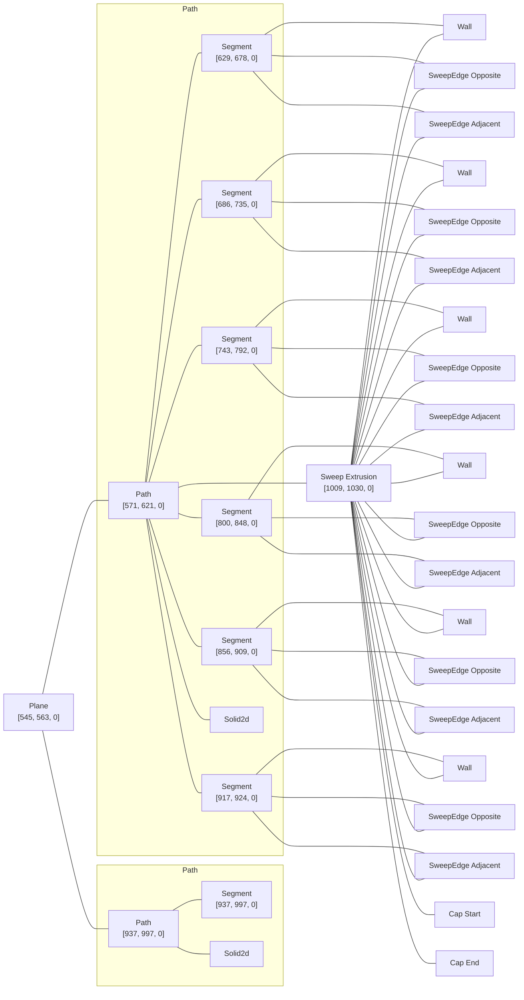

```mermaid
flowchart LR
  subgraph path2 [Path]
    2["Path<br>[571, 621, 0]"]
    3["Segment<br>[629, 678, 0]"]
    4["Segment<br>[686, 735, 0]"]
    5["Segment<br>[743, 792, 0]"]
    6["Segment<br>[800, 848, 0]"]
    7["Segment<br>[856, 909, 0]"]
    8["Segment<br>[917, 924, 0]"]
    9[Solid2d]
  end
  subgraph path10 [Path]
    10["Path<br>[937, 997, 0]"]
    11["Segment<br>[937, 997, 0]"]
    12[Solid2d]
  end
  1["Plane<br>[545, 563, 0]"]
  13["Sweep Extrusion<br>[1009, 1030, 0]"]
  14[Wall]
  15[Wall]
  16[Wall]
  17[Wall]
  18[Wall]
  19[Wall]
  20["Cap Start"]
  21["Cap End"]
  22["SweepEdge Opposite"]
  23["SweepEdge Adjacent"]
  24["SweepEdge Opposite"]
  25["SweepEdge Adjacent"]
  26["SweepEdge Opposite"]
  27["SweepEdge Adjacent"]
  28["SweepEdge Opposite"]
  29["SweepEdge Adjacent"]
  30["SweepEdge Opposite"]
  31["SweepEdge Adjacent"]
  32["SweepEdge Opposite"]
  33["SweepEdge Adjacent"]
  1 --- 2
  1 --- 10
  2 --- 3
  2 --- 4
  2 --- 5
  2 --- 6
  2 --- 7
  2 --- 8
  2 ---- 13
  2 --- 9
  3 --- 19
  3 --- 32
  3 --- 33
  4 --- 18
  4 --- 30
  4 --- 31
  5 --- 17
  5 --- 28
  5 --- 29
  6 --- 16
  6 --- 26
  6 --- 27
  7 --- 15
  7 --- 24
  7 --- 25
  8 --- 14
  8 --- 22
  8 --- 23
  10 --- 11
  10 --- 12
  13 --- 14
  13 --- 15
  13 --- 16
  13 --- 17
  13 --- 18
  13 --- 19
  13 --- 20
  13 --- 21
  13 --- 22
  13 --- 23
  13 --- 24
  13 --- 25
  13 --- 26
  13 --- 27
  13 --- 28
  13 --- 29
  13 --- 30
  13 --- 31
  13 --- 32
  13 --- 33
```
