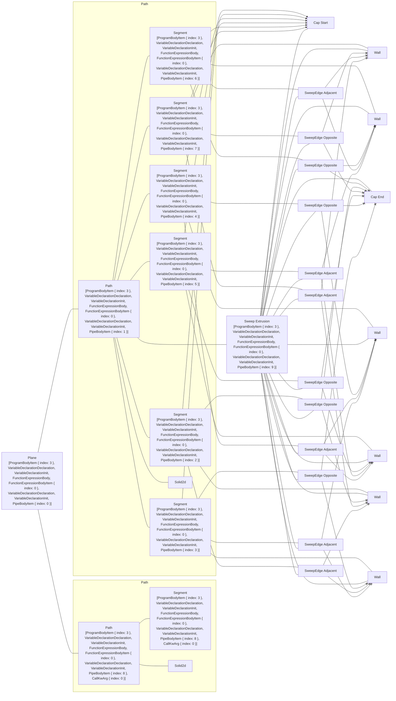

```mermaid
flowchart LR
  subgraph path2 [Path]
    2["Path<br>[ProgramBodyItem { index: 3 }, VariableDeclarationDeclaration, VariableDeclarationInit, FunctionExpressionBody, FunctionExpressionBodyItem { index: 0 }, VariableDeclarationDeclaration, VariableDeclarationInit, PipeBodyItem { index: 1 }]"]
    4["Segment<br>[ProgramBodyItem { index: 3 }, VariableDeclarationDeclaration, VariableDeclarationInit, FunctionExpressionBody, FunctionExpressionBodyItem { index: 0 }, VariableDeclarationDeclaration, VariableDeclarationInit, PipeBodyItem { index: 2 }]"]
    5["Segment<br>[ProgramBodyItem { index: 3 }, VariableDeclarationDeclaration, VariableDeclarationInit, FunctionExpressionBody, FunctionExpressionBodyItem { index: 0 }, VariableDeclarationDeclaration, VariableDeclarationInit, PipeBodyItem { index: 3 }]"]
    6["Segment<br>[ProgramBodyItem { index: 3 }, VariableDeclarationDeclaration, VariableDeclarationInit, FunctionExpressionBody, FunctionExpressionBodyItem { index: 0 }, VariableDeclarationDeclaration, VariableDeclarationInit, PipeBodyItem { index: 4 }]"]
    7["Segment<br>[ProgramBodyItem { index: 3 }, VariableDeclarationDeclaration, VariableDeclarationInit, FunctionExpressionBody, FunctionExpressionBodyItem { index: 0 }, VariableDeclarationDeclaration, VariableDeclarationInit, PipeBodyItem { index: 5 }]"]
    8["Segment<br>[ProgramBodyItem { index: 3 }, VariableDeclarationDeclaration, VariableDeclarationInit, FunctionExpressionBody, FunctionExpressionBodyItem { index: 0 }, VariableDeclarationDeclaration, VariableDeclarationInit, PipeBodyItem { index: 6 }]"]
    9["Segment<br>[ProgramBodyItem { index: 3 }, VariableDeclarationDeclaration, VariableDeclarationInit, FunctionExpressionBody, FunctionExpressionBodyItem { index: 0 }, VariableDeclarationDeclaration, VariableDeclarationInit, PipeBodyItem { index: 7 }]"]
    11[Solid2d]
  end
  subgraph path3 [Path]
    3["Path<br>[ProgramBodyItem { index: 3 }, VariableDeclarationDeclaration, VariableDeclarationInit, FunctionExpressionBody, FunctionExpressionBodyItem { index: 0 }, VariableDeclarationDeclaration, VariableDeclarationInit, PipeBodyItem { index: 8 }, CallKwArg { index: 0 }]"]
    10["Segment<br>[ProgramBodyItem { index: 3 }, VariableDeclarationDeclaration, VariableDeclarationInit, FunctionExpressionBody, FunctionExpressionBodyItem { index: 0 }, VariableDeclarationDeclaration, VariableDeclarationInit, PipeBodyItem { index: 8 }, CallKwArg { index: 0 }]"]
    12[Solid2d]
  end
  1["Plane<br>[ProgramBodyItem { index: 3 }, VariableDeclarationDeclaration, VariableDeclarationInit, FunctionExpressionBody, FunctionExpressionBodyItem { index: 0 }, VariableDeclarationDeclaration, VariableDeclarationInit, PipeBodyItem { index: 0 }]"]
  13["Sweep Extrusion<br>[ProgramBodyItem { index: 3 }, VariableDeclarationDeclaration, VariableDeclarationInit, FunctionExpressionBody, FunctionExpressionBodyItem { index: 0 }, VariableDeclarationDeclaration, VariableDeclarationInit, PipeBodyItem { index: 9 }]"]
  14[Wall]
  15[Wall]
  16[Wall]
  17[Wall]
  18[Wall]
  19[Wall]
  20["Cap Start"]
  21["Cap End"]
  22["SweepEdge Opposite"]
  23["SweepEdge Opposite"]
  24["SweepEdge Opposite"]
  25["SweepEdge Opposite"]
  26["SweepEdge Opposite"]
  27["SweepEdge Opposite"]
  28["SweepEdge Adjacent"]
  29["SweepEdge Adjacent"]
  30["SweepEdge Adjacent"]
  31["SweepEdge Adjacent"]
  32["SweepEdge Adjacent"]
  33["SweepEdge Adjacent"]
  1 --- 2
  1 --- 3
  2 --- 4
  2 --- 5
  2 --- 6
  2 --- 7
  2 --- 8
  2 --- 9
  2 --- 11
  2 ---- 13
  3 --- 10
  3 --- 12
  4 --- 17
  4 x--> 20
  4 --- 23
  4 --- 32
  5 --- 16
  5 x--> 20
  5 --- 27
  5 --- 33
  6 --- 18
  6 x--> 20
  6 --- 26
  6 --- 31
  7 --- 15
  7 x--> 20
  7 --- 25
  7 --- 29
  8 --- 14
  8 x--> 20
  8 --- 22
  8 --- 28
  9 --- 19
  9 x--> 20
  9 --- 24
  9 --- 30
  13 --- 14
  13 --- 15
  13 --- 16
  13 --- 17
  13 --- 18
  13 --- 19
  13 --- 20
  13 --- 21
  13 --- 22
  13 --- 23
  13 --- 24
  13 --- 25
  13 --- 26
  13 --- 27
  13 --- 28
  13 --- 29
  13 --- 30
  13 --- 31
  13 --- 32
  13 --- 33
  22 <--x 14
  28 <--x 14
  29 <--x 14
  25 <--x 15
  29 <--x 15
  31 <--x 15
  27 <--x 16
  32 <--x 16
  33 <--x 16
  23 <--x 17
  30 <--x 17
  32 <--x 17
  26 <--x 18
  31 <--x 18
  33 <--x 18
  24 <--x 19
  28 <--x 19
  30 <--x 19
  22 <--x 21
  23 <--x 21
  24 <--x 21
  25 <--x 21
  26 <--x 21
  27 <--x 21
```
