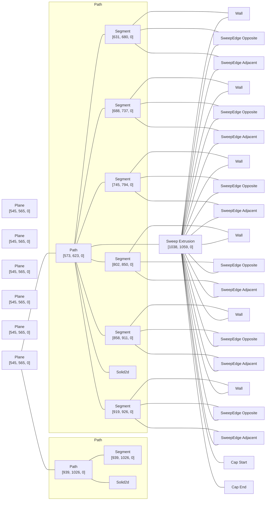

```mermaid
flowchart LR
  subgraph path7 [Path]
    7["Path<br>[573, 623, 0]"]
    8["Segment<br>[631, 680, 0]"]
    9["Segment<br>[688, 737, 0]"]
    10["Segment<br>[745, 794, 0]"]
    11["Segment<br>[802, 850, 0]"]
    12["Segment<br>[858, 911, 0]"]
    13["Segment<br>[919, 926, 0]"]
    14[Solid2d]
  end
  subgraph path15 [Path]
    15["Path<br>[939, 1026, 0]"]
    16["Segment<br>[939, 1026, 0]"]
    17[Solid2d]
  end
  1["Plane<br>[545, 565, 0]"]
  2["Plane<br>[545, 565, 0]"]
  3["Plane<br>[545, 565, 0]"]
  4["Plane<br>[545, 565, 0]"]
  5["Plane<br>[545, 565, 0]"]
  6["Plane<br>[545, 565, 0]"]
  18["Sweep Extrusion<br>[1038, 1059, 0]"]
  19[Wall]
  20[Wall]
  21[Wall]
  22[Wall]
  23[Wall]
  24[Wall]
  25["Cap Start"]
  26["Cap End"]
  27["SweepEdge Opposite"]
  28["SweepEdge Adjacent"]
  29["SweepEdge Opposite"]
  30["SweepEdge Adjacent"]
  31["SweepEdge Opposite"]
  32["SweepEdge Adjacent"]
  33["SweepEdge Opposite"]
  34["SweepEdge Adjacent"]
  35["SweepEdge Opposite"]
  36["SweepEdge Adjacent"]
  37["SweepEdge Opposite"]
  38["SweepEdge Adjacent"]
  6 --- 7
  6 --- 15
  7 --- 8
  7 --- 9
  7 --- 10
  7 --- 11
  7 --- 12
  7 --- 13
  7 ---- 18
  7 --- 14
  8 --- 24
  8 --- 37
  8 --- 38
  9 --- 23
  9 --- 35
  9 --- 36
  10 --- 22
  10 --- 33
  10 --- 34
  11 --- 21
  11 --- 31
  11 --- 32
  12 --- 20
  12 --- 29
  12 --- 30
  13 --- 19
  13 --- 27
  13 --- 28
  15 --- 16
  15 --- 17
  18 --- 19
  18 --- 20
  18 --- 21
  18 --- 22
  18 --- 23
  18 --- 24
  18 --- 25
  18 --- 26
  18 --- 27
  18 --- 28
  18 --- 29
  18 --- 30
  18 --- 31
  18 --- 32
  18 --- 33
  18 --- 34
  18 --- 35
  18 --- 36
  18 --- 37
  18 --- 38
```
