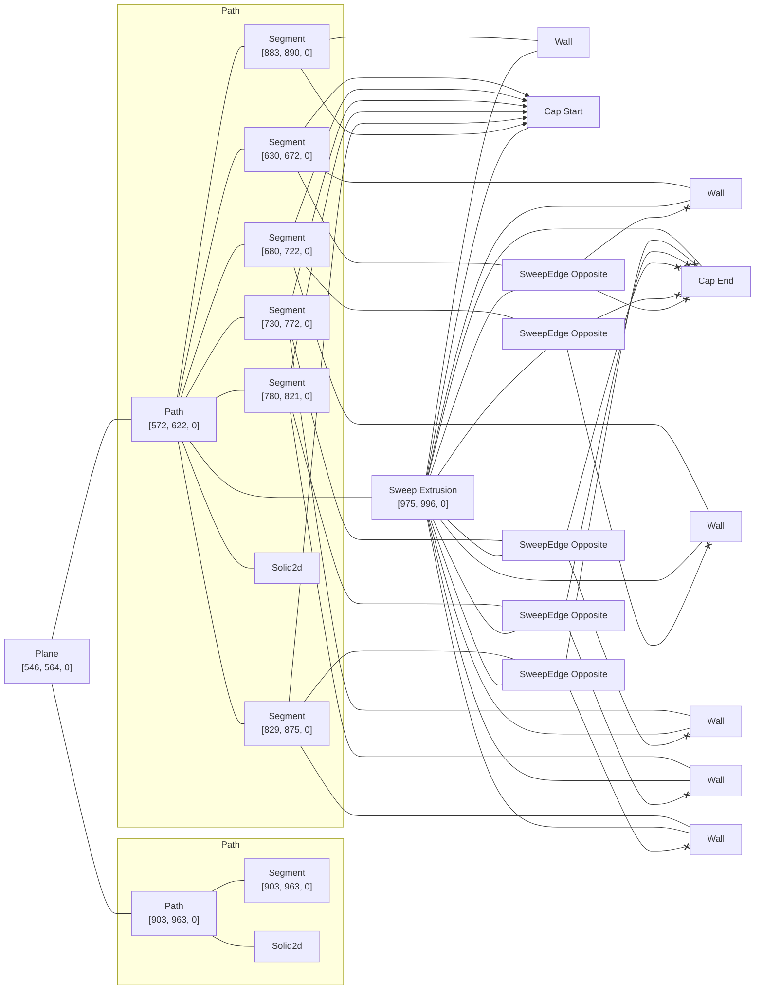

```mermaid
flowchart LR
  subgraph path2 [Path]
    2["Path<br>[572, 622, 0]"]
    3["Segment<br>[630, 672, 0]"]
    4["Segment<br>[680, 722, 0]"]
    5["Segment<br>[730, 772, 0]"]
    6["Segment<br>[780, 821, 0]"]
    7["Segment<br>[829, 875, 0]"]
    8["Segment<br>[883, 890, 0]"]
    9[Solid2d]
  end
  subgraph path10 [Path]
    10["Path<br>[903, 963, 0]"]
    11["Segment<br>[903, 963, 0]"]
    12[Solid2d]
  end
  1["Plane<br>[546, 564, 0]"]
  13["Sweep Extrusion<br>[975, 996, 0]"]
  14[Wall]
  15[Wall]
  16[Wall]
  17[Wall]
  18[Wall]
  19[Wall]
  20["Cap Start"]
  21["Cap End"]
  22["SweepEdge Opposite"]
  23["SweepEdge Opposite"]
  24["SweepEdge Opposite"]
  25["SweepEdge Opposite"]
  26["SweepEdge Opposite"]
  1 --- 2
  1 --- 10
  2 --- 3
  2 --- 4
  2 --- 5
  2 --- 6
  2 --- 7
  2 --- 8
  2 ---- 13
  2 --- 9
  3 --- 19
  3 --- 26
  3 x--> 20
  4 --- 18
  4 --- 25
  4 x--> 20
  5 --- 17
  5 --- 24
  5 x--> 20
  6 --- 16
  6 --- 23
  6 x--> 20
  7 --- 15
  7 --- 22
  7 x--> 20
  8 --- 14
  8 x--> 20
  10 --- 11
  10 --- 12
  13 --- 14
  13 --- 15
  13 --- 16
  13 --- 17
  13 --- 18
  13 --- 19
  13 --- 20
  13 --- 21
  13 --- 22
  13 --- 23
  13 --- 24
  13 --- 25
  13 --- 26
  22 <--x 15
  22 <--x 21
  23 <--x 16
  23 <--x 21
  24 <--x 17
  24 <--x 21
  25 <--x 18
  25 <--x 21
  26 <--x 19
  26 <--x 21
```
