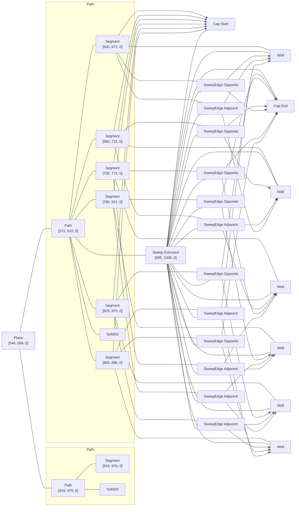

```mermaid
flowchart LR
  subgraph path2 [Path]
    2["Path<br>[572, 622, 0]"]
    4["Segment<br>[630, 672, 0]"]
    5["Segment<br>[680, 722, 0]"]
    6["Segment<br>[730, 772, 0]"]
    7["Segment<br>[780, 821, 0]"]
    8["Segment<br>[829, 875, 0]"]
    9["Segment<br>[883, 890, 0]"]
    11[Solid2d]
  end
  subgraph path3 [Path]
    3["Path<br>[916, 976, 0]"]
    10["Segment<br>[916, 976, 0]"]
    12[Solid2d]
  end
  1["Plane<br>[546, 564, 0]"]
  13["Sweep Extrusion<br>[985, 1006, 0]"]
  14[Wall]
  15[Wall]
  16[Wall]
  17[Wall]
  18[Wall]
  19[Wall]
  20["Cap Start"]
  21["Cap End"]
  22["SweepEdge Opposite"]
  23["SweepEdge Adjacent"]
  24["SweepEdge Opposite"]
  25["SweepEdge Adjacent"]
  26["SweepEdge Opposite"]
  27["SweepEdge Adjacent"]
  28["SweepEdge Opposite"]
  29["SweepEdge Adjacent"]
  30["SweepEdge Opposite"]
  31["SweepEdge Adjacent"]
  32["SweepEdge Opposite"]
  33["SweepEdge Adjacent"]
  1 --- 2
  1 --- 3
  2 --- 4
  2 --- 5
  2 --- 6
  2 --- 7
  2 --- 8
  2 --- 9
  2 --- 11
  2 ---- 13
  3 --- 10
  3 --- 12
  4 --- 17
  4 x--> 20
  4 --- 28
  4 --- 29
  5 --- 16
  5 x--> 20
  5 --- 26
  5 --- 27
  6 --- 18
  6 x--> 20
  6 --- 30
  6 --- 31
  7 --- 15
  7 x--> 20
  7 --- 24
  7 --- 25
  8 --- 14
  8 x--> 20
  8 --- 22
  8 --- 23
  9 --- 19
  9 x--> 20
  9 --- 32
  9 --- 33
  13 --- 14
  13 --- 15
  13 --- 16
  13 --- 17
  13 --- 18
  13 --- 19
  13 --- 20
  13 --- 21
  13 --- 22
  13 --- 23
  13 --- 24
  13 --- 25
  13 --- 26
  13 --- 27
  13 --- 28
  13 --- 29
  13 --- 30
  13 --- 31
  13 --- 32
  13 --- 33
  22 <--x 14
  23 <--x 14
  25 <--x 14
  24 <--x 15
  25 <--x 15
  31 <--x 15
  26 <--x 16
  27 <--x 16
  29 <--x 16
  28 <--x 17
  29 <--x 17
  33 <--x 17
  27 <--x 18
  30 <--x 18
  31 <--x 18
  23 <--x 19
  32 <--x 19
  33 <--x 19
  22 <--x 21
  24 <--x 21
  26 <--x 21
  28 <--x 21
  30 <--x 21
  32 <--x 21
```
