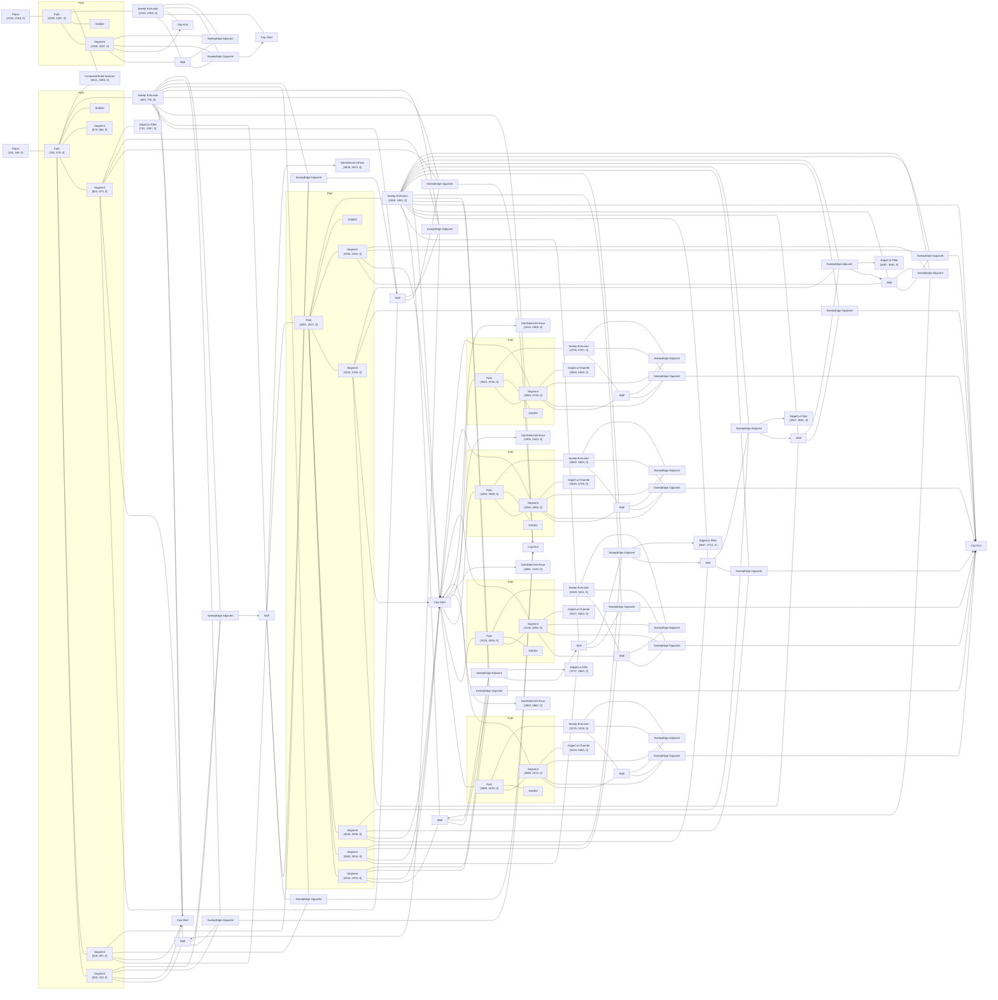

```mermaid
flowchart LR
  subgraph path2 [Path]
    2["Path<br>[354, 379, 0]"]
      %% [ProgramBodyItem { index: 8 }, VariableDeclarationDeclaration, VariableDeclarationInit, PipeBodyItem { index: 1 }]
    3["Segment<br>[385, 423, 0]"]
      %% [ProgramBodyItem { index: 8 }, VariableDeclarationDeclaration, VariableDeclarationInit, PipeBodyItem { index: 2 }]
    4["Segment<br>[429, 497, 0]"]
      %% [ProgramBodyItem { index: 8 }, VariableDeclarationDeclaration, VariableDeclarationInit, PipeBodyItem { index: 3 }]
    5["Segment<br>[503, 573, 0]"]
      %% [ProgramBodyItem { index: 8 }, VariableDeclarationDeclaration, VariableDeclarationInit, PipeBodyItem { index: 4 }]
    6["Segment<br>[579, 586, 0]"]
      %% [ProgramBodyItem { index: 8 }, VariableDeclarationDeclaration, VariableDeclarationInit, PipeBodyItem { index: 5 }]
    7[Solid2d]
  end
  subgraph path22 [Path]
    22["Path<br>[2189, 2287, 0]"]
      %% [ProgramBodyItem { index: 11 }, VariableDeclarationDeclaration, VariableDeclarationInit]
    23["Segment<br>[2189, 2287, 0]"]
      %% [ProgramBodyItem { index: 11 }, VariableDeclarationDeclaration, VariableDeclarationInit]
    24[Solid2d]
  end
  subgraph path32 [Path]
    32["Path<br>[2881, 2927, 0]"]
      %% [ProgramBodyItem { index: 18 }, VariableDeclarationDeclaration, VariableDeclarationInit, PipeBodyItem { index: 0 }]
    33["Segment<br>[2933, 2976, 0]"]
      %% [ProgramBodyItem { index: 18 }, VariableDeclarationDeclaration, VariableDeclarationInit, PipeBodyItem { index: 1 }]
    34["Segment<br>[2982, 3034, 0]"]
      %% [ProgramBodyItem { index: 18 }, VariableDeclarationDeclaration, VariableDeclarationInit, PipeBodyItem { index: 2 }]
    35["Segment<br>[3040, 3098, 0]"]
      %% [ProgramBodyItem { index: 18 }, VariableDeclarationDeclaration, VariableDeclarationInit, PipeBodyItem { index: 3 }]
    36["Segment<br>[3104, 3159, 0]"]
      %% [ProgramBodyItem { index: 18 }, VariableDeclarationDeclaration, VariableDeclarationInit, PipeBodyItem { index: 4 }]
    37["Segment<br>[3165, 3184, 0]"]
      %% [ProgramBodyItem { index: 18 }, VariableDeclarationDeclaration, VariableDeclarationInit, PipeBodyItem { index: 5 }]
    38[Solid2d]
  end
  subgraph path61 [Path]
    61["Path<br>[3898, 4070, 0]"]
      %% [ProgramBodyItem { index: 26 }, VariableDeclarationDeclaration, VariableDeclarationInit, PipeBodyItem { index: 1 }]
    62["Segment<br>[3898, 4070, 0]"]
      %% [ProgramBodyItem { index: 26 }, VariableDeclarationDeclaration, VariableDeclarationInit, PipeBodyItem { index: 1 }]
    63[Solid2d]
  end
  subgraph path64 [Path]
    64["Path<br>[4126, 4294, 0]"]
      %% [ProgramBodyItem { index: 27 }, VariableDeclarationDeclaration, VariableDeclarationInit, PipeBodyItem { index: 1 }]
    65["Segment<br>[4126, 4294, 0]"]
      %% [ProgramBodyItem { index: 27 }, VariableDeclarationDeclaration, VariableDeclarationInit, PipeBodyItem { index: 1 }]
    66[Solid2d]
  end
  subgraph path67 [Path]
    67["Path<br>[4350, 4508, 0]"]
      %% [ProgramBodyItem { index: 28 }, VariableDeclarationDeclaration, VariableDeclarationInit, PipeBodyItem { index: 1 }]
    68["Segment<br>[4350, 4508, 0]"]
      %% [ProgramBodyItem { index: 28 }, VariableDeclarationDeclaration, VariableDeclarationInit, PipeBodyItem { index: 1 }]
    69[Solid2d]
  end
  subgraph path70 [Path]
    70["Path<br>[4564, 4746, 0]"]
      %% [ProgramBodyItem { index: 29 }, VariableDeclarationDeclaration, VariableDeclarationInit, PipeBodyItem { index: 1 }]
    71["Segment<br>[4564, 4746, 0]"]
      %% [ProgramBodyItem { index: 29 }, VariableDeclarationDeclaration, VariableDeclarationInit, PipeBodyItem { index: 1 }]
    72[Solid2d]
  end
  1["Plane<br>[331, 348, 0]"]
    %% [ProgramBodyItem { index: 8 }, VariableDeclarationDeclaration, VariableDeclarationInit, PipeBodyItem { index: 0 }]
  8["Sweep Extrusion<br>[604, 735, 0]"]
    %% [ProgramBodyItem { index: 9 }, VariableDeclarationDeclaration, VariableDeclarationInit, PipeBodyItem { index: 0 }]
  9[Wall]
    %% face_code_ref=Missing NodePath
  10[Wall]
    %% face_code_ref=[ProgramBodyItem { index: 17 }, VariableDeclarationDeclaration, VariableDeclarationInit]
  11[Wall]
    %% face_code_ref=Missing NodePath
  12["Cap Start"]
    %% face_code_ref=Missing NodePath
  13["Cap End"]
    %% face_code_ref=Missing NodePath
  14["SweepEdge Opposite"]
  15["SweepEdge Adjacent"]
  16["SweepEdge Opposite"]
  17["SweepEdge Adjacent"]
  18["SweepEdge Opposite"]
  19["SweepEdge Adjacent"]
  20["EdgeCut Fillet<br>[741, 1067, 0]"]
    %% [ProgramBodyItem { index: 9 }, VariableDeclarationDeclaration, VariableDeclarationInit, PipeBodyItem { index: 1 }]
  21["Plane<br>[2126, 2158, 0]"]
    %% [ProgramBodyItem { index: 10 }, VariableDeclarationDeclaration, VariableDeclarationInit]
  25["Sweep Extrusion<br>[2310, 2369, 0]"]
    %% [ProgramBodyItem { index: 12 }, VariableDeclarationDeclaration, VariableDeclarationInit]
  26[Wall]
    %% face_code_ref=Missing NodePath
  27["Cap Start"]
    %% face_code_ref=Missing NodePath
  28["Cap End"]
    %% face_code_ref=Missing NodePath
  29["SweepEdge Opposite"]
  30["SweepEdge Adjacent"]
  31["CompositeSolid Subtract<br>[2611, 2668, 0]"]
    %% [ProgramBodyItem { index: 13 }, VariableDeclarationDeclaration, VariableDeclarationInit]
  39["Sweep Extrusion<br>[3359, 3481, 0]"]
    %% [ProgramBodyItem { index: 25 }, VariableDeclarationDeclaration, VariableDeclarationInit, PipeBodyItem { index: 0 }]
  40[Wall]
    %% face_code_ref=Missing NodePath
  41[Wall]
    %% face_code_ref=Missing NodePath
  42[Wall]
    %% face_code_ref=Missing NodePath
  43[Wall]
    %% face_code_ref=Missing NodePath
  44[Wall]
    %% face_code_ref=Missing NodePath
  45["Cap Start"]
    %% face_code_ref=[ProgramBodyItem { index: 26 }, VariableDeclarationDeclaration, VariableDeclarationInit, PipeBodyItem { index: 0 }]
  46["Cap End"]
    %% face_code_ref=Missing NodePath
  47["SweepEdge Opposite"]
  48["SweepEdge Adjacent"]
  49["SweepEdge Opposite"]
  50["SweepEdge Adjacent"]
  51["SweepEdge Opposite"]
  52["SweepEdge Adjacent"]
  53["SweepEdge Opposite"]
  54["SweepEdge Adjacent"]
  55["SweepEdge Opposite"]
  56["SweepEdge Adjacent"]
  57["EdgeCut Fillet<br>[3487, 3561, 0]"]
    %% [ProgramBodyItem { index: 25 }, VariableDeclarationDeclaration, VariableDeclarationInit, PipeBodyItem { index: 1 }]
  58["EdgeCut Fillet<br>[3567, 3641, 0]"]
    %% [ProgramBodyItem { index: 25 }, VariableDeclarationDeclaration, VariableDeclarationInit, PipeBodyItem { index: 2 }]
  59["EdgeCut Fillet<br>[3647, 3721, 0]"]
    %% [ProgramBodyItem { index: 25 }, VariableDeclarationDeclaration, VariableDeclarationInit, PipeBodyItem { index: 3 }]
  60["EdgeCut Fillet<br>[3727, 3843, 0]"]
    %% [ProgramBodyItem { index: 25 }, VariableDeclarationDeclaration, VariableDeclarationInit, PipeBodyItem { index: 4 }]
  73["Sweep Extrusion<br>[5176, 5218, 0]"]
    %% [ProgramBodyItem { index: 30 }, VariableDeclarationDeclaration, VariableDeclarationInit, PipeBodyItem { index: 0 }]
  74[Wall]
    %% face_code_ref=Missing NodePath
  75["SweepEdge Opposite"]
  76["SweepEdge Adjacent"]
  77["EdgeCut Chamfer<br>[5224, 5350, 0]"]
    %% [ProgramBodyItem { index: 30 }, VariableDeclarationDeclaration, VariableDeclarationInit, PipeBodyItem { index: 1 }]
  78["Sweep Extrusion<br>[5369, 5411, 0]"]
    %% [ProgramBodyItem { index: 31 }, VariableDeclarationDeclaration, VariableDeclarationInit, PipeBodyItem { index: 0 }]
  79[Wall]
    %% face_code_ref=Missing NodePath
  80["SweepEdge Opposite"]
  81["SweepEdge Adjacent"]
  82["EdgeCut Chamfer<br>[5417, 5543, 0]"]
    %% [ProgramBodyItem { index: 31 }, VariableDeclarationDeclaration, VariableDeclarationInit, PipeBodyItem { index: 1 }]
  83["Sweep Extrusion<br>[5562, 5604, 0]"]
    %% [ProgramBodyItem { index: 32 }, VariableDeclarationDeclaration, VariableDeclarationInit, PipeBodyItem { index: 0 }]
  84[Wall]
    %% face_code_ref=Missing NodePath
  85["SweepEdge Opposite"]
  86["SweepEdge Adjacent"]
  87["EdgeCut Chamfer<br>[5610, 5736, 0]"]
    %% [ProgramBodyItem { index: 32 }, VariableDeclarationDeclaration, VariableDeclarationInit, PipeBodyItem { index: 1 }]
  88["Sweep Extrusion<br>[5755, 5797, 0]"]
    %% [ProgramBodyItem { index: 33 }, VariableDeclarationDeclaration, VariableDeclarationInit, PipeBodyItem { index: 0 }]
  89[Wall]
    %% face_code_ref=Missing NodePath
  90["SweepEdge Opposite"]
  91["SweepEdge Adjacent"]
  92["EdgeCut Chamfer<br>[5803, 5929, 0]"]
    %% [ProgramBodyItem { index: 33 }, VariableDeclarationDeclaration, VariableDeclarationInit, PipeBodyItem { index: 1 }]
  93["StartSketchOnFace<br>[2828, 2872, 0]"]
    %% [ProgramBodyItem { index: 17 }, VariableDeclarationDeclaration, VariableDeclarationInit]
  94["StartSketchOnFace<br>[3853, 3892, 0]"]
    %% [ProgramBodyItem { index: 26 }, VariableDeclarationDeclaration, VariableDeclarationInit, PipeBodyItem { index: 0 }]
  95["StartSketchOnFace<br>[4081, 4120, 0]"]
    %% [ProgramBodyItem { index: 27 }, VariableDeclarationDeclaration, VariableDeclarationInit, PipeBodyItem { index: 0 }]
  96["StartSketchOnFace<br>[4305, 4344, 0]"]
    %% [ProgramBodyItem { index: 28 }, VariableDeclarationDeclaration, VariableDeclarationInit, PipeBodyItem { index: 0 }]
  97["StartSketchOnFace<br>[4519, 4558, 0]"]
    %% [ProgramBodyItem { index: 29 }, VariableDeclarationDeclaration, VariableDeclarationInit, PipeBodyItem { index: 0 }]
  1 --- 2
  2 --- 3
  2 --- 4
  2 --- 5
  2 --- 6
  2 --- 7
  2 ---- 8
  2 --- 31
  3 --- 11
  3 x--> 12
  3 --- 18
  3 --- 19
  4 --- 10
  4 x--> 12
  4 --- 16
  4 --- 17
  5 --- 9
  5 x--> 12
  5 --- 14
  5 --- 15
  5 --- 20
  8 --- 9
  8 --- 10
  8 --- 11
  8 --- 12
  8 --- 13
  8 --- 14
  8 --- 15
  8 --- 16
  8 --- 17
  8 --- 18
  8 --- 19
  9 --- 14
  9 --- 15
  17 <--x 9
  10 --- 16
  10 --- 17
  19 <--x 10
  10 --- 32
  10 <--x 93
  15 <--x 11
  11 --- 18
  11 --- 19
  14 <--x 13
  16 <--x 13
  18 <--x 13
  21 --- 22
  22 --- 23
  22 --- 24
  22 ---- 25
  22 --- 31
  23 --- 26
  23 x--> 28
  23 --- 29
  23 --- 30
  25 --- 26
  25 --- 27
  25 --- 28
  25 --- 29
  25 --- 30
  26 --- 29
  26 --- 30
  29 <--x 27
  32 --- 33
  32 --- 34
  32 --- 35
  32 --- 36
  32 --- 37
  32 --- 38
  32 ---- 39
  33 --- 40
  33 x--> 45
  33 --- 47
  33 --- 48
  34 --- 41
  34 x--> 45
  34 --- 49
  34 --- 50
  35 --- 42
  35 x--> 45
  35 --- 51
  35 --- 52
  36 --- 43
  36 x--> 45
  36 --- 53
  36 --- 54
  37 --- 44
  37 x--> 45
  37 --- 55
  37 --- 56
  39 --- 40
  39 --- 41
  39 --- 42
  39 --- 43
  39 --- 44
  39 --- 45
  39 --- 46
  39 --- 47
  39 --- 48
  39 --- 49
  39 --- 50
  39 --- 51
  39 --- 52
  39 --- 53
  39 --- 54
  39 --- 55
  39 --- 56
  40 --- 47
  40 --- 48
  56 <--x 40
  48 <--x 41
  41 --- 49
  41 --- 50
  50 <--x 42
  42 --- 51
  42 --- 52
  52 <--x 43
  43 --- 53
  43 --- 54
  54 <--x 44
  44 --- 55
  44 --- 56
  45 --- 61
  62 <--x 45
  45 --- 64
  65 <--x 45
  45 --- 67
  68 <--x 45
  45 --- 70
  71 <--x 45
  45 <--x 94
  45 <--x 95
  45 <--x 96
  45 <--x 97
  47 <--x 46
  49 <--x 46
  51 <--x 46
  53 <--x 46
  55 <--x 46
  75 <--x 46
  80 <--x 46
  85 <--x 46
  90 <--x 46
  48 <--x 60
  50 <--x 59
  52 <--x 58
  54 <--x 57
  61 --- 62
  61 --- 63
  61 ---- 73
  62 --- 74
  62 --- 75
  62 --- 76
  62 --- 77
  64 --- 65
  64 --- 66
  64 ---- 78
  65 --- 79
  65 --- 80
  65 --- 81
  65 --- 82
  67 --- 68
  67 --- 69
  67 ---- 83
  68 --- 84
  68 --- 85
  68 --- 86
  68 --- 87
  70 --- 71
  70 --- 72
  70 ---- 88
  71 --- 89
  71 --- 90
  71 --- 91
  71 --- 92
  73 --- 74
  73 --- 75
  73 --- 76
  74 --- 75
  74 --- 76
  78 --- 79
  78 --- 80
  78 --- 81
  79 --- 80
  79 --- 81
  83 --- 84
  83 --- 85
  83 --- 86
  84 --- 85
  84 --- 86
  88 --- 89
  88 --- 90
  88 --- 91
  89 --- 90
  89 --- 91
```
