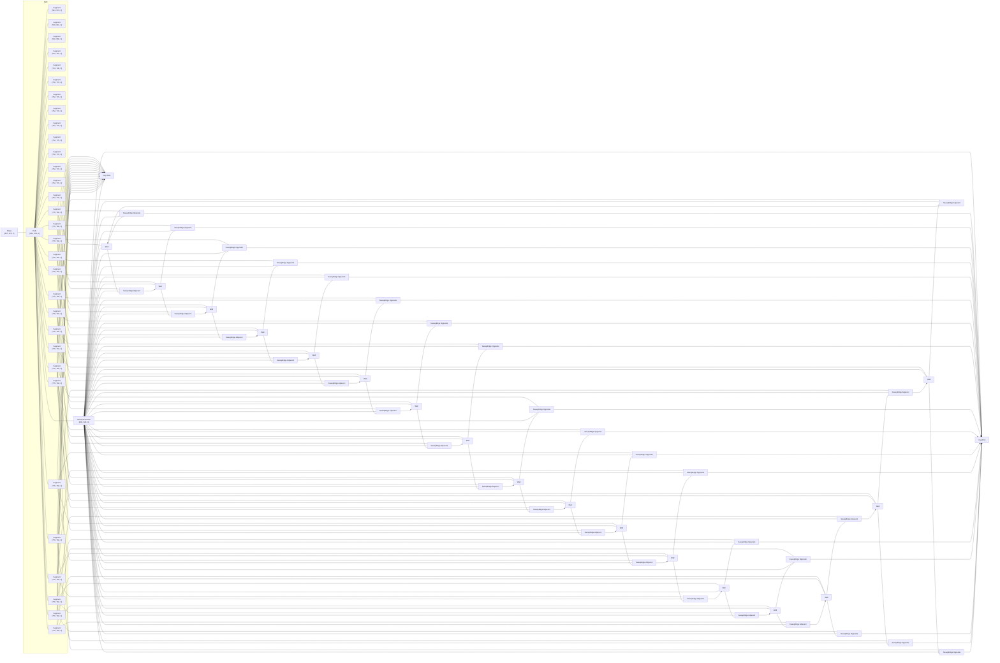

```mermaid
flowchart LR
  subgraph path2 [Path]
    2["Path<br>[484, 535, 0]"]
      %% [ProgramBodyItem { index: 7 }, VariableDeclarationDeclaration, VariableDeclarationInit, PipeBodyItem { index: 0 }]
    3["Segment<br>[541, 572, 0]"]
      %% [ProgramBodyItem { index: 7 }, VariableDeclarationDeclaration, VariableDeclarationInit, PipeBodyItem { index: 1 }]
    4["Segment<br>[578, 610, 0]"]
      %% [ProgramBodyItem { index: 7 }, VariableDeclarationDeclaration, VariableDeclarationInit, PipeBodyItem { index: 2 }]
    5["Segment<br>[616, 666, 0]"]
      %% [ProgramBodyItem { index: 7 }, VariableDeclarationDeclaration, VariableDeclarationInit, PipeBodyItem { index: 3 }]
    6["Segment<br>[672, 718, 0]"]
      %% [ProgramBodyItem { index: 7 }, VariableDeclarationDeclaration, VariableDeclarationInit, PipeBodyItem { index: 4 }]
    7["Segment<br>[724, 746, 0]"]
      %% [ProgramBodyItem { index: 7 }, VariableDeclarationDeclaration, VariableDeclarationInit, PipeBodyItem { index: 5 }]
    8["Segment<br>[752, 770, 0]"]
      %% [ProgramBodyItem { index: 7 }, VariableDeclarationDeclaration, VariableDeclarationInit, PipeBodyItem { index: 6 }]
    9["Segment<br>[752, 770, 0]"]
      %% [ProgramBodyItem { index: 7 }, VariableDeclarationDeclaration, VariableDeclarationInit, PipeBodyItem { index: 6 }]
    10["Segment<br>[752, 770, 0]"]
      %% [ProgramBodyItem { index: 7 }, VariableDeclarationDeclaration, VariableDeclarationInit, PipeBodyItem { index: 6 }]
    11["Segment<br>[752, 770, 0]"]
      %% [ProgramBodyItem { index: 7 }, VariableDeclarationDeclaration, VariableDeclarationInit, PipeBodyItem { index: 6 }]
    12["Segment<br>[752, 770, 0]"]
      %% [ProgramBodyItem { index: 7 }, VariableDeclarationDeclaration, VariableDeclarationInit, PipeBodyItem { index: 6 }]
    13["Segment<br>[752, 770, 0]"]
      %% [ProgramBodyItem { index: 7 }, VariableDeclarationDeclaration, VariableDeclarationInit, PipeBodyItem { index: 6 }]
    14["Segment<br>[752, 770, 0]"]
      %% [ProgramBodyItem { index: 7 }, VariableDeclarationDeclaration, VariableDeclarationInit, PipeBodyItem { index: 6 }]
    15["Segment<br>[752, 770, 0]"]
      %% [ProgramBodyItem { index: 7 }, VariableDeclarationDeclaration, VariableDeclarationInit, PipeBodyItem { index: 6 }]
    16["Segment<br>[752, 770, 0]"]
      %% [ProgramBodyItem { index: 7 }, VariableDeclarationDeclaration, VariableDeclarationInit, PipeBodyItem { index: 6 }]
    17["Segment<br>[776, 794, 0]"]
      %% [ProgramBodyItem { index: 7 }, VariableDeclarationDeclaration, VariableDeclarationInit, PipeBodyItem { index: 7 }]
    18["Segment<br>[776, 794, 0]"]
      %% [ProgramBodyItem { index: 7 }, VariableDeclarationDeclaration, VariableDeclarationInit, PipeBodyItem { index: 7 }]
    19["Segment<br>[776, 794, 0]"]
      %% [ProgramBodyItem { index: 7 }, VariableDeclarationDeclaration, VariableDeclarationInit, PipeBodyItem { index: 7 }]
    20["Segment<br>[776, 794, 0]"]
      %% [ProgramBodyItem { index: 7 }, VariableDeclarationDeclaration, VariableDeclarationInit, PipeBodyItem { index: 7 }]
    21["Segment<br>[776, 794, 0]"]
      %% [ProgramBodyItem { index: 7 }, VariableDeclarationDeclaration, VariableDeclarationInit, PipeBodyItem { index: 7 }]
    22["Segment<br>[776, 794, 0]"]
      %% [ProgramBodyItem { index: 7 }, VariableDeclarationDeclaration, VariableDeclarationInit, PipeBodyItem { index: 7 }]
    23["Segment<br>[776, 794, 0]"]
      %% [ProgramBodyItem { index: 7 }, VariableDeclarationDeclaration, VariableDeclarationInit, PipeBodyItem { index: 7 }]
    24["Segment<br>[776, 794, 0]"]
      %% [ProgramBodyItem { index: 7 }, VariableDeclarationDeclaration, VariableDeclarationInit, PipeBodyItem { index: 7 }]
    25["Segment<br>[776, 794, 0]"]
      %% [ProgramBodyItem { index: 7 }, VariableDeclarationDeclaration, VariableDeclarationInit, PipeBodyItem { index: 7 }]
    26["Segment<br>[776, 794, 0]"]
      %% [ProgramBodyItem { index: 7 }, VariableDeclarationDeclaration, VariableDeclarationInit, PipeBodyItem { index: 7 }]
    27["Segment<br>[776, 794, 0]"]
      %% [ProgramBodyItem { index: 7 }, VariableDeclarationDeclaration, VariableDeclarationInit, PipeBodyItem { index: 7 }]
    28["Segment<br>[776, 794, 0]"]
      %% [ProgramBodyItem { index: 7 }, VariableDeclarationDeclaration, VariableDeclarationInit, PipeBodyItem { index: 7 }]
    29["Segment<br>[776, 794, 0]"]
      %% [ProgramBodyItem { index: 7 }, VariableDeclarationDeclaration, VariableDeclarationInit, PipeBodyItem { index: 7 }]
    30["Segment<br>[776, 794, 0]"]
      %% [ProgramBodyItem { index: 7 }, VariableDeclarationDeclaration, VariableDeclarationInit, PipeBodyItem { index: 7 }]
    31["Segment<br>[776, 794, 0]"]
      %% [ProgramBodyItem { index: 7 }, VariableDeclarationDeclaration, VariableDeclarationInit, PipeBodyItem { index: 7 }]
    32["Segment<br>[776, 794, 0]"]
      %% [ProgramBodyItem { index: 7 }, VariableDeclarationDeclaration, VariableDeclarationInit, PipeBodyItem { index: 7 }]
    33["Segment<br>[776, 794, 0]"]
      %% [ProgramBodyItem { index: 7 }, VariableDeclarationDeclaration, VariableDeclarationInit, PipeBodyItem { index: 7 }]
  end
  1["Plane<br>[457, 475, 0]"]
    %% [ProgramBodyItem { index: 6 }, VariableDeclarationDeclaration, VariableDeclarationInit]
  34["Sweep Extrusion<br>[800, 828, 0]"]
    %% [ProgramBodyItem { index: 7 }, VariableDeclarationDeclaration, VariableDeclarationInit, PipeBodyItem { index: 8 }]
  35[Wall]
    %% face_code_ref=Missing NodePath
  36[Wall]
    %% face_code_ref=Missing NodePath
  37[Wall]
    %% face_code_ref=Missing NodePath
  38[Wall]
    %% face_code_ref=Missing NodePath
  39[Wall]
    %% face_code_ref=Missing NodePath
  40[Wall]
    %% face_code_ref=Missing NodePath
  41[Wall]
    %% face_code_ref=Missing NodePath
  42[Wall]
    %% face_code_ref=Missing NodePath
  43[Wall]
    %% face_code_ref=Missing NodePath
  44[Wall]
    %% face_code_ref=Missing NodePath
  45[Wall]
    %% face_code_ref=Missing NodePath
  46[Wall]
    %% face_code_ref=Missing NodePath
  47[Wall]
    %% face_code_ref=Missing NodePath
  48[Wall]
    %% face_code_ref=Missing NodePath
  49[Wall]
    %% face_code_ref=Missing NodePath
  50[Wall]
    %% face_code_ref=Missing NodePath
  51[Wall]
    %% face_code_ref=Missing NodePath
  52["Cap Start"]
    %% face_code_ref=Missing NodePath
  53["Cap End"]
    %% face_code_ref=Missing NodePath
  54["SweepEdge Opposite"]
  55["SweepEdge Adjacent"]
  56["SweepEdge Opposite"]
  57["SweepEdge Adjacent"]
  58["SweepEdge Opposite"]
  59["SweepEdge Adjacent"]
  60["SweepEdge Opposite"]
  61["SweepEdge Adjacent"]
  62["SweepEdge Opposite"]
  63["SweepEdge Adjacent"]
  64["SweepEdge Opposite"]
  65["SweepEdge Adjacent"]
  66["SweepEdge Opposite"]
  67["SweepEdge Adjacent"]
  68["SweepEdge Opposite"]
  69["SweepEdge Adjacent"]
  70["SweepEdge Opposite"]
  71["SweepEdge Adjacent"]
  72["SweepEdge Opposite"]
  73["SweepEdge Adjacent"]
  74["SweepEdge Opposite"]
  75["SweepEdge Adjacent"]
  76["SweepEdge Opposite"]
  77["SweepEdge Adjacent"]
  78["SweepEdge Opposite"]
  79["SweepEdge Adjacent"]
  80["SweepEdge Opposite"]
  81["SweepEdge Adjacent"]
  82["SweepEdge Opposite"]
  83["SweepEdge Adjacent"]
  84["SweepEdge Opposite"]
  85["SweepEdge Adjacent"]
  86["SweepEdge Opposite"]
  87["SweepEdge Adjacent"]
  1 --- 2
  2 --- 3
  2 --- 4
  2 --- 5
  2 --- 6
  2 --- 7
  2 --- 8
  2 --- 9
  2 --- 10
  2 --- 11
  2 --- 12
  2 --- 13
  2 --- 14
  2 --- 15
  2 --- 16
  2 --- 17
  2 --- 18
  2 --- 19
  2 --- 20
  2 --- 21
  2 --- 22
  2 --- 23
  2 --- 24
  2 --- 25
  2 --- 26
  2 --- 27
  2 --- 28
  2 --- 29
  2 --- 30
  2 --- 31
  2 --- 32
  2 --- 33
  2 ---- 34
  17 --- 35
  17 x--> 52
  17 --- 54
  17 --- 55
  18 --- 36
  18 x--> 52
  18 --- 56
  18 --- 57
  19 --- 37
  19 x--> 52
  19 --- 58
  19 --- 59
  20 --- 38
  20 x--> 52
  20 --- 60
  20 --- 61
  21 --- 39
  21 x--> 52
  21 --- 62
  21 --- 63
  22 --- 40
  22 x--> 52
  22 --- 64
  22 --- 65
  23 --- 41
  23 x--> 52
  23 --- 66
  23 --- 67
  24 --- 42
  24 x--> 52
  24 --- 68
  24 --- 69
  25 --- 43
  25 x--> 52
  25 --- 70
  25 --- 71
  26 --- 44
  26 x--> 52
  26 --- 72
  26 --- 73
  27 --- 45
  27 x--> 52
  27 --- 74
  27 --- 75
  28 --- 46
  28 x--> 52
  28 --- 76
  28 --- 77
  29 --- 47
  29 x--> 52
  29 --- 78
  29 --- 79
  30 --- 48
  30 x--> 52
  30 --- 80
  30 --- 81
  31 --- 49
  31 x--> 52
  31 --- 82
  31 --- 83
  32 --- 50
  32 x--> 52
  32 --- 84
  32 --- 85
  33 --- 51
  33 x--> 52
  33 --- 86
  33 --- 87
  34 --- 35
  34 --- 36
  34 --- 37
  34 --- 38
  34 --- 39
  34 --- 40
  34 --- 41
  34 --- 42
  34 --- 43
  34 --- 44
  34 --- 45
  34 --- 46
  34 --- 47
  34 --- 48
  34 --- 49
  34 --- 50
  34 --- 51
  34 --- 52
  34 --- 53
  34 --- 54
  34 --- 55
  34 --- 56
  34 --- 57
  34 --- 58
  34 --- 59
  34 --- 60
  34 --- 61
  34 --- 62
  34 --- 63
  34 --- 64
  34 --- 65
  34 --- 66
  34 --- 67
  34 --- 68
  34 --- 69
  34 --- 70
  34 --- 71
  34 --- 72
  34 --- 73
  34 --- 74
  34 --- 75
  34 --- 76
  34 --- 77
  34 --- 78
  34 --- 79
  34 --- 80
  34 --- 81
  34 --- 82
  34 --- 83
  34 --- 84
  34 --- 85
  34 --- 86
  34 --- 87
  35 --- 54
  35 --- 55
  87 <--x 35
  55 <--x 36
  36 --- 56
  36 --- 57
  57 <--x 37
  37 --- 58
  37 --- 59
  59 <--x 38
  38 --- 60
  38 --- 61
  61 <--x 39
  39 --- 62
  39 --- 63
  63 <--x 40
  40 --- 64
  40 --- 65
  65 <--x 41
  41 --- 66
  41 --- 67
  67 <--x 42
  42 --- 68
  42 --- 69
  69 <--x 43
  43 --- 70
  43 --- 71
  71 <--x 44
  44 --- 72
  44 --- 73
  73 <--x 45
  45 --- 74
  45 --- 75
  75 <--x 46
  46 --- 76
  46 --- 77
  77 <--x 47
  47 --- 78
  47 --- 79
  79 <--x 48
  48 --- 80
  48 --- 81
  81 <--x 49
  49 --- 82
  49 --- 83
  83 <--x 50
  50 --- 84
  50 --- 85
  85 <--x 51
  51 --- 86
  51 --- 87
  54 <--x 53
  56 <--x 53
  58 <--x 53
  60 <--x 53
  62 <--x 53
  64 <--x 53
  66 <--x 53
  68 <--x 53
  70 <--x 53
  72 <--x 53
  74 <--x 53
  76 <--x 53
  78 <--x 53
  80 <--x 53
  82 <--x 53
  84 <--x 53
  86 <--x 53
```
