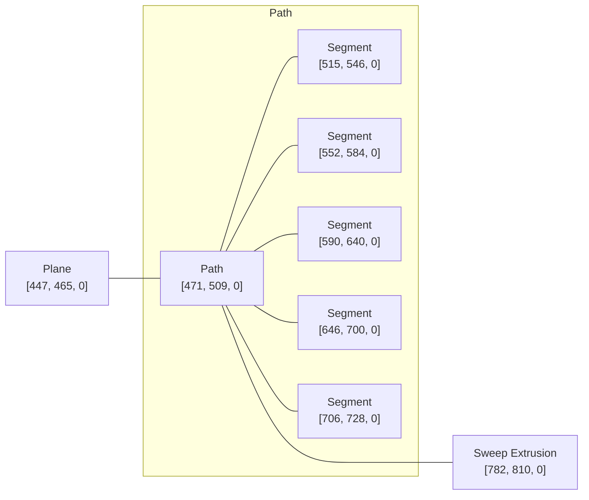

```mermaid
flowchart LR
  subgraph path2 [Path]
    2["Path<br>[471, 509, 0]"]
    3["Segment<br>[515, 546, 0]"]
    4["Segment<br>[552, 584, 0]"]
    5["Segment<br>[590, 640, 0]"]
    6["Segment<br>[646, 700, 0]"]
    7["Segment<br>[706, 728, 0]"]
  end
  1["Plane<br>[447, 465, 0]"]
  8["Sweep Extrusion<br>[782, 810, 0]"]
  1 --- 2
  2 --- 3
  2 --- 4
  2 --- 5
  2 --- 6
  2 --- 7
  2 ---- 8
```
