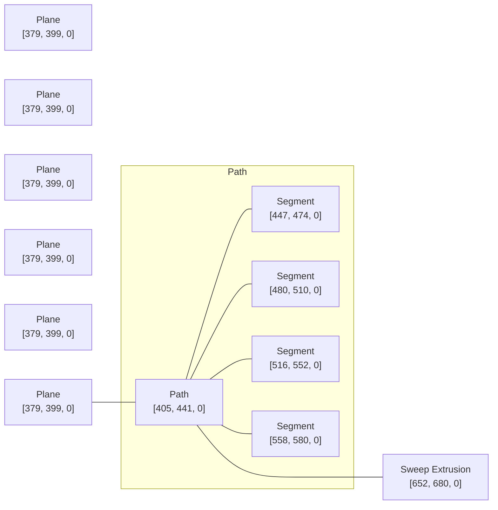

```mermaid
flowchart LR
  subgraph path7 [Path]
    7["Path<br>[405, 441, 0]"]
    8["Segment<br>[447, 474, 0]"]
    9["Segment<br>[480, 510, 0]"]
    10["Segment<br>[516, 552, 0]"]
    11["Segment<br>[558, 580, 0]"]
  end
  1["Plane<br>[379, 399, 0]"]
  2["Plane<br>[379, 399, 0]"]
  3["Plane<br>[379, 399, 0]"]
  4["Plane<br>[379, 399, 0]"]
  5["Plane<br>[379, 399, 0]"]
  6["Plane<br>[379, 399, 0]"]
  12["Sweep Extrusion<br>[652, 680, 0]"]
  6 --- 7
  7 --- 8
  7 --- 9
  7 --- 10
  7 --- 11
  7 ---- 12
```
