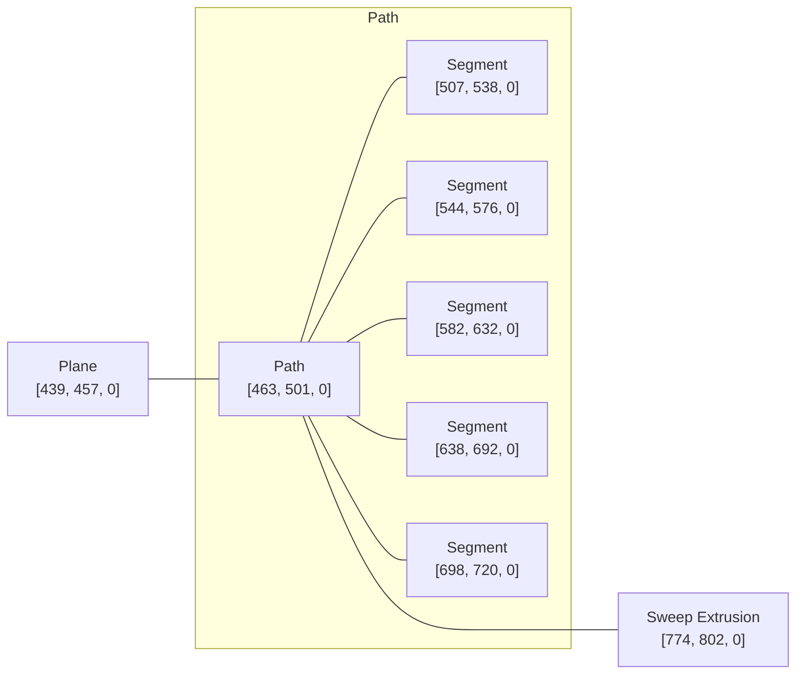

```mermaid
flowchart LR
  subgraph path2 [Path]
    2["Path<br>[463, 501, 0]"]
    3["Segment<br>[507, 538, 0]"]
    4["Segment<br>[544, 576, 0]"]
    5["Segment<br>[582, 632, 0]"]
    6["Segment<br>[638, 692, 0]"]
    7["Segment<br>[698, 720, 0]"]
  end
  1["Plane<br>[439, 457, 0]"]
  8["Sweep Extrusion<br>[774, 802, 0]"]
  1 --- 2
  2 --- 3
  2 --- 4
  2 --- 5
  2 --- 6
  2 --- 7
  2 ---- 8
```
