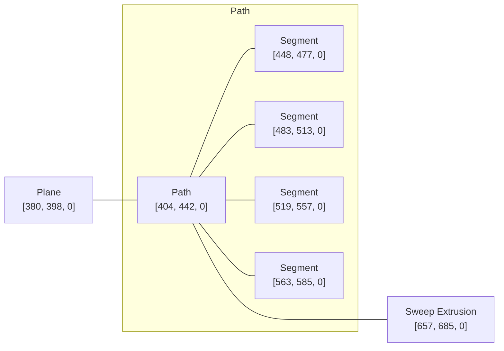

```mermaid
flowchart LR
  subgraph path2 [Path]
    2["Path<br>[404, 442, 0]"]
    3["Segment<br>[448, 477, 0]"]
    4["Segment<br>[483, 513, 0]"]
    5["Segment<br>[519, 557, 0]"]
    6["Segment<br>[563, 585, 0]"]
  end
  1["Plane<br>[380, 398, 0]"]
  7["Sweep Extrusion<br>[657, 685, 0]"]
  1 --- 2
  2 --- 3
  2 --- 4
  2 --- 5
  2 --- 6
  2 ---- 7
```
