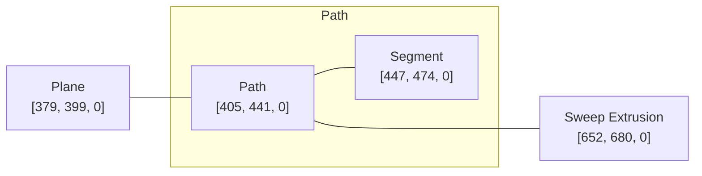

```mermaid
flowchart LR
  subgraph path2 [Path]
    2["Path<br>[405, 441, 0]"]
    3["Segment<br>[447, 474, 0]"]
  end
  1["Plane<br>[379, 399, 0]"]
  4["Sweep Extrusion<br>[652, 680, 0]"]
  1 --- 2
  2 --- 3
  2 ---- 4
```
