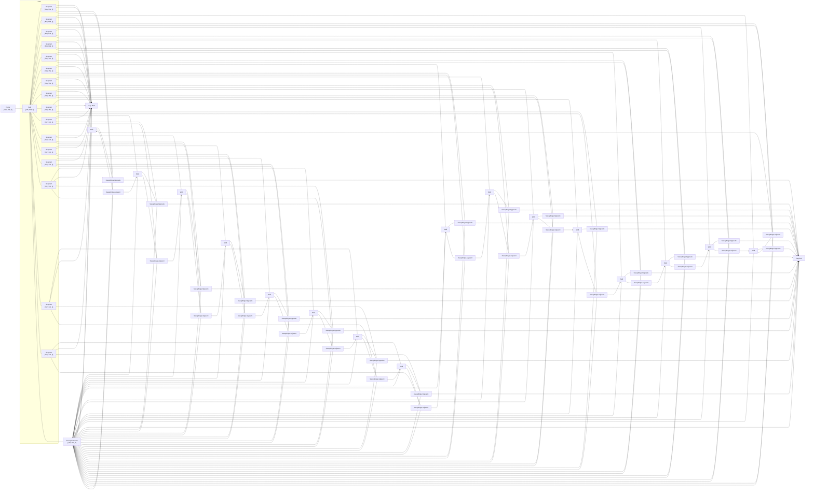

```mermaid
flowchart LR
  subgraph path2 [Path]
    2["Path<br>[475, 513, 0]"]
      %% [ProgramBodyItem { index: 6 }, VariableDeclarationDeclaration, VariableDeclarationInit, PipeBodyItem { index: 1 }]
    3["Segment<br>[519, 550, 0]"]
      %% [ProgramBodyItem { index: 6 }, VariableDeclarationDeclaration, VariableDeclarationInit, PipeBodyItem { index: 2 }]
    4["Segment<br>[556, 588, 0]"]
      %% [ProgramBodyItem { index: 6 }, VariableDeclarationDeclaration, VariableDeclarationInit, PipeBodyItem { index: 3 }]
    5["Segment<br>[594, 644, 0]"]
      %% [ProgramBodyItem { index: 6 }, VariableDeclarationDeclaration, VariableDeclarationInit, PipeBodyItem { index: 4 }]
    6["Segment<br>[650, 699, 0]"]
      %% [ProgramBodyItem { index: 6 }, VariableDeclarationDeclaration, VariableDeclarationInit, PipeBodyItem { index: 5 }]
    7["Segment<br>[705, 727, 0]"]
      %% [ProgramBodyItem { index: 6 }, VariableDeclarationDeclaration, VariableDeclarationInit, PipeBodyItem { index: 6 }]
    8["Segment<br>[733, 751, 0]"]
      %% [ProgramBodyItem { index: 6 }, VariableDeclarationDeclaration, VariableDeclarationInit, PipeBodyItem { index: 7 }]
    9["Segment<br>[733, 751, 0]"]
      %% [ProgramBodyItem { index: 6 }, VariableDeclarationDeclaration, VariableDeclarationInit, PipeBodyItem { index: 7 }]
    10["Segment<br>[733, 751, 0]"]
      %% [ProgramBodyItem { index: 6 }, VariableDeclarationDeclaration, VariableDeclarationInit, PipeBodyItem { index: 7 }]
    11["Segment<br>[733, 751, 0]"]
      %% [ProgramBodyItem { index: 6 }, VariableDeclarationDeclaration, VariableDeclarationInit, PipeBodyItem { index: 7 }]
    12["Segment<br>[757, 775, 0]"]
      %% [ProgramBodyItem { index: 6 }, VariableDeclarationDeclaration, VariableDeclarationInit, PipeBodyItem { index: 8 }]
    13["Segment<br>[757, 775, 0]"]
      %% [ProgramBodyItem { index: 6 }, VariableDeclarationDeclaration, VariableDeclarationInit, PipeBodyItem { index: 8 }]
    14["Segment<br>[757, 775, 0]"]
      %% [ProgramBodyItem { index: 6 }, VariableDeclarationDeclaration, VariableDeclarationInit, PipeBodyItem { index: 8 }]
    15["Segment<br>[757, 775, 0]"]
      %% [ProgramBodyItem { index: 6 }, VariableDeclarationDeclaration, VariableDeclarationInit, PipeBodyItem { index: 8 }]
    16["Segment<br>[757, 775, 0]"]
      %% [ProgramBodyItem { index: 6 }, VariableDeclarationDeclaration, VariableDeclarationInit, PipeBodyItem { index: 8 }]
    17["Segment<br>[757, 775, 0]"]
      %% [ProgramBodyItem { index: 6 }, VariableDeclarationDeclaration, VariableDeclarationInit, PipeBodyItem { index: 8 }]
    18["Segment<br>[757, 775, 0]"]
      %% [ProgramBodyItem { index: 6 }, VariableDeclarationDeclaration, VariableDeclarationInit, PipeBodyItem { index: 8 }]
  end
  1["Plane<br>[451, 469, 0]"]
    %% [ProgramBodyItem { index: 6 }, VariableDeclarationDeclaration, VariableDeclarationInit, PipeBodyItem { index: 0 }]
  19["Sweep Extrusion<br>[781, 809, 0]"]
    %% [ProgramBodyItem { index: 6 }, VariableDeclarationDeclaration, VariableDeclarationInit, PipeBodyItem { index: 9 }]
  20[Wall]
    %% face_code_ref=Missing NodePath
  21[Wall]
    %% face_code_ref=Missing NodePath
  22[Wall]
    %% face_code_ref=Missing NodePath
  23[Wall]
    %% face_code_ref=Missing NodePath
  24[Wall]
    %% face_code_ref=Missing NodePath
  25[Wall]
    %% face_code_ref=Missing NodePath
  26[Wall]
    %% face_code_ref=Missing NodePath
  27[Wall]
    %% face_code_ref=Missing NodePath
  28[Wall]
    %% face_code_ref=Missing NodePath
  29[Wall]
    %% face_code_ref=Missing NodePath
  30[Wall]
    %% face_code_ref=Missing NodePath
  31[Wall]
    %% face_code_ref=Missing NodePath
  32[Wall]
    %% face_code_ref=Missing NodePath
  33[Wall]
    %% face_code_ref=Missing NodePath
  34[Wall]
    %% face_code_ref=Missing NodePath
  35[Wall]
    %% face_code_ref=Missing NodePath
  36["Cap Start"]
    %% face_code_ref=Missing NodePath
  37["Cap End"]
    %% face_code_ref=Missing NodePath
  38["SweepEdge Opposite"]
  39["SweepEdge Adjacent"]
  40["SweepEdge Opposite"]
  41["SweepEdge Adjacent"]
  42["SweepEdge Opposite"]
  43["SweepEdge Adjacent"]
  44["SweepEdge Opposite"]
  45["SweepEdge Adjacent"]
  46["SweepEdge Opposite"]
  47["SweepEdge Adjacent"]
  48["SweepEdge Opposite"]
  49["SweepEdge Adjacent"]
  50["SweepEdge Opposite"]
  51["SweepEdge Adjacent"]
  52["SweepEdge Opposite"]
  53["SweepEdge Adjacent"]
  54["SweepEdge Opposite"]
  55["SweepEdge Adjacent"]
  56["SweepEdge Opposite"]
  57["SweepEdge Adjacent"]
  58["SweepEdge Opposite"]
  59["SweepEdge Adjacent"]
  60["SweepEdge Opposite"]
  61["SweepEdge Adjacent"]
  62["SweepEdge Opposite"]
  63["SweepEdge Adjacent"]
  64["SweepEdge Opposite"]
  65["SweepEdge Adjacent"]
  66["SweepEdge Opposite"]
  67["SweepEdge Adjacent"]
  68["SweepEdge Opposite"]
  69["SweepEdge Adjacent"]
  1 --- 2
  2 --- 3
  2 --- 4
  2 --- 5
  2 --- 6
  2 --- 7
  2 --- 8
  2 --- 9
  2 --- 10
  2 --- 11
  2 --- 12
  2 --- 13
  2 --- 14
  2 --- 15
  2 --- 16
  2 --- 17
  2 --- 18
  2 ---- 19
  3 --- 35
  3 x--> 36
  3 --- 68
  3 --- 69
  4 --- 34
  4 x--> 36
  4 --- 66
  4 --- 67
  5 --- 33
  5 x--> 36
  5 --- 64
  5 --- 65
  6 --- 32
  6 x--> 36
  6 --- 62
  6 --- 63
  7 --- 31
  7 x--> 36
  7 --- 60
  7 --- 61
  8 --- 27
  8 x--> 36
  8 --- 52
  8 --- 53
  9 --- 28
  9 x--> 36
  9 --- 54
  9 --- 55
  10 --- 29
  10 x--> 36
  10 --- 56
  10 --- 57
  11 --- 30
  11 x--> 36
  11 --- 58
  11 --- 59
  12 --- 20
  12 x--> 36
  12 --- 38
  12 --- 39
  13 --- 21
  13 x--> 36
  13 --- 40
  13 --- 41
  14 --- 22
  14 x--> 36
  14 --- 42
  14 --- 43
  15 --- 23
  15 x--> 36
  15 --- 44
  15 --- 45
  16 --- 24
  16 x--> 36
  16 --- 46
  16 --- 47
  17 --- 25
  17 x--> 36
  17 --- 48
  17 --- 49
  18 --- 26
  18 x--> 36
  18 --- 50
  18 --- 51
  19 --- 20
  19 --- 21
  19 --- 22
  19 --- 23
  19 --- 24
  19 --- 25
  19 --- 26
  19 --- 27
  19 --- 28
  19 --- 29
  19 --- 30
  19 --- 31
  19 --- 32
  19 --- 33
  19 --- 34
  19 --- 35
  19 --- 36
  19 --- 37
  19 --- 38
  19 --- 39
  19 --- 40
  19 --- 41
  19 --- 42
  19 --- 43
  19 --- 44
  19 --- 45
  19 --- 46
  19 --- 47
  19 --- 48
  19 --- 49
  19 --- 50
  19 --- 51
  19 --- 52
  19 --- 53
  19 --- 54
  19 --- 55
  19 --- 56
  19 --- 57
  19 --- 58
  19 --- 59
  19 --- 60
  19 --- 61
  19 --- 62
  19 --- 63
  19 --- 64
  19 --- 65
  19 --- 66
  19 --- 67
  19 --- 68
  19 --- 69
  20 --- 38
  20 --- 39
  69 <--x 20
  39 <--x 21
  21 --- 40
  21 --- 41
  41 <--x 22
  22 --- 42
  22 --- 43
  43 <--x 23
  23 --- 44
  23 --- 45
  45 <--x 24
  24 --- 46
  24 --- 47
  47 <--x 25
  25 --- 48
  25 --- 49
  49 <--x 26
  26 --- 50
  26 --- 51
  51 <--x 27
  27 --- 52
  27 --- 53
  53 <--x 28
  28 --- 54
  28 --- 55
  55 <--x 29
  29 --- 56
  29 --- 57
  57 <--x 30
  30 --- 58
  30 --- 59
  59 <--x 31
  31 --- 60
  31 --- 61
  61 <--x 32
  32 --- 62
  32 --- 63
  63 <--x 33
  33 --- 64
  33 --- 65
  65 <--x 34
  34 --- 66
  34 --- 67
  67 <--x 35
  35 --- 68
  35 --- 69
  38 <--x 37
  40 <--x 37
  42 <--x 37
  44 <--x 37
  46 <--x 37
  48 <--x 37
  50 <--x 37
  52 <--x 37
  54 <--x 37
  56 <--x 37
  58 <--x 37
  60 <--x 37
  62 <--x 37
  64 <--x 37
  66 <--x 37
  68 <--x 37
```
